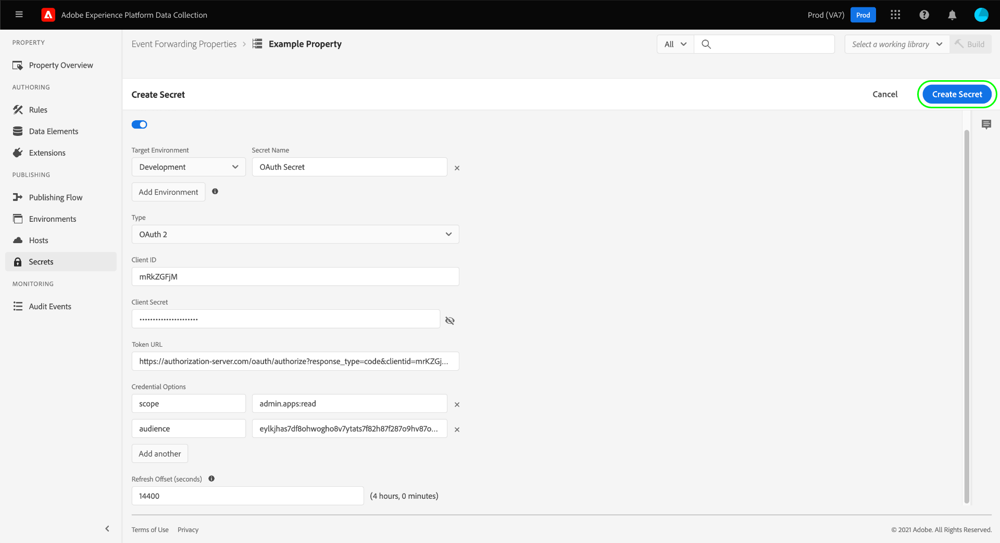

# Het vormen geheimen in gebeurtenis door:sturen

In gebeurtenis door:sturen, is een geheim een middel dat een authentificatiereferentie voor een ander systeem vertegenwoordigt, dat voor de veilige uitwisseling van gegevens toestaat. De geheimen kunnen slechts binnen gebeurtenis worden gecreeerd die eigenschappen door:sturen.

De volgende geheime types worden momenteel gesteund:

| Geheim type | Beschrijving |
| --- | --- |
| [!UICONTROL Amazon OAuth 2] | Schakelt beveiligde verificatie met [!DNL Amazon] -services in. Het systeem slaat het token veilig op en handelt de vernieuwing ervan met opgegeven intervallen af. |
| [!UICONTROL Google OAuth 2] | Bevat verscheidene attributen om [&#x200B; OAuth 2.0 &#x200B;](https://datatracker.ietf.org/doc/html/rfc6749) authentificatiespecic voor gebruik in [&#x200B; Google Ads API &#x200B;](https://developers.google.com/google-ads/api/docs/oauth/overview) en [&#x200B; Pub/Sub API &#x200B;](https://cloud.google.com/pubsub/docs/reference/service_apis_overview) te steunen. Het systeem vraagt u om de vereiste informatie, dan behandelt de vernieuwing van deze tokens voor u op een gespecificeerd interval. |
| [!UICONTROL HTTP] | Bevat respectievelijk twee tekenreekskenmerken voor een gebruikersnaam en wachtwoord. |
| [!UICONTROL [!DNL LinkedIn] OAuth 2] | Het systeem vraagt u om de vereiste informatie, dan behandelt de vernieuwing van deze tokens voor u op een gespecificeerd interval. |
| [!UICONTROL OAuth 2] | Bevat verscheidene attributen om het [&#x200B; type van de cliëntgeloofsbrieven van de cliëntgeloofsbrieven &#x200B;](https://datatracker.ietf.org/doc/html/rfc6749#section-1.3.4) voor [&#x200B; OAuth 2.0 &#x200B;](https://datatracker.ietf.org/doc/html/rfc6749) authentificatiespecifiek te steunen. Het systeem vraagt u om de vereiste informatie, dan behandelt de vernieuwing van deze tokens voor u op een gespecificeerd interval. |
| [!UICONTROL OAuth 2 JWT] | Bevat verscheidene attributen om het Symbolische Profiel van het Web JSON (JWT) voor [&#x200B; OAuth 2.0 Vergunning &#x200B;](https://datatracker.ietf.org/doc/html/rfc7523#section-2.1) subsidies te steunen. Het systeem vraagt u om de vereiste informatie, dan behandelt de vernieuwing van deze tokens voor u op een gespecificeerd interval. |
| [!UICONTROL Token] | Een enkele tekenreeks met tekens die een verificatietoken-waarde vertegenwoordigt die door beide systemen bekend en begrepen is. |

{style="table-layout:auto"}

Deze gids verstrekt een overzicht op hoog niveau van hoe te om geheimen voor een gebeurtenis te vormen door:sturen ([!UICONTROL Edge]) bezit in Experience Platform UI of UI van de Inzameling van Gegevens.

>[!NOTE]
>
>Voor gedetailleerde begeleiding op hoe te om geheimen in Reactor API, met inbegrip van voorbeeld JSON van de structuur van een geheim te beheren, verwijs naar de [&#x200B; geheimen API gids &#x200B;](../../api/guides/secrets.md).

## Vereisten

Deze gids veronderstelt dat u reeds vertrouwd met bent hoe te om middelen voor markeringen en gebeurtenis te beheren door:sturen in UI, met inbegrip van hoe te om een gegevenselement en een gebeurtenis tot stand te brengen door:sturen regel. Zie de gids op [&#x200B; het leiden middelen &#x200B;](../managing-resources/overview.md) als u een inleiding vereist.

U hebt ook een goed inzicht in de publicatiestroom voor tags en het doorsturen van gebeurtenissen, inclusief hoe u bronnen aan een bibliotheek kunt toevoegen en een build op uw website kunt installeren om deze te testen. Zie [&#x200B; het publiceren overzicht &#x200B;](../publishing/overview.md) voor meer details.

## Een geheim maken {#create}

>[!CONTEXTUALHELP]
>id="platform_eventforwarding_secrets_environments"
>title="Omgevingen voor geheimen"
>abstract="Opdat een geheim door gebeurtenis te gebruiken door:sturen, moet het aan een bestaand milieu worden toegewezen. Als u geen milieu&#39;s hebt die voor uw gebeurtenis door:sturen bezit worden gecreeerd, moet u hen vormen alvorens verder te gaan."
>additional-url="https://experienceleague.adobe.com/docs/experience-platform/tags/publish/environments/environments.html?lang=nl-NL" text="Overzicht van omgevingen"

Als u een geheim wilt maken, selecteert u **[!UICONTROL Event Forwarding]** in de linkernavigatie en opent u vervolgens de eigenschap voor het doorsturen van gebeurtenissen waaraan u het geheim onder wilt toevoegen. Selecteer vervolgens **[!UICONTROL Secrets]** in de linkernavigatie, gevolgd door **[!UICONTROL Create New Secret]** .

Het volgende scherm staat u toe om de details van het geheim te vormen. Opdat een geheim door gebeurtenis te gebruiken door:sturen, moet het aan een bestaand milieu worden toegewezen. Als u geen milieu&#39;s hebt die voor uw gebeurtenis worden gecreeerd door:sturen bezit, zie de gids op [&#x200B; milieu&#39;s &#x200B;](../publishing/environments.md) voor begeleiding op hoe te om hen te vormen alvorens verder te gaan.

>[!NOTE]
>
>Als u nog steeds het geheim wilt maken en opslaan voordat u het aan een omgeving toevoegt, schakelt u de schakeloptie **[!UICONTROL Attach Secret to Environments]** uit voordat u de rest van de informatie invult. Let op: u moet het later toewijzen aan een omgeving als u het geheim wilt gebruiken.
>
> onbruikbaar

Selecteer onder **[!UICONTROL Target Environment]** de omgeving waaraan u het geheim wilt toewijzen in het vervolgkeuzemenu. Geef onder **[!UICONTROL Secret Name]** een naam voor het geheim op in de context van de omgeving. Deze naam moet uniek over alle geheimen onder de gebeurtenis zijn die bezit door:sturen.

Een geheim kan slechts aan één milieu tegelijkertijd worden toegewezen, maar u kunt de zelfde geloofsbrieven aan veelvoudige geheimen over verschillende milieu&#39;s toewijzen als u wenst. Selecteer **[!UICONTROL Add Environment]** om nog een rij aan de lijst toe te voegen.

 toe

Voor elke omgeving die u toevoegt, moet u een andere unieke naam opgeven voor het bijbehorende geheim. Als u alle beschikbare omgevingen uitlaat, is de knop **[!UICONTROL Add Environment]** niet beschikbaar.

 toe

Van hier, verschillen de stappen om het geheim tot stand te brengen afhankelijk van het type van geheim u creeert. Raadpleeg de onderstaande subsecties voor meer informatie:

* [[!UICONTROL Token]](#token)
* [[!UICONTROL HTTP]](#http)
* [[!UICONTROL OAuth 2]](#oauth2)
* [[!UICONTROL OAuth 2 JWT]](#oauth2jwt)
* [[!UICONTROL Google OAuth 2]](#google-oauth2)
* [[!UICONTROL [!DNL LinkedIn] OAuth 2]](#linkedin-oauth2)
* [[!UICONTROL [!DNL Amazon] OAuth 2]](#amazon-oauth2)

### [!UICONTROL Token] {#token}

Selecteer **[!UICONTROL Token]** in het vervolgkeuzemenu **[!UICONTROL Type]** om een token-geheim te maken. Geef in het veld **[!UICONTROL Token]** dat wordt weergegeven, de referentie-tekenreeks op die wordt herkend door het systeem waarop u de verificatie uitvoert. Selecteer **[!UICONTROL Create Secret]** om het geheim op te slaan.

### [!UICONTROL HTTP] {#http}

Als u een HTTP-geheim wilt maken, selecteert u **[!UICONTROL Simple HTTP]** in de vervolgkeuzelijst **[!UICONTROL Type]** . Geef in de onderstaande velden een gebruikersnaam en wachtwoord op voor de referentie voordat u **[!UICONTROL Create Secret]** selecteert om het geheim op te slaan.

>[!NOTE]
>
>Op wordt opgeslagen, wordt de referentie gecodeerd gebruikend [&#x200B; &quot;Basis&quot;de authentificatieregeling van HTTP &#x200B;](https://www.rfc-editor.org/rfc/rfc7617.html).

### [!UICONTROL OAuth 2] {#oauth2}

Als u een OAuth 2-geheim wilt maken, selecteert u **[!UICONTROL OAuth 2]** in de vervolgkeuzelijst **[!UICONTROL Type]** . Op de gebieden die hieronder verschijnen, verstrek uw [[!UICONTROL Client ID] en [!UICONTROL Client Secret] &#x200B;](https://www.oauth.com/oauth2-servers/client-registration/client-id-secret/), evenals uw [[!UICONTROL Token URL] &#x200B;](https://www.oauth.com/oauth2-servers/access-tokens/client-credentials/) voor uw integratie OAuth. Het veld [!UICONTROL Token URL] in de gebruikersinterface is een aaneenschakeling tussen de host van de verificatieserver en het tokenpad.

Onder **[!UICONTROL Credential Options]** kunt u andere referentie-opties opgeven, zoals `scope` en `audience` , in de vorm van sleutelwaardeparen. Selecteer **[!UICONTROL Add another]** als u meer sleutelwaardeparen wilt toevoegen.

Tot slot kunt u de **[!UICONTROL Refresh Offset]** waarde voor het geheim vormen. Dit vertegenwoordigt het aantal seconden vóór de symbolische vervaldatum dat het systeem automatisch zal uitvoeren verfrist zich. De equivalente tijd in uren en minuten wordt rechts van het veld weergegeven en wordt automatisch bijgewerkt terwijl u typt.

Als de verschuiving Vernieuwen bijvoorbeeld is ingesteld op de standaardwaarde `14400` (vier uur) en het toegangstoken de `expires_in` waarde `86400` (24 uur) heeft, vernieuwt het systeem het geheim over 20 uur automatisch.

>[!IMPORTANT]
>
>Een geheim OAuth vereist minstens vier uren tussen verfrissingen en moet ook voor een minimum van acht uur geldig zijn. Deze beperking geeft u een minimum van vier uren om in te grijpen als de problemen met het geproduceerde teken zich voordoen.
>
>Als de verschuiving bijvoorbeeld is ingesteld op `28800` (8 uur) en de toegangstoken een `expires_in` van `36000` (10 uur) heeft, mislukt de uitwisseling omdat het resulterende verschil minder dan vier uur is.

Als u klaar bent, selecteert u **[!UICONTROL Create Secret]** om het geheim op te slaan.

### [!UICONTROL OAuth 2 JWT] {#oauth2jwt}

Als u een OAuth 2 JWT-geheim wilt maken, selecteert u **[!UICONTROL OAuth 2 JWT]** in het vervolgkeuzemenu **[!UICONTROL Type]** .

![&#x200B; het [!UICONTROL Create Secret] lusje met het geheim van OAuth 2 JWT dat in [!UICONTROL Type] dropdown wordt benadrukt.](../../images/ui/event-forwarding/secrets/oauth-jwt-secret.png)

>[!NOTE]
>
>De enige [!UICONTROL Algorithm] die momenteel wordt ondersteund voor het ondertekenen van de JWT is RS256.

Geef in de onderstaande velden de velden [!UICONTROL Issuer] , [!UICONTROL Subject] , [!UICONTROL Audience] , [!UICONTROL Custom Claims] en [!UICONTROL TTL] op en selecteer vervolgens de [!UICONTROL Algorithm] in de vervolgkeuzelijst. Daarna, ga [!UICONTROL Private Key Id], evenals uw [[!UICONTROL Token URL] in &#x200B;](https://www.oauth.com/oauth2-servers/access-tokens/client-credentials/) voor uw integratie OAuth. Het veld [!UICONTROL Token URL] is geen verplicht veld. Wanneer een waarde wordt opgegeven, wordt de JWT uitgewisseld met een toegangstoken. Het geheim wordt vernieuwd volgens het kenmerk `expires_in` van het antwoord en de waarde [!UICONTROL Refresh Offset] . Als er geen waarde wordt opgegeven, wordt de JWT gebruikt als geheim dat naar de rand wordt geduwd. De JWT wordt vernieuwd volgens de waarden [!UICONTROL TTL] en [!UICONTROL Refresh Offset] .

![&#x200B; het [!UICONTROL Create Secret] lusje met een selectie van benadrukte inputgebieden.](../../images/ui/event-forwarding/secrets/oauth-jwt-information.png)

Onder **[!UICONTROL Credential Options]** kunt u andere referentie-opties opgeven, zoals `jwt_param` in de vorm van sleutelwaardeparen. Selecteer **[!UICONTROL Add another]** als u meer sleutelwaardeparen wilt toevoegen.

![&#x200B; het [!UICONTROL Create Secret] lusje dat de [!UICONTROL Credential Options] gebieden benadrukt.](../../images/ui/event-forwarding/secrets/oauth-jwt-credential-options.png)

Tot slot kunt u de **[!UICONTROL Refresh Offset]** waarde voor het geheim vormen. Dit vertegenwoordigt het aantal seconden vóór de symbolische vervaldatum dat het systeem automatisch zal uitvoeren verfrist zich. De equivalente tijd in uren en minuten wordt rechts van het veld weergegeven en wordt automatisch bijgewerkt terwijl u typt.

![&#x200B; het [!UICONTROL Create Secret] lusje die het [!UICONTROL Refresh Offset] gebied benadrukt.](../../images/ui/event-forwarding/secrets/oauth-jwt-refresh-offset.png)

Als de verschuiving Vernieuwen bijvoorbeeld is ingesteld op de standaardwaarde `1800` (30 minuten) en het toegangstoken de `expires_in` waarde `3600` (1 uur) heeft, vernieuwt het systeem het geheim over een uur automatisch.

>[!IMPORTANT]
>
>Een OAuth 2 JWT geheim vereist minstens 30 minuten tussen verfrissingen en moet ook voor een minimum van één uur geldig zijn. Deze beperking geeft u een minimum van 30 minuten om in te grijpen als de problemen met het geproduceerde teken zich voordoen.
>
>Als de verschuiving bijvoorbeeld is ingesteld op `1800` (30 minuten) en de toegangstoken de waarde `expires_in` `2700` (45 minuten) heeft, mislukt de uitwisseling omdat het resulterende verschil minder dan 30 minuten bedraagt.

Als u klaar bent, selecteert u **[!UICONTROL Create Secret]** om het geheim op te slaan.

![&#x200B; De markering [!UICONTROL Create Secret] tab [!UICONTROL Create Secret]](../../images/ui/event-forwarding/secrets/oauth-jwt-create-secret.png)

### [!UICONTROL Google OAuth 2] {#google-oauth2}

Als u een Google OAuth 2-geheim wilt maken, selecteert u **[!UICONTROL Google OAuth 2]** in de vervolgkeuzelijst **[!UICONTROL Type]** . Selecteer onder **[!UICONTROL Scopes]** de Google API&#39;s die u wilt gebruiken om toegang te verlenen tot dit geheim. De volgende producten worden momenteel ondersteund:

* [&#x200B; Advertentie API van Google &#x200B;](https://developers.google.com/google-ads/api/docs/oauth/overview)
* [&#x200B; Pub/Sub API &#x200B;](https://cloud.google.com/pubsub/docs/reference/service_apis_overview)

Selecteer **[!UICONTROL Create Secret]** als u klaar bent.

Er verschijnt een pop-up met de mededeling dat het geheim handmatig moet worden geautoriseerd via Google. Selecteer **[!UICONTROL Create & Authorize]** om door te gaan.

Er wordt een dialoogvenster weergegeven waarin u de referenties voor uw Google-account kunt invoeren. Volg de herinneringen om gebeurtenis door:sturen toegang tot uw gegevens onder het geselecteerde werkingsgebied te verlenen. Zodra het vergunningsproces volledig is, wordt het geheim gecreeerd.

>[!IMPORTANT]
>
>Als in uw organisatie een beleid voor herverificatie is ingesteld voor Google Cloud-toepassingen, worden de gemaakte geheimen niet vernieuwd nadat de verificatie is verlopen (tussen 1 en 24 uur, afhankelijk van de beleidsconfiguratie).
>
>U lost dit probleem op door u aan te melden bij de Google Admin-console en naar de pagina **[!DNL App access control]** te gaan, zodat u de door:sturen app voor de gebeurtenis (Adobe Real-Time CDP Event Forwarding) kunt markeren als [!DNL Trusted] . Verwijs naar de documentatie van Google over [&#x200B; plaatsende zittingslengten voor de diensten van de Wolk van Google &#x200B;](https://support.google.com/a/answer/9368756) voor meer informatie.

### [!UICONTROL [!DNL LinkedIn] OAuth 2] {#linkedin-oauth2}

Selecteer [!DNL LinkedIn] in het vervolgkeuzemenu **[!UICONTROL [!DNL LinkedIn] OAuth 2]** om een **[!UICONTROL Type]** OAuth 2-geheim te maken. Selecteer vervolgens **[!UICONTROL Create Secret]** .

![&#x200B; het [!UICONTROL Create Secret] lusje met het [!UICONTROL Type] benadrukte gebied.](../../images/ui/event-forwarding/secrets/linkedin-oauth.png)

Er verschijnt een pop-up met de melding dat het geheim handmatig moet worden geautoriseerd via [!DNL LinkedIn] . Selecteer **[!UICONTROL Create & Authorize secret with [!DNL LinkedIn]]** om door te gaan.

Er wordt een dialoogvenster weergegeven waarin u wordt gevraagd uw [!DNL LinkedIn] -referenties in te voeren. Volg de herinneringen om gebeurtenis door:sturen toegang tot uw gegevens te verlenen.

Nadat het autorisatieproces is voltooid, gaat u terug naar het tabblad **[!UICONTROL Secrets]** , waar u het zojuist gemaakte geheim kunt zien. Hier zie je de status van het geheim en de vervaldatum.

![&#x200B; het [!UICONTROL Secret] lusje die het pas gecreëerde geheim benadrukken.](../../images/ui/event-forwarding/secrets/linkedin-new-secret.png)

#### Een [!UICONTROL [!DNL LinkedIn] OAuth 2] -geheim opnieuw autoriseren

>BELANGRIJK
>
>U moet opnieuw autoriseren met uw [!DNL LinkedIn] -gegevens om de 365 dagen. Als u de verificatie niet tijdig opnieuw uitvoert, wordt het geheim niet vernieuwd en mislukken de conversieverzoeken van [!DNL LinkedIn] .

Drie maanden vóór het geheim dat opnieuw toestemming vereist, zal popup beginnen te tonen wanneer u navigeert om het even welke pagina van het bezit. Selecteer **[!UICONTROL Click here to go to your secrets]**.

![&#x200B; het [!UICONTROL Property Overview] lusje die geheime re-vergunning popup benadrukt.](../../images/ui/event-forwarding/secrets/linkedin-reauthorization-popup.png)

U wordt omgeleid naar de tab [!UICONTROL Secrets] . De geheimen die op deze pagina worden vermeld worden gefiltreerd om slechts de geheimen te tonen die opnieuw moeten worden toegelaten. Selecteer **[!UICONTROL Auth Needed]** voor het geheim u opnieuw moet autoriseren.

![&#x200B; het [!UICONTROL Secret] lusje benadrukken [!UICONTROL Auth Needed] voor het [!DNL LinkedIn] geheim.](../../images/ui/event-forwarding/secrets/linkedin-reauthorization.png)

Er wordt een dialoogvenster weergegeven waarin u wordt gevraagd uw [!DNL LinkedIn] -referenties in te voeren. Volg de aanwijzingen om uw geheim opnieuw toe te staan.

### [!UICONTROL [!DNL Amazon] OAuth 2] {#amazon-oauth2}

Als u een [!DNL Amazon] OAuth 2-geheim wilt maken, selecteert u **[!UICONTROL [!DNL Amazon] OAuth 2]** in de vervolgkeuzelijst **[!UICONTROL Type]** . Selecteer vervolgens **[!UICONTROL Create Secret]** .

![&#x200B; het [!UICONTROL Create Secret] lusje met het [!UICONTROL Type] benadrukte gebied.](../../images/ui/event-forwarding/secrets/amazon-oauth.png)

Er verschijnt een pop-up met de melding dat het geheim handmatig moet worden geautoriseerd via [!DNL Amazon] . Selecteer **[!UICONTROL Create & Authorize secret with [!DNL Amazon]]** om door te gaan.

Er wordt een dialoogvenster weergegeven waarin u wordt gevraagd uw [!DNL Amazon] -referenties in te voeren. Volg de herinneringen om gebeurtenis door:sturen toegang tot uw gegevens te verlenen.

Nadat het autorisatieproces is voltooid, gaat u terug naar het tabblad **[!UICONTROL Secrets]** , waar u het zojuist gemaakte geheim kunt zien. Hier zie je de status van het geheim en de vervaldatum.

![&#x200B; het [!UICONTROL Secret] lusje die het pas gecreëerde geheim benadrukken.](../../images/ui/event-forwarding/secrets/amazon-new-secret.png)

## Een geheim bewerken

Nadat u geheimen voor een eigenschap hebt gemaakt, vindt u deze in de werkruimte van **[!UICONTROL Secrets]** . Als u de details van een bestaand geheim wilt bewerken, selecteert u de naam in de lijst.

In het volgende scherm kunt u de naam en referenties voor het geheim wijzigen.

 uit

>[!NOTE]
>
>Als het geheim met een bestaand milieu wordt geassocieerd, kunt u niet het geheim aan een andere milieu opnieuw toewijzen. Als u wenst om de zelfde geloofsbrieven op een verschillend milieu te gebruiken, moet u [&#x200B; een nieuw geheim &#x200B;](#create) in plaats daarvan creëren. De enige manier om de omgeving van dit scherm opnieuw toe te wijzen is door het geheim nooit vooraf aan een omgeving toe te wijzen of door de omgeving te verwijderen waaraan het geheim was gekoppeld.

### Opnieuw een geheime uitwisseling

U kunt een geheime uitwisseling van het het uitgeven scherm opnieuw proberen of verfrissen. Dit proces is afhankelijk van het type geheim dat wordt bewerkt:

| Geheim type | Protocol opnieuw proberen |
| --- | --- |
| [!UICONTROL Token] | Selecteer **[!UICONTROL Exchange Secret]** om de geheime uitwisseling opnieuw te proberen. Deze controle is slechts beschikbaar wanneer er een milieu verbonden aan het geheim is. |
| [!UICONTROL HTTP] | Als er geen milieu in bijlage aan het geheim is, uitgezochte **[!UICONTROL Exchange Secret]** om de referentie aan base64 om te ruilen. Als een milieu in bijlage is, selecteer **[!UICONTROL Exchange and Deploy Secret]** om aan base64 uit te wisselen en het geheim op te stellen. |
| [!UICONTROL OAuth 2] | Selecteer **[!UICONTROL Generate Token]** om de referenties uit te wisselen en een toegangstoken van de verificatieprovider te retourneren. |

## Een geheim verwijderen

Als u een bestaand geheim in de **[!UICONTROL Secrets]** -werkruimte wilt verwijderen, schakelt u het selectievakje naast de naam in voordat u **[!UICONTROL Delete]** selecteert.

## Het gebruiken van geheimen in gebeurtenis door:sturen

Om gebruik van een geheim in gebeurtenis te maken door:sturen, moet u a [&#x200B; gegevenselement &#x200B;](../managing-resources/data-elements.md) eerst creëren dat verwijzingen het geheim zelf. Na het bewaren van het gegevenselement, kunt u het in gebeurtenis omvatten door:sturen [&#x200B; regels &#x200B;](../managing-resources/rules.md) en die regels toevoegen aan a [&#x200B; bibliotheek &#x200B;](../publishing/libraries.md), die beurtelings aan de servers van Adobe als a [&#x200B; kan worden opgesteld bouwt &#x200B;](../publishing/builds.md).

Selecteer bij het maken van het gegevenselement de extensie **[!UICONTROL Core]** en selecteer vervolgens **[!UICONTROL Secret]** voor het gegevenstype van het gegevenselement. Het rechterdeelvenster wordt bijgewerkt en bevat vervolgkeuzemenu&#39;s waarmee maximaal drie geheimen aan het gegevenselement kunnen worden toegewezen: een voor respectievelijk [!UICONTROL Development] , [!UICONTROL Staging] en [!UICONTROL Production] .

>[!NOTE]
>
>Alleen geheimen die zijn gekoppeld aan de ontwikkelings-, staging- en productieomgevingen worden weergegeven voor hun respectieve dropdowns.

Door veelvoudige geheimen aan één enkel gegevenselement toe te wijzen en het te omvatten een regel, kunt u de waarde van de verandering van het gegevenselement afhankelijk van hebben waar de bevattende bibliotheek in de [&#x200B; het publiceren stroom &#x200B;](../publishing/publishing-flow.md) is.

>[!NOTE]
>
>Bij het maken van het gegevenselement moet een ontwikkelomgeving worden toegewezen. Geheimen voor de het opvoeren en productiemilieu&#39;s worden niet vereist, maar bouwt die proberen om naar die milieu&#39;s over te schakelen zal ontbreken als hun geheim-type gegevenselementen geen geheim hebben dat voor het milieu in kwestie wordt geselecteerd.

## Volgende stappen

Deze gids behandelde hoe te om geheimen in UI te beheren. Voor informatie over hoe te met geheimen in wisselwerking te staan gebruikend Reactor API, zie de [&#x200B; geheimen eindpuntgids &#x200B;](../../api/endpoints/secrets.md).
