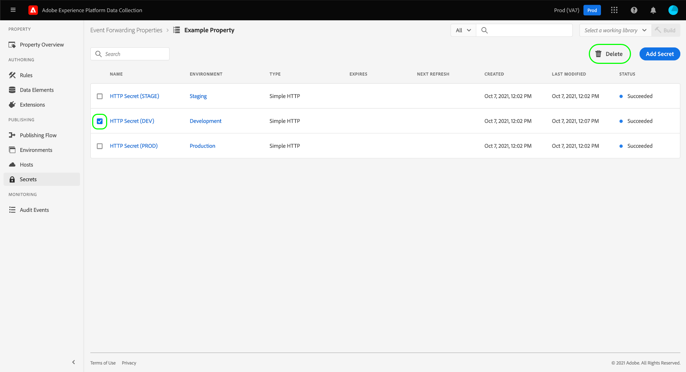

# Het vormen geheimen in gebeurtenis door:sturen

In gebeurtenis door:sturen, is een geheim een middel dat een authentificatiereferentie voor een ander systeem vertegenwoordigt, dat voor de veilige uitwisseling van gegevens toestaat. De geheimen kunnen slechts binnen gebeurtenis worden gecreeerd die eigenschappen door:sturen.

Er zijn momenteel drie ondersteunde geheime typen:

| Geheim type | Beschrijving |
| --- | --- |
| [!UICONTROL Token] | Een enkele tekenreeks met tekens die een verificatietoken-waarde vertegenwoordigt die door beide systemen bekend en begrepen is. |
| [!UICONTROL HTTP] | Bevat respectievelijk twee tekenreekskenmerken voor een gebruikersnaam en wachtwoord. |
| [!UICONTROL OAuth2] | Bevat diverse kenmerken die de [OAuth2](https://datatracker.ietf.org/doc/html/rfc6749) verificatiespecificatie. Het systeem vraagt u om de vereiste informatie, dan behandelt de vernieuwing van deze tokens voor u op een gespecificeerd interval. Alleen de [Client Credentials](https://datatracker.ietf.org/doc/html/rfc6749#section-1.3.4) versie van OAuth2 wordt gesteund. |

{style=&quot;table-layout:auto&quot;}

Deze gids verstrekt een overzicht op hoog niveau van hoe te om geheimen voor een gebeurtenis te vormen door:sturen ([!UICONTROL Edge]) in de UI voor gegevensverzameling.

>[!NOTE]
>
>Raadpleeg voor gedetailleerde informatie over het beheren van geheimen in de Reactor-API, zoals bijvoorbeeld JSON van de structuur van een geheim [geheimen-API](../../api/guides/secrets.md).

## Vereisten

Deze gids veronderstelt dat u reeds vertrouwd met bent hoe te om middelen voor markeringen en gebeurtenis te beheren die in de Inzameling UI van Gegevens door:sturen, met inbegrip van hoe te om een gegevenselement en een gebeurtenis tot stand te brengen die regel door:sturen. Zie de handleiding op [resources beheren](../managing-resources/overview.md) als u een inleiding nodig hebt.

U hebt ook een goed inzicht in de publicatiestroom voor tags en het doorsturen van gebeurtenissen, inclusief hoe u bronnen aan een bibliotheek kunt toevoegen en een build op uw website kunt installeren om deze te testen. Zie de [publicatieoverzicht](../publishing/overview.md) voor meer informatie .

## Een geheim maken {#create}

Om een geheim tot stand te brengen, login aan de Inzameling UI van Gegevens en open de gebeurtenis die bezit door:sturen u het geheim onder wilt toevoegen. Selecteer vervolgens **[!UICONTROL Secrets]** in de linkernavigatie, gevolgd door **[!UICONTROL Create New Secret]**.

Het volgende scherm staat u toe om de details van het geheim te vormen. Opdat een geheim door gebeurtenis te gebruiken door:sturen, moet het aan een bestaand milieu worden toegewezen. Als u geen milieu&#39;s hebt die voor uw gebeurtenis door:sturen bezit worden gecreeerd, zie de gids op [omgevingen](../publishing/environments.md) voor begeleiding op hoe te om hen te vormen alvorens verder te gaan.

>[!NOTE]
>
>Als u het geheim nog wilt creëren en bewaren alvorens het aan een milieu toe te voegen, maak onbruikbaar **[!UICONTROL Attach Secret to Environments]** schakelen voordat de rest van de informatie wordt ingevuld. Let op: u moet het later toewijzen aan een omgeving als u het geheim wilt gebruiken.
>
>

Onder **[!UICONTROL Target Environment]** selecteert u de omgeving waaraan u het geheim wilt toewijzen in het vervolgkeuzemenu. Onder **[!UICONTROL Secret Name]**, een naam voor het geheim in de context van het milieu verstrekken. Deze naam moet uniek over alle geheimen onder de gebeurtenis zijn die bezit door:sturen.

Een geheim kan slechts aan één milieu tegelijkertijd worden toegewezen, maar u kunt de zelfde geloofsbrieven aan veelvoudige geheimen over verschillende milieu&#39;s toewijzen als u wenst. Selecteren **[!UICONTROL Add Environment]** om nog een rij aan de lijst toe te voegen.

Voor elke omgeving die u toevoegt, moet u een andere unieke naam opgeven voor het bijbehorende geheim. Als u alle beschikbare omgevingen uitlaat, **[!UICONTROL Add Environment]** button is niet beschikbaar.

Van hier, verschillen de stappen om het geheim tot stand te brengen afhankelijk van het type van geheim u creeert. Raadpleeg de onderstaande subsecties voor meer informatie:

* [[!UICONTROL Token]](#token)
* [[!UICONTROL HTTP]](#http)
* [[!UICONTROL OAuth2]](#oauth2)

### [!UICONTROL Token] {#token}

Selecteer **[!UICONTROL Token]** van de **[!UICONTROL Type]** vervolgkeuzelijst. In de **[!UICONTROL Token]** in het veld dat wordt weergegeven, geeft u de referentietekenreeks op die wordt herkend door het systeem waarop u de verificatie uitvoert. Selecteren **[!UICONTROL Create Secret]** om het geheim te bewaren.

### [!UICONTROL HTTP] {#http}

Als u een HTTP-geheim wilt maken, selecteert u **[!UICONTROL Simple HTTP]** van de **[!UICONTROL Type]** vervolgkeuzelijst. Geef in de onderstaande velden een gebruikersnaam en wachtwoord op voor de referentie voordat u **[!UICONTROL Create Secret]** om het geheim te bewaren.

>[!NOTE]
>
>Als de referentie wordt opgeslagen, wordt deze gecodeerd met de [&quot;Basic&quot; HTTP-verificatieschema](https://www.rfc-editor.org/rfc/rfc7617.html).

### [!UICONTROL OAuth2] {#oauth2}

Als u een OAuth2-geheim wilt maken, selecteert u **[!UICONTROL OAuth2]** van de **[!UICONTROL Type]** vervolgkeuzelijst. Geef in de onderstaande velden uw [[!UICONTROL Client ID] en [!UICONTROL Client Secret]](https://www.oauth.com/oauth2-servers/client-registration/client-id-secret/)en uw [Autorisatie-URL](https://www.oauth.com/oauth2-servers/access-tokens/client-credentials/) voor uw OAuth integratie. De [!UICONTROL Authorization URL] in de UI van de Inzameling van Gegevens is een aaneenschakeling tussen de gastheer van de vergunningsserver en de symbolische weg.

Onder **[!UICONTROL Credential Options]**, kunt u andere referentie-opties opgeven, zoals `scope` en `audience` in de vorm van sleutelwaardeparen. Als u meer sleutelwaardeparen wilt toevoegen, selecteert u **[!UICONTROL Add another]**.

Tot slot kunt u vormen **[!UICONTROL Refresh Offset]** waarde voor het geheim. Dit vertegenwoordigt het aantal seconden vóór de symbolische vervaldatum dat het systeem automatisch zal uitvoeren verfrist zich. De equivalente tijd in uren en minuten wordt rechts van het veld weergegeven en wordt automatisch bijgewerkt terwijl u typt.

Als de verschuiving Vernieuwen bijvoorbeeld is ingesteld op de standaardwaarde van `14400` (vier uur) en het toegangstoken heeft een `expires_in` waarde van `86400` (24 uur), vernieuwt het systeem automatisch het geheim over 20 uur.

>[!IMPORTANT]
>
>Een geheim OAuth vereist minstens vier uren tussen verfrissingen en moet ook voor een minimum van acht uur geldig zijn. Deze beperking geeft u een minimum van vier uren om in te grijpen als de problemen met het geproduceerde teken zich voordoen.
>
>Als de verschuiving bijvoorbeeld is ingesteld op `28800` (8 uur) en het toegangstoken heeft een `expires_in` van `36000` (10 uur), zou de ruil mislukken omdat het resulterende verschil minder dan vier uur bedraagt.

Als u klaar bent, selecteert u **[!UICONTROL Create Secret]** om het geheim te bewaren.

## Een geheim bewerken

Nadat u geheimen voor een eigenschap hebt gemaakt, vindt u deze in het menu **[!UICONTROL Secrets]** werkruimte. Als u de details van een bestaand geheim wilt bewerken, selecteert u de naam in de lijst.

In het volgende scherm kunt u de naam en referenties voor het geheim wijzigen.

>[!NOTE]
>
>Als het geheim met een bestaand milieu wordt geassocieerd, kunt u niet het geheim aan een andere milieu opnieuw toewijzen. Als u dezelfde gegevens wilt gebruiken in een andere omgeving, moet u [een nieuw geheim maken](#create) in plaats daarvan. De enige manier om de omgeving van dit scherm opnieuw toe te wijzen is door het geheim nooit vooraf aan een omgeving toe te wijzen of door de omgeving te verwijderen waaraan het geheim was gekoppeld.

### Opnieuw een geheime uitwisseling

U kunt een geheime uitwisseling van het het uitgeven scherm opnieuw proberen of verfrissen. Dit proces is afhankelijk van het type geheim dat wordt bewerkt:

| Geheim type | Protocol opnieuw proberen |
| --- | --- |
| [!UICONTROL Token] | Selecteren **[!UICONTROL Exchange Secret]** om de geheime uitwisseling opnieuw te proberen. Deze controle is slechts beschikbaar wanneer er een milieu verbonden aan het geheim is. |
| [!UICONTROL HTTP] | Als er geen omgeving aan het geheim is gekoppeld, selecteert u **[!UICONTROL Exchange Secret]** de referentie aan base64 om te wisselen. Als een omgeving is gekoppeld, selecteert u **[!UICONTROL Exchange and Deploy Secret]** om uit te wisselen om base64 te gebruiken en het geheim op te stellen. |
| [!UICONTROL OAuth2] | Selecteren **[!UICONTROL Generate Token]** om de geloofsbrieven uit te wisselen en een toegangstoken van de authentificatieleverancier terug te keren. |

## Een geheim verwijderen

Om een bestaand geheim in te schrappen  **[!UICONTROL Secrets]** in de werkruimte selecteert u het selectievakje naast de naam van de werkruimte voordat u **[!UICONTROL Delete]**.

## Het gebruiken van geheimen in gebeurtenis door:sturen

Om gebruik te maken van een geheim in gebeurtenis die door:sturen, moet u eerst tot een [gegevenselement](../managing-resources/data-elements.md) dat verwijst naar het geheim zelf. Na het bewaren van het gegevenselement, kunt u het in gebeurtenis omvatten door:sturen [regels](../managing-resources/rules.md) en voegt deze regels toe aan een [bibliotheek](../publishing/libraries.md), die op hun beurt als een [build](../publishing/builds.md).

Selecteer bij het maken van het gegevenselement de optie **[!UICONTROL Core]** extensie selecteert u vervolgens **[!UICONTROL Secret]** voor het gegevenstype data. Het juiste paneel werkt en verstrekt dropdown controles bij om tot drie geheimen aan het gegevenselement toe te wijzen: één voor [!UICONTROL Development], [!UICONTROL Staging], en [!UICONTROL Production] respectievelijk.

>[!NOTE]
>
>Alleen geheimen die zijn gekoppeld aan de ontwikkelings-, staging- en productieomgevingen worden weergegeven voor hun respectieve dropdowns.

Door veelvoudige geheimen aan één enkel gegevenselement toe te wijzen en het op te nemen een regel, kunt u de waarde van de verandering van het gegevenselement hebben afhankelijk van waar de bevattende bibliotheek in is [publicatiestroom](../publishing/publishing-flow.md).

>[!NOTE]
>
>Bij het maken van het gegevenselement moet een ontwikkelomgeving worden toegewezen. Geheimen voor de het opvoeren en productiemilieu&#39;s worden niet vereist, maar bouwt die proberen om naar die milieu&#39;s over te schakelen zal ontbreken als hun geheim-type gegevenselementen geen geheim hebben dat voor het milieu in kwestie wordt geselecteerd.

## Volgende stappen

Deze gids behandelde hoe te om geheimen in de Inzameling UI van Gegevens te beheren. Voor informatie over hoe u met geheimen communiceert met de Reactor-API raadpleegt u de [punthulplijn voor geheimen](../../api/endpoints/secrets.md).
