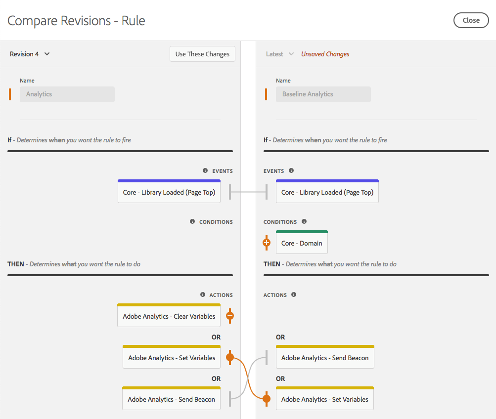
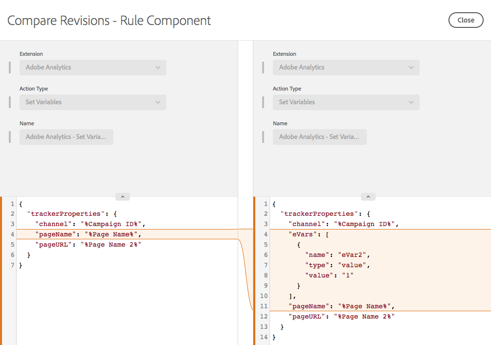

# Bronrevisies vergelijken

Vergelijk resourcerevisies om de geschiedenis van een individuele bron te zien.  U kunt de huidige status van de bron vergelijken met oudere versies of de momenteel gepubliceerde versie van een bron vergelijken met de meest recente set wijzigingen die zijn opgeslagen.

## Een vergelijking starten

Het initiëren van een vergelijking is het zelfde voor alle middeltypes.  Open de weergave Bewerken voor een afzonderlijke bron en zoek vervolgens het drie puntenpictogram naast de knop **[!UICONTROL Save]** om de beschikbare handelingen voor die bron weer te geven.  Selecteer **[!UICONTROL Compare Revisions]** in de lijst.

Voor extensies opent u de detailweergave door de knop **[!UICONTROL Configure]** te selecteren wanneer u de lijst met geïnstalleerde extensies weergeeft.  Selecteer een gegevenselement in de lijst voor gegevenselementen en -regels.

## De vergelijkingsweergave gebruiken

Wanneer u een vergelijking initieert, toont de standaardmening de recentste versie op het recht.  Deze versie bevat alle niet-opgeslagen wijzigingen die u in de bron hebt aangebracht in de weergave Bewerken. (Let op het label Niet-opgeslagen wijzigingen rechts in de onderstaande afbeelding.)

Links kun je kiezen uit bestaande revisies die je wilt vergelijken met &#39;Nieuwst&#39;.

Selecteer **[!UICONTROL Use These Changes]** om de instellingen van de geselecteerde revisie te kopiëren (links) naar de meest recente versie (rechts).  Hiermee kopieert u de instellingen van de oude revisie naar de laatste niet-opgeslagen wijzigingen.  Als u deze wijzigingen wilt behouden, moet u de vergelijkingsweergave afsluiten met **[!UICONTROL Save]** .

>[!TIP]
>Individuele bronnen kunnen zowel kenmerken als instellingen hebben.  Deze instellingen worden opgeslagen als een JSON-blok. Dit is een gestructureerde manier om gegevens op te slaan, maar flexibel genoeg om extensieontwikkelaars in staat te stellen hun extensies naar wens uit te voeren.
>In de eerste versie van de vergelijkingsweergave worden de instellingen in onbewerkte vorm weergegeven als JSON. Dankzij toekomstige verbeteringen kunt u versies op verschillende manieren weergeven, inclusief gedetailleerde codevergelijkingen en het gebruik van de extensieweergaven die door de ontwikkelaars van de extensies worden geboden.

## Extensies vergelijken

Extensies hebben één scherm om de verschillen tussen versies weer te geven.

In de vergelijkingsweergave worden de verschillen tussen de instellingenversies gemarkeerd.  De toevoeging en de verwijdering aan individuele montages worden vermeld door een uitbreiding van een lijn in één van beide richting.

Hierboven kunt u de volgende wijzigingen zien:

* De extensie [!DNL Adobe Analytics] wordt bijgewerkt naar een nieuwe versie, aangegeven door de oranje versienummers bovenaan.
* De instellingen `orgID` en `currencyCode` worden gewijzigd in de instellingen die worden aangegeven door het vergroten van de oranje sectie in de instellingen.

## Gegevenselementen vergelijken

De elementen van gegevens hebben één enkel scherm om verschillen te tonen, maar omdat de gegevenselementen extra attributen naast hun montages hebben, wordt de extra informatie getoond.  Kenmerken die zijn gewijzigd, worden in oranje gemarkeerd.

Hierboven kunt u de volgende wijzigingen zien:

* De naam is gewijzigd van &quot;Paginanaam 2&quot; in &quot;Mijn speciale paginanaam&quot;, zoals aangegeven door de oranje balk.
* Het type is gewijzigd van JavaScript-variabele in Pagina-info.
* De standaardwaarde van &quot;b&quot; is toegevoegd.
* De optie Kleine letters forceren is geselecteerd.
* &quot;Schone tekst&quot; is geselecteerd.
* De instellingen zijn gewijzigd. (De instellingen voor het type JavaScript-variabele verschillen van het type Pagina-info.)

Als het instellingenblok groot is, kunt u de sectie Instellingen uitvouwen zodat u deze beter kunt zien.

## Regels vergelijken

De regels bestaan uit vele regelcomponenten.  Om de veranderingen in een regel te begrijpen, moet u over de toevoeging en de verwijdering van componenten evenals wijzigingen aan een individuele component weten.  Als je versies van een regel vergelijkt, zijn er eigenlijk twee schermen.

Het eerste scherm toont een mening op hoog niveau, die veranderingen in de rangschikking van regelcomponenten binnen de regel benadrukt.  Wijzigingen worden gemarkeerd. Verschillende typen wijzigingen worden weergegeven.

Hierboven kunt u de volgende wijzigingen zien:

* De regelnaam is veranderd van &quot;Analytics&quot; in &quot;Baseline Analytics&quot;, aangegeven door de oranje balk op Naam.
* De voorwaarde &quot;Core - Domain&quot; is toegevoegd, aangegeven door het oranje &quot;+&quot;-pictogram en de toevoeging van de component aan de rechterkant.
* De handeling &quot;[!DNL Adobe Analytics] - Variabelen wissen&quot; is verwijderd. Dit wordt aangegeven door het oranje pictogram &quot;-&quot; en de afwezigheid van de component aan de rechterkant.
* De actie &quot;[!DNL Adobe Analytics] - Vastgestelde Variabelen&quot;werd gewijzigd, die door de oranje lijn tussen de versies van de component op de linkerzijde en juiste kanten wordt vermeld. Deze lijn is recht als de componentenorde niet is veranderd.
* De actie &quot;[!DNL Adobe Analytics] - Vastgestelde Variabelen&quot;en &quot;[!DNL Adobe Analytics] - verzend Beacon&quot;actieorde is veranderd, die door de gebogen lijnen wordt vermeld die de verschillende versies van de componenten op de linker en juiste kanten verbinden

Om de specifieke wijzigingen in één van de regelcomponenten te bekijken, selecteer de specifieke component u zou willen bekijken.  De lijn verandert in blauw wanneer u de muis erboven plaatst.

De vergelijking voor een individuele regelcomponent gedraagt zich het zelfde als de vergelijking voor een gegevenselement.

Hierboven ziet u de volgende wijziging:

* De component rule is gewijzigd en voegt nu eVar2 met de waarde &quot;1&quot; toe.

Als het instellingenblok groot is, kunt u de sectie Instellingen uitvouwen zodat u deze beter kunt zien.
