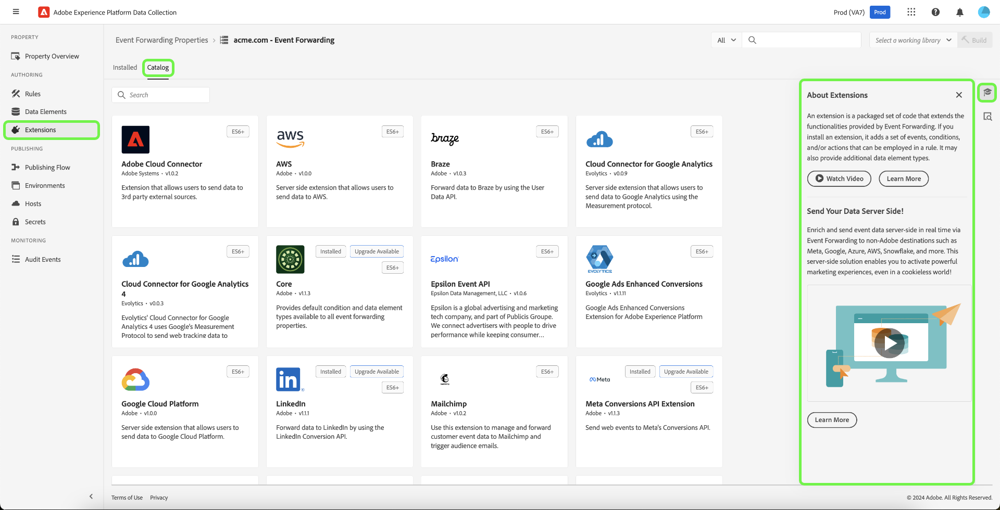

# Extensies

Een extensie is een set verpakte code die de functionaliteit uitbreidt die wordt geboden door tags of het doorsturen van gebeurtenissen.

Als u een extensie toevoegt, worden nieuwe gegevenselementen en nieuwe opties voor het maken van regels toegevoegd.

Extensies bepalen de elementen die beschikbaar zijn bij het bouwen van eigenschappen, regels en gegevenselementen. Zij verstrekken:

* Gebeurtenissen, voorwaarden en uitzonderingen
* Gegevenselementen
* Code aan de clientzijde

Gebruik de koppelingen boven aan de lijst Extensies om geïnstalleerde extensies, de catalogus met extensies of updates weer te geven.

Selecteer een extensie en selecteer vervolgens [!UICONTROL Configure] om de instellingen van de extensie weer te geven en te wijzigen. Voor meer informatie, zie de sectie over [ toevoegend een nieuwe uitbreiding ](#add-a-new-extension) voor informatie over uitbreidingsopties.

>[!IMPORTANT]
>
>De veranderingen treden niet van kracht tot zij [ worden gepubliceerd ](../../publishing/overview.md).

Adobe biedt standaard extensies die ondersteuning bieden voor algemene integratie. Extensies kunnen worden gewijzigd met aangepaste configuraties. Configuraties worden geleverd via de extensies. Als u een configuratie wilt maken, selecteert u eerst de extensiekaart en vervolgens **[!UICONTROL Add New Configuration]** .

## Extensiecatalogus

Met de extensiecatalogus kunt u zoeken naar en marketing- en advertentietechnologie die is ontwikkeld en onderhouden door onafhankelijke softwareleveranciers, en extensies voor Adobe-oplossingen.

De pagina Extensies biedt drie weergaven:

* Geïnstalleerd

  Hiermee worden alle geïnstalleerde extensies weergegeven.

* Catalogus
* Alle beschikbare extensies weergeven
* Updates

  Hiermee geeft u updates voor geïnstalleerde extensies weer.

Selecteer **[!UICONTROL Extensions]** om alle geïnstalleerde extensies weer te geven. U kunt de catalogus ook gebruiken om een lijst weer te geven met alle beschikbare extensies en extensies waarvoor updates beschikbaar zijn.

Zie {de Verwijzing van Uitbreidingen 0} [ voor details over de Adobe-Bezit uitbreidingen.](../../../extensions/client/overview.md)

## Een nieuwe extensie toevoegen {#add-a-new-extension}

Tags zijn zeer uitbreidbaar. Extensies voegen kernfunctionaliteit toe aan tags. Extensies worden veel gebruikt om integraties met andere toepassingen te maken.

>[!TIP]
>
>Gebruik de Help bij het product In in het rechterdeelvenster voor meer informatie over extensies en voor meer informatie over beschikbare bronnen.

1. Open vanuit de overzichtspagina van een eigenschap de tab **[!UICONTROL Extensions]** .
1. Selecteer een extensie.

   

   * Als de extensie bestaat, selecteert u deze in de extensiecatalogus.
   * Plaats de muis boven een extensie in de lijst om deze te configureren of uit te schakelen.
   * Voeg andere extensies toe uit de catalogus als deze momenteel niet in de lijst staan.

   De extensie Core is het beginpunt voor de nieuwe extensie. De standaardextensie biedt:

   * Standaardgebeurtenis
   * Standaardvoorwaarden en -uitzonderingen
   * Standaardcode aan clientzijde

   Deze gebreken zijn de basis voor de douaneregels u zult bouwen om uw uitbreiding tot stand te brengen.

Wanneer het creëren van of het uitgeven van elementen, kunt u sparen en aan uw [ actieve bibliotheek ](../../publishing/libraries.md#active-library) bouwen. Hiermee slaat u de wijziging onmiddellijk op in uw bibliotheek en wordt een build uitgevoerd. De status van de build wordt weergegeven. U kunt ook een nieuwe bibliotheek maken via het keuzemenu Actieve bibliotheek.

## Een extensie configureren

Plaats de muis boven een geïnstalleerde extensie en selecteer **[!UICONTROL Configure]** .

>[!NOTE]
>
>Sommige extensies vereisen geen configuratie en bieden geen configuratieopties.

Elke configureerbare extensie heeft unieke opties. Verwijs naar [ Verwijzing van Uitbreidingen ](../../../extensions/client/overview.md) voor informatie over de opties beschikbaar voor elke uitbreiding van Adobe.
