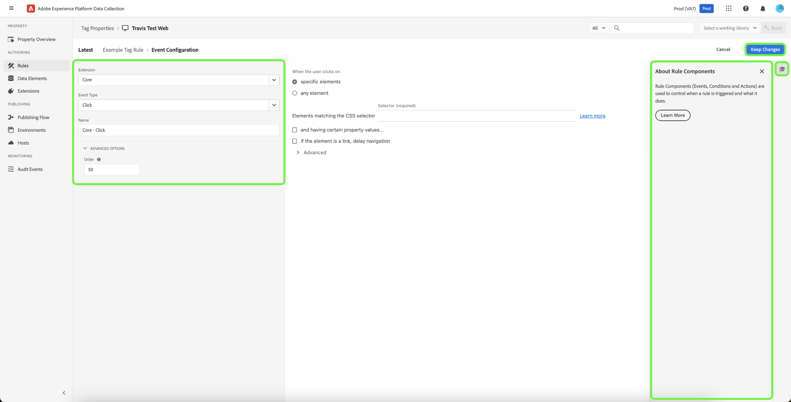

# Regels

Tags in Adobe Experience Platform volgen een op regels gebaseerd systeem. Zij zoeken gebruikersinteractie en bijbehorende gegevens. Wanneer aan de criteria die in uw regels worden geschetst wordt voldaan, teweegbrengt de regel de uitbreiding, het manuscript, of cliënt-zijcode in werking u identificeerde.

Bouw regels om de gegevens en de functionaliteit van marketing en advertentietechnologie te integreren die ongelijksoortige producten in één enkele oplossing verenigt.

## Regelstructuur

**Gebeurtenissen (als):** de gebeurtenis is wat u de regel wilt zoeken. Dit wordt bepaald door een gebeurtenis, om het even welke toepasselijke voorwaarden, en om het even welke uitzonderingen te kiezen.

**Acties (toen):** de Trekkers komen voor nadat de gebeurtenissen van een regel plaatsvinden en alle voorwaarden worden voldaan. Een labelregel kan zoveel afzonderlijke acties activeren als u wilt en u kunt de volgorde bepalen waarin deze acties plaatsvinden. Bijvoorbeeld, kan één enkele regel voor e-commerce bedankt pagina uw analysehulpmiddelen en derdetags van één enkele regel teweegbrengen. Het is niet nodig voor elke extensie of tag afzonderlijke regels te maken.

U kunt meer gebeurtenistypen toevoegen. De veelvoudige gebeurtenissen worden aangesloten bij met OF, zodat zullen de voorwaarden van de regel worden geëvalueerd als om het even welke gebeurtenissen worden voldaan aan.

>[!IMPORTANT]
>
>De veranderingen treden niet van kracht tot zij [ worden gepubliceerd ](../publishing/overview.md).

### Gebeurtenissen en voorwaarden (indien van toepassing)

Gebeurtenissen met om het even welke voorwaarden zijn *als* gedeelte van een regel.

Als een opgegeven gebeurtenis plaatsvindt, worden de voorwaarden geëvalueerd en vinden de opgegeven handelingen plaats, indien nodig.

* **Gebeurtenissen**: specificeer één of meerdere gebeurtenissen die moeten plaatsvinden om de regel teweeg te brengen. Bij meerdere gebeurtenissen hoort een OR. Om het even welke gespecificeerde gebeurtenissen zullen de regel teweegbrengen.

* **Voorwaarden**: Verklein de gebeurtenis door om het even welke voorwaarden te vormen die voor een gebeurtenis waar moeten zijn om de regel teweeg te brengen. Een uitzondering wordt gedefinieerd als een NOT-voorwaarde. De veelvoudige voorwaarden worden aangesloten bij door EN.

Welke gebeurtenissen beschikbaar zijn, is afhankelijk van de extensies die zijn geïnstalleerd. Voor informatie over de gebeurtenissen in de uitbreiding van de Kern, zie [ de types van de uitbreidingsgebeurtenis van de Kern ](../../extensions/client/core/overview.md#core-extension-event-types).

### Handelingen (dan)

De acties zijn het *toen* gedeelte van een regel. Zij bepalen wat u wilt gebeuren wanneer de regel loopt. Wanneer een gebeurtenis in werking wordt gesteld, als de voorwaarden aan waar evalueren en de uitzonderingen aan vals evalueren, worden de acties uitgevoerd. U kunt acties slepen en neerzetten om ze naar wens te bestellen.

## Een regel maken

Maak een regel door op te geven welke handelingen worden uitgevoerd als aan een voorwaarde wordt voldaan.

>[!TIP]
>
>U kunt extra middelen bekijken beschikbaar om meer over deze eigenschap te leren door  van het juiste paneel te selecteren.

1. Open het tabblad [!UICONTROL Rules] en selecteer vervolgens **[!UICONTROL Create New Rule]** .

   

1. Geef de regel een naam.
1. Selecteer het pictogram Gebeurtenissen **[!UICONTROL Add]** .
1. Selecteer uw extensie en een van de gebeurtenistypen die beschikbaar zijn voor die extensie en configureer vervolgens de instellingen voor de gebeurtenis.

   

   Welke gebeurtenistypen beschikbaar zijn, is afhankelijk van de extensie die u hebt geselecteerd. Gebeurtenisinstellingen verschillen afhankelijk van het gebeurtenistype. Sommige gebeurtenissen hebben geen instellingen die moeten worden geconfigureerd.

   >[!IMPORTANT]
   >
   >In een client-side regel worden gegevenselementen samengevoegd met een `%` aan het begin en einde van de naam van het gegevenselement. Bijvoorbeeld `%viewportHeight%` . In een gebeurtenis-door:sturen regel, worden de gegevenselementen samengevoegd met `{{` aan het begin en `}}` aan het eind van de naam van het gegevenselement. Bijvoorbeeld `{{viewportHeight}}` .

   Als u wilt verwijzen naar gegevens van het Edge-netwerk, moet het pad voor het gegevenselement `arc.event._<element>_` zijn.

   `arc` staat voor Adobe Response Context.

   Bijvoorbeeld: `arc.event.xdm.web.webPageDetails.URL`

   >[!IMPORTANT]
   >
   >Als dit pad onjuist is opgegeven, worden geen gegevens verzameld.

1. Stel de parameter Order in en selecteer vervolgens **[!UICONTROL Keep Changes]** .

   De standaardvolgorde voor alle regelcomponenten is 50. Als u wilt dat er een sneller verloop is, geef dan een getal van minder dan 50.

   * Volgorde van uitvoering is volgorde van getallen. 1 komt voor 3. 3 komt voor 10. 10 komt vóór 100, enz.
   * Regels die dezelfde volgorde hebben, worden in geen enkele volgorde uitgevoerd.
   * Regels worden op volgorde afgegaan, maar hoeven niet noodzakelijkerwijs in dezelfde volgorde af te lopen. Als Regel A en Regel B een gebeurtenis delen, en u orde toewijst zodat Regel A eerst komt, dan als Regel A iets asynchroon doet, is er geen garantie dat Regel A eindigt alvorens Regel B begint.

     Als u het later wilt uitvoeren, geef het een aantal hoger dan 50. Voor meer informatie over het opdracht geven tot, zie [ Regel het opdracht geven tot ](rules.md#rule-ordering).

1. Selecteer het pictogram Voorwaarden **[!UICONTROL Add]** en selecteer vervolgens een logicatype, extensie, type voorwaarde en configureer de instellingen voor uw voorwaarde. Selecteer vervolgens **[!UICONTROL Keep Changes]** .

   

   De beschikbare voorwaardetypen hangen van de uitbreiding af u hebt geselecteerd. Voorwaarde-instellingen verschillen op basis van het type voorwaarde.

   Type logica:

   * Met het gewone logische type kunnen handelingen worden uitgevoerd als aan de voorwaarde is voldaan
   * Het type van de logica van de uitzondering verhindert acties worden uitgevoerd als aan de voorwaarde wordt voldaan

   (Geavanceerd) Onderbreking: deze optie is beschikbaar wanneer de regelcomponent het rangschikken op uw bezit wordt toegelaten. Dit kenmerk definieert de maximale hoeveelheid tijd die de voorwaarde mag uitvoeren. Als de onderbreking wordt bereikt, ontbreekt de voorwaarde en de rest voorwaarden en de acties van de regel zullen uit de verwerkingsrij worden verwijderd. De standaardwaarde is 2000 ms.

   U kunt zoveel voorwaarden toevoegen als u wilt. De veelvoudige voorwaarden binnen de zelfde regel worden aangesloten bij EN.

1. Selecteer het pictogram Handelingen **[!UICONTROL Add]** , selecteer vervolgens uw extensie en een van de actietypen die beschikbaar zijn voor die extensie, configureer de instellingen voor de handeling en selecteer **[!UICONTROL Keep Changes]** .

   

   Welke handelingstypen beschikbaar zijn, is afhankelijk van de extensie die u hebt geselecteerd. De instellingen voor handelingen verschillen afhankelijk van het type handeling.

   (Geavanceerd) Wacht om volgende actie in werking te stellen: Deze optie is beschikbaar wanneer de regelcomponent het rangschikken op uw bezit wordt toegelaten. Als deze optie is ingeschakeld, worden de volgende handelingen pas door de labels aangeroepen wanneer deze zijn voltooid. Als deze optie is uitgeschakeld, wordt de volgende actie direct uitgevoerd. De standaardwaarde is **[!UICONTROL Checked]** .

   (Geavanceerd) Onderbreking: deze optie is beschikbaar wanneer de regelcomponent het rangschikken op uw bezit wordt toegelaten. Hiermee wordt de maximale hoeveelheid tijd gedefinieerd die de handeling mag voltooien. Als de onderbreking wordt bereikt, ontbreekt de actie en om het even welke verdere acties voor deze regel zullen worden verwijderd uit de verwerkingsrij. De standaardwaarde is 2000 ms.

1. Controleer uw regel en selecteer vervolgens **[!UICONTROL Save Rule]** .

   Later, wanneer u  publiceert, zult u deze regel aan een bibliotheek toevoegen en het opstellen.

Wanneer het creëren van of het uitgeven van regels, kunt u sparen en aan uw [ actieve bibliotheek ](../publishing/libraries.md#active-library) bouwen. Hiermee slaat u de wijziging onmiddellijk op in uw bibliotheek en wordt een build uitgevoerd. De status van de build wordt weergegeven.

## Regelvolgorde {#rule-ordering}

De orde die van de regel toestaat u om de orde van uitvoering voor regels te controleren die een gebeurtenis delen. Elke regel bevat een geheel dat zijn ordeprioriteit bepaalt (de standaardwaarde is 50). Regels die lagere waarden voor hun volgorde bevatten, worden uitgevoerd vóór regels met hogere waarden.

Overweeg een reeks van vijf regels die allen een gebeurtenis delen en allen standaardprioriteit hebben:

* Als er een regel is die u als laatste wilt uitvoeren, kunt u die ene regelcomponent bewerken en er een getal hoger dan 50 (bijvoorbeeld 60) aan geven.
* Als er een regel is die u het eerst wilt uitvoeren, kunt u die ene regelcomponent bewerken en er een getal lager dan 50 (bijvoorbeeld 40) aan geven.

>[!NOTE]
>
>Uiteindelijk ligt de verantwoordelijkheid voor het uitvoeren van handelingen in volgorde bij de extensieontwikkelaar van het gebeurtenistype dat u gebruikt. Ontwikkelaars van Adobe-extensies zorgen ervoor dat hun extensies werken zoals bedoeld. Adobe biedt ontwikkelaars van extensies van derden aanwijzingen om dit naar behoren te doen, maar kan niet garanderen hoe deze richtlijnen worden gevolgd.

Het wordt ten zeerste aanbevolen om uw regels te bestellen met positieve getallen tussen 1 en 100 (de standaardwaarde is 50). Aangezien de regelorde manueel moet worden gehandhaafd, is het beste praktijken om uw het bestel zo eenvoudig mogelijk te houden. Als er randgevallen zijn waarin deze beperking te beperkt is, ondersteunen de labels volgordenummers +/- 2,147,483,648.

### Regelafhandeling op de client

De ladingsorde voor regels hangt af van of de regelactie met JavaScript, HTML, of andere cliënt-zijcode wordt gevormd, en of de regels een pagina bodem of hoogste gebeurtenis, of een verschillend type van gebeurtenis gebruiken.

U kunt `document.write` in uw douanescripts ongeacht de gebeurtenissen gebruiken die voor de regel worden gevormd.

U kunt verschillende aangepaste codetypen onder elkaar bestellen. U kunt nu bijvoorbeeld een aangepaste code van JavaScript gebruiken, vervolgens een aangepaste code van HTML en vervolgens een aangepaste code van JavaScript. Tags zorgen ervoor dat ze in die volgorde worden uitgevoerd.

## Regelbundeling

Regelgebeurtenissen en -voorwaarden worden altijd gebundeld in de hoofdtagbibliotheek. Acties kunnen in de hoofdbibliotheek worden gebundeld of te laat worden geladen als subbronnen. Of de acties gebundeld zijn of niet wordt bepaald door het gebeurtenistype van de regel.

### Regels met gebeurtenissen &quot;Core - Library Loaded&quot; of &quot;Core - Page Top&quot;

Deze gebeurtenissen moeten bijna altijd worden uitgevoerd (tenzij de omstandigheden false opleveren). Voor efficiëntie worden ze gebundeld in de hoofdbibliotheek, het bestand waarnaar wordt verwezen door uw insluitcode.

* **Javascript:** JavaScript wordt ingebed in de belangrijkste markeringsbibliotheek. Het aangepaste script wordt ondergebracht in een scripttag en met `document.write` naar het document geschreven. Als de regel meerdere aangepaste scripts heeft, worden deze op volgorde geschreven.

* **HTML:** HTML wordt ingebed in de belangrijkste markeringsbibliotheek. `document.write` wordt gebruikt om de HTML naar het document te schrijven. Als de regel meerdere aangepaste scripts heeft, worden deze op volgorde geschreven.

### Regels met andere gebeurtenissen

Adobe kan niet garanderen dat andere regels daadwerkelijk in werking zullen treden en dat hun actiecode nodig zal zijn. Daarom worden de acties voor alle gebeurtenistypen die hierboven niet worden vermeld, niet in de hoofdbibliotheek verpakt. In plaats daarvan worden ze opgeslagen als subbronnen en wordt zo nodig verwezen door de hoofdbibliotheek.

* **JavaScript:** JavaScript wordt geladen van de server als regelmatige tekst, verpakt in een manuscriptmarkering, en toegevoegd aan het document gebruikend Postscribe. Als de regel meerdere aangepaste JavaScript-scripts heeft, worden deze parallel van de server geladen, maar in dezelfde volgorde uitgevoerd als die in de regel was geconfigureerd.
* **HTML:** HTML wordt geladen van de server en aan het document toegevoegd gebruikend Postscribe. Als de regel veelvoudige manuscripten van douaneHTML heeft, worden zij geladen parallel van de server, maar uitgevoerd in de zelfde orde die in de regel werd gevormd.

## Reeksen van componenten van de regel {#sequencing}

Het gedrag van de runtimeomgeving hangt af van het feit of **[!UICONTROL Run rule components in sequence]** voor uw eigenschap is in- of uitgeschakeld. Dit het plaatsen bepaalt of de componenten van een regel parallel (asynchroon) kunnen worden geëvalueerd of of zij in opeenvolging moeten worden geëvalueerd.

>[!IMPORTANT]
>
>Dit het plaatsen bepaalt slechts hoe de voorwaarden en de acties binnen elke regel worden geëvalueerd, en beïnvloedt niet de opeenvolging waarin de regels zelf op uw bezit worden uitgevoerd. Verwijs naar de vorige sectie op [ regel die ](#rule-ordering) voor meer informatie opdracht geeft tot hoe te om de uitvoeringsorde voor veelvoudige regels te bepalen.
>
>In [ gebeurtenis die ](../event-forwarding/overview.md) eigenschappen door:sturen, worden de regelacties altijd opeenvolgend uitgevoerd en dit het plaatsen is niet beschikbaar. Zorg ervoor de orde correct is wanneer u de regel creeert.

### Ingeschakeld

Als het plaatsen wordt toegelaten wanneer een gebeurtenis bij runtime wordt teweeggebracht, worden de de voorwaarden en de acties van de regel toegevoegd aan een verwerkingsrij (die op de orde wordt gebaseerd u) hebt bepaald en verwerkt één voor één op een &quot;eerste binnen, eerste uit&quot;basis (FIFO). De regel wacht tot de component is voltooid voordat naar de volgende wordt gegaan.

Als een voorwaarde als vals evalueert of zijn bepaalde onderbreking bereikt, worden de verdere voorwaarden en de acties van die regel verwijderd uit de rij.

Als een actie ontbreekt of zijn bepaalde onderbreking bereikt, worden de verdere acties van die regel verwijderd uit de rij.

### Uitgeschakeld

Als deze optie is uitgeschakeld en een gebeurtenis wordt geactiveerd tijdens uitvoering, worden de voorwaarden van de regel direct geëvalueerd. Meerdere omstandigheden worden parallel geëvalueerd.

Wanneer alle voorwaarden true retourneren (en uitzonderingen false retourneren), worden de handelingen van de regel onmiddellijk uitgevoerd. De handelingen worden op volgorde aangeroepen, maar de tags wachten niet tot de ene handeling is voltooid voordat de volgende wordt aangeroepen. Als uw acties synchroon zijn, worden ze nog steeds op volgorde uitgevoerd. Als een of meer acties asynchroon zijn, worden sommige acties parallel uitgevoerd.
