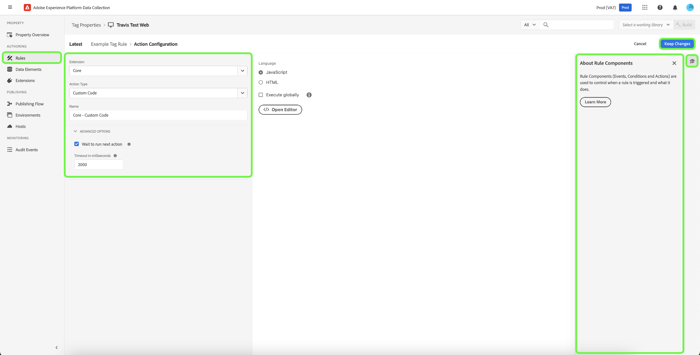

# Regels

>[!NOTE]
>
>Adobe Experience Platform Launch is omgedoopt tot een reeks technologieën voor gegevensverzameling in Adobe Experience Platform. Diverse terminologische wijzigingen zijn als gevolg hiervan in de productdocumentatie doorgevoerd. Raadpleeg het volgende [document](../../term-updates.md) voor een geconsolideerde referentie van de terminologische wijzigingen.

Tags in Adobe Experience Platform volgen een op regels gebaseerd systeem. Zij zoeken gebruikersinteractie en bijbehorende gegevens. Wanneer aan de criteria die in uw regels worden geschetst wordt voldaan, teweegbrengt de regel de uitbreiding, het manuscript, of cliënt-zijcode in werking u identificeerde.

Bouw regels om de gegevens en de functionaliteit van marketing en advertentietechnologie te integreren die ongelijksoortige producten in één enkele oplossing verenigt.

## Regelstructuur

**Gebeurtenissen (if):** de gebeurtenis is wat u de regel wilt zoeken. Dit wordt bepaald door een gebeurtenis, om het even welke toepasselijke voorwaarden, en om het even welke uitzonderingen te kiezen.

**Handelingen (vervolgens):** Triggers vinden plaats nadat de gebeurtenissen van een regel hebben plaatsgevonden en aan alle voorwaarden is voldaan. Een labelregel kan zoveel afzonderlijke acties activeren als u wilt en u kunt de volgorde bepalen waarin deze acties plaatsvinden. Bijvoorbeeld, kan één enkele regel voor e-commerce bedankt pagina uw analysehulpmiddelen en derdetags van één enkele regel teweegbrengen. Het is niet nodig voor elke extensie of tag afzonderlijke regels te maken.

U kunt meer gebeurtenistypen toevoegen. De veelvoudige gebeurtenissen worden aangesloten bij met OF, zodat zullen de voorwaarden van de regel worden geëvalueerd als om het even welke gebeurtenissen worden voldaan aan.

>[!IMPORTANT]
>
>Wijzigingen worden pas van kracht als ze [gepubliceerd](../publishing/overview.md) zijn.

### Gebeurtenissen en voorwaarden (indien van toepassing)

Gebeurtenissen met om het even welke voorwaarden zijn het *If* gedeelte van een regel.

Als een opgegeven gebeurtenis plaatsvindt, worden de voorwaarden geëvalueerd en vinden de opgegeven handelingen plaats, indien nodig.

* **Gebeurtenissen**: Geef een of meer gebeurtenissen op die moeten plaatsvinden om de regel te activeren. Bij meerdere gebeurtenissen hoort een OR. Om het even welke gespecificeerde gebeurtenissen zullen de regel teweegbrengen.

* **Voorwaarden**: Verfijn de gebeurtenis door om het even welke voorwaarden te vormen die voor een gebeurtenis waar moeten zijn om de regel teweeg te brengen. Een uitzondering wordt gedefinieerd als een NOT-voorwaarde. De veelvoudige voorwaarden worden aangesloten bij door EN.

Welke gebeurtenissen beschikbaar zijn, is afhankelijk van de extensies die zijn geïnstalleerd. Voor informatie over de gebeurtenissen in de uitbreiding van de Kern, zie [de types van de uitbreidingsgebeurtenis van de Kern](../../extensions/web/core/overview.md#core-extension-event-types).

### Handelingen (dan)

Handelingen zijn het *Dan* deel van een regel. Zij bepalen wat u wilt gebeuren wanneer de regel loopt. Wanneer een gebeurtenis in werking wordt gesteld, als de voorwaarden aan waar evalueren en de uitzonderingen aan vals evalueren, worden de acties uitgevoerd. U kunt acties slepen en neerzetten om ze naar wens te bestellen.

## Een regel maken

Maak een regel door op te geven welke handelingen worden uitgevoerd als aan een voorwaarde wordt voldaan.

1. Open het tabblad [!UICONTROL Rules] en selecteer **[!UICONTROL Create New Rule]**.

   

1. Geef de regel een naam.
1. Selecteer het pictogram Gebeurtenissen **[!UICONTROL Add]**.
1. Kies uw extensie en een van de gebeurtenistypen die beschikbaar zijn voor die extensie en configureer vervolgens de instellingen voor de gebeurtenis.

   

   Welke gebeurtenistypen beschikbaar zijn, is afhankelijk van de extensie die u hebt geselecteerd. Gebeurtenisinstellingen verschillen afhankelijk van het gebeurtenistype. Sommige gebeurtenissen hebben geen instellingen die moeten worden geconfigureerd.

   >[!IMPORTANT]
   >
   >In een client-side regel worden gegevenselementen aan het begin en einde van de naam van het gegevenselement gekoppeld aan een `%`. Bijvoorbeeld, `%viewportHeight%`. In een gebeurtenis-door:sturen regel, worden de gegevenselementen samengevoegd met `{{` aan het begin en `}}` aan het eind van de naam van het gegevenselement. Bijvoorbeeld, `{{viewportHeight}}`.

   Als u wilt verwijzen naar gegevens van het Edge-netwerk, moet het pad voor het gegevenselement `arc.event._<element>_` zijn.

   `arc` staat voor Adobe Response Context.

   Bijvoorbeeld: `arc.event.xdm.web.webPageDetails.URL`

   >[!IMPORTANT]
   >
   >Als dit pad onjuist is opgegeven, worden geen gegevens verzameld.

1. Stel de parameter Order in en selecteer **[!UICONTROL Keep Changes]**.

   De standaardvolgorde voor alle regelcomponenten is 50. Als u wilt dat er een sneller verloop is, geef dan een getal van minder dan 50.

   * Volgorde van uitvoering is volgorde van getallen. 1 komt voor 3. 3 komt voor 10. 10 komt vóór 100, enz.
   * Regels die dezelfde volgorde hebben, worden in geen enkele volgorde uitgevoerd.
   * Regels worden op volgorde afgegaan, maar hoeven niet noodzakelijkerwijs in dezelfde volgorde af te lopen. Als Regel A en Regel B een gebeurtenis delen, en u orde toewijst zodat Regel A eerst komt, dan als Regel A iets asynchroon doet, is er geen garantie dat Regel A eindigt alvorens Regel B begint.

      Als u het later wilt uitvoeren, geef het een aantal hoger dan 50. Voor meer informatie over het opdracht geven tot, zie [Regel het opdracht geven](rules.md#rule-ordering).

1. Selecteer het pictogram Voorwaarden **[!UICONTROL Add]**, kies dan een logisch type, uitbreiding, voorwaardetype en vorm de montages voor uw voorwaarde. Selecteer vervolgens **[!UICONTROL Keep Changes]**.

   

   De beschikbare voorwaardetypen hangen van de uitbreiding af u hebt geselecteerd. Voorwaarde-instellingen verschillen afhankelijk van het type voorwaarde.

   Type logica:

   * Met het gewone logische type kunnen handelingen worden uitgevoerd als aan de voorwaarde is voldaan
   * Het type van de logica van de uitzondering verhindert acties worden uitgevoerd als aan de voorwaarde wordt voldaan

   (Geavanceerd) Time-out: Deze optie is beschikbaar wanneer het rangschikken van de regelcomponent op uw bezit wordt toegelaten. Dit kenmerk definieert de maximale hoeveelheid tijd die de voorwaarde mag uitvoeren. Als de onderbreking wordt bereikt, ontbreekt de voorwaarde en de rest voorwaarden en de acties van de regel zullen uit de verwerkingsrij worden verwijderd. De standaardwaarde is 2000 ms.

   U kunt zoveel voorwaarden toevoegen als u wilt. De veelvoudige voorwaarden binnen de zelfde regel worden aangesloten bij EN.

1. Selecteer het pictogram Handelingen **[!UICONTROL Add]**, kies dan uw uitbreiding en één van de actietypes beschikbaar voor die uitbreiding, vorm de montages voor de actie, dan selecteer **[!UICONTROL Keep Changes]**.

   

   Welke handelingstypen beschikbaar zijn, is afhankelijk van de extensie die u hebt geselecteerd. De instellingen voor handelingen verschillen afhankelijk van het type handeling.

   (Geavanceerd) Wacht tot volgende handeling wordt uitgevoerd: Deze optie is beschikbaar wanneer het rangschikken van de regelcomponent op uw bezit wordt toegelaten. Als deze optie is ingeschakeld, worden de volgende handelingen pas door de labels aangeroepen wanneer deze zijn voltooid. Als deze optie is uitgeschakeld, wordt de volgende actie direct uitgevoerd. De standaardwaarde is **[!UICONTROL Checked]**.

   (Geavanceerd) Time-out: Deze optie is beschikbaar wanneer het rangschikken van de regelcomponent op uw bezit wordt toegelaten. Hiermee wordt de maximale hoeveelheid tijd gedefinieerd die de handeling mag voltooien. Als de onderbreking wordt bereikt, ontbreekt de actie en om het even welke verdere acties voor deze regel zullen worden verwijderd uit de verwerkingsrij. De standaardwaarde is 2000 ms.

1. Herzie uw regel, dan uitgezocht **[!UICONTROL Save Rule]**.

   Later, wanneer u [publish](../publishing/overview.md), zult u deze regel aan een bibliotheek toevoegen en het opstellen.

Wanneer het creëren van of het uitgeven van regels, kunt u opslaan en aan uw [actieve bibliotheek](../publishing/libraries.md#active-library) bouwen. Hiermee slaat u de wijziging onmiddellijk op in uw bibliotheek en wordt een build uitgevoerd. De status van de build wordt weergegeven.

## Regelvolgorde {#rule-ordering}

De orde die van de regel toestaat u om de orde van uitvoering voor regels te controleren die een gebeurtenis delen.

Het is vaak belangrijk dat uw regels in een bepaalde volgorde worden geactiveerd. Voorbeelden: (1) u hebt verscheidene regels die voorwaardelijk [!DNL Analytics] variabelen plaatsen en u moet ervoor zorgen dat de regel met Send Bacon het laatst gaat. (2) u hebt een regel die [!DNL Target] en een andere regel in brand steken [!DNL Analytics] en u wilt eerst de [!DNL Target] regel in werking stellen.

Uiteindelijk ligt de verantwoordelijkheid voor het uitvoeren van handelingen in volgorde bij de extensieontwikkelaar van het gebeurtenistype dat u gebruikt. Adobe-extensieontwikkelaars zorgen ervoor dat hun extensies werken zoals u wilt. Voor extensies van derden biedt Adobe ontwikkelaars richtlijnen voor het correct implementeren van extensies, maar dat is hun taak.

Adobe raadt u ten zeerste aan om uw regels te bestellen met een positief getal tussen 1 en 100 (de standaardwaarde is 50). Eenvoudiger is beter. Vergeet niet dat u uw bestelling moet onderhouden. Adobe herkent echter dat er randgevallen kunnen zijn waarbij dat beperkt zal zijn, zodat andere getallen zijn toegestaan. Tags ondersteunen getallen tussen +/- 2.147.483.648. U kunt ook ongeveer 10 decimalen gebruiken - maar als u in een scenario bent waar u denkt dat u dat moet doen, zou u sommige besluiten moeten heroverwegen u hebt gemaakt om tot waar u nu bent te komen.

>[!IMPORTANT]
>
>In de sectie van de Actie van een regel, server-zijregels worden uitgevoerd opeenvolgend. Zorg ervoor de orde correct is wanneer u de regel creeert.

### Scenarios

* Vijf regels delen een gebeurtenis. Allemaal hebben de standaardprioriteit. Ik wil dat een van hen de laatste is. Ik moet alleen die ene regelcomponent bewerken en er een getal hoger dan 50 (bijvoorbeeld 60) aan geven.
* Vijf regels delen een gebeurtenis. Allemaal hebben de standaardprioriteit. Ik wil dat een van hen eerst loopt. Ik moet die ene regelcomponent bewerken en er een getal van lager dan 50 (bijvoorbeeld 40) aan geven.

### Regelafhandeling op de client

De ladingsorde voor regels hangt af van of de regelactie met JavaScript, HTML, of andere cliënt-zijcode wordt gevormd, en of de regels een pagina bodem of hoogste gebeurtenis, of een verschillend type van gebeurtenis gebruiken.

U kunt `document.write` binnen uw douanescripts ongeacht de gebeurtenissen gebruiken die voor de regel worden gevormd.

U kunt verschillende aangepaste codetypen onder elkaar bestellen. U kunt nu bijvoorbeeld een aangepaste JavaScript-codehandeling hebben, vervolgens een aangepaste HTML-codehandeling en vervolgens een aangepaste JavaScript-codehandeling. Tags zorgen ervoor dat ze in die volgorde worden uitgevoerd.

## Regelbundeling

Regelgebeurtenissen en -voorwaarden worden altijd gebundeld in de hoofdtagbibliotheek. Acties kunnen in de hoofdbibliotheek worden gebundeld of te laat worden geladen als subbronnen. Of de acties gebundeld zijn of niet wordt bepaald door het gebeurtenistype van de regel.

### Regels met gebeurtenissen &quot;Core - Library Loaded&quot; of &quot;Core - Page Top&quot;

Deze gebeurtenissen moeten bijna altijd worden uitgevoerd (tenzij de omstandigheden false opleveren). Voor efficiëntie worden ze gebundeld in de hoofdbibliotheek, het bestand waarnaar wordt verwezen door uw insluitcode.

* **JavaScript:** het JavaScript wordt ingesloten in de tagbibliotheek met hoofditems. Het aangepaste script wordt verpakt in een scripttag en naar het document geschreven met `document.write`. Als de regel meerdere aangepaste scripts heeft, worden deze op volgorde geschreven.

   >[!NOTE]
   >
   >Tags gebruiken ES5 JavaScript. Het door:sturen van de gebeurtenis gebruikt ES6.

* **HTML:** De HTML is ingesloten in de hoofdtagbibliotheek. `document.write` wordt gebruikt om de HTML naar het document te schrijven. Als de regel meerdere aangepaste scripts heeft, worden deze op volgorde geschreven.

### Regels met andere gebeurtenissen

Adobe kan niet garanderen dat andere regels daadwerkelijk in werking zullen treden en dat hun actiecode nodig zal zijn. Daarom worden de acties voor alle gebeurtenistypen die hierboven niet worden vermeld, niet in de hoofdbibliotheek verpakt. In plaats daarvan worden ze opgeslagen als subbronnen en wordt zo nodig verwezen door de hoofdbibliotheek.

* **JavaScript:** Het JavaScript wordt als normale tekst vanaf de server geladen, in een scripttag opgenomen en met Postscript aan het document toegevoegd. Als de regel meerdere aangepaste JavaScript-scripts heeft, worden deze parallel van de server geladen, maar in dezelfde volgorde uitgevoerd als in de regel.
* **HTML:** De HTML wordt geladen van de server en aan het document toegevoegd gebruikend Postscript. Als de regel veelvoudige manuscripten van douaneHTML heeft, worden zij geladen parallel van de server, maar in de zelfde orde uitgevoerd die in de regel werd gevormd.

## Regelcomponentvolgorde

Het gedrag van de runtimeomgeving van de tag hangt af van het feit of **[!UICONTROL Run rule components in sequence]** voor uw eigenschap is in- of uitgeschakeld.

### Ingeschakeld

Indien toegelaten, wanneer een gebeurtenis bij runtime wordt teweeggebracht, worden de voorwaarden en de acties van de regel toegevoegd aan een verwerkingsrij-gebaseerd op de orde u-bepaald-en verwerkt tegelijkertijd op een basis FIFO. De tag wacht tot de component is voltooid voordat naar de volgende wordt gegaan.

Als een voorwaarde als vals evalueert of zijn bepaalde onderbreking bereikt, worden de verdere voorwaarden en de acties van die regel verwijderd uit de rij.

Als een actie ontbreekt of zijn bepaalde onderbreking bereikt, worden de verdere acties van die regel verwijderd uit de rij.

>[!NOTE]
>
>Als deze instelling is ingeschakeld, worden alle voorwaarden en handelingen asynchroon uitgevoerd, zelfs als u de tagbibliotheek synchroon hebt geladen.

### Uitgeschakeld

Als deze optie is uitgeschakeld en een gebeurtenis wordt geactiveerd tijdens uitvoering, worden de voorwaarden van de regel direct geëvalueerd. Meerdere omstandigheden worden parallel geëvalueerd.

Wanneer alle voorwaarden true retourneren (en uitzonderingen false retourneren), worden de handelingen van de regel onmiddellijk uitgevoerd. De handelingen worden op volgorde aangeroepen, maar de tags wachten niet tot de ene handeling is voltooid voordat de volgende wordt aangeroepen. Als uw acties synchroon zijn, worden ze nog steeds op volgorde uitgevoerd. Als een of meer acties asynchroon zijn, worden sommige acties parallel uitgevoerd.
