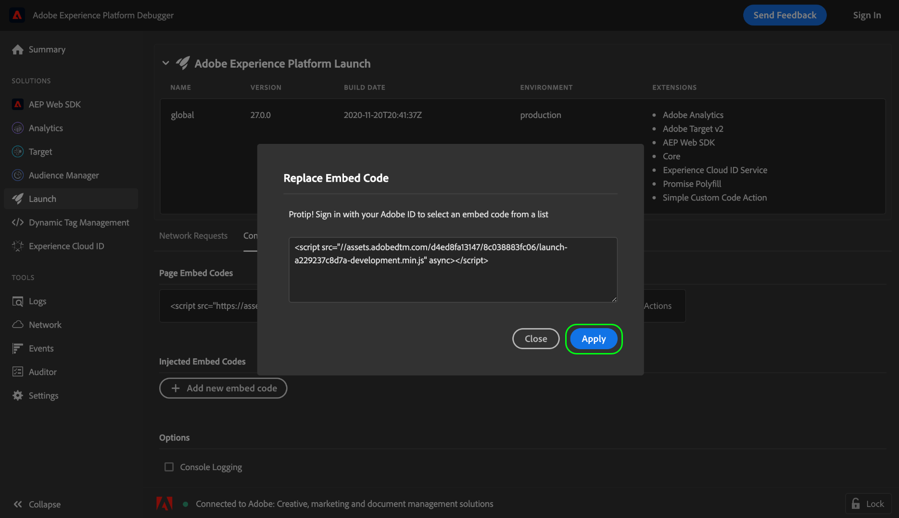
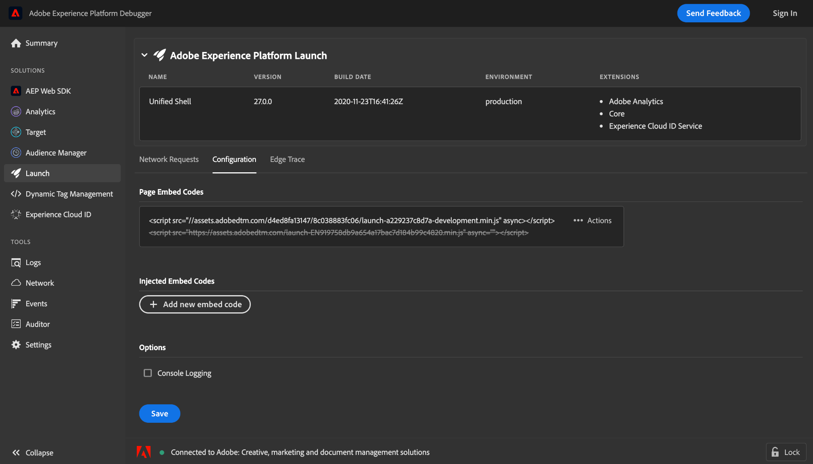

# Insluitcodes testen met Adobe Experience Platform Debugger

Als u wijzigingen aanbrengt in uw tagbibliotheek die in Adobe Experience Platform is gemaakt, moet u deze wijzigingen testen voordat u de build implementeert in uw productieomgeving. Als u geen specifieke testomgeving of ontwikkelomgeving voor uw website hebt, kunt u Adobe Experience Platform Debugger gebruiken om verschillende insluitcodes op uw site lokaal te testen.

## Vereisten

Deze zelfstudie vereist een goed begrip van het gebruik van omgevingen en insluitcodes voor tags. Zie het [ milieu&#39;s overzicht ](./environments.md) voor meer informatie.

Deze zelfstudie vereist ook dat u de browserextensie van Experience Platform Debugger hebt geïnstalleerd. Experience Platform Debugger is beschikbaar voor de browser van Chrome. Gebruik de volgende koppeling om de extensie te installeren voordat u de zelfstudie start:

* [ Debugger van Experience Platform voor Chrome ](https://chrome.google.com/webstore/detail/adobe-experience-platform/bfnnokhpnncpkdmbokanobigaccjkpob)

## Experience Platform Debugger openen op uw website

Navigeer met de browser van uw keuze naar uw website en open de extensie Experience Platform Debugger. De site waarmee Experience Platform Debugger momenteel is verbonden, wordt onder in het venster weergegeven. Als er momenteel tags op uw site worden uitgevoerd, wordt deze weergegeven op het tabblad [!UICONTROL Summary] .

>[!NOTE]
>
>Als Experience Platform Debugger in eerste instantie geen verbinding maakt, moet u mogelijk het browsertabblad dat uw website weergeeft opnieuw laden voordat u het opnieuw probeert.

## Insluitcodes vervangen

Nadat Experience Platform Debugger verbinding heeft gemaakt met uw site, selecteert u **[!UICONTROL Launch]** in de linkernavigatie. Hier ziet u informatie over de bibliotheek die momenteel op uw site wordt uitgevoerd, inclusief de omgeving en bijbehorende extensies. Selecteer van hieruit **[!UICONTROL Configuration]** om besturingselementen voor het beheren van insluitcodes weer te geven.

Onder [!UICONTROL Page Embed Codes] wordt de insluitcode weergegeven die uw site momenteel gebruikt. Selecteer **[!UICONTROL Actions]** aan de rechterkant van de insluitcode en selecteer vervolgens **[!UICONTROL Replace]** .

Er wordt een pop-up weergegeven waarin u wordt gevraagd een insluitcode op te geven om de huidige code te vervangen door. Als u de insluitcode vervangt met Experience Platform Debugger, verandert de geïmplementeerde insluitcode op uw site niet. In plaats daarvan vervangt deze alleen de insluitcode die lokaal wordt uitgevoerd, zodat u de implementatie kunt testen en fouten kunt opsporen.

Plak de insluitcode die u wilt testen in het opgegeven tekstvak en selecteer vervolgens **[!UICONTROL Apply]** .

Het tabblad **[!UICONTROL Configuration]** wordt weer weergegeven, zodat u kunt zien dat de actieve insluitcode is vervangen door de code die u hebt opgegeven. U kunt nu de webbrowser gebruiken om te controleren of de insluitcode die u test, naar behoren werkt.

## Volgende stappen

In deze zelfstudie wordt beschreven hoe u met Experience Platform Debugger lokaal kunt schakelen tussen insluitcodes voor testdoeleinden. Verwijs naar de [ Debugger van Experience Platform documentatie ](../../../debugger/home.md) voor meer informatie over zijn diverse mogelijkheden.
