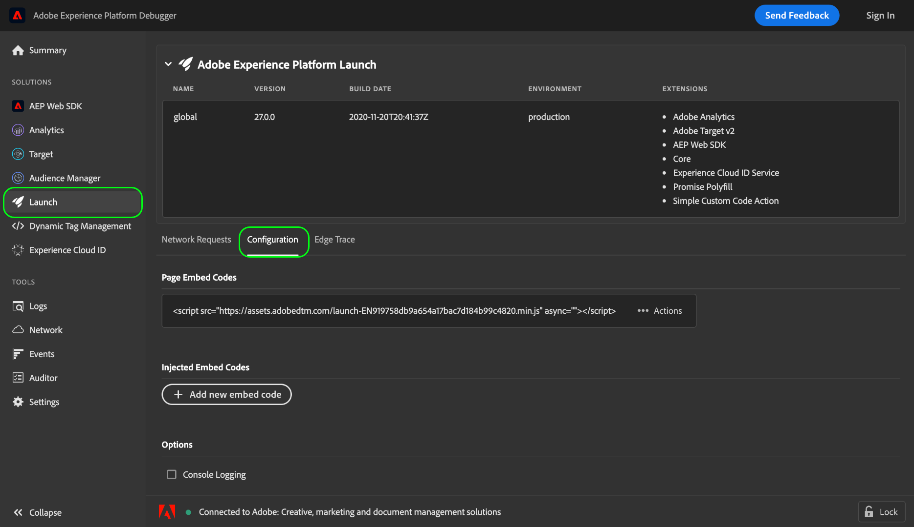

# Insluitcodes testen met Adobe Experience Platform Debugger

>[!NOTE]
>
>Adobe Experience Platform Launch wordt omgedoopt tot een reeks technologieën voor gegevensverzameling in Experience Platform. Diverse terminologische wijzigingen zijn als gevolg hiervan in de productdocumentatie doorgevoerd. Raadpleeg het volgende [document](../../term-updates.md) voor een geconsolideerde referentie van de terminologische wijzigingen.

Als u wijzigingen aanbrengt in uw tagbibliotheek die in Adobe Experience Platform is gemaakt, moet u deze wijzigingen testen voordat u de build implementeert in uw productieomgeving. Als u geen specifieke testomgeving of ontwikkelomgeving voor uw website hebt, kunt u Adobe Experience Platform Debugger gebruiken om verschillende insluitcodes op uw site lokaal te testen.

## Vereisten

Deze zelfstudie vereist een goed begrip van het gebruik van omgevingen en insluitcodes in de gebruikersinterface voor gegevensverzameling. Zie het [Omgevingenoverzicht](./environments.md) voor meer informatie.

Deze zelfstudie vereist ook dat u de browserextensie van Foutopsporing voor Platforms hebt geïnstalleerd. Foutopsporing voor Platforms is alleen beschikbaar voor Chrome- en Firefox-browsers. Gebruik een van de volgende koppelingen om de extensie te installeren voordat u de zelfstudie start:

* [Foutopsporing Platform voor Chrome](https://chrome.google.com/webstore/detail/adobe-experience-platform/bfnnokhpnncpkdmbokanobigaccjkpob)
* [Foutopsporing voor Platform voor Firefox](https://addons.mozilla.org/en-US/firefox/addon/adobe-experience-platform-dbg/)

## Foutopsporing Platform openen op uw website

Navigeer met de browser van uw keuze naar uw website en open de extensie Foutopsporing Platform. De site waarmee Foutopsporing op Platform is verbonden, wordt onder in het venster weergegeven. Als er momenteel tags op uw site worden uitgevoerd, wordt deze weergegeven op het tabblad [!UICONTROL Summary].

>[!NOTE]
>
>Als Foutopsporing op Platform in eerste instantie geen verbinding maakt, moet u mogelijk het browsertabblad opnieuw laden dat uw website weergeeft voordat u het opnieuw probeert.

## Insluitcodes vervangen

Als Foutopsporing Platform is verbonden met uw site, selecteert u **[!UICONTROL Launch]** in de linkernavigatie. Hier ziet u informatie over de bibliotheek die momenteel op uw site wordt uitgevoerd, inclusief de omgeving en bijbehorende extensies. Selecteer **[!UICONTROL Configuration]** om besturingselementen voor het beheren van insluitcodes weer te geven.

Onder [!UICONTROL Page Embed Codes] wordt de insluitcode weergegeven die uw site momenteel gebruikt. Selecteer **[!UICONTROL Actions]** aan de rechterkant van de insluitcode en selecteer **[!UICONTROL Replace]**.

Er wordt een pop-up weergegeven waarin u wordt gevraagd een insluitcode op te geven om de huidige code te vervangen door. Merk op dat het vervangen van de insluitcode die Foutopsporing van het Platform gebruikt de opgestelde insluitcode op uw plaats niet verandert. In plaats daarvan vervangt deze alleen de insluitcode die lokaal wordt uitgevoerd, zodat u de implementatie kunt testen en fouten kunt opsporen.

Plak de insluitcode die u wilt testen in het opgegeven tekstvak en selecteer **[!UICONTROL Apply]**.

Het tabblad **[!UICONTROL Configuration]** wordt opnieuw weergegeven, zodat u kunt zien dat de actieve insluitcode is vervangen door de code die u hebt opgegeven. U kunt nu de webbrowser gebruiken om te controleren of de insluitcode die u test, naar behoren werkt.

## Volgende stappen

In deze zelfstudie wordt besproken hoe u met behulp van Foutopsporing op Platform lokaal kunt schakelen tussen insluitcodes voor testdoeleinden. Raadpleeg de [documentatie bij Foutopsporing Platform](https://experienceleague.adobe.com/docs/debugger/using-v2/experience-cloud-debugger.html) voor meer informatie over de verschillende mogelijkheden.
