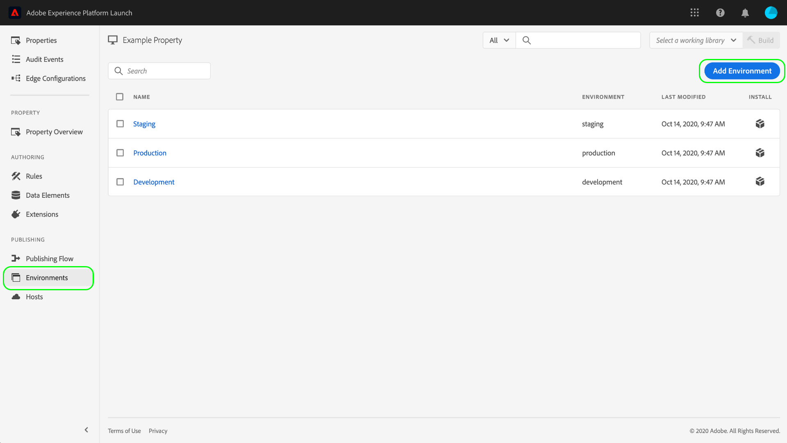

# Omgevingen

Tagomgevingen definiëren verschillende belangrijke aspecten van de bibliotheekbuilds die u op uw website of app implementeert:

* De bestandsnaam van de build.
* Het domein en de weg van de bouwstijl, afhankelijk van de toegewezen gastheer van het milieu.
* De bestandsindeling van de build, afhankelijk van de gekozen archiefoptie.

Wanneer u een bibliotheek maakt, moet u deze toewijzen aan een omgeving. De uitbreidingen, de regels, en de gegevenselementen van de bouwstijl worden dan gecompileerd en in het toegewezen milieu geplaatst. Elke omgeving bevat een unieke insluitcode waarmee u de toegewezen build in uw site kunt integreren.

In elke omgeving kunnen verschillende artefacten voorkomen. Op deze manier kunt u verschillende bibliotheken in verschillende omgevingen testen terwijl u ze door uw workflow duwt.

Dit document bevat stappen voor het installeren, configureren en maken van verschillende omgevingen in de gebruikersinterface voor gegevensverzameling.

## Omgevingstypen

De markeringen steunen drie verschillende milieutypes, elk die aan een verschillende staat in het [&#x200B; het publiceren werkschema &#x200B;](./publishing-flow.md) beantwoorden:

| Type omgeving | Beschrijving |
| --- | --- |
| Ontwikkeling | Dit milieu beantwoordt met de **kolom van de Ontwikkeling** in het publiceren werkschema. |
| Staging | Dit milieu beantwoordt met **voorgelegde** en **Goedgekeurde** kolommen in het het publiceren werkschema. |
| Productie | Dit milieu beantwoordt met de **Gepubliceerde** kolom in het het publiceren werkschema. |

In elke omgeving kunnen verschillende artefacten voorkomen. Hierdoor kunt u verschillende bibliotheken in verschillende omgevingen testen terwijl u ze doorloopt in de publicatieworkflow.

>[!NOTE]
>
>Aan elke omgeving kan slechts één bibliotheekbuild tegelijk worden toegewezen. Nochtans, wordt verwacht dat één enkele milieu vele verschillende bouwstijlen in tijd zal bevatten aangezien u hen door het publiceren werkschema beweegt, die bouwt zonodig opnieuw aan tussen milieu&#39;s.

## Installatie {#installation}

Elke omgeving heeft een set instructies die worden gebruikt om de omgeving te verbinden met uw toepassing. Voor wegeigenschappen bevatten deze instructies insluitcodes. Voor mobiele eigenschappen, verstrekken deze instructies de code noodzakelijk om de bibliotheken te concretiseren u gebruikt en de configuratie bij runtime terugwinnen.

>[!IMPORTANT]
>
>Elk omgevingstype heeft zijn eigen bijbehorende installatie-instructies. Afhankelijk van de omgeving die u gebruikt, moet u ervoor zorgen dat u de juiste corresponderende insluitcodes en/of afhankelijkheden gebruikt.
>
>De insluitcode voor de productie van een webeigenschap ondersteunt bijvoorbeeld het in cache plaatsen van browsers, terwijl de insluitcodes voor de ontwikkeling en het opvoeren van insluitcodes dat niet doen. Als dusdanig, zou u ontwikkeling of het opvoeren ingebedde codes in hoog-verkeer of productiecontext niet moeten gebruiken.

Als u de installatie-instructies voor een omgeving wilt openen, navigeert u naar de tab **[!UICONTROL Environments]** voor de eigenschap en selecteert u vervolgens het pictogram **[!UICONTROL Install]** voor die omgeving.

Als u een webeigenschap gebruikt, krijgt u een insluitcode die moet worden gebruikt in de tag `<head>` van het document. U krijgt ook de mogelijkheid om bibliotheekbestanden synchroon of asynchroon te implementeren tijdens runtime. Afhankelijk van de instelling die u kiest, zijn de weergegeven installatie-instructies anders. Insluitcodes worden verderop in dit document uitgebreid uitgelegd.

Als u een mobiel bezit gebruikt, krijgt u afzonderlijke instructies voor het installeren van gebiedsdelen voor Android (via [&#x200B; Gradle &#x200B;](https://gradle.org/)) en iOS (via [&#x200B; CocoaPods &#x200B;](https://cocoapods.org/)).

## Mobiele configuratie

Voor mobiele eigenschappen kunt u de configuratieopties voor een omgeving bekijken door deze in de lijst te selecteren. Hier kunt u de naam van de omgeving wijzigen. Mobiele omgevingen kunnen momenteel alleen met Adobe beheerde hosts gebruiken.

Zie het overzicht op [&#x200B; gastheren &#x200B;](./hosts/hosts-overview.md) voor meer informatie.

## Webconfiguratie

De instellingen van de toegewezen omgeving bepalen het volgende voor wegeigenschappen:

* **Gastheer**: De serverplaats waar u uw bouwstijl wilt worden opgesteld.
* **Archivering die** plaatst: Of het systeem een plaatsbare reeks dossiers zou moeten uitvoeren of hen gecomprimeerd in een archiefformaat hebben.
* **bedt code** in: De `<script>` code die binnen HTML van uw websitepagina&#39;s moet worden ingebed, wordt gebruikt om de bibliotheek op te stellen bouwt bij runtime.

Selecteer op het tabblad [!UICONTROL Environments] een weergegeven omgeving om de bijbehorende besturingselementen voor configuratie weer te geven.

### Host {#host}

Selecteer **[!UICONTROL Host]** om een vooraf geconfigureerde host voor de omgeving te kiezen in het vervolgkeuzemenu.

Wanneer een bouwstijl wordt gecreeerd, wordt die bouwstijl geleverd aan de plaats u voor de toegewezen gastheer specificeerde. Voor informatie over om markeringsgastheren tot stand te brengen en te vormen, verwijs naar het [&#x200B; overzicht van gastheren &#x200B;](./hosts/hosts-overview.md).

### Archiefinstelling {#archive}

De meeste builds bestaan uit meerdere bestanden. Samenstellen van meerdere bestanden bevatten een hoofdbibliotheekbestand (gekoppeld in de insluitcode) dat interne verwijzingen bevat naar de andere bestanden die zo nodig worden ingesloten.

Met de knop **[!UICONTROL Create archive]** kunt u de archiefinstelling van de omgeving in- en uitschakelen. Standaard wordt de archiefoptie uitgeschakeld en wordt de build geleverd in een indeling die &#39;as-is&#39; wordt uitgevoerd (JavaScript voor wegeigenschappen en JSON voor mobiele eigenschappen).

Als u ervoor kiest om de archiefinstelling in te schakelen, worden aanvullende configuratie-instellingen weergegeven in de gebruikersinterface, zodat u het archiefbestand optioneel kunt coderen en een pad naar de bibliotheek kunt definiëren als u zelfhosting gebruikt.

Het pad kan een volledige URL zijn of een relatief pad dat over meerdere domeinen kan worden gebruikt. Dit is belangrijk omdat de meeste builds meerdere bestanden hebben die interne verwijzingen naar elkaar bevatten.

Als u de archiefoptie gebruikt, worden alle bouwstijlbestanden als ZIP-bestand geleverd. Dit is handig als:

1. U hebt zelf hosting van de bibliotheek, maar u wilt geen SFTP-host instellen voor levering.
1. U moet codeanalyse op bouwstijl voorafgaand aan plaatsing in werking stellen.
1. U wilt enkel naar de bouwstijlinhoud kijken om te zien wat het bevat.

### Code insluiten {#embed-code}

Een insluitcode is een `<script>` -tag die in de `<head>` -secties van uw websitepagina&#39;s moet worden geplaatst om de code die u maakt te laden en uit te voeren. Bij elke omgevingsconfiguratie wordt automatisch een eigen insluitcode gegenereerd. U hoeft deze dus alleen te kopiëren en in uw site te plakken op de pagina&#39;s waarop de tags moeten worden uitgevoerd.

Wanneer u de installatie-instructies bekijkt, kunt u ervoor kiezen om het script de bibliotheekbestanden synchroon of asynchroon te laten laden. Deze instelling is niet blijvend en geeft niet aan hoe u tags daadwerkelijk hebt geïmplementeerd op uw site. Het is alleen bedoeld om de juiste manier te tonen om de omgeving te installeren.

>[!WARNING]
>
>Afhankelijk van de inhoud van uw tagbibliotheek kan het gedrag van uw regels en andere elementen veranderen tussen synchrone en asynchrone implementatie. Daarom is het belangrijk om alle aangebrachte wijzigingen grondig te testen.

#### Asynchrone implementatie

Met asynchrone implementatie kan de browser de rest van de pagina blijven laden terwijl de bibliotheek wordt opgehaald. Er is slechts één insluitcode wanneer u deze instelling gebruikt, die in het document `<head>` moet worden geplaatst.

Voor meer informatie over dit plaatsen, zie de gids op [&#x200B; asynchrone plaatsing &#x200B;](../client-side/asynchronous-deployment.md).

#### Synchrone implementatie

Wanneer de browser een ingesloten code leest met een synchrone implementatie, wordt de tagbibliotheek opgehaald en uitgevoerd voordat de pagina verder wordt geladen.

Synchrone insluitcodes bestaan uit twee `<script>` -tags die in de HTML van uw website moeten worden geplaatst. Een `<script>` -tag moet in het document `<head>` worden geplaatst, een ander label moet vlak voor de afsluitende `</body>` -tag worden geplaatst.

#### Code-updates insluiten

Aangezien insluitcodes worden gegenereerd op basis van uw omgevingsconfiguraties, wordt de insluitcode voor de desbetreffende omgeving door sommige configuratiewijzigingen automatisch bijgewerkt. Deze wijzigingen zijn onder meer:

* Het schakelen van een Adobe-geleide gastheer aan een gastheer SFTP, of vice versa.
* De archiefinstelling wijzigen.
* Het padveld bijwerken als de archiefinstelling is ingeschakeld.

>[!WARNING]
>
>Wanneer de insluitcode van een tagomgeving verandert, moet u de insluitcodes handmatig bijwerken in uw HTML. Om kostbaar onderhoud te voorkomen, dient u uw insluitcode(s) alleen bij te werken als dat absoluut noodzakelijk is.

## Een omgeving maken

Drie milieu&#39;s worden automatisch toegewezen aan een bezit wanneer dat bezit eerst wordt gecreeerd: ontwikkeling, het opvoeren, en productie. Dit is genoeg om de publicatieworkflow uit te voeren. U kunt desgewenst echter aanvullende ontwikkelomgevingen toevoegen, omdat dit nuttig kan zijn voor grotere teams waar meerdere ontwikkelaars tegelijkertijd aan verschillende projecten werken.

Selecteer op het tabblad [!UICONTROL Environments] voor de eigenschap de optie **[!UICONTROL Add Environment]** .

Selecteer in het volgende scherm de optie **[!UICONTROL Development]** .

In het volgende scherm kunt u de nieuwe omgeving een naam geven, een host selecteren en een archiefinstelling kiezen. Als u klaar bent, selecteert u **[!UICONTROL Save]** om de omgeving te maken.

Het tabblad [!UICONTROL Environments] wordt weer weergegeven, met de installatie-instructies voor de nieuwe omgeving.

## Volgende stappen

Door dit document te lezen, hebt u een goed begrip voor het configureren van omgevingen in de gebruikersinterface en het installeren van deze omgevingen in uw website of app. U kunt nu beginnen met het publiceren van uw bibliotheekbuilds.

Wanneer u in de loop der tijd herhalingen van uw bibliotheek publiceert, is het mogelijk nodig om eerdere builds bij te houden en te archiveren voor probleemoplossing en terugdraaidoeleinden. Zie de gids bij [&#x200B; opnieuw publiceren oudere bibliotheken &#x200B;](./republish.md) voor meer informatie.
