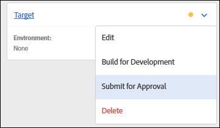

# Bibliotheken

Een bibliotheek is een reeks instructies voor hoe de uitbreidingen, gegevenselementen, en de regels met elkaar in wisselwerking staan nadat zij worden opgesteld. Wanneer u een bibliotheek maakt, geeft u de wijzigingen op die u in de bibliotheek wilt aanbrengen. Tijdens het maken worden deze wijzigingen gecombineerd met alles wat in vorige bibliotheken is verzonden, goedgekeurd of gepubliceerd.

Bibliotheken bevatten de toevoeging of verwijdering van:

* Regels
* Elementen
* Extensieconfiguratie

Bibliotheken moeten aan een omgeving worden toegewezen voordat ze in een build kunnen worden gecompileerd. Bibliotheken worden als geheel goedgekeurd of verworpen. U kunt afzonderlijke items in een bibliotheek niet goedkeuren of afwijzen. Een bibliotheek beweegt zich tussen verscheidene milieu&#39;s aangezien het zijn weg door het publiceren werkschema maakt.

## Een bibliotheek maken {#create-a-library}

Voer de volgende stappen uit om een bibliotheek te maken.

1. Open de tab [!UICONTROL Publishing] .

   De pagina [!UICONTROL Publishing] bevat een lijst met de Dev-bibliotheken en biedt de mogelijkheid om deze ter goedkeuring in te dienen, naar een lagere versie te verplaatsen of naar de productie te publiceren.

1. Selecteer **[!UICONTROL Add New Library]**.

   

1. Geef de bibliotheek een naam.
1. Wijs de bibliotheek toe aan een Dev-omgeving.
1. Voeg een wijziging toe aan de bibliotheek.
Als u een item wilt toevoegen, selecteert u **[!UICONTROL Add a Change]** en kiest u de items die u wilt toevoegen. Elk item dat is bewerkt of verwijderd, kan worden toegevoegd aan de gekozen bibliotheek.

   

   U kunt het volgende toevoegen aan uw bibliotheek:

   * Regels
   * Gegevenselementen
   * Extensieconfiguraties

1. Selecteer **[!UICONTROL Add All Changed Resources]** om gewijzigde bronnen toe te voegen.
1. Selecteer **[!UICONTROL Save]** of **[!UICONTROL Save and Build for Development]** .

   Het opstellen compileert een bouwstijl en stelt het aan het toegewezen milieu op.

Nadat u een bibliotheek hebt gemaakt, selecteert u een van de volgende opties in het keuzemenu voor die bibliotheek:

* **geeft** uit: Deze optie staat u toe om de bibliotheekconfiguratie te veranderen.

* **bouwt voor Ontwikkeling**: Deze optie compileert een bouwt en stelt het aan het toegewezen milieu op.

* **legt voor Goedkeuring** voor: Deze optie maakt de bibliotheek beschikbaar voor een Approver om het naar de volgende stap in het het publiceren proces te verplaatsen.

* **Schrapping**: Deze optie verwijdert de momenteel geselecteerde bibliotheek uit het het publiceren proces.

## Toevoegen aan een bibliotheek {#add-to-a-library}

Voer de volgende stappen uit om een bibliotheek toe te voegen.

1. Installeer de [&#x200B; uitbreidingen &#x200B;](../managing-resources/extensions/overview.md) u wilt toevoegen.
1. Creeer de [&#x200B; gegevenselementen &#x200B;](../managing-resources/data-elements.md) en de regels u wilt toevoegen.
1. Open de tab **[!UICONTROL Publishing]** .
1. Selecteer de [&#x200B; bibliotheek &#x200B;](libraries.md) u wilt veranderen, dan selecteren **[!UICONTROL Edit]**.
1. Gebruik de knoppen voor regels, gegevenselementen en extensies om de items te selecteren die u wilt toevoegen aan de bibliotheek.
1. Sla de wijzigingen op.

Wijzigingen in de bibliotheek worden weergegeven in het wijzigingslogboek Bibliotheek Inhoud.

>[!NOTE]
>
>Gegevenselementen kunnen afhankelijk zijn van extensies. De regels kunnen van zowel gegevenselementen als uitbreidingen afhangen. Als u niet alle noodzakelijke componenten in uw bibliotheek omvat, zal de bouwstijl bij bouwstijltijd ontbreken en u zult de noodzakelijke componenten moeten toevoegen alvorens u een succesvolle bouwstijl voltooit. Een toekomstige versie controleert afhankelijkheden wanneer u wijzigingen aanbrengt in een bibliotheek.

## Verwijderen uit een bibliotheek

Als u iets uit een bibliotheek wilt verwijderen, moet u het deactiveren en vervolgens de gedeactiveerde status publiceren.

1. Schakel de extensies die u wilt verwijderen uit, samen met de gegevenselementen en -regels die van deze extensies afhankelijk zijn.
1. Schakel de gegevenselementen en -regels uit die u wilt verwijderen.
1. Open de tab **[!UICONTROL Publishing]** .
1. Selecteer de bibliotheek die u wilt wijzigen.
1. Gebruik de knoppen voor regels, gegevenselementen en extensies om de uitgeschakelde items te selecteren die u uit de bibliotheek wilt verwijderen.
1. Sla de wijzigingen op.

## Bibliotheekwijzigingen beheren

Voer de volgende stappen uit om de bibliotheekopties te bewerken.

1. Kies een bibliotheek en selecteer **[!UICONTROL Edit]** om bibliotheekwijzigingen weer te geven. Alle wijzigingen worden weergegeven in de lijst [!UICONTROL Library Contents] .

   

1. Selecteer een wijziging die u wilt weergeven en selecteer een revisie.

   

1. Selecteer of om **Alle** punten of **Gewijzigde** punten te tonen.
1. Selecteer de revisie en selecteer vervolgens **[!UICONTROL Select Revision]** .
1. Selecteer **[!UICONTROL Add a Change]** of **[!UICONTROL Add All Changed Resources]** .

## Actieve bibliotheek {#active-library}

De bibliotheken kapselen een reeks veranderingen in u aan uw opgestelde code wilt aanbrengen. De actieve Bibliotheek maakt dit gemakkelijker, toestaand u om door veranderingen snel te herhalen en de invloed te zien.

Extensies, regels en gegevenselementen kunnen nu rechtstreeks worden opgeslagen in de bibliotheek waaraan u werkt. Indien nodig kan ook een nieuwe build worden gemaakt of zelfs een nieuwe bibliotheek worden gemaakt in de vervolgkeuzelijst [!UICONTROL Active Library] .

De volgende lijst bevat meer informatie over het beheer van een actieve bibliotheek.

1. [&#x200B; creeer een nieuwe bibliotheek &#x200B;](libraries.md#create-a-library).
1. Ga naar [&#x200B; Regels &#x200B;](../managing-resources/rules.md), [&#x200B; Elementen van Gegevens &#x200B;](../managing-resources/data-elements.md), of [&#x200B; Uitbreidingen &#x200B;](../managing-resources/extensions/overview.md).
1. Selecteer uw actieve bibliotheek.
1. Breng de wijzigingen aan en sla de bibliotheek op en maak deze samen.
1. Test de wijzigingen en herhaal deze stappen zo nodig.
