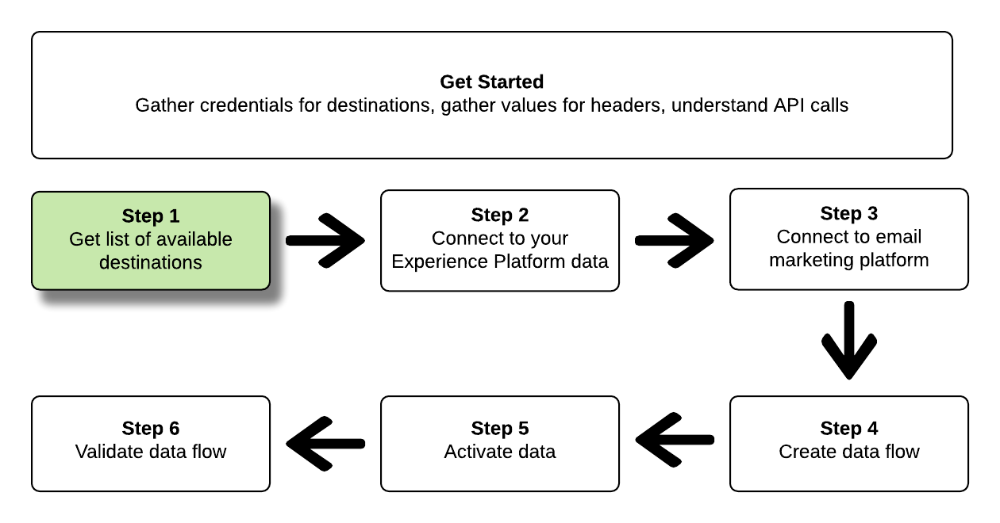
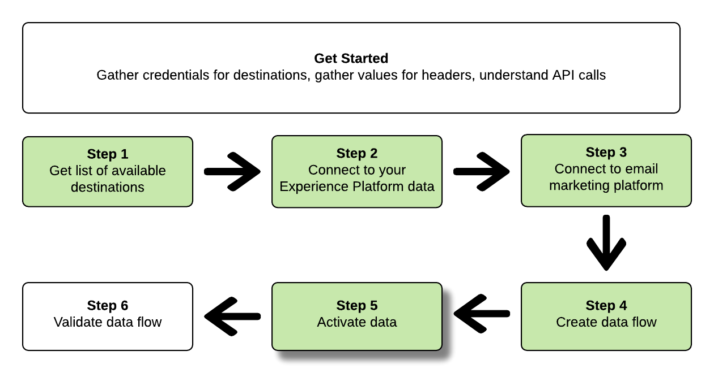

# Maak e-mailmarketingdoelen en activeer gegevens in het realtime Platform voor klantgegevens van Adobe

Deze zelfstudie laat zien hoe u API-aanroepen kunt gebruiken om verbinding te maken met uw Adobe Experience Platform-gegevens, een [e-mailmarketingbestemming](../../rtcdp/destinations/email-marketing-destinations.md)te maken, een gegevensstroom te maken naar uw nieuwe gemaakte bestemming en gegevens te activeren voor uw nieuwe gemaakte bestemming.

In deze zelfstudie wordt de Adobe Campaign-bestemming in alle voorbeelden gebruikt, maar de stappen zijn identiek voor alle marketingdoelen per e-mail.


Raadpleeg de zelfstudies voor het [verbinden van een doel](../../rtcdp/destinations/connect-destination.md) en het [activeren van profielen en segmenten naar een doel](../../rtcdp/destinations/activate-destinations.md) als u liever de gebruikersinterface in CDP in realtime van Adobe gebruikt om een doel te verbinden en gegevens te activeren.

## Aan de slag

Deze gids vereist een werkend inzicht in de volgende componenten van Adobe Experience Platform:

* [XDM-systeem](../../xdm/home.md)(Experience Data Model): Het gestandaardiseerde kader waardoor het Experience Platform gegevens van de klantenervaring organiseert.
* [Catalogusservice](../../catalog/home.md): Catalog is het systeem van verslagen voor gegevensplaats en lijn binnen Experience Platform.
* [Sandboxen](../../sandboxes/home.md): Experience Platform biedt virtuele sandboxen die één Platform-instantie in afzonderlijke virtuele omgevingen verdelen om toepassingen voor digitale ervaringen te ontwikkelen en te ontwikkelen.

De volgende secties verstrekken extra informatie die u zult moeten weten om gegevens aan e-mail marketing bestemmingen in Adobe in real time CDP te activeren.

### Vereiste referenties verzamelen

Om de stappen in dit leerprogramma te voltooien, zou u de volgende geloofsbrieven klaar moeten hebben, afhankelijk van het type van bestemmingen dat u verbindt en segmenten aan activeert.

* Voor Amazon S3-verbindingen met e-mailmarketingplatforms: `accessId`, `secretKey`
* Voor SFTP-verbindingen met e-mailmarketingplatforms: `domain`, `port`, `username`, `password` of `ssh key` (afhankelijk van de verbindingsmethode met de FTP-locatie)

### API-voorbeeldaanroepen lezen

Deze zelfstudie biedt voorbeeld-API-aanroepen om aan te tonen hoe uw verzoeken moeten worden opgemaakt. Dit zijn paden, vereiste kopteksten en correct opgemaakte ladingen voor aanvragen. Voorbeeld-JSON die wordt geretourneerd in API-reacties, wordt ook verschaft. Voor informatie over de overeenkomsten die in documentatie voor steekproefAPI vraag worden gebruikt, zie de sectie over [hoe te om voorbeeldAPI vraag](../../landing/troubleshooting.md#how-do-i-format-an-api-request) in de het oplossen van problemengids van het Experience Platform te lezen.

### Waarden verzamelen voor vereiste en optionele koppen

Om vraag aan Platform APIs te maken, moet u eerst het [authentificatieleerprogramma](../authentication.md)voltooien. Het voltooien van de autorisatiezelfstudie biedt de waarden voor elk van de vereiste headers in alle Experience Platform API-aanroepen, zoals hieronder wordt getoond:

* Autorisatie: Drager `{ACCESS_TOKEN}`
* x-api-key: `{API_KEY}`
* x-gw-ims-org-id: `{IMS_ORG}`

De middelen in Experience Platform kunnen aan specifieke virtuele zandbakken worden geïsoleerd. In aanvragen voor Platform-API&#39;s kunt u de naam en id opgeven van de sandbox waarin de bewerking plaatsvindt. Dit zijn optionele parameters.

* x-sandbox-name: `{SANDBOX_NAME}`

>[!Nofferte]
>Raadpleeg de documentatie bij het overzicht van de [sandbox voor meer informatie over sandboxen in Experience Platform](../../sandboxes/home.md).

Alle verzoeken die een nuttige lading (POST, PUT, PATCH) bevatten vereisen een extra media typekopbal:

* Inhoudstype: `application/json`

<!--

### Definitions

Before starting this tutorial, familiarize yourself with the following terms which we'll use throughout the tutorial:

**Flow**: 

**Base Connection**: 

**Target Connection**: 

**Source Connection**: 

-->

### Documentatie voor de wagenbak

In deze zelfstudie in Swagger vindt u begeleidende referentiedocumentatie voor alle API-aanroepen. Zie de documentatie van de [Flow Service API op Adobe.io](https://www.adobe.io/apis/experienceplatform/home/api-reference.html#!acpdr/swagger-specs/flow-service.yaml). We raden u aan deze zelfstudie en de documentatiepagina van Swagger parallel te gebruiken.

## Krijg de lijst van beschikbare bestemmingen {#get-the-list-of-available-destinations}



Als eerste stap moet u bepalen naar welke e-mailmarketingbestemming de gegevens moeten worden geactiveerd. Om met te beginnen, voer een vraag uit om een lijst van beschikbare bestemmingen te verzoeken die u segmenten kunt verbinden en activeren aan. Voer het volgende GET verzoek aan het `connectionSpecs` eindpunt uit om een lijst van beschikbare bestemmingen terug te keren:

**API-indeling**

```http
GET /connectionSpecs
```

**Verzoek**

<!--

```shell
curl -X GET \
    'http://platform.adobe.io/data/foundation/flowservice/connectionSpecs' \
    -H 'Authorization: Bearer {ACCESS_TOKEN}' \
    -H 'x-api-key: {API_KEY}' \
    -H 'x-gw-ims-org-id: {IMS_ORG}' \
    -H 'x-sandbox-name: {SANDBOX_NAME}' \
    -H 'x-sandbox-id: {SANDBOX_ID}' \    
    -H 'Content-Type: application/json' \
```

-->

```
curl --location --request GET 'https://platform.adobe.io/data/foundation/flowservice/connectionSpecs' \
--header 'accept: application/json' \
--header 'x-gw-ims-org-id: {IMS_ORG}' \
--header 'x-api-key: {API_KEY}' \
--header 'x-sandbox-name: {SANDBOX_NAME}' \
--header 'Authorization: Bearer {ACCESS_TOKEN}'
```


**Antwoord**

Een succesvolle reactie bevat een lijst met beschikbare bestemmingen en hun unieke herkenningstekens (`id`). Sla de waarde op van het doel dat u wilt gebruiken, zoals in verdere stappen wordt vereist. Als u bijvoorbeeld segmenten wilt verbinden en leveren aan Adobe Campaign, zoekt u het volgende fragment in het antwoord:

```json
{
    "id": "0b23e41a-cb4a-4321-a78f-3b654f5d7d97",
  "name": "Adobe Campaign",
  ...
  ...
}
```

## Verbinden met uw Experience Platform gegevens {#connect-to-your-experience-platform-data}


Vervolgens moet u verbinding maken met de gegevens van uw Experience Platform, zodat u profielgegevens kunt exporteren en activeren op de gewenste bestemming. Deze bestaat uit twee substappen die hieronder worden beschreven.

1. Eerst, moet u een vraag uitvoeren om toegang tot uw gegevens in Experience Platform toe te staan, door opstelling een basisverbinding.
2. Dan, gebruikend identiteitskaart van de basisverbinding, zult u een andere vraag maken waarin u een bronverbinding creeert, die de verbinding aan uw gegevens van het Experience Platform vestigt.


### Toegang tot uw gegevens in Experience Platform toestaan

**API-indeling**

```http
POST /connections
```

**Verzoek**

<!--

```shell
curl -X POST \
    'http://platform.adobe.io/data/foundation/flowservice/connections' \
    -H 'Authorization: Bearer {ACCESS_TOKEN}' \
    -H 'x-api-key: {API_KEY}' \
    -H 'x-gw-ims-org-id: {IMS_ORG}' \
    -H 'x-sandbox-name: {SANDBOX_NAME}' \
    -H 'x-sandbox-id: {SANDBOX_ID}' \ 
    -H 'Content-Type: application/json' \
    -d  '{
            
            "name": "Base connection to Experience Platform",
            "description": "This call establishes the connection to Experience Platform data",
            "connectionSpec": {
                "id": "{CONNECTION_SPEC}",
                "version": "1.0"
            }
           }'
```

-->

```
curl --location --request POST 'https://platform.adobe.io/data/foundation/flowservice/connections' \
--header 'Authorization: Bearer {ACCESS_TOKEN}' \
--header 'x-api-key: {API_KEY}' \
--header 'x-gw-ims-org-id: {IMS_ORG}' \
--header 'x-sandbox-name: {SANDBOX_NAME} \
--header 'Content-Type: application/json' \
--data-raw '{
            "name": "Base connection to Experience Platform",
            "description": "This call establishes the connection to Experience Platform data",
            "connectionSpec": {
                "id": "{CONNECTION_SPEC_ID}",
                "version": "1.0"
            }
}'
```


* `{CONNECTION_SPEC_ID}`: Gebruik de verbindingsSpatiespecificatieidentiteitskaart voor de Verenigde Dienst van het Profiel - `8a9c3494-9708-43d7-ae3f-cda01e5030e1`.

**Antwoord**

Een geslaagde reactie bevat de unieke id (`id`) van de basisverbinding. Sla deze waarde op zoals vereist in de volgende stap om de bronverbinding te maken.

```json
{
    "id": "1ed86558-59b5-42f7-9865-5859b552f7f4"
}
```

### Verbinden met uw Experience Platform gegevens

**API-indeling**

```http
POST /sourceConnections
```

**Verzoek**

<!--

```shell
curl -X POST \
    'http://platform.adobe.io/data/foundation/flowservice/sourceConnections' \
    -H 'Authorization: Bearer {ACCESS_TOKEN}' \
    -H 'x-api-key: {API_KEY}' \
    -H 'x-gw-ims-org-id: {IMS_ORG}' \
    -H 'x-sandbox-id: {SANDBOX_ID}' \ 
    -H 'x-sandbox-name: {SANDBOX_NAME}' \
    -H 'Content-Type: application/json' \
    -d  '{
  "name": "Connecting to Unified Profile Service",
  "description": "Optional",
  "baseConnectionId": "{BASE_CONNECTION_ID}",
  "connectionSpec": {
    "id": "{CONNECTION_SPEC}",
    "version": "1.0"
  },
  "data": {
    "format": "CSV",
    "schema": null
  }
  }
```

-->

```
curl --location --request POST 'https://platform.adobe.io/data/foundation/flowservice/sourceConnections' \
--header 'Authorization: Bearer {ACCESS_TOKEN}' \
--header 'x-api-key: {API_KEY}' \
--header 'x-gw-ims-org-id: {IMS_ORG}' \
--header 'x-sandbox-name: {SANDBOX_NAME}' \
--header 'Content-Type: application/json' \
--data-raw '{
            "name": "Connecting to Unified Profile Service",
            "description": "Optional",
            "connectionSpec": {
                "id": "{CONNECTION_SPEC_ID}",
                "version": "1.0"
            },
            "baseConnectionId": "{BASE_CONNECTION_ID}",
            "data": {
                "format": "CSV",
                "schema": null
            },
            "params" : {}
}'
```

* `{BASE_CONNECTION_ID}`: Gebruik de id die u in de vorige stap hebt gekregen.
* `{CONNECTION_SPEC_ID}`: Gebruik de verbindingsSpatiespecificatieidentiteitskaart voor de Verenigde Dienst van het Profiel - `8a9c3494-9708-43d7-ae3f-cda01e5030e1`.

**Antwoord**

Een succesvolle reactie keert het unieke herkenningsteken (`id`) voor de pas gecreëerde bronverbinding aan de Verenigde Dienst van het Profiel terug. Hiermee bevestigt u dat u verbinding hebt gemaakt met de gegevens van uw Experience Platform. Sla deze waarde op zoals deze in een latere stap wordt vereist.

```json
{
    "id": "ed48ae9b-c774-4b6e-88ae-9bc7748b6e97"
}
```


## Verbinding maken met marketingdoel voor e-mail {#connect-to-email-marketing-destination}


In deze stap stelt u een verbinding in met uw gewenste e-mailmarketingbestemming. Deze bestaat uit twee substappen die hieronder worden beschreven.

1. Eerst, moet u een vraag uitvoeren om toegang tot de e-maildienstverlener toe te staan, door opstelling een basisverbinding.
2. Vervolgens doet u met de id van de basisverbinding een volgende aanroep waarin u een doelverbinding maakt. Hiermee geeft u in uw opslagaccount de locatie op waar de geëxporteerde gegevens worden geleverd en de indeling van de gegevens die worden geëxporteerd.

### Toegang tot de e-mailmarketingbestemming toestaan

**API-indeling**

```http
POST /connections
```

**Verzoek**

<!--

```shell
curl -X POST \
    'http://platform.adobe.io/data/foundation/flowservice/connections' \
    -H 'Authorization: Bearer {ACCESS_TOKEN}' \
    -H 'x-api-key: {API_KEY}' \
    -H 'x-gw-ims-org-id: {IMS_ORG}' \
    -H 'x-sandbox-name: {SANDBOX_NAME}' \
    -H 'x-sandbox-id: {SANDBOX_ID}' \ 
    -H 'Content-Type: application/json' \
    -d  '{
            
            "name": "S3 Connection for Adobe Campaign",
            "description": "ACME company holiday campaign",
            "connectionSpec": {
                "id": "{CONNECTION_SPEC}",
                "version": "1.0"
            },
            "auth": {
                "specName": "{S3 or SFTP}",
                "params": {
                    "accessId": "{ACCESS_ID}",
                    "secretKey": "{SECRET_KEY}"
                }
            }
           }'
```

-->

```
curl --location --request POST 'https://platform.adobe.io/data/foundation/flowservice/connections' \
--header 'Authorization: Bearer {ACCESS_TOKEN}' \
--header 'x-api-key: {API_KEY}' \
--header 'x-gw-ims-org-id: {IMS_ORG}' \
--header 'x-sandbox-name: {SANDBOX_NAME}' \
--header 'Content-Type: application/json' \
--data-raw '{
    "name": "S3 Connection for Adobe Campaign",
    "description": "your company's holiday campaign",
    "connectionSpec": {
        "id": "{_CONNECTION_SPEC_ID}",
        "version": "1.0"
    },
    "auth": {
        "specName": "{S3 or SFTP}",
        "params": {
            "accessId": "{ACCESS_ID}",
            "secretKey": "{SECRET_KEY}"
        }
    }
}'
```

* `{CONNECTION_SPEC_ID}`: Gebruik de verbindingsSpeciaal identiteitskaart u in de stap verkrijgt [krijgt de lijst van beschikbare bestemmingen](#get-the-list-of-available-destinations).
* `{S3 or SFTP}`: Vul het gewenste verbindingstype voor deze bestemming in. Blader in de [doelcatalogus](../../rtcdp/destinations/destinations-catalog.md)naar de gewenste bestemming om te zien of de S3- en/of SFTP-verbindingstypen worden ondersteund.
* `{ACCESS_ID}`: Uw toegangs-id voor de opslaglocatie van Amazon S3.
* `{SECRET_KEY}`: Uw geheime sleutel voor de opslaglocatie van Amazon S3.

**Antwoord**

Een geslaagde reactie bevat de unieke id (`id`) van de basisverbinding. Sla deze waarde op zoals vereist in de volgende stap om een doelverbinding te maken.

```json
{
    "id": "1ed86558-59b5-42f7-9865-5859b552f7f4"
}
```

### Opslaglocatie en gegevensindeling opgeven

**API-indeling**

```http
POST /targetConnections
```

**Verzoek**

<!--

```shell
curl -X POST \
    'http://platform.adobe.io/data/foundation/flowservice/targetConnections' \
    -H 'Authorization: Bearer {ACCESS_TOKEN}' \
    -H 'x-api-key: {API_KEY}' \
    -H 'x-gw-ims-org-id: {IMS_ORG}' \
    -H 'x-sandbox-name: {SANDBOX_NAME}' \    
    -H 'x-sandbox-id: {SANDBOX_ID}' \ 
    -H 'Content-Type: application/json' \
    -d  '{
   "baseConnectionId": "{BASE_CONNECTION_ID}",
   "name": "TargetConnection for Adobe Campaign",
   "data": {
       "format": "CSV",
       "schema": {
           "id": "1.0",
           "version": "1.0"
       },
    "connectionSpec": {
    "id": "{CONNECTION_SPEC_ID}",
    "version": "1.0"
   },
   "params": {
       "mode": "S3",
       "bucketName": "{BUCKETNAME}",
       "path": "{FILEPATH}"
    }
    }
```

-->

```
curl --location --request POST 'https://platform.adobe.io/data/foundation/flowservice/targetConnections' \
--header 'Authorization: Bearer {ACCESS_TOKEN}' \
--header 'x-api-key: {API_KEY}' \
--header 'x-gw-ims-org-id: {IMS_ORG}' \
--header 'Content-Type: application/json' \
--data-raw '{
    "name": "TargetConnection for Adobe Campaign",
    "description": "Connection to Adobe Campaign",
    "baseConnection": "{BASE_CONNECTION_ID}",
    "connectionSpec": {
        "id": "{CONNECTION_SPEC_ID}",
        "version": "1.0"
    },
    "data": {
        "format": "json",
        "schema": {
            "id": "1.0",
            "version": "1.0"
        }
    },
    "params": {
        "mode": "S3",
        "bucketName": "{BUCKETNAME}",
        "path": "{FILEPATH}",
        "format": "CSV"
    }
}'
```

* `{BASE_CONNECTION_ID}`: Gebruik de basisverbindings-id die u in de bovenstaande stap hebt verkregen.
* `{CONNECTION_SPEC_ID}`: Gebruik de verbindingsspecificatie u in de stap verkrijgt [krijgt de lijst van beschikbare bestemmingen](#get-the-list-of-available-destinations).
* `{BUCKETNAME}`: Uw Amazon S3-emmertje, waar CDP in real time de gegevensexport zal deponeren.
* `{FILEPATH}`: Het pad in uw Amazon S3 bucket-map waar CDP in realtime de gegevens exporteert.

**Antwoord**

Een succesvol antwoord retourneert de unieke id (`id`) voor de nieuwe doelverbinding naar uw e-mailmarketingbestemming. Sla deze waarde op zoals deze in latere stappen wordt vereist.

```json
{
    "id": "12ab90c7-519c-4291-bd20-d64186b62da8"
}
```

## Een gegevensstroom maken


Met de id&#39;s die u in de vorige stappen hebt opgehaald, kunt u nu een gegevensstroom maken tussen de gegevens van het Experience Platform en de bestemming waarnaar u de gegevens wilt activeren. Beschouw deze stap als het construeren van de pijpleiding, waardoor de gegevens, tussen Experience Platform en uw gewenste bestemming later zullen stromen.

Als u een gegevensstroom wilt maken, voert u een POST-verzoek uit, zoals hieronder wordt weergegeven, terwijl u de hieronder vermelde waarden opgeeft binnen de laadtijd.

Voer het volgende POST- verzoek uit om een gegevensstroom tot stand te brengen.

**API-indeling**

```http
POST /flows
```

**Verzoek**

```shell
curl -X POST \
'https://platform.adobe.io/data/foundation/flowservice/flows' \
-H 'Authorization: Bearer {ACCESS_TOKEN}' \
-H 'x-api-key: {API_KEY}' \
-H 'x-gw-ims-org-id: {IMS_ORG}' \
-H 'x-sandbox-name: {SANDBOX_NAME}' \
-H 'Content-Type: application/json' \
-d  '{
   
        "name": "Activate segments to Adobe Campaign",
        "description": "This operation creates a dataflow which we will later use to activate segments to Adobe Campaign",
        "flowSpec": {
            "id": "{FLOW_SPEC_ID}",
            "version": "1.0"
        },
        "sourceConnectionIds": [
            "{SOURCE_CONNECTION_ID}"
        ],
        "targetConnectionIds": [
            "{TARGET_CONNECTION_ID}"
        ],
        "transformations": [
            {
                "name": "GeneralTransform",
                "params": {
                    "segmentSelectors": {
                        "selectors": []
                    },
                    "profileSelectors": {
                        "selectors": []
                    }
                }
            }
        ]
    }
```

* `{FLOW_SPEC_ID}`: Gebruik de stroom voor de e-mailmarketingbestemming waarmee u verbinding wilt maken. Om de stroomspecificatie te krijgen, voer een GET verrichting op het `flowspecs` eindpunt uit. Zie hier de documentatie van Swagger: https://platform.adobe.io/data/foundation/flowservice/swagger#/Flow%20Specs%20API/getFlowSpecs. In de reactie, zoek `upsTo` en kopieer overeenkomstige identiteitskaart van de e-mailmarketing bestemming die u met wilt verbinden. Voor Adobe Campaign zoekt `upsToCampaign` en kopieert u bijvoorbeeld de `id` parameter.
* `{SOURCE_CONNECTION_ID}`: Gebruik de bronverbindings-id die u hebt verkregen in de stap [Verbinding maken met uw Experience Platform](#connect-to-your-experience-platform-data).
* `{TARGET_CONNECTION_ID}`: Gebruik de doel-verbindings-id die u hebt verkregen in de stap [Verbinding maken met e-mailmarketingdoel](#connect-to-email-marketing-destination).

**Antwoord**

Een geslaagde reactie retourneert de id (`id`) van de nieuwe gegevensstroom en een `etag`. Noteer beide waarden. om segmenten te activeren, zoals u dat in de volgende stap doet.

```json
{
    "id": "8256cfb4-17e6-432c-a469-6aedafb16cd5",
    "etag": "8256cfb4-17e6-432c-a469-6aedafb16cd5"
}
```


## Gegevens activeren naar uw nieuwe bestemming



Nadat u alle verbindingen en de gegevensstroom hebt gemaakt, kunt u nu uw profielgegevens activeren naar het e-mailmarketingplatform. In deze stap selecteert u welke segmenten en welke profielkenmerken u naar de bestemming verzendt en kunt u gegevens plannen en naar de bestemming verzenden.

Als u segmenten naar uw nieuwe bestemming wilt activeren, moet u een JSON PATCH-bewerking uitvoeren, vergelijkbaar met het onderstaande voorbeeld. U kunt veelvoudige segmenten en profielattributen in één vraag activeren. Zie de [RFC-specificatie](https://tools.ietf.org/html/rfc6902)voor meer informatie over JSON PATCH.

**API-indeling**

```http
PATCH /flows
```

**Verzoek**

```
curl --location --request PATCH 'https://platform.adobe.io/data/foundation/flowservice/flows/{DATAFLOW_ID}' \
--header 'Authorization: Bearer {ACCESS_TOKEN}' \
--header 'x-api-key: {API_KEY}' \
--header 'x-gw-ims-org-id: {IMS_ORG}' \
--header 'Content-Type: application/json' \
--header 'x-sandbox-name: {SANDBOX_NAME}' \
--header 'If-Match: "{ETAG}"' \
--data-raw '[
    {
        "op": "add",
        "path": "/transformations/0/params/segmentSelectors/selectors/-",
        "value": {
            "type": "PLATFORM_SEGMENT",
            "value": {
                "name": "Name of the segment that you are activating",
                "description": "Description of the segment that you are activating",
                "id": "{SEGMENT_ID}"
            }
        }
    },
        {
        "op": "add",
        "path": "/transformations/0/params/segmentSelectors/selectors/-",
        "value": {
            "type": "PLATFORM_SEGMENT",
            "value": {
                "name": "Name of the segment that you are activating",
                "description": "Description of the segment that you are activating",
                "id": "{SEGMENT_ID}"
            }
        }
    },
        {
        "op": "add",
        "path": "/transformations/0/params/profileSelectors/selectors/-",
        "value": {
            "type": "JSON_PATH",
            "value": {
                "operator": "EXISTS",
                "path": "{PROFILE_ATTRIBUTE}"
            }
        }
    }
]
```

* `{DATAFLOW_ID}`: Gebruik de gegevensstroom die u in de vorige stap hebt verkregen.
* `{ETAG}`: Gebruik het label dat u in de vorige stap hebt verkregen.
* `{SEGMENT_ID}`: Geef de segment-id op die u naar dit doel wilt exporteren. Als u segment-id&#39;s wilt ophalen voor de segmenten die u wilt activeren, gaat u naar https://www.adobe.io/apis/experienceplatform/home/api-reference.html#/ en zoekt u de `GET /segment/jobs` bewerking.
* `{PROFILE_ATTRIBUTE}`: Bijvoorbeeld, `"person.lastName"`

**Antwoord**

Kijk naar een 202 OK-antwoord. Er wordt geen responsorgaan geretourneerd. Om te bevestigen dat het verzoek correct was, zie de volgende stap, de gegevensstroom bevestigen.

## De gegevensstroom valideren


Als laatste stap in de zelfstudie moet u controleren of de segmenten en profielkenmerken correct zijn toegewezen aan de gegevensstroom.

Om dit te bevestigen, voer het volgende GET verzoek uit:

**API-indeling**

```http
GET /flows
```

**Verzoek**

```
curl --location --request PATCH 'https://platform.adobe.io/data/foundation/flowservice/flows/{DATAFLOW_ID}' \
--header 'Authorization: Bearer {ACCESS_TOKEN}' \
--header 'x-api-key: {API_KEY}' \
--header 'x-gw-ims-org-id: {IMS_ORG}' \
--header 'Content-Type: application/json' \
--header 'x-sandbox-name: prod' \
--header 'If-Match: "{ETAG}"' 
```

* `{DATAFLOW_ID}`: Gebruik de gegevensstroom uit de vorige stap.
* `{ETAG}`: Gebruik het label van de vorige stap.

**Antwoord**

De geretourneerde reactie moet in de `transformations` parameter de segmenten en profielkenmerken bevatten die u in de vorige stap hebt verzonden. Een voorbeeldparameter in de reactie kan er als volgt uitzien: `transformations`

```
"transformations": [
    {
        "name": "GeneralTransform",
        "params": {
            "profileSelectors": {
                "selectors": []
            },
            "segmentSelectors": {
                "selectors": [
                    {
                        "type": "PLATFORM_SEGMENT",
                        "value": {
                            "name": "Men over 50",
                            "description": "",
                            "id": "72ddd79b-6b0a-4e97-a8d2-112ccd81bd02"
                        }
                    }
                ]
            }
        }
    }
],
```

## Volgende stappen

Door deze zelfstudie te volgen, hebt u met succes CDP in real time met één van uw aangewezen e-mail marketing bestemmingen verbonden en opstelling een dataflow aan de respectieve bestemming. De uitgaande gegevens kunnen nu in de bestemming voor e-mailcampagnes, gerichte reclame, en vele andere gebruiksgevallen worden gebruikt. Raadpleeg de volgende pagina&#39;s voor meer informatie:

* [Overzicht van doelen](../../rtcdp/destinations/destinations-overview.md)
* [Overzicht van de doelcatalogus](../../rtcdp/destinations/destinations-catalog.md)