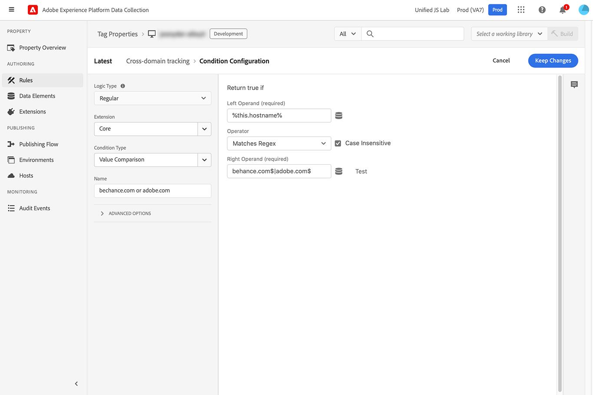
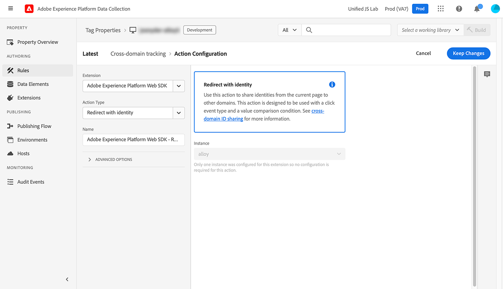

# `appendIdentityToUrl`

De `appendIdentityToUrl` kunt u een gebruiker-id aan de URL toevoegen als een queryreeks. Met deze actie kunt u de identiteit van een bezoeker tussen domeinen dragen, waardoor dubbele bezoekersaantallen voor datasets met zowel domeinen als kanalen worden voorkomen. Het is beschikbaar op versies 2.11.0 van SDK van het Web of later.

De querytekenreeks die wordt gegenereerd en aan de URL wordt toegevoegd, is `adobe_mc`. Als SDK van het Web geen ECID kan vinden, roept het ECID `/acquire` om één te produceren.

>[!NOTE]
>
>Als er geen toestemming is gegeven, wordt de URL van deze methode ongewijzigd geretourneerd. Deze opdracht wordt onmiddellijk uitgevoerd; er wordt niet gewacht op een toestemmingsupdate.

## Identiteit aan URL toevoegen met de extensie Web SDK

Het toevoegen van een identiteit aan een URL wordt uitgevoerd als een actie binnen een regel in de interface van de markeringen van de Inzameling van Gegevens van Adobe Experience Platform.

1. Aanmelden bij [experience.adobe.com](https://experience.adobe.com) je Adobe ID-gebruikersgegevens gebruiken.
1. Ga naar **[!UICONTROL Data Collection]** > **[!UICONTROL Tags]**.
1. Selecteer de gewenste eigenschap tag.
1. Navigeren naar **[!UICONTROL Rules]** Selecteer vervolgens de gewenste regel.
1. Onder [!UICONTROL Actions], selecteert u een bestaande actie of maakt u een actie.
1. Stel de [!UICONTROL Extension] vervolgkeuzeveld naar **[!UICONTROL Adobe Experience Platform Web SDK]** en stelt de [!UICONTROL Action Type] tot **[!UICONTROL Redirect with identity]**.
1. Klikken **[!UICONTROL Keep Changes]** en voer vervolgens uw publicatieworkflow uit.

Dit bevel wordt typisch gebruikt met een specifieke regel die op kliks en controles gewenste domeinen let.

+++Gebeurteniscriteria van de regel

Triggers wanneer een ankertag met een `href` wordt geklikt.

* **[!UICONTROL Extension]**: Core
* **[!UICONTROL Event type]**: Klikken
* **[!UICONTROL When the user clicks on]**: Specifieke elementen
* **[!UICONTROL Elements matching the CSS selector]**: `a[href]`


+++

+++voorwaarde van de regel

Triggers worden alleen op de gewenste domeinen geactiveerd.

* **[!UICONTROL Logic type]**: Standaard
* **[!UICONTROL Extension]**: Core
* **[!UICONTROL Condition Type]**: Value Comparison
* **[!UICONTROL Left Operand]**: `%this.hostname%`
* **[!UICONTROL Operator]**: Komt overeen met Regex
* **[!UICONTROL Right Operand]**: Een reguliere expressie die overeenkomt met de gewenste domeinen. Bijvoorbeeld: `adobe.com$|behance.com$`



+++

+++Handeling Rule

Voeg de identiteit toe aan de URL.

* **[!UICONTROL Extension]**: Adobe Experience Platform Web SDK
* **[!UICONTROL Action Type]**: Omleiden met identiteit



+++

## Identiteit toevoegen aan URL met de Web SDK JavaScript-bibliotheek

Voer de `appendIdentityToUrl` gebruiken met een URL als parameter. De methode retourneert een URL waarvan de id als queryreeks is toegevoegd.

```js
alloy("appendIdentityToUrl",document.location);
```

U kunt een gebeurtenislistener toevoegen voor alle klikken die op de pagina worden ontvangen en controleren of de URL overeenkomt met de gewenste domeinen. Als dit het geval is, voegt u de identiteit toe aan de URL en leidt u de gebruiker om.

```js
document.addEventListener("click", event => {
  // Check if the click was a link
  const anchor = event.target.closest("a");
  if (!anchor || !anchor.href) return;

  // Check if the link points to the desired domain
  const url = new URL(anchor.href);
  if (!url.hostname.endsWith(".adobe.com") && !url.hostname.endsWith(".behance.com")) return;

  // Append the identity to the URL, then direct the user to the URL
  event.preventDefault();
  alloy("appendIdentityToUrl", {url: anchor.href}).then(result => {document.location = result.url;});
});
```

## Object Response

Als u besluit [reacties verwerken](command-responses.md) met deze opdracht bevat het reactieobject **`url`**, de nieuwe URL met identiteitsinformatie die als parameter van het vraagkoord wordt toegevoegd.
