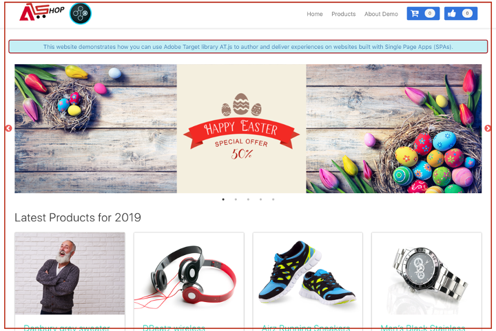

# Implementatie van één pagina

Adobe Experience Platform Web SDK verstrekt rijke eigenschappen die uw zaken uitrusten om verpersoonlijking op volgende-generatie, cliënt-zijtechnologieën zoals single-page toepassingen (SPAs) uit te voeren.

Traditionele websites werkten aan navigatiemodellen &quot;van pagina tot pagina&quot;, ook wel bekend als Toepassingen van meerdere pagina&#39;s, waarbij websiteontwerpen nauw gekoppeld waren aan URL&#39;s en overgangen van de ene webpagina naar de andere een pagina moesten laden.

De moderne Webtoepassingen, zoals enig-paginatoepassingen, hebben in plaats daarvan een model aangenomen dat snel gebruik van browser UI teruggeeft, die vaak onafhankelijk van paginaherladingen is. Deze ervaringen kunnen door klanteninteractie, zoals rollen, klikken, en curseurbewegingen worden teweeggebracht. Naarmate de paradigma&#39;s van het moderne web zijn geëvolueerd, werkt de relevantie van traditionele generieke gebeurtenissen, zoals het laden van een pagina, voor het implementeren van personalisatie en experimenten niet meer.


## Voordelen van Experience Platform Web SDK voor SPA&#39;s

Hier volgen enkele voordelen van Adobe Experience Platform Web SDK voor uw single-page toepassingen:

* De capaciteit om alle aanbiedingen op pagina-lading in het voorgeheugen onder te brengen om veelvoudige servervraag aan één enkele servervraag te verminderen.
* Verbeter de gebruikerservaring op uw site aanzienlijk omdat aanbiedingen direct via de cache worden weergegeven zonder vertraging die door traditionele serveraanroepen is geïntroduceerd.
* Één enkele lijn van code en éénmalige ontwikkelaarsopstelling laat marketers toe om A/B en de Ervaring te creëren richtend (XT) activiteiten via Visual Experience Composer (VEC) op uw SPA.

## XDM-weergaven en toepassingen van één pagina

Adobe Target VEC voor SPAs haalt voordeel uit een concept genoemd Bekijken: een logische groep visuele elementen die samen omhoog een ervaring van het KUUROORD maken. Een toepassing van één pagina kan daarom worden beschouwd als het overgaan door Meningen, in plaats van URLs, die op gebruikersinteractie wordt gebaseerd. Een weergave kan doorgaans een hele site of gegroepeerde visuele elementen binnen een site vertegenwoordigen.

Om verder uit te leggen welke Weergaven zijn, gebruikt het volgende voorbeeld een hypothetische online e-commercesite die in React wordt uitgevoerd om voorbeeldweergaven te onderzoeken.

Na het navigeren naar de thuissite bevordert een hoofdafbeelding een paasverkoop en de nieuwste producten die op de site beschikbaar zijn. In dit geval kan een weergave worden gedefinieerd voor het gehele beginscherm. Deze weergave kan gewoon &#39;thuis&#39; worden genoemd.



Aangezien de klant meer in de producten geinteresseerd wordt die de zaken verkopen, besluiten zij om de **verbinding van Producten** te klikken. Net als op de thuissite kan de hele productsite worden gedefinieerd als een weergave. Deze weergave kan de naam &quot;products-all&quot; hebben.


Aangezien een Mening als volledige plaats of een groep visuele elementen op een plaats kan worden bepaald, zouden de vier producten die op de productplaats worden getoond als Mening kunnen worden gegroepeerd en worden beschouwd. Deze weergave kan &#39;producten&#39; worden genoemd.


Wanneer de klant besluit om de **Lading Meer** knoop te klikken om meer producten op de plaats te onderzoeken, verandert website URL niet in dit geval, maar een Mening kan hier worden gecreeerd om slechts de tweede rij van producten te vertegenwoordigen die worden getoond. De weergavenaam kan &#39;products-page-2&#39; zijn.


De klant besluit een paar producten van de site te kopen en gaat verder naar het uitcheckscherm. Op de uitchecksite krijgt de klant opties om normale levering of expreslevering te kiezen. Een weergave kan uit elke groep visuele elementen op een site bestaan. Een weergave kan dus worden gemaakt voor leveringsvoorkeuren en &quot;Leveringsvoorkeuren&quot; worden genoemd.


Het concept van standpunten kan veel verder worden uitgebreid. Dit zijn slechts een paar voorbeelden van weergaven die op een site kunnen worden gedefinieerd.

## XDM-weergaven implementeren

De meningen XDM kunnen in Adobe Target worden gebruikt om marketers toe te staan om tests A/B en XT op SPAs via Visual Experience Composer in werking te stellen. Hiervoor moeten de volgende stappen worden uitgevoerd om een eenmalige ontwikkelaarsinstelling te voltooien:

1. Installeer [ SDK van het Web van Adobe Experience Platform ](/help/web-sdk/install/overview.md)
2. Bepaal alle XDM-weergaven in uw toepassing voor één pagina die u wilt aanpassen.
3. Nadat u de XDM-weergaven hebt gedefinieerd, implementeert u de functie `sendEvent()` met `renderDecisions` ingesteld op `true` en de bijbehorende XDM-weergave in uw toepassing voor één pagina om AB- of XT VEC-activiteiten te kunnen uitvoeren. De XDM-weergave moet worden doorgegeven in `xdm.web.webPageDetails.viewName` . Met deze stap kunnen marketers de Visual Experience Composer gebruiken om A/B- en XT-tests voor die XDM te starten.

   ```javascript
   alloy("sendEvent", { 
     "renderDecisions": true, 
     "xdm": { 
       "web": { 
         "webPageDetails": { 
         "viewName":"home" 
         }
       } 
     } 
   });
   ```

>[!NOTE]
>
>Bij de eerste `sendEvent()` oproep worden alle XDM-weergaven die aan de eindgebruiker moeten worden gerenderd, opgehaald en in cache geplaatst. Volgende `sendEvent()` aanroepen met XDM Views die binnen worden overgegaan zullen van het geheime voorgeheugen worden gelezen en zonder een servervraag worden teruggegeven.

## `sendEvent()` functievoorbeelden

Deze sectie schetst drie voorbeelden die tonen hoe te om de `sendEvent()` functie in React voor een hypothetische e-commerce SPA aan te halen.

### Voorbeeld 1: Introductiepagina A/B-test

Het marketing team wil tests A/B op de volledige homepage in werking stellen.


Als u A/B-tests wilt uitvoeren op de hele thuissite, moet `sendEvent()` worden aangeroepen met de XDM `viewName` ingesteld op `home` :

```jsx
function onViewChange() { 
  
  var viewName = window.location.hash; // or use window.location.pathName if router works on path and not hash 

  viewName = viewName || 'home'; // view name cannot be empty 

  // Sanitize viewName to get rid of any trailing symbols derived from URL 

  if (viewName.startsWith('#') || viewName.startsWith('/')) { 
    viewName = viewName.substr(1); 
  }
   
  alloy("sendEvent", { 
    "renderDecisions": true, 
    "xdm": { 
      "web": { 
        "webPageDetails": { 
          "viewName":"home" 
        } 
      } 
    }
  }); 
} 

// react router v4 

const history = syncHistoryWithStore(createBrowserHistory(), store); 

history.listen(onViewChange); 

// react router v3 

<Router history={hashHistory} onUpdate={onViewChange} > 
```

### Voorbeeld 2: Persoonlijke producten

Het marketing team wil de tweede rij van producten personaliseren door de kleur van het prijsetiket in rood te veranderen nadat een gebruiker **Lading meer** klikt.


```jsx
function onViewChange(viewName) { 

  alloy("sendEvent", { 
    "renderDecisions": true, 
    "xdm": { 
      "web": { 
        "webPageDetails": { 
          "viewName": viewName
        }
      } 
    } 
  }); 
} 

class Products extends Component { 
  
  render() { 
    return ( 
      <button type="button" onClick={this.handleLoadMoreClicked}>Load more</button> 
    ); 
  } 

  handleLoadMoreClicked() { 
    var page = this.state.page + 1; // assuming page number is derived from component's state 
    this.setState({page: page}); 
    onViewChange('PRODUCTS-PAGE-' + page); 
  } 

} 
```

### Voorbeeld 3: Voorkeuren voor de aflevering van een A/B-test

Het marketing team wil een test A/B in werking stellen om te zien of het veranderen van de kleur van de knoop van blauw in rood wanneer **Uitdrukkelijke Levering** wordt geselecteerd omzettingen (in tegenstelling tot het houden van de knoopkleur blauw voor beide leveringsopties) kan verhogen.


Als u de inhoud op de site wilt aanpassen, afhankelijk van de gekozen leveringsvoorkeur, kunt u een weergave maken voor elke leveringsvoorkeur. Wanneer **Normale Levering** wordt geselecteerd, kan de Mening &quot;controle-normaal&quot;worden genoemd. Als **Uitdrukkelijke Levering** wordt geselecteerd, kan de Mening &quot;checkout-express&quot;worden genoemd.

```jsx
function onViewChange(viewName) { 
  alloy("sendEvent", { 
    "renderDecisions": true, 
    "xdm": { 
      "web": { 
        "webPageDetails": { 
          "viewName": viewName 
        }
      }
    }
  }); 
} 

class Checkout extends Component { 

  render() { 
    return ( 
      <div onChange={this.onDeliveryPreferenceChanged}> 
        <label> 
          <input type="radio" id="normal" name="deliveryPreference" value={"Normal Delivery"} defaultChecked={true}/> 
          <span> Normal Delivery (7-10 business days)</span> 
        </label> 
        <label> 
          <input type="radio" id="express" name="deliveryPreference" value={"Express Delivery"}/> 
          <span> Express Delivery* (2-3 business days)</span> 
        </label> 
      </div> 
    ); 
  } 

  onDeliveryPreferenceChanged(evt) { 
    var selectedPreferenceValue = evt.target.value; 
    onViewChange(selectedPreferenceValue); 
  } 

} 
```

## Het gebruiken van de Visuele Composer van de Ervaring voor een SPA

Wanneer u klaar bent met het definiëren van uw XDM-weergaven en `sendEvent()` hebt geïmplementeerd met deze XDM Views die zijn doorgegeven, kan de VEC deze weergaven detecteren en kunnen gebruikers handelingen en wijzigingen maken voor A/B- of XT-activiteiten.

>[!NOTE]
>
>Om VEC voor uw SPA te gebruiken, moet u of de [ Firefox ](https://addons.mozilla.org/en-US/firefox/addon/adobe-target-vec-helper/) installeren en activeren of [ Chrome ](https://chrome.google.com/webstore/detail/adobe-target-vec-helper/ggjpideecfnbipkacplkhhaflkdjagak) VEC Helper Extension.

### Deelvenster Wijzigingen

In het deelvenster Wijzigingen worden de acties vastgelegd die voor een bepaalde weergave zijn gemaakt. Alle acties voor een weergave worden gegroepeerd onder die weergave.


### Acties

Wanneer u op een handeling klikt, wordt het element op de site gemarkeerd waarop deze handeling wordt toegepast. Elke actie VEC die onder een Mening wordt gecreeerd heeft de volgende pictogrammen: **Informatie**, **geeft** uit, **Kloon**, **Beweging**, en **Schrapping**. Deze pictogrammen worden nader toegelicht in de onderstaande tabel.


| Pictogram | Beschrijving |
|---|---|
| Informatie | Geeft de details van de handeling weer. |
| Bewerken | Hiermee kunt u de eigenschappen van de handeling rechtstreeks bewerken. |
| Klonen | Kloont de actie aan één of meerdere Weergaven die op het paneel van Aanpassingen of aan één of meerdere Weergaven bestaan die u hebt doorzocht en aan in VEC genavigeerd. De handeling hoeft niet noodzakelijkerwijs in het deelvenster Wijzigingen te staan.<br/><br/>**Nota:** nadat een kloonverrichting wordt gemaakt, moet u aan de Mening in VEC via doorbladeren navigeren om te zien of de gekloonde actie een geldige verrichting was. Als de actie niet op de Mening kan worden toegepast, zult u een fout zien. |
| Verplaatsen | Hiermee wordt de handeling verplaatst naar een gebeurtenis Pagina laden of een andere weergave die al bestaat in het deelvenster Wijzigingen.<br/><br/>**Gebeurtenis van de Lading van de Pagina:** Om het even welke acties die aan de gebeurtenis beantwoorden van de paginading worden toegepast op de aanvankelijke paginading van uw Webtoepassing. <br/><br/>**Nota:** nadat een bewegingsverrichting wordt gemaakt, moet u aan de Mening in VEC via Browse navigeren om te zien of de beweging een geldige verrichting was. Als de actie niet op de Mening kan worden toegepast, zult u een fout zien. |
| Verwijderen | Hiermee verwijdert u de handeling. |

## Het gebruiken van VEC voor voorbeelden SPAs

Deze sectie schetst drie voorbeelden om de Visuele Composer van de Ervaring te gebruiken om acties en wijzigingen voor A/B of XT activiteiten tot stand te brengen.

### Voorbeeld 1: &quot;home&quot;-weergave bijwerken

Eerder in dit document is een weergave met de naam &quot;home&quot; gedefinieerd voor de gehele thuissite. Nu wil het marketingteam de weergave &quot;home&quot; op de volgende manieren bijwerken:

* Verander **toevoegt aan Kar** en **als** knopen aan een lichter aandeel van blauw. Dit moet gebeuren tijdens het laden van de pagina, omdat hierbij componenten van de koptekst worden gewijzigd.
* Verander de **Laatste Producten voor 2019** etiket in **HottestProducten voor 2019** en verander de tekstkleur in paars.

Om deze updates in VEC te maken, selecteer **stel** samen en pas die veranderingen op de &quot;huis&quot;mening toe.


### Voorbeeld 2: productlabels wijzigen

Voor de &quot;producten-pagina-2&quot;Mening, zou het marketing team het **etiket van de Prijs** aan **de Prijs van de Verkoop** willen veranderen en de etiketkleur in rood veranderen.

Om deze updates in VEC te maken, zijn de volgende stappen vereist:

1. Selecteer **doorbladeren** in VEC.
2. Selecteer **Producten** in de hoogste navigatie van de plaats.
3. Selecteer **Lading meer** eens om de tweede rij van producten te bekijken.
4. Selecteer **samenstellen** in VEC.
5. Pas acties toe om het tekstetiket in **de Prijs van de Verkoop** en de kleur aan rood te veranderen.


### Voorbeeld 3: Opmaak van leveringsvoorkeuren aanpassen

Weergaven kunnen worden gedefinieerd op korrelig niveau, zoals een status of een optie van een keuzerondje. Eerder in dit document zijn weergaven gedefinieerd voor leveringsvoorkeuren, &quot;uitchecken-normaal&quot; en &quot;uitchecken-express&quot;. Het marketingteam wil de kleur van de knop wijzigen in rood voor de weergave &quot;uitchecken-uitdrukken&quot;.

Om deze updates in VEC te maken, zijn de volgende stappen vereist:

1. Selecteer **doorbladeren** in VEC.
2. Voeg op de site producten toe aan het winkelwagentje.
3. Selecteer het winkelwagentje in de rechterbovenhoek van de site.
4. Selecteer **Controle uw Orde**.
5. Selecteer het **Uitdrukkelijke 1&rbrace; radioknoop van de Levering &lbrace;** Voorkeur van de Levering **.**
6. Selecteer **samenstellen** in VEC.
7. Verander de **de knoopkleur van het Betalen** in rood.

>[!NOTE]
>
>De &quot;controle-uitdrukkelijke&quot;Mening verschijnt niet in het paneel van Veranderingen tot het **Uitdrukkelijke radioknoop van de Levering** wordt geselecteerd. Dit is omdat de `sendEvent()` functie wordt uitgevoerd wanneer het **Uitdrukkelijke 2&rbrace; radioknoop van de Levering &lbrace;wordt geselecteerd, daarom is VEC niet bewust van de &quot;controle-uit-uitdrukkelijke&quot;Mening tot het radioknoop wordt geselecteerd.**


