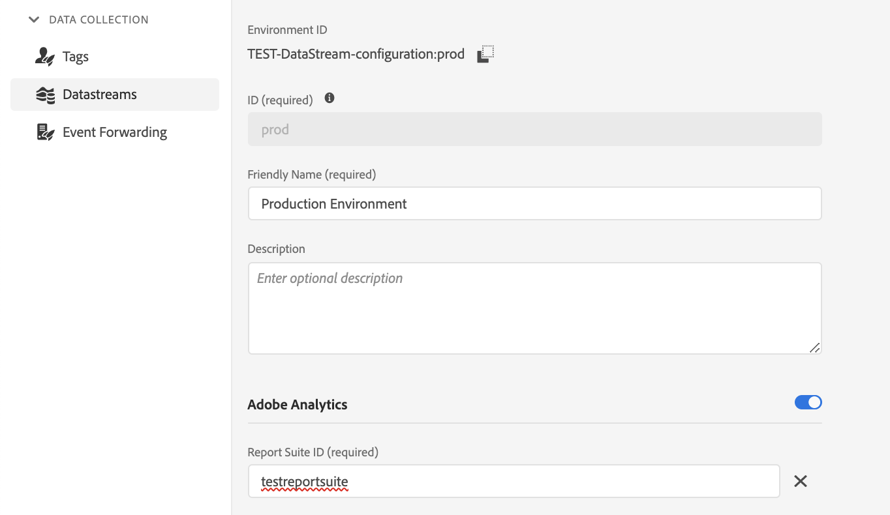
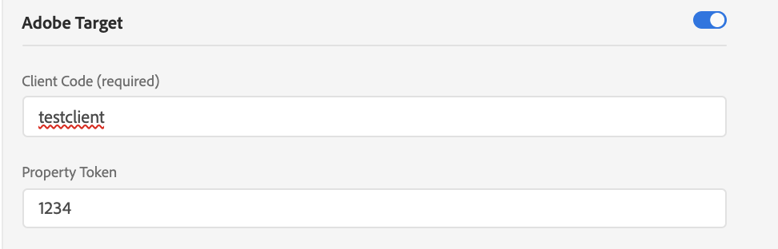

# De bibliotheek at.js vergelijken met de Web SDK

## Overzicht

Dit artikel biedt een overzicht van de verschillen tussen de `at.js` -bibliotheek en de Experience Plaform Web SDK.

## Bibliotheken installeren

### Installeer at.js

Wij staan onze klanten toe om de bibliotheek van Adobe Experience Cloud, het lusje van de Implementatie direct te downloaden. De bibliotheek at.js wordt aangepast met instellingen die de klant als volgt heeft: clientCode, imsOrgId, enz.

### De Web SDK installeren

De vooraf gebouwde versie is beschikbaar op een CDN. U kunt de bibliotheek op CDN rechtstreeks op uw pagina van verwijzingen voorzien, of het downloaden en ontvangen op uw eigen infrastructuur. Het is beschikbaar in geminiatuurde en ongeminificeerde formaten. De ongeminificeerde versie is handig voor foutopsporingsdoeleinden.

Zie [ SDK van het Web installeren gebruikend de bibliotheek van JavaScript ](/help/web-sdk/install/library.md) voor meer informatie.

## De bibliotheken configureren

### Bij.js configureren

Aan het einde van elk bestand at.js vindt u een sectie waarin we een instellingsobject instantiëren en doorgeven. Het is aanpasbaar, bij het downloaden vullen wij die sectie met huidige klantenmontages.

```javascript
window.adobe.target.init(window, document, {
  "clientCode": "demo",
  "imsOrgId": "",
  "serverDomain": "localhost:5000",
  "timeout": 2000,
  "globalMboxName": "target-global-mbox",
  "version": "2.0.0",
  "defaultContentHiddenStyle": "visibility: hidden;",
  "defaultContentVisibleStyle": "visibility: visible;",
  "bodyHiddenStyle": "body {opacity: 0 !important}",
  "bodyHidingEnabled": true,
  "deviceIdLifetime": 63244800000,
  "sessionIdLifetime": 1860000,
  "selectorsPollingTimeout": 5000,
  "visitorApiTimeout": 2000,
  "overrideMboxEdgeServer": false,
  "overrideMboxEdgeServerTimeout": 1860000,
  "optoutEnabled": false,
  "optinEnabled": false,
  "secureOnly": false,
  "supplementalDataIdParamTimeout": 30,
  "authoringScriptUrl": "//cdn.tt.omtrdc.net/cdn/target-vec.js",
  "urlSizeLimit": 2048,
  "endpoint": "/rest/v1/delivery",
  "pageLoadEnabled": true,
  "viewsEnabled": true,
  "analyticsLogging": "server_side",
  "serverState": {},
  "decisioningMethod": "server-side",
  "legacyBrowserSupport":  false
});
```

[Meer informatie](https://experienceleague.adobe.com/docs/target/using/implement-target/client-side/at-js-implementation/functions-overview/targetgobalsettings.html?lang=nl-NL)


### De SDK van het Web configureren

De configuratie voor de SDK is voltooid met de opdracht [`configure`](/help/web-sdk/commands/configure/overview.md) . Het `configure` bevel is altijd ** geroepen eerst.

## Aanbiedingen voor het laden van pagina&#39;s aanvragen en automatisch renderen

### At.js gebruiken

Als u at.js 2.x gebruikt en de instelling `pageLoadEnabled` inschakelt, wordt in de bibliotheek een aanroep van Target Edge met `execute -> pageLoad` geactiveerd. Als alle instellingen op de standaardwaarden zijn ingesteld, is geen aangepaste codering nodig. Als at.js eenmaal aan de pagina is toegevoegd en door de browser wordt geladen, wordt een Target Edge-aanroep uitgevoerd.

### Web SDK gebruiken

De inhoud die binnen Adobe Target [ wordt gecreeerd Visuele Composer van de Ervaring ](https://experienceleague.adobe.com/docs/target/using/experiences/vec/visual-experience-composer.html?lang=nl-NL) kan automatisch door SDK worden teruggewonnen en worden teruggegeven.

Als u Target-aanbiedingen wilt aanvragen en automatisch wilt renderen, gebruikt u de opdracht `sendEvent` en stelt u de optie `renderDecisions` in op `true` . Hierdoor wordt de SDK gedwongen om automatisch gepersonaliseerde inhoud te renderen die in aanmerking komt voor automatische rendering.

Voorbeeld:

```javascript
alloy("sendEvent", {
  "renderDecisions": true,
  "xdm": {
    "commerce": {
      "order": {
        "purchaseID": "a8g784hjq1mnp3",
        "purchaseOrderNumber": "VAU3123",
        "currencyCode": "USD",
        "priceTotal": 999.98
      }
    }
  }
});
```

Experience Platform Web SDK verzendt automatisch een bericht met de aanbiedingen die door WEB SDK werden uitgevoerd, is dit een voorbeeld van hoe een lading van het berichtverzoek kijkt als:

```json
{
  "events": [{
      "xdm": {
        "_experience": {
          "decisioning": {
            "propositions": [
              {
                "id": "AT:eyJhY3Rpdml0eUlkIjoiMTI3MDE5IiwiZXhwZXJpZW5jZUlkIjoiMCJ9",
                "scope": "cart",
                "scopeDetails": {
                  "decisionProvider": "TGT",
                  "activity": {
                    "id": "127019"
                  },
                  "experience": {
                    "id": "0"
                  },
                  "strategies": [
                    {
                      "step": "entry",
                      "algorithmID": "0",
                      "trafficType": "0"
                    },
                    {
                      "step": "display",
                      "algorithmID": "0",
                      "trafficType": "0"
                    }
                  ],
                  "characteristics": {
                    "eventToken": "bKMxJ8dCR1XlPfDCx+2vSGqipfsIHvVzTQxHolz2IpSCnQ9Y9OaLL2gsdrWQTvE54PwSz67rmXWmSnkXpSSS2Q=="
                  }
                }
              }
            ]
          }
        },
        "eventType": "display",
        "web": {
          "webPageDetails": {
            "viewName": "cart",
            "URL": "https://alloyio.com/personalizationSpa/cart"
          },
          "webReferrer": {
            "URL": ""
          }
        },
        "device": {
          "screenHeight": 800,
          "screenWidth": 1280,
          "screenOrientation": "landscape"
        },
        "environment": {
          "type": "browser",
          "browserDetails": {
            "viewportWidth": 1280,
            "viewportHeight": 284
          }
        },
        "placeContext": {
          "localTime": "2021-12-10T15:50:34.467+02:00",
          "localTimezoneOffset": -120
        },
        "timestamp": "2021-12-10T13:50:34.467Z",
        "implementationDetails": {
          "name": "https://ns.adobe.com/experience/alloy",
          "version": "2.6.2",
          "environment": "browser"
        }
      }
    }
  ]
}
```

[Meer informatie](../rendering-personalization-content.md)

## Aanbiedingen voor het laden van pagina&#39;s aanvragen en NIET automatisch renderen

### At.js gebruiken

Er zijn twee manieren waarop we een telefoontje naar Target Edge kunnen starten om aanbiedingen voor het laden van pagina&#39;s op te halen.

Voorbeeld 1:

```javascript
adobe.target.getOffer({
   mbox: "target-global-mbox", 
   success: console.log,
   error: console.error
});
```

Voorbeeld 2:

```javascript
adobe.target.getOffers({
    request: {
      execute: {
        pageLoad: {}
    }
  }
})
.then(console.log)
.catch(console.error);
```

[Meer informatie](https://experienceleague.adobe.com/docs/target/using/implement-target/client-side/at-js-implementation/functions-overview/cmp-atjs-functions.html?lang=nl-NL)

### Web SDK gebruiken

Voer een opdracht `sendEvent` uit met een speciaal bereik onder `decisionScopes` : `__view__` . Wij gebruiken dit werkingsgebied als signaal om alle pagina-lading activiteiten van Doel te halen en alle meningen vooraf in te stellen. De SDK van het Web zal ook proberen om alle VEC mening gebaseerde activiteiten te evalueren. Het uitschakelen van de weergave-prefetching wordt momenteel niet ondersteund in Web SDK.

Om tot om het even welke verpersoonlijkingsinhoud toegang te hebben, kunt u een callback functie verstrekken, die zal worden geroepen nadat SDK een succesvolle reactie van de server ontvangt. Uw callback wordt verstrekt een resultaatvoorwerp, dat voorzetbezit kan bevatten die om het even welke teruggekeerde verpersoonlijkingsinhoud bevatten.

Voorbeeld:

```javascript
alloy("sendEvent", {
    xdm: {...},
    decisionScopes: ["__view__"]
  }).then(function(result) {
    if (result.propositions) {
      result.propositions.forEach(proposition => {
        proposition.items.forEach(item => {
          if (item.schema === HTML_SCHEMA) {
            // manually apply offer
            document.getElementById("form-based-offer-container").innerHTML =
              item.data.content;
            const executedPropositions = [
              {
                id: proposition.id,
                scope: proposition.scope,
                scopeDetails: proposition.scopeDetails
              }
            ];
          // manually send the display notification event, so that Target/Analytics impressions aare increased
            alloy("sendEvent",{
              "xdm": {
                "eventType": "decisioning.propositionDisplay",
                "_experience": {
                  "decisioning": {
                    "propositions": executedPropositions
                  }
                }
              }
            });
          }
        });
      });
    }
  });
```

[Meer informatie](../rendering-personalization-content.md#manually-rendering-content)


## Specifieke doelvakken voor formulieren aanvragen


### At.js gebruiken

U kunt op formulier gebaseerde Composer-activiteiten ophalen met behulp van de functie `getOffer` :

Voorbeeld 1:

```javascript
adobe.target.getOffer({
   mbox: "hero-banner", 
   success: console.log,
   error: console.error
});
```

Voorbeeld 2:

```javascript
adobe.target.getOffers({
    request: {
      execute: {
        mboxes: [
        {
          index: 0,
          name: "hero-banner"
        }]
    }
  }
})
.then(console.log)
.catch(console.error);
```

[Meer informatie](https://experienceleague.adobe.com/docs/target/using/implement-target/client-side/at-js-implementation/functions-overview/cmp-atjs-functions.html?lang=nl-NL)


### Web SDK gebruiken

U kunt op formulier gebaseerde Composer-activiteiten ophalen door de opdracht `sendEvent` te gebruiken en de namen van de selectievakjes door te geven onder de optie `decisionScopes` . De opdracht `sendEvent` retourneert een belofte die wordt opgelost met een object dat de gevraagde activiteiten/voorstellen bevat:
Zo ziet de array `propositions` er uit:

```javascript
[
  {
    "id": "AT:eyJhY3Rpdml0eUlkIjoiNDM0Njg5IiwiZXhwZXJpZW5jZUlkIjoiMCJ9",
    "scope": "hero-banner",
    "scopeDetails": {
      "decisionProvider": "TGT",
      "activity": {
        "id": "434689"
      },
      "experience": {
        "id": "0"
      },
      "strategies": [
        {
          "algorithmID": "0",
          "trafficType": "0"
        }
      ],
      "characteristics": {
        "eventToken": "2lTS5KA6gj4JuSjOdhqUhGqipfsIHvVzTQxHolz2IpTMromRrB5ztP5VMxjHbs7c6qPG9UF4rvQTJZniWgqbOw=="
      }
    },
    "items": [
      {
        "id": "1184844",
        "schema": "https://ns.adobe.com/personalization/html-content-item",
        "meta": {
          "geo.state": "bucuresti",
          "activity.id": "434689",
          "experience.id": "0",
          "activity.name": "a4t test form based activity",
          "offer.id": "1184844",
          "profile.tntId": "04608610399599289452943468926942466370-pybgfJ"
        },
        "data": {
          "id": "1184844",
          "format": "text/html",
          "content": "<div> analytics impressions </div>"
        }
      }
    ]
  },
  {
    "id": "AT:eyJhY3Rpdml0eUlkIjoiNDM0Njg5IiwiZXhwZXJpZW5jZUlkIjoiMCJ9",
    "scope": "hero-banner",
    "scopeDetails": {
      "decisionProvider": "TGT",
      "activity": {
        "id": "434689"
      },
      "characteristics": {
        "eventToken": "E0gb6q1+WyFW3FMbbQJmrg=="
      }
    },
    "items": [
      {
        "id": "434689",
        "schema": "https://ns.adobe.com/personalization/measurement",
        "data": {
          "type": "click",
          "format": "application/vnd.adobe.target.metric"
        }
      }
    ]
  }
]
```

Voorbeeld:

```javascript
alloy("sendEvent", {
  xdm: { ...},
  decisionScopes: ["hero-banner"]
}).then(function (result) {
  var propositions = result.propositions;

  if (propositions) {
    // Find the discount proposition, if it exists.
    for (var i = 0; i < propositions.length; i++) {
      var proposition = propositions[i];
      for (var j = 0; j < proposition.items; j++) {
        var item = proposition.items[j];
        if (item.schema === HTML_SCHEMA) {
          // apply offer
          document.getElementById("form-based-offer-container").innerHTML =
            item.data.content;
          const executedPropositions = [
            {
              id: proposition.id,
              scope: proposition.scope,
              scopeDetails: proposition.scopeDetails
            }
          ];

          alloy("sendEvent", {
            "xdm": {
              "eventType": "decisioning.propositionDisplay",
              "_experience": {
                "decisioning": {
                  "propositions": executedPropositions
                }
              }
            }
          });
        }
      }
    }
  }
});
```

[Meer informatie](../rendering-personalization-content.md#manually-rendering-content)

## Hoe de doelactiviteiten worden toegepast

### At.js gebruiken

U kunt de doelactiviteiten toepassen met de functie `applyOffers` : `adobe.target.applyOffer(options)`

Voorbeeld:

```javascript
adobe.target.getOffers({...})
  .then(response => adobe.target.applyOffers({ response: response }))
  .then(() => console.log("Success"))
  .catch(error => console.log("Error", error));
```

Leer meer over het `applyOffers` bevel van de [ specifieke documentatie ](https://experienceleague.adobe.com/docs/target/using/implement-target/client-side/at-js-implementation/functions-overview/adobe-target-applyoffers-atjs-2.html?lang=nl-NL).


### Web SDK gebruiken

U kunt de doelactiviteiten toepassen met de opdracht `applyPropositions` .

Voorbeeld:

```javascript
alloy("applyPropositions", {
    propositions: [...]
});
```

Leer meer over het `applyPropositions` bevel van de [ specifieke documentatie ](../../personalization/rendering-personalization-content.md#applypropositions).

## Hoe kan ik gebeurtenissen volgen?

### At.js gebruiken

U kunt gebeurtenissen bijhouden met de functie `trackEvent` of met `sendNotifications` .

Deze functie voert een verzoek in om gebruikersacties, zoals kliks en omzettingen te melden. Het levert geen activiteiten in de reactie.


**Voorbeeld 1**

```javascript
adobe.target.trackEvent({ 
    "type": "click",
    "mbox": "some-mbox"
});
```

**Voorbeeld 2**

```javascript
adobe.target.sendNotifications({ 
    request: {
       notifications: [{
          ...,
          mbox: {
            name: "some-mbox"
          },
          type: "click",
          ...
       }]
    }
});
```

[Meer informatie](https://experienceleague.adobe.com/docs/target/using/implement-target/client-side/at-js-implementation/functions-overview/adobe-target-trackevent.html?lang=nl-NL)

### Web SDK gebruiken

U kunt gebeurtenissen en gebruikersacties volgen door de opdracht `sendEvent` aan te roepen, de `_experience.decisioning.propositions` XDM-veldgroep te vullen en de `eventType` op een van de twee waarden in te stellen:

* `decisioning.propositionDisplay`: hiermee wordt de rendering van de doelactiviteit aangegeven.
* `decisioning.propositionInteract`: hiermee wordt een gebruikersinteractie met de activiteit aangegeven, zoals een muisklik.

De XDM-veldgroep van `_experience.decisioning.propositions` is een array van objecten. De eigenschappen van elk object worden afgeleid van de `result.propositions` die wordt geretourneerd in de `sendEvent` command: `{ id, scope, scopeDetails }`

**Voorbeeld 1 - spoor a `decisioning.propositionDisplay` gebeurtenis na het teruggeven van een activiteit**

```javascript
alloy("sendEvent", {
  xdm: {},
  decisionScopes: ['discount']
}).then(function(result) {
  var propositions = result.propositions;

  var discountProposition;
  if (propositions) {
    // Find the discount proposition, if it exists.
    for (var i = 0; i < propositions.length; i++) {
      var proposition = propositions[i];
      if (proposition.scope === "discount") {
        discountProposition = proposition;
        break;
      }
    }
  }

  if (discountProposition) {
    // Find the item from proposition that should be rendered.
    // Rather than assuming there a single item that has HTML
    // content, find the first item whose schema indicates
    // it contains HTML content.
    for (var j = 0; j < discountProposition.items.length; j++) {
      var discountPropositionItem = discountProposition.items[i];
      if (discountPropositionItem.schema === "https://ns.adobe.com/personalization/html-content-item") {
        var discountHtml = discountPropositionItem.data.content;
        // Render the content
        var dailySpecialElement = document.getElementById("daily-special");
        dailySpecialElement.innerHTML = discountHtml;
        
        // For this example, we assume there is only a single place to update in the HTML.
        break;  
      }
    }
    // Send a "decisioning.propositionDisplay" event signaling that the proposition has been rendered.
    alloy("sendEvent", {
      "xdm": {
        "eventType": "decisioning.propositionDisplay",
        "_experience": {
          "decisioning": {
            "propositions": [{
              "id": id,
              "scope": scope,
              "scopeDetails": scopeDetails
            }],
            "propositionEventType": {
              "display": 1
            }
          }
        }
      }
    });
  }
});
```

**Voorbeeld 2 - Spoor a `decisioning.propositionInteract` gebeurtenis na klikken metrisch voorkomt**

```javascript
alloy("sendEvent", {
  xdm: { ...},
  decisionScopes: ["hero-banner"]
}).then(function (result) {
  var propositions = result.propositions;

  if (propositions) {
    // Find the discount proposition, if it exists.
    for (var i = 0; i < propositions.length; i++) {
      var proposition = propositions[i];
      for (var j = 0; j < proposition.items.length; j++) {
        var item = proposition.items[j];

        if (item.schema === "https://ns.adobe.com/personalization/measurement") {
          // add metric to the DOM element
          const button = document.getElementById("form-based-click-metric");

          button.addEventListener("click", event => {
            const executedPropositions = [
              {
                id: proposition.id,
                scope: proposition.scope,
                scopeDetails: proposition.scopeDetails
              }
            ];
            // send the click track event
            alloy("sendEvent", {
              "xdm": {
                "eventType": "decisioning.propositionInteract",
                "_experience": {
                  "decisioning": {
                    "propositions": executedPropositions
                  }
                }
              }
            });
          });
        }
      }
    }
  }
});
```

[Meer informatie](../rendering-personalization-content.md#manually-rendering-content)

**Voorbeeld 3 - spoor een gebeurtenis die na het uitvoeren van een actie** wordt ontbrand

In dit voorbeeld wordt een gebeurtenis bijgehouden die is geactiveerd nadat een bepaalde handeling is uitgevoerd, zoals het klikken op een knop.
U kunt aanvullende aangepaste parameters toevoegen via het gegevensobject `__adobe.target` .

U kunt ook het `commerce` XDM-object toevoegen.

```js
alloy("sendEvent", {
    "xdm": {
        "_experience": {
            "decisioning": {
                "propositions": [
                    {
                        "scope": "orderConfirm" //example scope name
                    }
                ],
                "propositionEventType": {
                    "display": 1
                }
            }
        },
        "eventType": "decisioning.propositionDisplay"
    },
    "commerce": {
        "order": {
            "purchaseID": "a8g784hjq1mnp3",
            "purchaseOrderNumber": "VAU3123",
            "currencyCode": "USD",
            "priceTotal": 999.98
        }
    },
    "data": {
        "__adobe": {
            "target": {
                "pageType": "Order Confirmation",
                "user.categoryId": "Insurance"
            }
        }
    }
})
```

## Een weergavewijziging activeren in een toepassing voor één pagina

### At.js gebruiken

Gebruik de functie `adobe.target.triggerView` . Deze functie kan worden aangeroepen wanneer een nieuwe pagina wordt geladen of wanneer een component op een pagina opnieuw wordt weergegeven. adobe.target.triggerView () zou voor enige paginatoepassingen (SPAs) moeten worden uitgevoerd om Visual Experience Composer (VEC) te gebruiken om A/B Tests en Ervaring te creëren richtend (XT) activiteiten. Als adobe.target.triggerView() niet is geïmplementeerd op de site, kan VEC niet worden gebruikt voor SPA.

**Voorbeeld**

```javascript
adobe.target.triggerView("homeView")
```

[Meer informatie](https://experienceleague.adobe.com/docs/target/using/implement-target/client-side/at-js-implementation/functions-overview/adobe-target-triggerview-atjs-2.html?lang=nl-NL)


### Web SDK gebruiken

Als u een wijziging in de weergave van één pagina wilt activeren of signaleren, stelt u de eigenschap `web.webPageDetails.viewName` in onder de optie `xdm` van de opdracht `sendEvent` . De Web SDK controleert de weergavecache. Als er aanbiedingen zijn voor de `viewName` die in `sendEvent` is opgegeven, worden deze uitgevoerd en wordt een weergavemeldingsgebeurtenis verzonden.

**Voorbeeld**

```javascript
alloy("sendEvent", {
  renderDecisions: true,
  xdm:{
    web:{
      webPageDetails:{
        viewName: "homeView"
      }
    }
  }
});
```

[Meer informatie](./spa-implementation.md#implementing-xdm-views)

## Respontokens gebruiken

De inhoud van Personalization die van Adobe Target is teruggekeerd omvat [ reactietokens ](https://experienceleague.adobe.com/docs/target/using/administer/response-tokens.html?lang=nl-NL), die details over de activiteit, de aanbieding, de ervaring, het gebruikersprofiel, geo informatie, en meer zijn. Deze details kunnen met derdehulpmiddelen worden gedeeld of voor het zuiveren worden gebruikt. De tokens van de reactie kunnen in het gebruikersinterface van Adobe Target worden gevormd.

### At.js gebruiken

Gebruik at.js aangepaste gebeurtenissen om te luisteren naar de reactie van het Doel en de reactietokens te lezen.

**Voorbeeld**

```javascript
document.addEventListener(adobe.target.event.REQUEST_SUCCEEDED, function(e) { 
  console.log("Request succeeded", e.detail); 
}); 
```

[Meer informatie](https://experienceleague.adobe.com/docs/target/using/administer/response-tokens.html?lang=nl-NL)


### Web SDK gebruiken

>[!IMPORTANT]
>
>Zorg ervoor dat u Experience Platform Web SDK versie 2.6.0 of later gebruikt.

De reactietokens worden geretourneerd als onderdeel van de `propositions` die worden weergegeven in het resultaat van de opdracht `sendEvent` . Elke propositie bevat een array van `items` en elk item heeft een `meta` -object dat is gevuld met reactietokens als deze zijn ingeschakeld in de interface van Target-beheerder. [Meer informatie](https://experienceleague.adobe.com/docs/target/using/administer/response-tokens.html?lang=nl-NL)

**Voorbeeld**

```javascript
alloy("sendEvent", {
    renderDecisions: true,
    xdm: {}
  }).then(function(result) {
    if (result.propositions) {
      // Format of result.propositions:
      /*
        [
            {
                "id": "",
                "scope": "",
                "items": [
                    {
                        "id": "",
                        "schema": "",
                        "data": {},
                        "meta": { // RESPONSE TOKENS
                            "activity.name": ...,
                            "offer.id": ...,
                            "profile.activeActivities": ...
                        }
                    }
                ],
                "scopeDetails": {}
                "renderAttempted": false
            }
        ]
      */
    }
  });
```

[Meer informatie](./accessing-response-tokens.md)

## Flikkering beheren

### At.js gebruiken

Als u at.js gebruikt, kunt u flikkering beheren door `bodyHidingEnabled: true` zo in te stellen dat at.js het bestand is dat zorgt voor
de gepersonaliseerde containers voorverbergen voordat deze de DOM-wijzigingen ophalen en toepassen.
De paginagedeelten die gepersonaliseerde inhoud bevatten, kunnen vooraf worden verborgen door at.js `bodyHiddenStyle` te overschrijven.
Standaard verbergt `bodyHiddenStyle` de hele HTML `body` .
U kunt beide instellingen overschrijven met `window.targetGlobalSettings` . `window.targetGlobalSettings` moet worden geplaatst voordat u het bestand at.js laadt.

### Web SDK gebruiken

Gebruikend Web SDK kan de klant opstelling hun pre-verbergende stijl in vormen bevel, zoals in het voorbeeld hieronder:

```javascript
alloy("configure", {
  datastreamId: "configurationId",
  orgId: "orgId@AdobeOrg",
  debugEnabled: true,
  prehidingStyle: "body { opacity: 0 !important }"
});
```

Wanneer het laden van het Web SDK async adviseren wij dat het volgende fragment in de pagina wordt ingespoten alvorens het Web SDK wordt ingespoten:

```html
<script>
  !function(e,a,n,t){
  if (a) return;
  var i=e.head;if(i){
  var o=e.createElement("style");
  o.id="alloy-prehiding",o.innerText=n,i.appendChild(o),
  setTimeout(function(){o.parentNode&&o.parentNode.removeChild(o)},t)}}
  (document, document.location.href.indexOf("adobe_authoring_enabled") !== -1, "body { opacity: 0 !important }", 3000);
</script>
```

## Hoe wordt A4T verwerkt?

### At.js gebruiken

Er zijn 2 types van registreren A4T die het gebruiken at.js worden gesteund:

* Logboekregistratie aan clientzijde
* Logboekregistratie op de server voor Analytics

#### Logboekregistratie aan clientzijde

**Voorbeeld 1: Het gebruiken van Globale Plaatsing van het Doel**

Logboekregistratie aan de clientzijde van Analytics kan worden ingeschakeld door `analyticsLogging: client_side` in te stellen bij de instellingen at.js of door het `window.targetglobalSettings` -object te overschrijven.
Als deze optie is ingesteld, ziet de indeling van de geretourneerde lading er als volgt uit:

```json
{
  "analytics": {
    "payload": {
      "pe": "tnt",
      "tnta": "167169:0:0|0|100,167169:0:0|2|100,167169:0:0|1|100"
    }
  }
}
```

De payload kan vervolgens naar Analytics worden doorgestuurd via de API voor het invoegen van gegevens.

Voorbeeld 2: Het vormen het in elke `getOffers` functie:

```javascript
adobe.target.getOffers({
      request: {
        experienceCloud: {
          analytics: {
            logging: "client_side"
          }
        },
        prefetch: {
          mboxes: [{
            index: 0,
            name: "a1-serverside-xt"
          }]
        }
      }
    })
    .then(console.log)
```

Zo ziet de antwoordlading eruit:

```json
{
  "prefetch": {
    "mboxes": [{
      "index": 0,
      "name": "a1-serverside-xt",
      "options": [{
        "content": "",
        "type": "html",
        "eventToken": "n/K05qdH0MxsiyH4gX05/2qipfsIHvVzTQxHolz2IpSCnQ9Y9OaLL2gsdrWQTvE54PwSz67rmXWmSnkXpSSS2Q==",
        "responseTokens": {
          "profile.memberlevel": "0",
          "geo.city": "bucharest",
          "activity.id": "167169",
          "experience.name": "USA Experience",
          "geo.country": "romania"
        }
      }],
      "analytics": {
        "payload": {
          "pe": "tnt",
          "tnta": "167169:0:0|0|100,167169:0:0|2|100,167169:0:0|1|100"
        }
      }
    }]
  }
}
```

De nuttige lading van de Analyse (`tnta` teken) zou in de treffer moeten worden omvat Analytics gebruikend [ Invoeging API van Gegevens ](https://github.com/AdobeDocs/analytics-1.4-apis/blob/master/docs/data-insertion-api/index.md).

#### Logboekregistratie op de server voor Analytics

Logboekregistratie aan de serverzijde voor analyse kan worden ingeschakeld door `analyticsLogging: server_side` in te stellen bij de instellingen at.js of door het `window.targetglobalSettings` -object te overschrijven.
Vervolgens worden de gegevens als volgt gestroomd:


[ leer meer ](https://experienceleague.adobe.com/docs/target/using/integrate/a4t/a4timplementation.html?lang=nl-NL)

### Web SDK gebruiken

Web SDK ondersteunt ook:

* Logboekregistratie aan clientzijde
* Logboekregistratie aan de zijde van Analytics Server

#### Logboekregistratie aan clientzijde

Logboekregistratie aan de clientzijde van Analytics wordt ingeschakeld wanneer Adobe Analytics is uitgeschakeld voor die DataStream-configuratie.


De klant heeft toegang tot het teken van Analytics (`tnta`) dat met Analytics moet worden gedeeld gebruikend [ de Invoeging API van Gegevens ](https://github.com/AdobeDocs/analytics-1.4-apis/blob/master/docs/data-insertion-api/index.md)
door de opdracht `sendEvent` in een keten te plaatsen en de resulterende array met voorstellingen te doorlopen.

**Voorbeeld**

```javascript
alloy("sendEvent", {
    "renderDecisions": true,
    "xdm": {
      "web": {
        "webPageDetails": {
          "name": "Home Page"
        }
      }
    }
  }
).then(function (results) {
  var analyticsPayloads = new Set();
  for (var i = 0; i < results.propositions.length; i++) {
    var proposition = results.propositions[i];
    var renderAttempted = proposition.renderAttempted;

    if (renderAttempted === true) {
      var analyticsPayload = getAnalyticsPayload(proposition);
      if (analyticsPayload !== undefined) {
        analyticsPayloads.add(analyticsPayload);
      }
    }
  }
  var analyticsPayloadsToken = concatenateAnalyticsPayloads(analyticsPayloads);
  // send the page view Analytics hit with collected Analytics payload using Data Insertion API
});
```

Hier is een diagram om te tonen hoe de gegevensstromen wanneer de Kant van de Cliënt van Analytics wordt toegelaten:


#### Logboekregistratie op de server voor Analytics

Logboekregistratie aan de serverkant van Analytics wordt ingeschakeld wanneer Analytics is ingeschakeld voor die DataStream-configuratie.



Wanneer de Logboekregistratie van de Analyse van de Zijde van de Server wordt toegelaten de nuttige lading A4T die met Analytics moet worden gedeeld zodat de Analytics rapportering toont
de correcte beelden en de omzettingen worden gedeeld op het niveau van Edge Network, zodat de klant geen extra verwerking hoeft te doen.

Hieronder wordt beschreven hoe gegevens in onze systemen stromen wanneer de Logboekregistratie van de Analytics van de Server wordt toegelaten:


## Globale instellingen doel instellen

### At.js gebruiken

U kunt instellingen in de bibliotheek at.js overschrijven met behulp van `window.targetGlobalSettings` in plaats van de instellingen in de gebruikersinterface van Target Standard/Premium te configureren of met behulp van REST API&#39;s.

De overschrijving moet worden gedefinieerd voordat om.js wordt geladen of in Beheer > Implementatie > Bewerken op.js-instellingen > Codeinstellingen > Bibliotheekheader.

Voorbeeld:

```javascript
window.targetGlobalSettings = {  
   timeout: 200, // using custom timeout  
   visitorApiTimeout: 500, // using custom API timeout  
   enabled: document.location.href.indexOf('https://www.adobe.com') >= 0 // enabled ONLY on adobe.com  
};
```

[Meer informatie](https://experienceleague.adobe.com/docs/target/using/implement-target/client-side/at-js-implementation/functions-overview/targetgobalsettings.html?lang=nl-NL)

### Web SDK gebruiken

Deze functie wordt niet ondersteund in Web SDK.

## De kenmerken van het doelprofiel bijwerken

### At.js gebruiken

**Voorbeeld 1**

```javascript
adobe.target.getOffer({
   mbox: "target-global-mbox",
   params: {
     "profile.name": "test",
     "profile.gender": "female"
   },
   success: console.log,
   error: console.error
});
```

**Voorbeeld 2**

```javascript
adobe.target.getOffers({
    request: {
      execute: {
        pageLoad: {
          profileParameters: {
            name: "test",
            gender: "female"
          }
        }
    }
  }
})
.then(console.log)
.catch(console.error);
```

### Web SDK gebruiken

Als u een doelprofiel wilt bijwerken, gebruikt u de opdracht `sendEvent` en stelt u de eigenschap `data.__adobe.target` in, waarbij u de sleutelnamen vooraf instelt met `profile` .

**Voorbeeld**

```javascript
alloy("sendEvent", {
  renderDecisions: true,
  data: {
    __adobe: {
      target: {
        "profile.gender": "female",
        "profile.age": 30
      }
    }
  }
});
```

## Hoe gebruik ik Doelaanbevelingen

### At.js gebruiken

**Voorbeeld 1**

```javascript
adobe.target.getOffer({
   mbox: "target-global-mbox",
   params: {
     "entity.name": "T-shirt",
     "entity.id": "1234"
   },
   success: console.log,
   error: console.error
});
```

**Voorbeeld 2**

```javascript
adobe.target.getOffers({
    request: {
      execute: {
        pageLoad: {
          parameters: {
            "entity.name": "T-shirt",
            "entity.id": "1234"
          }
        }
    }
  }
})
.then(console.log)
.catch(console.error);
```

[Meer informatie](https://experienceleague.adobe.com/docs/target/using/implement-target/client-side/at-js-implementation/functions-overview/adobe-target-getoffers-atjs-2.html?lang=nl-NL)


### Web SDK gebruiken

Als u gegevens van Aanbeveling wilt verzenden, gebruikt u de opdracht `sendEvent` en stelt u de eigenschap `data.__adobe.target` in, waarbij de sleutelnamen worden voorafgegaan door `entity` .

**Voorbeeld**

```javascript
alloy("sendEvent", {
  renderDecisions: true,
  data: {
    __adobe: {
      target: {
        "entity.name": "T-shirt",
        "entity.id": "1234"
      }
    }
  }
});
```

## Hoe gebruik ik id&#39;s van derden

### At.js gebruiken

Wanneer u at.js gebruikt, zijn er meerdere manieren om `mbox3rdPartyId` te verzenden met `getOffer` of `getOffers` :

**Voorbeeld 1**

```javascript
adobe.target.getOffer({
  mbox:"test",
  params:{
    "mbox3rdPartyId": "1234"
  },
  success: console.log,
  error: console.error
});
```

**Voorbeeld 2**

```javascript
adobe.target.getOffers({
    request: {
      id:{
        thirdPartyId: "1234"
      },
      execute: {
        pageLoad: {}
    }
  }
})
.then(console.log)
.catch(console.error);
```

U kunt de `mbox3rdPartyId` ook instellen in `targetPageParams` of `targetPageParamsAll` .
Wanneer u deze instelt in `targetPageParams` , wordt deze verzonden in de aanvragen voor `target-global-mbox` ook wel `pag-lLoad` genoemd.
De aanbeveling moet worden ingesteld met `targetPageParamsAll` zoals deze in elk doelverzoek wordt verzonden.
Het voordeel van `targetPageParamsAll` is dat u de `mbox3rdPartyId` op de pagina één keer kunt definiëren, zodat alle doelaanvragen juist zijn `mbox3rdPartyId` .

```javascript
window.targetPageParamsAll = function() {
      return {
        "mbox3rdPartyId": "1234"
      };
    };
```

```javascript
window.targetPageParams = function() {
  return {
    "mbox3rdPartyId": "1234"
  };
};
```

[Meer informatie](https://experienceleague.adobe.com/docs/target/using/implement-target/client-side/at-js-implementation/functions-overview/targetpageparams.html?lang=nl-NL)

### Web SDK gebruiken

Web SDK biedt ondersteuning voor doel-id van derden. Er zijn echter nog een paar stappen voor nodig. Voordat we in de oplossing duiken, moeten we wat praten over `identityMap` .
Met Identiteitskaart kunnen klanten meerdere identiteiten verzenden. Alle identiteiten worden naamruimte gegeven. Elke naamruimte kan een of meer identiteiten hebben. Een bepaalde identiteit kan als primair worden gemarkeerd.
Met deze kennis in mening kunnen wij zien wat de noodzakelijke stappen aan opstellings Web sdk zijn om identiteitskaart van de Derde van het Doel te gebruiken.

1. Opstelling namespace die identiteitskaart van de Derde van het Doel in de de configuratiepagina van de gegevensstroom zal bevatten:


1. Verzend die identiteitsnaamruimte in elke sendEvent-opdracht als volgt:

```javascript
alloy("sendEvent", {
  "renderDecisions": true,
  "xdm": {
    "identityMap": {
      "TGT3PID": [
        {
          "id": "1234",
          "primary": true
        }
      ]
    }
  }
});
```

## Hoe kan ik eigenschapstokens instellen?

### At.js gebruiken

Wanneer u at.js gebruikt, zijn er twee manieren om de eigenschapstokens in te stellen met `targetPageParams` of `targetPageParamsAll` . Wanneer u `targetPageParams` gebruikt, wordt het eigenschapstoken toegevoegd aan de `target-global-mbox` -aanroep, maar wanneer u `targetPageParamsAll` gebruikt, wordt het token toegevoegd aan alle doelaanroepen:

**Voorbeeld 1**

```javascript
   window.targetPageParamsAll = function() {
      return {
        "at_property": "1234"
      };
    };
```

**Voorbeeld 2**

```javascript
window.targetPageParams = function() {
      return {
        "at_property": "1234"
      };
    };
```

### Web SDK gebruiken

Gebruikend Web SDK kunnen de klanten opstelling het bezit op een hoger niveau, wanneer vestiging de configuratie van de gegevensstroom, onder Adobe Target namespace:

Dit betekent elke vraag van het Doel voor die specifieke configuratie van de Stream van Gegevens die bezitstoken zal bevatten.

## Hoe kan ik een voorvoegsel toevoegen aan een box

### At.js gebruiken

Deze functionaliteit is alleen beschikbaar in at.js 2.x. at.js 2.x heeft een nieuwe functie met de naam `getOffers` . Met `getOffers` kunnen klanten inhoud voor een of meer vakken vooraf instellen. Hier volgt een voorbeeld:

```javascript
adobe.target.getOffers({
    request: {
      prefetch: {
        mboxes: [{
          index: 0,
          name: "test-mbox",
          parameters: {
            ...
          },
          profileParameters: {
            ...
          }
        }]
    }
  }
})
.then(console.log)
.catch(console.error);
```

OPMERKING: Het wordt ten zeerste aangeraden ervoor te zorgen dat elke `mbox` in de `mboxes` -array een eigen index heeft. Meestal heeft de eerste box `index=0` , de volgende `index=1` , enzovoort.

### Web SDK gebruiken

Deze functionaliteit wordt momenteel niet ondersteund in Web SDK.

## Hoe kan ik fouten opsporen in mijn doelimplementatie

### At.js gebruiken

At.js stelt deze het zuiveren eigenschappen bloot:

* Mbox Uitschakelen - schakel Doel uit van ophalen en renderen om te controleren of de pagina wordt verbroken zonder interactie van Doel
* Mbox Debug - at.js registreert elke actie
* Doelovertrek - met een mbox trace-token dat in Bullseye is gegenereerd, is een trace-object met details die aan het beslissingsproces hebben deelgenomen, beschikbaar onder `window.___target_trace` -object

Nota: Al deze het zuiveren eigenschappen zijn beschikbaar met verbeterde mogelijkheden in [ Adobe Experience Platform Debugger ](https://chrome.google.com/webstore/detail/adobe-experience-platform/bfnnokhpnncpkdmbokanobigaccjkpob)

### Web SDK gebruiken

U hebt meerdere mogelijkheden voor foutopsporing wanneer u Web SDK gebruikt:

* Gebruikend [ Assurance ](/help/assurance/home.md)
* [Web SDK debug ingeschakeld](/help/web-sdk/use-cases/debugging.md)
* Het gebruik van [ SDK controlemaakjes van het Web ](https://github.com/adobe/alloy/wiki/Monitoring-Hooks)
* Gebruik [ Adobe Experience Platform Debugger ](/help/debugger/home.md)
* Doelovertrek
