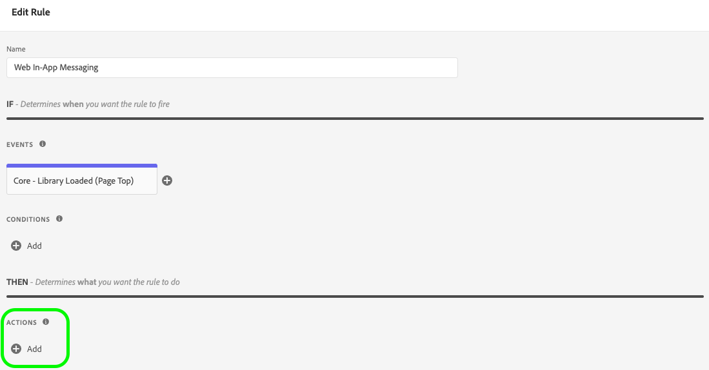
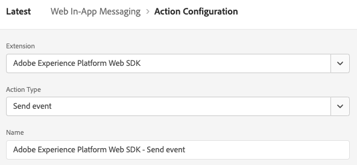

# Ondersteuning voor Web In-app Messaging in Web SDK configureren

In-app berichten zijn meldingen die u naar gebruikers in uw webtoepassing kunt sturen en die hen naar bepaalde aandachtspunten kunnen sturen.

U kunt deze meldingen voor verschillende doeleinden gebruiken, zoals het promoten van nieuwe functies, het aanbieden van speciale aanbiedingen of het vergemakkelijken van het aan boord nemen van gebruikers.

Door in-app berichten te gebruiken, kunt u effectief met uw publiek in gesprek gaan en hen naar belangrijke aspecten van uw toepassing sturen.

>[!IMPORTANT]
>
>Webberichten in de app zijn [Adobe Journey Optimizer](https://experienceleague.adobe.com/docs/journey-optimizer/using/ajo-home.html) eigenschap, die SDK van het Web gebruikt om de gepersonaliseerde inhoud te leveren.
>
>Voor gedetailleerde instructies op hoe te om uw campagne van het Overseinen van het Web in-App te vormen, zie [Adobe Journey Optimizer-documentatie](https://experienceleague.adobe.com/docs/journey-optimizer/using/in-app/create-in-app-web.html).


## Vereisten {#prerequisites}

### Web SDK-tagextensie {#extension-version}

Voor de functionaliteit voor berichten via Web in-app is de nieuwste versie van de Web SDK-tagextensie vereist.

### Een CSP configureren voor web in-app berichten {#csp}

Wanneer u [Webberichten in de app](../personalization/web-in-app-messaging.md), moet u de volgende richtlijn in uw CSP opnemen:

```
default-src  blob:;
```

Voor meer informatie over het vormen van CSP, zie [speciale documentatie](../use-cases/configuring-a-csp.md).

## Webberichten in de app configureren met de Web SDK-tagextensie {#tag-extension}

Zie de [Web SDK-pagina voor configuratie van tags](../../tags/extensions/client/web-sdk/web-sdk-extension-configuration.md) om te begrijpen waar u de hieronder beschreven montages kunt vinden.

Nadat u [geïnstalleerd](../../tags/extensions/client/web-sdk/web-sdk-extension-configuration.md#install-the-web-sdk-tag-extension) Voer de onderstaande stappen uit om de extensie voor Web SDK-tags te configureren voor Web In-app Messaging.

In de **[!UICONTROL Personalization]** sectie, controleren **[!UICONTROL Enable personalization storage]** -optie. Deze optie staat SDK van het Web toe om spoor te houden van welke ervaringen door de gebruiker over paginaladingen zijn gezien.


Het Web in-app Overseinen steunt twee types van trekkers:

* [Gegevens verzenden naar platform](#send-data-platform)
* [De berichten handmatig activeren](#manual-trigger)

Verwijs naar de volgende secties om de de marktextensie van SDK van het Web volgens de trekkers te vormen u wilt gebruiken.

### Configuratiestappen voor de **[!UICONTROL Send data to Platform]** trigger {#send-data-platform}

Selecteer het markeringsbezit dat uw uitbreiding van SDK van het Web bevat, en [een nieuwe regel maken](../../tags/ui/managing-resources/rules.md##create-a-rule) met de volgende instellingen:

1. **[!UICONTROL Extension]**: [!UICONTROL Core]
2. **[!UICONTROL Event Type]**: [!UICONTROL Library Loaded (Page Top)]

   

3. Selecteren **[!UICONTROL Keep Changes]** om de gebeurtenisconfiguratie op te slaan.

Vervolgens moet u een handeling toevoegen aan de regel die u hebt gemaakt.

1. In de [!DNL Actions] sectie, selecteert u **[!UICONTROL Add]**.
   

2. Gebruik het volgende **[!UICONTROL Action]** instellingen:
   * **[!UICONTROL Extension]**: [!UICONTROL Adobe Experience Platform Web SDK]
   * **[!UICONTROL Action Type]**: [!UICONTROL Send event]

     

3. Aan de rechterkant van het scherm, in **[!UICONTROL Personalization]** in, schakelt u de **[!UICONTROL Render visual personalization decisions]** -optie.
   

4. Aan de rechterkant van het scherm, in **[!UICONTROL Decision context]** in, definieert u de **[!UICONTROL Key]**/**[!UICONTROL Value]** paren die u in uw campagneconfiguratie hebt gebruikt om in aanmerking te komen voor het bericht in de app.
   

5. Selecteren **[!UICONTROL Keep Changes]** om uw configuratie op te slaan.


Vervolgens moet u de nieuwe regel toevoegen aan de bibliotheek met eigenschappen van de tag. Ga hiervoor naar **[!UICONTROL Publishing Flow]** en selecteer de regel die u eerder hebt gemaakt.


Nadat u de regel aan de bibliotheek hebt toegevoegd, selecteert u **[!UICONTROL Save & Build to Development]**.


Het configuratieproces is nu voltooid en uw bericht is klaar om aan uw gebruikers te worden getoond.

### Configuratiestappen voor het gebruik van handmatige triggers {#manual-trigger}

Selecteer het markeringsbezit dat uw uitbreiding van SDK van het Web bevat, en [een nieuwe regel maken](../../tags/ui/managing-resources/rules.md##create-a-rule) met de volgende instellingen:

1. **[!UICONTROL Extension]**: [!UICONTROL Core]
2. **[!UICONTROL Event Type]**: [!UICONTROL Click]
3. Stel de trigger voor een specifiek element op de pagina in, herkenbaar aan een CSS-kiezer van uw keuze.

   


Vervolgens moet u een handeling toevoegen aan de regel die u hebt gemaakt.

1. In de [!DNL Actions] sectie, selecteert u **[!UICONTROL Add]**.
   

2. Gebruik het volgende **[!UICONTROL Action]** instellingen:
   * **[!UICONTROL Extension]**: [!UICONTROL Adobe Experience Platform Web SDK]
   * **[!UICONTROL Action Type]**: [!UICONTROL Evaluate rulesets]

     

3. Schakel rechts van het scherm de optie **[!UICONTROL Render visual personalization decisions]** -optie.
   


4. Aan de rechterkant van het scherm, in **[!UICONTROL Decision context]** in, definieert u de **[!UICONTROL Key]**/**[!UICONTROL Value]** paren die u in uw campagneconfiguratie hebt gebruikt om in aanmerking te komen voor het bericht in de app.
   

5. Selecteren **[!UICONTROL Keep Changes]** om uw configuratie op te slaan.

Vervolgens moet u de nieuwe regel toevoegen aan de bibliotheek met eigenschappen van de tag. Ga hiervoor naar **[!UICONTROL Publishing Flow]** en selecteer de regel die u eerder hebt gemaakt.


Nadat u de regel aan de bibliotheek hebt toegevoegd, selecteert u **[!UICONTROL Save & Build to Development]**.


Het configuratieproces is nu voltooid en uw bericht is klaar om aan uw gebruikers te worden getoond.

## Webberichten in de app configureren met de Web SDK JavaScript-bibliotheek {#js-library}

Als alternatief voor het gebruiken van de de markeringsuitbreiding van SDK van het Web, kunt u Web in-App Overseinen van het Web direct van de bibliotheek van SDK JavaScript van het Web vormen.


U kunt binnen-app berichten van Adobe Journey Optimizer op twee manieren weergeven.

### Methode 1: hiermee wordt de inhoud van de personalisatie automatisch opgehaald {#automatic}

Als u wilt dat Web SDK de personalisatie-inhoud automatisch ophaalt bij het laden van de pagina, gebruikt u de opdracht `sendEvent` gebruiken, zoals in het onderstaande voorbeeld wordt getoond.

```js
  alloy("sendEvent", {
      renderDecisions: true,
      personalization: {
          surfaces: ['#welcome']
      }
  });
```

### Methode 2: hiermee wordt de inhoud van de personalisatie handmatig opgehaald op basis van gebruikersactie {#manual}

Om de verpersoonlijkingsinhoud slechts te tonen nadat de gebruiker een specifieke actie uitvoert, gebruik `evaluateRulesets` gebruiken, zoals in het onderstaande voorbeeld wordt getoond.

In dit voorbeeld wordt de personalisatie-inhoud weergegeven wanneer een gebruiker op de knop **[!UICONTROL Buy Now]** op uw website.

```js
 alloy("evaluateRulesets", {
     renderDecisions: true,
     personalization: {
         decisionContext: {
             "userAction": "buy_now"
         }
     }
 });
```

### Opslag voor personalisatie configureren {#personalization-storage}

U kunt ervoor kiezen om in-app berichten voor een bepaald aantal keren of telkens wanneer gebruikers een pagina bezoeken, via `personalizationStorageEnabled` configuratieoptie.

In de [Web SDK-configuratie](../commands/configure/overview.md) instellen `personalizationStorageEnabled` naar behoefte:

* `personalizationStorageEnabled: true` activeert het bericht in de app met de frequentie die u in de [Adobe Journey Optimizer-campagne](https://experienceleague.adobe.com/docs/journey-optimizer/using/in-app/create-in-app-web.html#configure-inapp).
* `personalizationStorageEnabled: false` activeert het bericht in de app bij het laden van elke pagina.