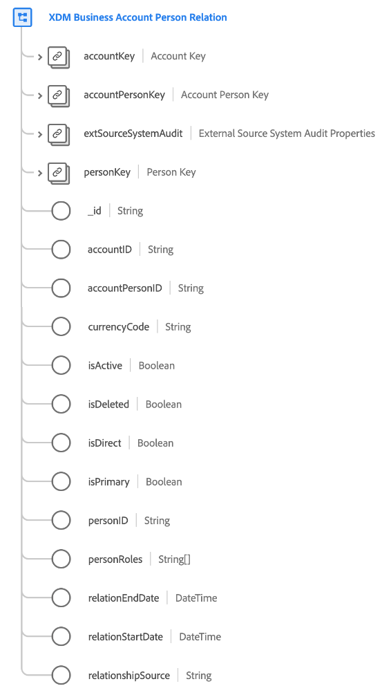

# [!UICONTROL XDM Business Account Person Relation] class

>[!NOTE]
>
>Deze klasse is alleen beschikbaar voor organisaties die toegang hebben tot Real-time Customer Data Platform B2B Edition.

[!UICONTROL XDM Business Account Person Relation] is een standaardklasse van de Gegevens van de Ervaring van het Model (XDM) die de minimum vereiste eigenschappen van een persoon vangt die met een bedrijfsrekening wordt geassocieerd.

| Eigenschap | Gegevenstype | Beschrijving |
| --- | --- | --- |
| `accountKey` | [[!UICONTROL B2B Source]](../../data-types/b2b-source.md) | Een samengestelde identificatiecode voor de rekening in de relatie tussen de rekeninghouder en persoon. |
| `accountPersonKey` | [[!UICONTROL B2B Source]](../../data-types/b2b-source.md) | Een samengestelde identificator voor de relatie-entiteit van de rekeningpersoon. |
| `extSourceSystemAudit` | [[!UICONTROL External Source System Audit Attributes]](../../data-types/external-source-system-audit-attributes.md) | Als de account-persoonverhouding uit een extern bronsysteem komt, vangt dit voorwerp controleattributen voor dat systeem. |
| `personKey` | [[!UICONTROL B2B Source]](../../data-types/b2b-source.md) | Een samengestelde identificatiecode voor de persoon in de relatie tussen de rekeninghouder en de persoon in kwestie. |
| `_id` | Tekenreeks | Een unieke id voor de record. Dit is een door het systeem gegenereerde waarde die los staat van de andere id-velden die door de klasse worden vastgelegd. |
| `accountID` | Tekenreeks | Een unieke identificatiecode voor de rekening in de relatie tussen de account en de persoon. |
| `accountPersonID` | Tekenreeks | Een unieke identificatiecode voor de relatie-entiteit van de rekeningpersoon. |
| `currencyCode` | Tekenreeks | De ISO 4217-valutacode die wordt gebruikt voor de relatie tussen de rekening en de persoon. |
| `isActive` | Boolean | Geeft aan of de relatie tussen de account en de persoon actief is. |
| `isDirect` | Boolean | Geeft aan of dit een directe relatie is tussen de rekening en de persoon. |
| `isPrimary` | Boolean | Geeft aan of de persoon de primaire contactpersoon voor deze account is. |
| `personID` | Tekenreeks | Een unieke identificatiecode voor de persoon in de relatie tussen de account en de persoon. |
| `personRole` | Tekenreeks | De rol van de persoon in de relatie tussen de rekeninghouder en de persoon. |
| `relationEndDate` | DateTime | De datum waarop de relatie tussen de rekening en de persoon eindigde. |
| `relationStartDate` | DateTime | De datum waarop de relatie tussen de rekening en de persoon is begonnen. |

Zie de gids op [schemaverhoudingen in Real-time CDP B2B Uitgave](../../tutorials/relationship-b2b.md) leren hoe deze klasse conceptueel met de andere B2B klassen verwant en hoe u deze verhoudingen in Adobe Experience Platform UI kunt vestigen.
