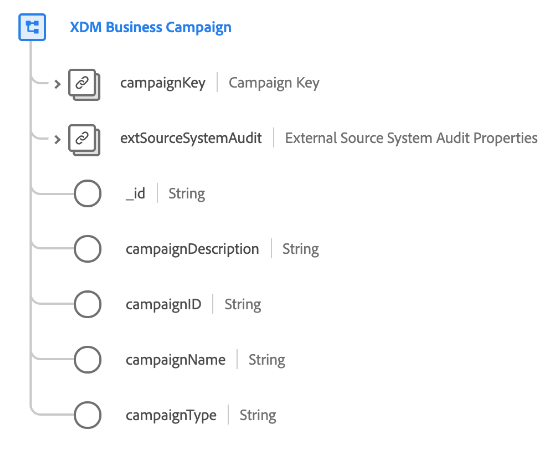

# [!UICONTROL XDM Business Campaign] class

[!UICONTROL XDM Business Campaign] is een standaardklasse van de Gegevens van de Ervaring van het Model (XDM) die de minimum vereiste eigenschappen van een bedrijfscampagne vangt.

| Eigenschap | Gegevenstype | Beschrijving |
| --- | --- | --- |
| `campaignKey` | [[!UICONTROL B2B Source]](../../data-types/b2b-source.md) | Een samengestelde id voor de campagneentiteit. |
| `extSourceSystemAudit` | [[!UICONTROL External Source System Audit Attributes]](../../data-types/external-source-system-audit-attributes.md) | Als de campagne uit een extern bronsysteem komt, vangt dit voorwerp controleattributen voor dat systeem. |
| `_id` | Tekenreeks | Een unieke id voor de record. Dit is een door het systeem gegenereerde waarde die los staat van de `campaignID`. |
| `campaignDescription` | Tekenreeks | Een beschrijving van de campagne. |
| `campaignID` | Tekenreeks | Een unieke id voor de campagneentiteit. |
| `campaignName` | Tekenreeks | De naam van de campagne. |
| `campaignType` | Tekenreeks | Het type campagne of doelpubliek. |

{style=&quot;table-layout:auto&quot;}

Zie de handleiding op [schema-relaties in Real-time CDP B2B Edition](../../tutorials/relationship-b2b.md) om te leren hoe deze klasse conceptueel op de andere klassen B2B betrekking heeft en hoe u deze verhoudingen in Adobe Experience Platform UI kunt vestigen.
