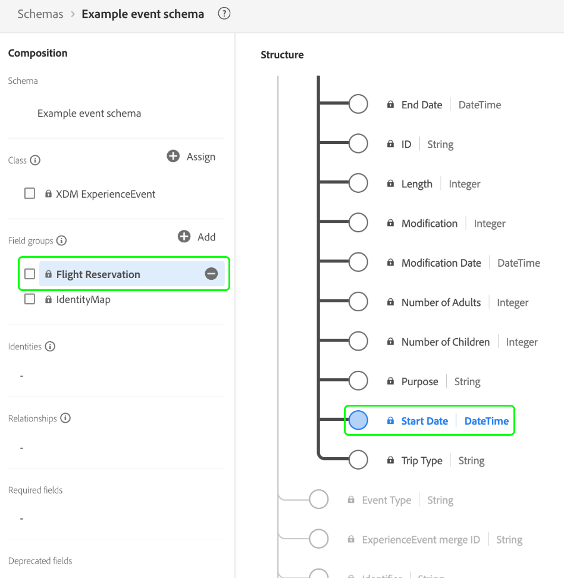

# [!DNL XDM ExperienceEvent] class

[!DNL XDM ExperienceEvent] is een standaardklasse van het Gegevensmodel van de Ervaring (XDM) die u toestaat om een timestamped momentopname van het systeem tot stand te brengen wanneer een specifieke gebeurtenis voorkomt of een bepaalde reeks voorwaarden zijn bereikt.

Een ervaringsgebeurtenis is een feitenverslag van wat voorkwam, met inbegrip van het tijdstip en de identiteit van de betrokken persoon. Gebeurtenissen kunnen expliciet (direct waarneembare menselijke acties) of impliciet (zonder directe menselijke actie) zijn en worden geregistreerd zonder aggregatie of interpretatie. Raadpleeg voor meer informatie op hoog niveau over het gebruik van deze klasse in het ecosysteem van het Platform de [XDM-overzicht](../home.md#data-behaviors).

De [!DNL XDM ExperienceEvent] De klasse zelf verstrekt verscheidene op tijd-reeksen betrekking hebbende gebieden aan een schema. De waarden van sommige van deze velden worden automatisch ingevuld wanneer gegevens worden ingevoerd:

| Eigenschap | Beschrijving |
| --- | --- |
| `_id` | Een unieke tekenreeks-id voor de gebeurtenis. Dit veld wordt gebruikt om de unieke aard van een individuele gebeurtenis te volgen, om te voorkomen dat gegevens worden herhaald en om die gebeurtenis in downstreamdiensten op te zoeken. In sommige gevallen `_id` kan [Universally Unique Identifier (UUID)](https://tools.ietf.org/html/rfc4122) of [Globally Unique Identifier (GUID)](https://docs.microsoft.com/en-us/dotnet/api/system.guid?view=net-5.0).  Als u gegevens streamt via een bronverbinding of rechtstreeks opgeeft vanuit een Parquet-bestand, moet u deze waarde genereren door een bepaalde combinatie van velden samen te voegen die de gebeurtenis uniek maken, zoals een primaire id, tijdstempel, gebeurtenistype, enzovoort. De samengevoegde waarde moet een `uri-reference` geformatteerde tekenreeks: eventuele dubbele tekens moeten worden verwijderd. Daarna, zou de samengevoegde waarde moeten worden gehakt gebruikend SHA-256 of een ander algoritme van uw keus.  Het is van belang te onderscheiden dat **dit veld vertegenwoordigt geen identiteit die betrekking heeft op een individuele persoon**, maar eerder de gegevensregistratie zelf. Identiteitsgegevens betreffende een persoon moeten worden beperkt tot [identiteitsvelden](../schema/composition.md#identity) in plaats daarvan worden verstrekt door compatibele veldgroepen. |
| `eventMergeId` | Als u de [Adobe Experience Platform Web SDK](../../edge/home.md) om gegevens in te voeren, vertegenwoordigt dit identiteitskaart van de opgenomen partij die het verslag om veroorzaakte te creëren. Dit veld wordt automatisch ingevuld door het systeem bij het invoeren van gegevens. Het gebruik van dit gebied buiten de context van een implementatie van SDK van het Web wordt niet gesteund. |
| `eventType` | Een tekenreeks die het type of de categorie voor de gebeurtenis aangeeft. Dit gebied kan worden gebruikt als u verschillende gebeurtenistypen binnen het zelfde schema en de dataset wilt onderscheiden, zoals het onderscheiden van een gebeurtenis van de productmening van toe:voegen-aan-winkelwagentje voor een detailhandelsbedrijf.  Standaardwaarden voor deze eigenschap worden gegeven in het gedeelte [aanhangsel](#eventType), met een beschrijving van het beoogde gebruik. Dit veld is een uitbreidbare opsomming. Dit houdt in dat u ook uw eigen tekenreeksen voor gebeurtenistypen kunt gebruiken om de gebeurtenissen die u bijhoudt, te categoriseren.  `eventType` beperkt u tot het gebruik van slechts één gebeurtenis per hit op uw toepassing en daarom moet u berekende velden gebruiken om het systeem te laten weten welke gebeurtenis het belangrijkst is. Zie de sectie over [aanbevolen procedures voor berekende velden](#calculated). |
| `producedBy` | Een tekenreekswaarde die de producent of oorsprong van de gebeurtenis beschrijft. Dit veld kan worden gebruikt om bepaalde gebeurtenisproducenten uit te filteren als dat voor segmentatiedoeleinden nodig is.  Sommige voorgestelde waarden voor deze eigenschap zijn opgenomen in het dialoogvenster [aanhangsel](#producedBy). Dit veld is een uitbreidbare opsomming. Dit houdt in dat u ook uw eigen tekenreeksen kunt gebruiken om verschillende gebeurtenisproducenten te vertegenwoordigen. |
| `identityMap` | Een toewijzingsveld dat een set naamloze identiteiten bevat voor het individu waarop de gebeurtenis van toepassing is. Dit veld wordt automatisch door het systeem bijgewerkt wanneer er identiteitsgegevens worden ingevoerd. Voor een juist gebruik van dit veld voor [Klantprofiel in realtime](../../profile/home.md)Probeer niet handmatig de inhoud van het veld bij te werken in uw gegevensbewerkingen.  Zie de sectie over identiteitskaarten in het dialoogvenster [grondbeginselen van de schemacompositie](../schema/composition.md#identityMap) voor meer informatie over het gebruik ervan . |
| `timestamp` | Een ISO 8601-tijdstempel van wanneer de gebeurtenis heeft plaatsgevonden, opgemaakt volgens [RFC 3339 — Sectie 5.6](https://tools.ietf.org/html/rfc3339#section-5.6). Deze tijdstempel moet in het verleden voorkomen. Zie de onderstaande sectie over [tijdstempels](#timestamps) voor beste praktijken op het gebruik van dit gebied. |

{style=&quot;table-layout:auto&quot;}

## Aanbevolen procedures voor het modelleren van gebeurtenissen

De volgende secties behandelen beste praktijken voor het ontwerpen van uw op gebeurtenis-gebaseerde schema&#39;s van de Gegevens van de Ervaring (XDM) in Adobe Experience Platform.

### Tijdstempels {#timestamps}

De basis `timestamp` veld van een gebeurtenisschema kan **alleen** de waarneming van het evenement zelf vertegenwoordigen en in het verleden moeten plaatsvinden. Als voor uw segmentatiegebruik tijdstempels moeten worden gebruikt die in de toekomst kunnen voorkomen, moeten deze waarden elders in het schema van de Experience-gebeurtenis worden beperkt.

Als een bedrijf in de reis- en gastsector bijvoorbeeld een vluchtreserveringsevenement modelleert, moet de klasse `timestamp` wordt het tijdstip weergegeven waarop de reserveringsgebeurtenis is waargenomen. Andere tijdstempels die verband houden met de gebeurtenis, zoals de begindatum van de reisreservering, moeten worden vastgelegd in afzonderlijke velden die worden verschaft door standaard- of aangepaste veldgroepen.

Door de klasse-vlakke timestamp gescheiden van andere verwante datetime waarden in uw gebeurtenisschema&#39;s te houden, kunt u de flexibele gevallen van het segmentatiegebruik uitvoeren terwijl het bewaren van een timestamped rekening van klantenreizen in uw ervaringstoepassing.

### Berekende velden gebruiken {#calculated}

Bepaalde interacties in uw ervaringstoepassingen kunnen resulteren in meerdere gerelateerde gebeurtenissen die technisch dezelfde tijdstempel voor de gebeurtenis hebben en daarom kunnen worden weergegeven als één gebeurtenisrecord. Als een klant bijvoorbeeld een product op uw website weergeeft, kan dit resulteren in een gebeurtenisrecord met twee mogelijke `eventType` waarden: een &quot;product view&quot;-gebeurtenis (`commerce.productViews`) of een algemene gebeurtenis &quot;paginaweergave&quot; (`web.webpagedetails.pageViews`). In deze gevallen kunt u berekende velden gebruiken om de belangrijkste kenmerken vast te leggen wanneer meerdere gebeurtenissen in één keer worden vastgelegd.

[Adobe Experience Platform Data Prep](../../data-prep/home.md) staat u toe om, gegevens aan en van XDM in kaart te brengen om te zetten en te bevestigen. De beschikbare [toewijzingsfuncties](../../data-prep/functions.md) die door de dienst worden verstrekt kunt u logische exploitanten aanhalen om, gegevens van multi-gebeurtenisverslagen voorrang te geven om te zetten en/of te consolideren wanneer ingebed in Experience Platform. In het bovenstaande voorbeeld kunt u `eventType` als een berekend veld dat voorrang geeft aan een &quot;productweergave&quot; boven een &quot;paginaweergave&quot; wanneer deze beide voorkomen.

Als u gegevens handmatig via de gebruikersinterface in het Platform invoert, raadpleegt u de handleiding [berekende velden](../../data-prep/ui/mapping.md#calculated-fields) voor specifieke stappen voor het maken van berekende velden.

Als u gegevens aan Platform stroomt gebruikend een bronverbinding, kunt u de bron vormen om berekende gebieden in plaats daarvan te gebruiken. Zie de [documentatie voor uw specifieke bron](../../sources/home.md) voor instructies op hoe te om berekende gebieden uit te voeren wanneer het vormen van de verbinding.

## Compatibele schemaveldgroepen {#field-groups}

>[!NOTE]
>
>De namen van verschillende veldgroepen zijn gewijzigd. Document weergeven op [veldgroepnaapupdates](../field-groups/name-updates.md) voor meer informatie .

Adobe biedt verschillende standaardveldgroepen voor gebruik met de [!DNL XDM ExperienceEvent] klasse. Hieronder volgt een lijst met enkele veelgebruikte veldgroepen voor de klasse:

* [[!UICONTROL Campaign Marketing Details]](../field-groups/event/campaign-marketing-details.md)
* [[!UICONTROL Channel Details]](../field-groups/event/channel-details.md)
* [[!UICONTROL Commerce Details]](../field-groups/event/commerce-details.md)
* [[!UICONTROL Device Trade-In Details]](../field-groups/event/device-trade-in-details.md)
* [[!UICONTROL Dining Reservation]](../field-groups/event/dining-reservation.md)
* [[!UICONTROL End User ID Details]](../field-groups/event/enduserids.md)
* [[!UICONTROL Environment Details]](../field-groups/event/environment-details.md)
* [[!UICONTROL Flight Reservation]](../field-groups/event/flight-reservation.md)
* [[!UICONTROL IAB TCF 2.0 Consent]](../field-groups/event/iab.md)
* [[!UICONTROL Lodging Reservation]](../field-groups/event/lodging-reservation.md)
* [[!UICONTROL Reservation Details]](../field-groups/event/reservation-details.md)
* [[!UICONTROL Web Details]](../field-groups/event/web-details.md)

## Aanhangsel

De volgende sectie bevat aanvullende informatie over de [!UICONTROL XDM ExperienceEvent] klasse.

### Geaccepteerde waarden voor `eventType` {#eventType}

In de volgende tabel worden de toegestane waarden voor `eventType`, alsmede de definities ervan:

| Waarde | Definitie |
| --- | --- |
| `advertising.clicks` | Klik op een handeling(en) op een advertentie. |
| `advertising.completes` | Een getimede media-element is gecontroleerd op voltooiing. Dit betekent niet noodzakelijkerwijs dat de viewer de hele video heeft bekeken, aangezien de viewer vooruit had kunnen overgeslagen. |
| `advertising.conversions` | Vooraf gedefinieerde actie(s) uitgevoerd door een klant die een gebeurtenis voor prestatiebeoordeling start. |
| `advertising.federated` | Geeft aan of een Experience Event is gemaakt via gegevensfederatie (gegevens delen tussen klanten). |
| `advertising.firstQuartiles` | Een digitale video heeft 25% van de duur bij normale snelheid afgespeeld. |
| `advertising.impressions` | Indrukking(en) van een advertentie voor een klant die mogelijk wordt bekeken. |
| `advertising.midpoints` | Een digitale video heeft 50% van zijn duur bij normale snelheid afgespeeld. |
| `advertising.starts` | Er is een digitale video afgespeeld. |
| `advertising.thirdQuartiles` | Een digitale video heeft 75% van zijn duur bij normale snelheid afgespeeld. |
| `advertising.timePlayed` | Beschrijft de hoeveelheid tijd die door een gebruiker aan een specifiek getimed media activa wordt doorgebracht. |
| `application.close` | Een toepassing is gesloten of op de achtergrond geplaatst. |
| `application.launch` | Er is een toepassing gestart of op de voorgrond geplaatst. |
| `commerce.checkouts` | Er is een uitcheckgebeurtenis opgetreden voor een productlijst. Er kunnen meerdere uitcheckgebeurtenissen zijn als er meerdere stappen in een uitcheckproces zijn. Als er meerdere stappen zijn, worden de tijdstempel en de pagina/ervaring waarnaar wordt verwezen voor elke gebeurtenis gebruikt om elke afzonderlijke gebeurtenis (stap) in volgorde weer te geven. |
| `commerce.productListAdds` | Er is een product toegevoegd aan de productlijst of winkelwagentje. |
| `commerce.productListOpens` | Er is een nieuwe productlijst (winkelwagentje) geïnitialiseerd of gemaakt. |
| `commerce.productListRemovals` | Een of meer productvermeldingen zijn uit een productlijst of winkelwagentje verwijderd. |
| `commerce.productListReopens` | Een productlijst (winkelwagentje) die niet meer toegankelijk (verlaten) was, is door een klant opnieuw geactiveerd, bijvoorbeeld via een hermarketingactiviteit. |
| `commerce.productListViews` | Een productlijst of winkelwagentje heeft een of meer weergaven ontvangen. |
| `commerce.productViews` | Een product heeft een of meer weergaven ontvangen. |
| `commerce.purchases` | Er is een bestelling geaccepteerd. Dit is de enige vereiste actie in een commerciële omschakeling. Een aankoopgebeurtenis moet een productlijst hebben waarnaar wordt verwezen. |
| `commerce.saveForLaters` | Er is een productlijst opgeslagen voor toekomstig gebruik, zoals een wenslijst voor een product. |
| `decisioning.propositionDisplay` | Een beslissingsvoorstel is weergegeven aan een persoon. |
| `decisioning.propositionInteract` | Een persoon had interactie met een beslissingsvoorstel. |
| `delivery.feedback` | Feedbackgebeurtenissen voor een levering, zoals een e-maillevering. |
| `directMarketing.emailBounced` | Een e-mail naar een persoon teruggestuurd. |
| `directMarketing.emailBouncedSoft` | Een e-mail naar een persoon met een zachte buis. |
| `directMarketing.emailClicked` | Een persoon heeft op een koppeling in een marketingbericht geklikt. |
| `directMarketing.emailDelivered` | Er is een e-mailbericht verzonden naar de e-mailservice van een persoon |
| `directMarketing.emailOpened` | Een persoon heeft een marketingbericht geopend. |
| `directMarketing.emailUnsubscribed` | Een persoon die zich niet heeft geabonneerd op een marketingbericht. |
| `leadOperation.convertLead` | Een lead is omgezet. |
| `leadOperation.interestingMoment` | Er is een interessant moment opgenomen voor een persoon. |
| `leadOperation.newLead` | Er is een lead gemaakt. |
| `leadOperation.scoreChanged` | De waarde van het score-kenmerk van de lead is gewijzigd. |
| `leadOperation.statusInCampaignProgressionChanged` | De status van een leider in een campagne is veranderd. |
| `listOperation.addToList` | Er is een persoon toegevoegd aan een marketinglijst. |
| `listOperation.removeFromList` | Een persoon is verwijderd uit een marketinglijst. |
| `message.feedback` | Feedbackgebeurtenissen zoals verzonden/stuit/fout voor berichten die naar een klant worden verzonden. |
| `message.tracking` | Gebeurtenissen bijhouden zoals open/klikken/aangepaste handelingen voor berichten die naar een klant worden verzonden. |
| `opportunityEvent.addToOpportunity` | Er is een persoon toegevoegd aan een opportuniteit. |
| `opportunityEvent.opportunityUpdated` | Er is een opportuniteit bijgewerkt. |
| `opportunityEvent.removeFromOpportunity` | Een persoon is uit een kans verwijderd. |
| `pushTracking.applicationOpened` | Een persoon heeft een toepassing geopend via een pushmelding. |
| `pushTracking.customAction` | Een persoon heeft op een aangepaste actie in een pushbericht geklikt. |
| `web.formFilledOut` | Een persoon heeft een formulier op een webpagina ingevuld. |
| `web.webinteraction.linkClicks` | Een koppeling is een of meer keer geselecteerd. |
| `web.webpagedetails.pageViews` | Een webpagina heeft een of meer weergaven ontvangen. |

{style=&quot;table-layout:auto&quot;}

### Voorgestelde waarden voor `producedBy` {#producedBy}

In de volgende tabel worden enkele toegestane waarden voor `producedBy`:

| Waarde | Definitie |
| --- | --- |
| `self` | Zelf |
| `system` | Systeem |
| `salesRef` | Verkoopvertegenwoordiger |
| `customerRep` | Vertegenwoordiger van klant |
