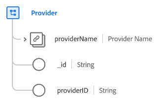

# [!UICONTROL Provider] class

In het Model van de Gegevens van de Ervaring (XDM), [!UICONTROL Provider] klasse legt de minimumreeks eigenschappen vast die een dienstverlener bedrijfsentiteit (zoals een zorgleverancier of verzekeringsleverancier) bepalen.

| Eigenschap | Gegevenstype | Beschrijving |
| --- | --- | --- |
| `providerName` | [[!UICONTROL Person name]](../data-types/person-name.md) | De naam van de provider. |
| `_id` | [!UICONTROL String] | Een unieke, door het systeem gegenereerde tekenreeks-id voor de record. Dit veld wordt gebruikt om het unieke karakter van een individueel record te volgen, om te voorkomen dat gegevens dubbel worden opgeslagen en om dat record op te zoeken in downstreamdiensten.  Aangezien dit veld door het systeem wordt gegenereerd, wordt er geen expliciete waarde opgegeven tijdens het invoeren van gegevens. U kunt er echter desgewenst nog voor kiezen om uw eigen unieke id-waarden op te geven. |
| `providerId` | [!UICONTROL String] | Een unieke id voor de provider. |

{style=&quot;table-layout:auto&quot;}

De klasse kan worden uitgebreid met de [[!UICONTROL Healthcare Provider] veldgroep](../field-groups/provider/healthcare-provider.md) voor nadere informatie over een zorgleverancier.
