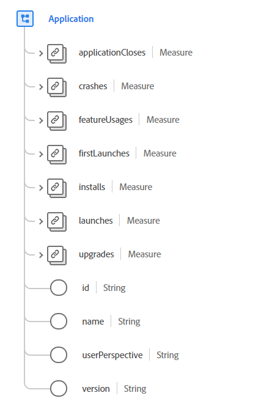

# [!UICONTROL Application] gegevenstype

[!UICONTROL Application] is een standaard XDM-gegevenstype (Experience Data Model) dat details beschrijft met betrekking tot interacties die door een toepassing worden gegenereerd. Een toepassing verwijst naar een softwareervaring, zoals een mobiele toepassing of bureaubladtoepassing die door een eindgebruiker kan worden geïnstalleerd, uitgevoerd, gesloten of verwijderd. De eigenschappen voor dit gegevenstype zijn niet bedoeld voor het beschrijven van agents zoals chatbots, browsergebaseerde plug-ins of andere ervaringen die niet van toepassing zijn op toepassingen.

 {width= 500}

| Eigenschap | Gegevenstype | Beschrijving |
| --- | --- | --- |
| `applicationCloses` | [[!UICONTROL Measure]](./measure.md) | Beschrijft details over de beëindiging van een toepassing. |
| `crashes` | [[!UICONTROL Measure]](./measure.md) | Deze eigenschap wordt geactiveerd wanneer de toepassing niet volgens plan wordt afgesloten. |
| `featureUsages` | [[!UICONTROL Measure]](./measure.md) | Beschrijft om het even welke gegevens van de activering van een toepassingseigenschap die worden gemeten. |
| `firstLaunches` | [[!UICONTROL Measure]](./measure.md) | Bevat gegevens over de eerste keer starten. Deze eigenschap wordt geactiveerd bij de eerste keer dat de toepassing na de installatie wordt gestart. |
| `installs` | [[!UICONTROL Measure]](./measure.md) | Registreert de installatie van een toepassing op een apparaat wanneer een specifieke installatiegebeurtenis beschikbaar is. |
| `launches` | [[!UICONTROL Measure]](./measure.md) | Beschrijft een waarde verbonden aan de lancering van een toepassing. Dit wordt geactiveerd bij elke uitvoering, inclusief crashes, installaties en het hervatten vanaf de achtergrond wanneer de sessietime-out is overschreden. |
| `upgrades` | [[!UICONTROL Measure]](./measure.md) | Bevat gegevens over de verbetering van een toepassing die eerder geïnstalleerd is. Dit wordt geactiveerd bij de eerste introductie na een upgrade. |
| `id` | String | Een unieke id voor de toepassing. |
| `name` | String | De naam van de toepassing. |
| `userPerspective` | String | Het perspectief of de fysieke relatie tussen de gebruiker en de app of het merk op het moment dat een gebeurtenis plaatsvond. Als u het perspectief van de gebruiker ten opzichte van de app begrijpt, kunt u beter sessies op de juiste wijze genereren omdat het grootste deel van de tijd dat u `background` - en `detached` -gebeurtenissen niet wilt opnemen in een &quot;actieve&quot; sessie. De waarde van deze eigenschap moet gelijk zijn aan een van de onderstaande opsommingswaarden. <li> `foreground`: de gebruiker en de toepassing communiceren rechtstreeks met elkaar. </li> <li> `background`: de toepassing en de gebruiker communiceren indirect met elkaar. De app kan bijvoorbeeld een waarde meten en vernieuwen terwijl het scherm vergrendeld is of een andere app op de voorgrond wordt gebruikt.  </li> <li> `detached`: Ontkoppeld betekent dat de gebeurtenis aan de app is gerelateerd, maar niet rechtstreeks uit de app is gekomen, zoals het verzenden van een e-mail- of pushmelding vanuit een extern systeem. |
| `version` | String | De versie van de toepassing. |

{style="table-layout:auto"}

Raadpleeg de openbare XDM-opslagplaats voor meer informatie over het gegevenstype:

* [ Bevolkt voorbeeld ](https://github.com/adobe/xdm/blob/master/components/datatypes/channels/application.example.1.json)
* [ Volledig schema ](https://github.com/adobe/xdm/blob/master/components/datatypes/channels/application.schema.json)
