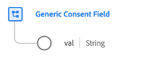

# [!UICONTROL Generic Consent Field] gegevenstype

[!UICONTROL Generic Consent Field] is een standaard XDM gegevenstype dat de selectie van een klant voor een bepaalde toestemmingsvoorkeur beschrijft.

>[!NOTE]
>
>Dit gegevenstype is bedoeld om te worden gebruikt om de structuur van de toestemmingsregelingen van uw organisatie aan te passen gebruikend de [[!UICONTROL Consents and Preferences] gebiedsgroep &#x200B;](../field-groups/profile/consents.md) als basislijn.

| Eigenschap | Gegevenstype | Beschrijving |
| --- | --- | --- |
| `val` | String | De klant-verstrekte toestemmingskeuze voor dit gebruiksgeval. Zie de onderstaande tabel voor toegestane waarden en definities. |

{style="table-layout:auto"}

In de volgende tabel worden de toegestane waarden voor `val` weergegeven:

| Waarde | Titel | Beschrijving |
| --- | --- | --- |
| `y` | Ja (opt-in) | De klant heeft ervoor gekozen de toestemming te verlenen. Met andere woorden, doen zij **&#x200B;**&#x200B;toestemming voor het gebruik van hun gegevens zoals die door de toestemming in kwestie worden vermeld. |
| `n` | Nee (opt-out) | De klant heeft ervoor gekozen niet akkoord te gaan. Met andere woorden, zij **stemmen niet** toe met het gebruik van hun gegevens zoals die door de betrokken toestemming worden vermeld. |
| `p` | Verificatie in behandeling | Het systeem heeft nog geen definitieve goedkeuringswaarde ontvangen. Dit wordt het vaakst gebruikt als deel van een toestemming die uit twee stappen controle vereist. Als een klant bijvoorbeeld ervoor kiest e-mailberichten te ontvangen, wordt die toestemming ingesteld op `p` totdat de klant een koppeling in een e-mailbericht selecteert om te controleren of hij het juiste e-mailadres heeft opgegeven. Op dat moment wordt de toestemming bijgewerkt naar `y` .   als deze toestemming geen twee-reeks controleproces gebruikt, dan kan `p` keus worden gebruikt om erop te wijzen dat de klant nog niet op de toestemmingsherinnering heeft gereageerd. U kunt bijvoorbeeld automatisch de waarde instellen op `p` op de eerste pagina van een website, voordat de klant heeft gereageerd op de bevestigingsprompt. In rechtsgebieden waarvoor geen uitdrukkelijke toestemming vereist is, kunt u deze ook gebruiken om aan te geven dat de klant niet expliciet heeft aangegeven dat de toestemming is geweigerd (met andere woorden, er wordt aangenomen dat de toestemming is verleend). |
| `u` | Onbekend | De informatie over de toestemming van de klant is onbekend. |
| `dy` | Standaard van Ja (opt-in) | De klant heeft zelf geen waarde voor de toestemming opgegeven en wordt standaard als een opt-in (&quot;Yes&quot;) behandeld. Met andere woorden, instemming wordt verondersteld tot de klant anders aangeeft.   Merk op dat als de wetten of de veranderingen in het privacybeleid van uw bedrijf in veranderingen in de gebreken van sommige of alle gebruikers resulteren, u alle profielen manueel moet bijwerken die standaardwaarden bevatten. |
| `dn` | Standaard van Geen (opt-out) | De klant heeft zelf geen waarde voor de toestemming opgegeven en wordt standaard als een &quot;nee&quot; behandeld. Met andere woorden, de klant wordt verondersteld toestemming te hebben geweigerd tot zij anders aangeven.   Merk op dat als de wetten of de veranderingen in het privacybeleid van uw bedrijf in veranderingen in de gebreken van sommige of alle gebruikers resulteren, u alle profielen manueel moet bijwerken die standaardwaarden bevatten. |
| `LI` | Gewettigd belang | Het legitieme zakelijke belang om deze gegevens voor het opgegeven doel te verzamelen en te verwerken, weegt zwaarder dan de potentiële schade die het voor het individu oplevert. |
| `CT` | Slinken | De verzameling van gegevens voor het opgegeven doel is vereist om te voldoen aan contractuele verplichtingen met de betrokkene. |
| `CP` | Naleving van een wettelijke verplichting | De verzameling van gegevens voor het gespecificeerde doel is vereist om te voldoen aan de wettelijke verplichtingen van het bedrijf. |
| `VI` | vitaal belang van de individuele | Het verzamelen van gegevens voor het opgegeven doel is vereist om de vitale belangen van het individu te beschermen. |
| `PI` | Openbaar belang | Het verzamelen van gegevens voor het specifieke doel is vereist om een taak van algemeen belang of in de uitoefening van het openbaar gezag uit te voeren. |

{style="table-layout:auto"}

Raadpleeg de openbare XDM-opslagplaats voor meer informatie over het gegevenstype:

* [&#x200B; Bevolkt voorbeeld &#x200B;](https://github.com/adobe/xdm/blob/master/components/datatypes/consent/consent-field.example.1.json)
* [&#x200B; Volledig schema &#x200B;](https://github.com/adobe/xdm/blob/master/components/datatypes/consent/consent-field.schema.json)
