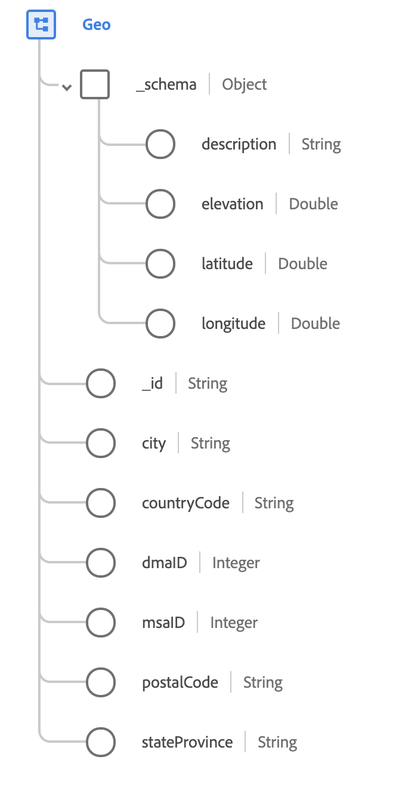

# [!UICONTROL Geo] , gegevenstype

[!UICONTROL Geo] is een standaard XDM gegevenstype dat het geografische gebied beschrijft waar een gebeurtenis werd waargenomen.

 

| Eigenschap | Gegevenstype | Beschrijving |
| --- | --- | --- |
| `_schema` | [[!UICONTROL Geo-coördinaten]](./geo-coordinates.md) | Beschrijft de geografische coördinaten van een plaats. |
| `_id` | Tekenreeks | Een unieke, door het systeem gegenereerde id voor de coördinaten. |
| `city` | Tekenreeks | De naam van de stad. |
| `countryCode` | Tekenreeks | De uit twee tekens bestaande <a href="https://datahub.io/core/country-list">ISO 3166-1 alpha-2</a> -code voor het land. |
| `dmaID` | Geheel | Het Nielsen-mediaonderzoek heeft een marktgebied aangewezen. |
| `msaID` | Geheel | Het statistische metropolitane gebied in de Verenigde Staten waar de waarneming plaatsvond. |
| `postalCode` | Tekenreeks | De postcode van de locatie. Postcodes zijn niet voor alle landen beschikbaar. In sommige landen zal dit slechts een deel van de postcode bevatten. |
| `stateProvince` | Tekenreeks | De staat of provincie van de observatie. Het formaat is conform de norm [ISO 3166-2 (land en onderverdeling)](http://www.unece.org/cefact/locode/subdivisions.html) . |

Raadpleeg de openbare XDM-opslagplaats voor meer informatie over de mix:

* [Voorbeeld van vulling](https://github.com/adobe/xdm/blob/master/components/datatypes/geo.example.1.json)
* [Volledig schema](https://github.com/adobe/xdm/blob/master/components/datatypes/geo.schema.json)