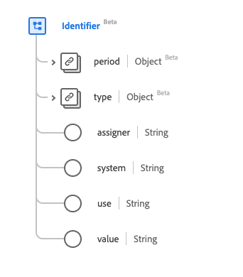

# [!UICONTROL Identifier] gegevenstype

[!UICONTROL Identifier] is een standaardgegevenstype van het Gegevensmodel van de Ervaring (XDM) dat een herkenningsteken voorgenomen voor berekening verstrekt. Dit gegevenstype wordt gecreeerd volgens de specificaties van Versie 5 van HL7 FHIR.

| Weergavenaam | Eigenschap | Gegevenstype | Beschrijving |
| --- | --- | --- | --- |
| [!UICONTROL Period] | `period` | [[!UICONTROL Period]](../healthcare/period.md) | De periode waarin de id geldig is of was voor gebruik. |
| [!UICONTROL Type] | `type` | [[!UICONTROL Codeable Concept]](../healthcare/codeable-concept.md) | De beschrijving van de id. |
| [!UICONTROL Assigner] | `assigner` | String | De organisatie die de id heeft uitgegeven. |
| [!UICONTROL System] | `system` | String | De naamruimte voor de id-waarde, vertegenwoordigd als een URI. |
| [!UICONTROL Use] | `use` | String | Het gebruik van de id. De waarden van deze eigenschap moeten gelijk zijn aan een of meer van de volgende bekende opsommingswaarden. <li> `usual` </li> <li> `offical` </li> <li> `temp` </li> <li> `secondary` </li> <li> `old` </li> |
| [!UICONTROL Value] | `value` | String | De unieke waarde van de id. |

Raadpleeg de openbare XDM-opslagplaats voor meer informatie over het gegevenstype:

* [ Bevolkt voorbeeld ](https://github.com/adobe/xdm/blob/master/extensions/industry/healthcare/fhir/datatypes/identifier.example.1.json)
* [ Volledig schema ](https://github.com/adobe/xdm/blob/master/extensions/industry/healthcare/fhir/datatypes/identifier.schema.json)
