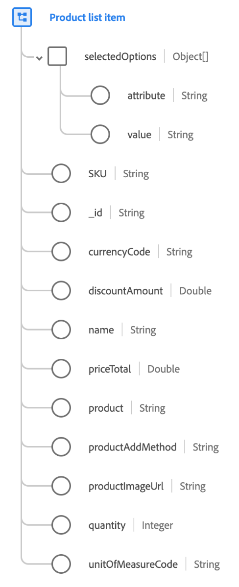

# [!UICONTROL Product list item] gegevenstype

[!UICONTROL Product list item] is een standaard XDM gegevenstype dat een product beschrijft dat door een klant met specifieke opties, tarifering, en gebruikscontext voor een specifiek tijdspunt wordt geselecteerd.

De waarden die in dit gegevenstype worden vastgelegd, kunnen afwijken van de productrecord. Het productdossier bevat bijvoorbeeld gegevens uit het productinformatiesysteem die consistent zijn voor alle klanten, waarbij het product in de productlijst de werkelijke prijs heeft die aan de klant wordt aangeboden op het moment van aankoop, die kan variëren als gevolg van verkoopcampagnes of seizoensgebonden prijzen.

| Eigenschap | Gegevenstype | Beschrijving |
| --- | --- | --- |
| `SKU` | [!UICONTROL String] | Stock keeping unit (SKU), de unieke identificator voor een product dat door de verkoper wordt gedefinieerd. |
| `_id` | [!UICONTROL String] | The line item identifier for this product entry. Het product zelf wordt geïdentificeerd via `product`. |
| `currencyCode` | [!UICONTROL String] | De alfabetische valutacode [ISO 4217](https://www.iso.org/iso-4217-currency-codes.html) die wordt gebruikt voor de prijsstelling van het product. |
| `name` | [!UICONTROL String] | De weergavenaam van het product zoals deze aan de gebruiker wordt getoond voor deze productweergave. |
| `priceTotal` | [!UICONTROL Double] | De totale prijs voor het item van de productlijn. |
| `product` | [!UICONTROL String] (URI) | De URI `$id` van het XDM-schema dat het product zelf vastlegt. |
| `productAddMethod` | [!UICONTROL String] | De methode die door de bezoeker is gebruikt om een product-item aan de lijst toe te voegen. |
| `quantity` | [!UICONTROL Integer] | Het aantal eenheden dat de klant heeft aangegeven van het product te verlangen. |

{style=&quot;table-layout:auto&quot;}

Raadpleeg de openbare XDM-opslagplaats voor meer informatie over het gegevenstype van het postadres:

* [Voorbeeld van vulling](https://github.com/adobe/xdm/blob/master/components/datatypes/productlistitem.example.1.json)
* [Volledig schema](https://github.com/adobe/xdm/blob/master/components/datatypes/productlistitem.schema.json)
