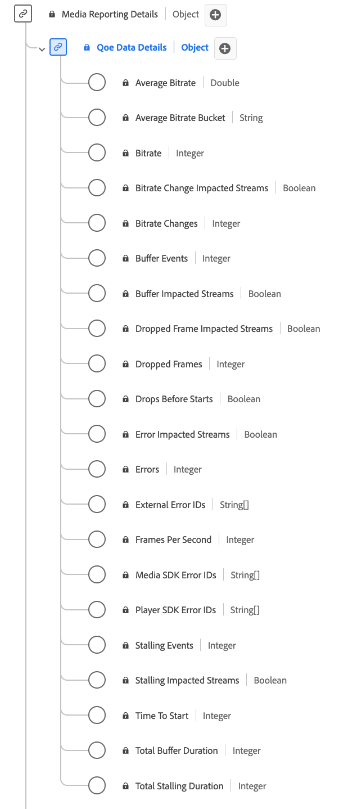

# QoE (Kwaliteit van Ervaring) Gegevens - Rapportgegevenstype

[!UICONTROL QoE Data Details] Rapportage is een standaard XDM-gegevenstype (Experience Data Model) dat gedetailleerde metriek biedt met betrekking tot de kwaliteit van de ervaring (QoE) tijdens het afspelen van media. Gebruik het gegevenstype [!UICONTROL QoE Data Details] Rapportage voor het vastleggen van details zoals bitsnelheidgegevens, framesnelheden, buffergebeurtenissen, gedropte frames enzovoort. Media-rapportvelden worden door Adobe-services gebruikt voor het analyseren van de velden Media Collection die door gebruikers worden verzonden. Deze gegevens worden, samen met andere specifieke maatstaven voor gebruikers, berekend en gerapporteerd. Met dit gegevenstype kunt u de afspeelkwaliteit analyseren, zodat u inzicht hebt in de streamingprestaties, gebruikerservaring en potentiële problemen die tijdens afspeelsessies zijn opgetreden.

+++Select om het gegevenstype van de Gegevens te tonen QoE die van Gegevens het gegevenstype melden.

+++

>[!NOTE]
>
>Elke weergavenaam bevat een koppeling naar meer informatie over de audio- en videoparameters. De gekoppelde pagina&#39;s bevatten gegevens over de video en gegevens die worden verzameld door Adobe, implementatiewaarden, netwerkparameters, rapportage en belangrijke overwegingen.

| Weergavenaam | Eigenschap | Gegevenstype | Beschrijving |
|----------------------------------------------------------------------------------------------------------------------------------------------------------------------------------------------|--------------------------|-----------|---------------------------------------------------------------------------------------------------|
| [[!UICONTROL Average Bitrate]](https://experienceleague.adobe.com/docs/media-analytics/using/implementation/variables/quality-parameters.html#average-bitrate-1) | `bitrateAverage` | getal | De gemiddelde bitsnelheid (in kbps, geheel getal). Berekend als een gewogen gemiddelde van bitsnelheidwaarden. |
| [[!UICONTROL Average Bitrate Bucket]](https://experienceleague.adobe.com/docs/media-analytics/using/implementation/variables/quality-parameters.html#average-bitrate) | `bitrateAverageBucket` | string | De gemiddelde bitsnelheid (in kbps) die in vooraf gedefinieerde emmers met intervallen van 100 kbps wordt gecategoriseerd. |
| [[!UICONTROL Bitrate]](https://experienceleague.adobe.com/docs/media-analytics/using/implementation/variables/quality-parameters.html#average-bitrate) | `bitrate` | integer | De bitsnelheidwaarde (in kbps). |
| [[!UICONTROL Bitrate Change Impacted Streams]](https://experienceleague.adobe.com/docs/media-analytics/using/implementation/variables/quality-parameters.html#bitrate-change-impacted-streams) | `hasBitrateChangeImpactedStreams` | boolean | Geeft aan of streams tijdens het afspelen zijn beïnvloed door wijzigingen in bitsnelheid. |
| [[!UICONTROL Bitrate Changes]](https://experienceleague.adobe.com/docs/media-analytics/using/implementation/variables/quality-parameters.html#bitrate-changes) | `bitrateChangeCount` | integer | Het totale aantal bitsnelheden verandert tijdens het afspelen. |
| [[!UICONTROL Buffer Events]](https://experienceleague.adobe.com/docs/media-analytics/using/implementation/variables/quality-parameters.html#buffer-events) | `bufferCount` | integer | Het aantal verschillende bufferstatussen tijdens het afspelen. |
| [[!UICONTROL Buffer Impacted Streams]](https://experienceleague.adobe.com/docs/media-analytics/using/implementation/variables/quality-parameters.html#buffer-impacted-streams) | `hasBufferImpactedStreams` | boolean | Geeft aan of streams zijn beïnvloed door bufferen tijdens het afspelen. |
| [[!UICONTROL Dropped Frame Impacted Streams]](https://experienceleague.adobe.com/docs/media-analytics/using/implementation/variables/quality-parameters.html#dropped-frame-impacted-streams) | `hasDroppedFrameImpactedStreams` | boolean | Geeft aan of streams tijdens het afspelen door gedropte frames zijn beïnvloed. |
| [[!UICONTROL Dropped Frames]](https://experienceleague.adobe.com/docs/media-analytics/using/implementation/variables/quality-parameters.html#dropped-frames-1) | `droppedFrames` | integer | Het totale aantal frames dat tijdens het afspelen is gedropt. |
| [[!UICONTROL Drops Before Starts]](https://experienceleague.adobe.com/docs/media-analytics/using/implementation/variables/quality-parameters.html#drops-before-start) | `isDroppedBeforeStart` | boolean | Hiermee geeft u aan of gebruikers de video vóór het starten moeten sluiten, ongeacht advertenties. |
| [[!UICONTROL Error Impacted Streams]](https://experienceleague.adobe.com/docs/media-analytics/using/implementation/variables/quality-parameters.html#error-impacted-streams) | `hasErrorImpactedStreams` | boolean | Geeft aan of er fouten zijn opgetreden tijdens het afspelen van streams. |
| [[!UICONTROL Errors]](https://experienceleague.adobe.com/docs/media-analytics/using/implementation/variables/quality-parameters.html#errors-%2F-error-events) | `errorCount` | integer | Het totale aantal fouten dat tijdens het afspelen is opgetreden. |
| [[!UICONTROL External Error IDs]](https://experienceleague.adobe.com/docs/media-analytics/using/implementation/variables/quality-parameters.html#external-error-ids) | `externalErrors` | array van tekenreeksen | Unieke fout-id&#39;s van externe bronnen, bijvoorbeeld CDN-fouten. |
| [[!UICONTROL Frames Per Second]](https://experienceleague.adobe.com/docs/media-analytics/using/implementation/variables/quality-parameters.html#frames-per-second) | `framesPerSecond` | integer | De huidige framesnelheid van de stream (in frames per seconde). |
| [[!UICONTROL Media SDK Error IDs]](https://experienceleague.adobe.com/docs/media-analytics/using/implementation/variables/quality-parameters.html#media-sdk-error-ids) | `mediaSdkErrors` | array van tekenreeksen | Unieke fout-id&#39;s die door Media SDK worden gegenereerd tijdens het afspelen. |
| [[!UICONTROL Player SDK Error IDs]](https://experienceleague.adobe.com/docs/media-analytics/using/implementation/variables/quality-parameters.html#player-sdk-error-ids) | `playerSdkErrors` | array van tekenreeksen | Unieke fout-id&#39;s die tijdens het afspelen door de speler-SDK worden gegenereerd. |
| [[!UICONTROL Stalling Events]](https://experienceleague.adobe.com/docs/media-analytics/using/implementation/variables/quality-parameters.html#stalling-events) | `stallCount` | integer | Het aantal stapelgebeurtenissen tijdens het afspelen. |
| [[!UICONTROL Stalling Impacted Streams]](https://experienceleague.adobe.com/docs/media-analytics/using/implementation/variables/quality-parameters.html#stalling-impacted-streams) | `hasStallImpactedStreams` | boolean | Geeft aan of streams tijdens het afspelen stalling hebben ervaren. |
| [[!UICONTROL Time To Start]](https://experienceleague.adobe.com/docs/media-analytics/using/implementation/variables/quality-parameters.html#time-to-start-1) | `timeToStart` | integer | Duur (in seconden) tussen het laden van de video en het starten. |
| [[!UICONTROL Total Buffer Duration]](https://experienceleague.adobe.com/docs/media-analytics/using/implementation/variables/quality-parameters.html#total-buffer-duration-1) | `bufferTime` | integer | Totale tijd (in seconden) besteed aan bufferen tijdens het afspelen. |
| [[!UICONTROL Total Stalling Duration]](https://experienceleague.adobe.com/docs/media-analytics/using/implementation/variables/quality-parameters.html#total-stalling-duration) | `stallTime` | integer | De totale tijd (in seconden) dat het afspelen tijdens het afspelen is gestopt. |

{style="table-layout:auto"}
