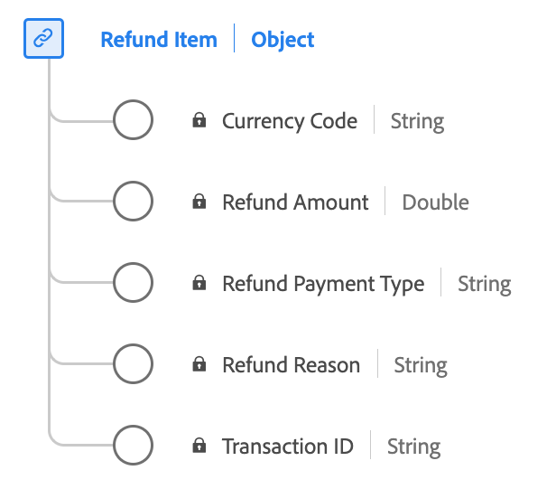

# [!UICONTROL Refund Item] gegevenstype

[!UICONTROL Refund Item] is een standaard XDM-gegevenstype (Experience Data Model) waarmee wordt beschreven welke gegevens betrekking hebben op een restitutie voor een bestelling.

| Weergavenaam | Eigenschap | Gegevenstype | Beschrijving |
|--------------------|-----------------------|-----------|---------------------------------------------------------------------------------------------------|
| [!UICONTROL Transaction ID] | `transactionID` | string | De unieke transactie-id voor dit restitutieobject. |
| [!UICONTROL Refund Amount] | `refundAmount` | getal | De waarde van de restitutie. |
| [!UICONTROL Refund Reason] | `refundReason` | string | De reden waarom een restitutie is toegekend. |
| [!UICONTROL Refund Payment Type] | `refundPaymentType` | string | De betalingsmethode voor deze bestelling. Aangepaste waarden zijn toegestaan. |
| [!UICONTROL Currency Code] | `currencyCode` | string | De ISO 4217-valutacode die wordt gebruikt voor dit restitutieobject. Bijvoorbeeld: &quot;USD&quot;, &quot;EUR&quot;. |

{style="table-layout:auto"}

Raadpleeg de openbare XDM-opslagplaats voor meer informatie over het gegevenstype:

* [ Bevolkt voorbeeld ](https://github.com/adobe/xdm/blob/master/components/datatypes/refunditem.example.1.json)
* [ Volledig schema ](https://github.com/adobe/xdm/blob/master/components/datatypes/refunditem.schema.json)
