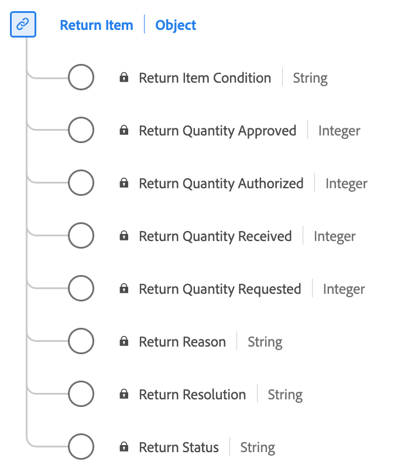

# [!UICONTROL Return Item] gegevenstype

[!UICONTROL Return Item] is een standaard gegevenstype van het Gegevensmodel van de Ervaring (XDM) vangt essentiële details met betrekking tot het terugkeerproces voor een gekocht punt.

| Weergavenaam | Eigenschap | Gegevenstype | Beschrijving |
|-----------------------------|------------------------------|-----------|--------------------------------------------------------|
| [!UICONTROL Return Status] | `returnStatus` | string | De status van het geretourneerde item (bijvoorbeeld In behandeling of goedgekeurd). |
| [!UICONTROL Return Reason] | `returnReason` | string | De reden waarom de return is aangevraagd voor het object. |
| [!UICONTROL Return Item Condition] | `returnItemCondition` | string | De voorwaarde van het item waarvoor de return wordt aangevraagd. |
| [!UICONTROL Return Resolution] | `returnResolution` | string | De gewenste resolutie of het gewenste resultaat dat van het rendement wordt verwacht (bijvoorbeeld Terugbetaling of Uitwisseling). |
| [!UICONTROL Return Quantity Requested] | `returnQuantityRequested` | integer | De hoeveelheid van het object die de verkoper heeft aangevraagd om terug te sturen. |
| [!UICONTROL Return Quantity Authorized] | `returnQuantityAuthorized` | integer | De hoeveelheid van het object die mag worden geretourneerd. |
| [!UICONTROL Return Quantity Received] | `returnQuantityReceived` | integer | Het aantal geretourneerde objecten dat is ontvangen. |
| [!UICONTROL Return Quantity Approved] | `returnQuantityApproved` | integer | De hoeveelheid van het artikel met een volledig ingevulde en goedgekeurde terugzending. |

{style="table-layout:auto"}

Raadpleeg de openbare XDM-opslagplaats voor meer informatie over het gegevenstype:

* [Voorbeeld van vulling](https://github.com/adobe/xdm/blob/master/components/datatypes/returnitem.example.1.json)
* [Volledig schema](https://github.com/adobe/xdm/blob/master/components/datatypes/returnitem.schema.json)
