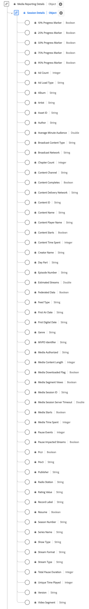

# [!UICONTROL Session Details] Gegevenstype rapporteren

[!UICONTROL Session Details] Rapportage is een standaard XDM-gegevenstype (Experience Data Model) dat gegevens bijhoudt met betrekking tot mediaflaysessies.
Media-rapportvelden worden door Adobe-services gebruikt voor het analyseren van de velden voor de verzameling van media die door gebruikers worden verzonden. Deze gegevens worden, samen met andere specifieke maatstaven voor gebruikers, berekend en gerapporteerd. Het schema omvat een breed scala aan eigenschappen die inzicht verschaffen in het gedrag van de gebruiker en de consumptiepatronen van de inhoud. Gebruik de [!UICONTROL Session Details] Gegevenstype rapporteren om de betrokkenheid van de gebruiker vast te leggen door afspeelgebeurtenissen, interacties, voortgangsmarkeringen, pauzes en andere metriek te registreren.

+++Select om een diagram van de Gegevens van de Zitting te tonen Meldend gegevenstype.

+++

>[!NOTE]
>
>Elke weergavenaam bevat een koppeling naar meer informatie over de audio- en videoparameters. De gekoppelde pagina&#39;s bevatten gegevens over de video en gegevens die worden verzameld door Adobe, implementatiewaarden, netwerkparameters, rapportage en belangrijke overwegingen.

| Weergavenaam | Eigenschap | Gegevenstype | Beschrijving |
|-------------------------------------------------------------------------------------------------------------------------------------------------------------------------------------|------------------|-----------|--------------------------------------------------------------------------------------------------|
| [[!UICONTROL 10% Progress Marker]](https://experienceleague.adobe.com/docs/media-analytics/using/implementation/variables/audio-video-parameters.html#ten-%25-progress-marker) | `hasProgress10` | Boolean | Geeft aan dat de afspeelkop de 10% markering van het medium heeft doorgegeven op basis van de lengte van de stream. De markering wordt slechts eenmaal geteld, zelfs als u achterwaarts zoekt. Als u voorwaarts zoekt, worden markeringen die worden overgeslagen, niet geteld. |
| [[!UICONTROL 25% Progress Marker]](https://experienceleague.adobe.com/docs/media-analytics/using/implementation/variables/audio-video-parameters.html#twenty-five-%25-progress-marker) | `hasProgress25` | Boolean | Geeft aan dat de afspeelkop de 25% markering van media heeft doorgegeven op basis van de streamlengte. Markering telde maar één keer, zelfs als u achterwaarts zoekt. Als u voorwaarts zoekt, worden markeringen die worden overgeslagen, niet geteld. |
| [[!UICONTROL 50% Progress Marker]](https://experienceleague.adobe.com/docs/media-analytics/using/implementation/variables/audio-video-parameters.html#50%25-progress-marker) | `hasProgress50` | Boolean | Geeft aan dat de afspeelkop de 50% markering van media heeft doorgegeven op basis van de streamlengte. Markering telde maar één keer, zelfs als u achterwaarts zoekt. Als u voorwaarts zoekt, worden markeringen die worden overgeslagen, niet geteld. |
| [[!UICONTROL 75% Progress Marker]](https://experienceleague.adobe.com/docs/media-analytics/using/implementation/variables/audio-video-parameters.html#seventy-five-%25-progress-marker) | `hasProgress75` | Boolean | Geeft aan dat de afspeelkop de 75%-markering voor media heeft doorgegeven op basis van de lengte van de stream. Markering telde maar één keer, zelfs als u achterwaarts zoekt. Als u voorwaarts zoekt, worden markeringen die worden overgeslagen, niet geteld. |
| [[!UICONTROL 95% Progress Marker]](https://experienceleague.adobe.com/docs/media-analytics/using/implementation/variables/audio-video-parameters.html#ninety-five-%25-progress-marker) | `hasProgress95` | Boolean | Geeft aan dat de afspeelkop de 95%-markering van media heeft doorgegeven op basis van de streamlengte. Markering telde maar één keer, zelfs als u achterwaarts zoekt. Als u voorwaarts zoekt, worden markeringen die worden overgeslagen, niet geteld. |
| [[!UICONTROL Ad Count]](https://experienceleague.adobe.com/docs/media-analytics/using/implementation/variables/audio-video-parameters.html#ad-count) | `adCount` | Geheel | Het aantal advertenties dat tijdens het afspelen is gestart. |
| [!UICONTROL Ad Load Type] | `adLoad` | String | Het type advertentie dat wordt geladen zoals gedefinieerd door de interne representatie van elke klant. |
| [[!UICONTROL Album]](https://experienceleague.adobe.com/docs/media-analytics/using/implementation/variables/audio-video-parameters.html#album) | `album` | String | De naam van het album waartoe de muziekopname of video behoort. |
| [[!UICONTROL Artist]](https://experienceleague.adobe.com/docs/media-analytics/using/implementation/variables/audio-video-parameters.html#artist) | `artist` | String | De naam van de albumartiest of groep die de muziekopname of video uitvoert. |
| [[!UICONTROL Asset ID]](https://experienceleague.adobe.com/docs/media-analytics/using/implementation/variables/audio-video-parameters.html#asset-id) | `assetID` | String | De [!UICONTROL Asset ID] is de unieke id voor de inhoud van het media-element, zoals de aflevering-id van de tv-reeks, de id van het filmelement of de livegebeurtenis. Deze id&#39;s zijn doorgaans afgeleid van metagegevensautoriteiten zoals EIDR, TMS/Gracenote of Rovi. Deze id&#39;s kunnen ook afkomstig zijn van andere bedrijfseigen of interne systemen. |
| [[!UICONTROL Author]](https://experienceleague.adobe.com/docs/media-analytics/using/implementation/variables/audio-video-parameters.html#author) | `author` | String | De naam van de auteur van de media. |
| [[!UICONTROL Average Minute Audience]](https://experienceleague.adobe.com/docs/media-analytics/using/implementation/variables/audio-video-parameters.html#average-minute-audience) | `averageMinuteAudience` | Het aantal beschrijft de gemiddelde inhoudstijd die voor een specifiek media punt wordt doorgebracht - namelijk de totale inhoudstijd die door de lengte van alle playbackzittingen wordt verdeeld. |
| [[!UICONTROL Broadcast Content Type]](https://experienceleague.adobe.com/docs/media-analytics/using/implementation/variables/audio-video-parameters.html#content-type) | `contentType` | String | De [!UICONTROL Broadcast Content Type] van de levering van de stream. Beschikbare waarden per [!UICONTROL Stream Type] omvatten: Audio: &quot;song&quot;, &quot;podcast&quot;, &quot;audiobook&quot; en &quot;radio&quot;; Video: &quot;VoD&quot;, &quot;Live&quot;, &quot;Linear&quot;, &quot;UGC&quot; en &quot;DVoD&quot;. Klanten kunnen aangepaste waarden voor deze parameter opgeven. |
| [[!UICONTROL Broadcast Network]](https://experienceleague.adobe.com/docs/media-analytics/using/implementation/variables/audio-video-parameters.html#network) | `network` | String | De netwerk-/kanaalnaam. |
| [[!UICONTROL Chapter Count]](https://experienceleague.adobe.com/docs/media-analytics/using/implementation/variables/audio-video-parameters.html#chapter-count) | `chapterCount` | Geheel | Het aantal hoofdstukken dat tijdens het afspelen is gestart. |
| [[!UICONTROL Content Channel]](https://experienceleague.adobe.com/docs/media-analytics/using/implementation/variables/audio-video-parameters.html#content-channel) | `channel` | String | De [!UICONTROL Content Channel] Dit is het distributiekanaal van waaruit de inhoud is afgespeeld. |
| [[!UICONTROL Content Completes]](https://experienceleague.adobe.com/docs/media-analytics/using/implementation/variables/audio-video-parameters.html#content-complete) | `isCompleted` | Boolean | [!UICONTROL Content Completes] Hiermee wordt aangegeven of een getimede media-element is gecontroleerd op voltooiing. Deze gebeurtenis betekent niet noodzakelijkerwijs dat de viewer de hele video heeft bekeken. De viewer heeft mogelijk een voorsprong overgeslagen. |
| [!UICONTROL Content Delivery Network] | `cdn` | String | De [!UICONTROL Content Delivery Network] van de afgespeelde inhoud. |
| [[!UICONTROL Content ID]](https://experienceleague.adobe.com/docs/media-analytics/using/implementation/variables/audio-video-parameters.html#content-id) | `name` | String | De [!UICONTROL Content ID] is een unieke id van de inhoud. Het kan worden gebruikt om terug naar andere industrie of CMS IDs te verbinden. |
| [[!UICONTROL Content Name]](https://experienceleague.adobe.com/docs/media-analytics/using/implementation/variables/audio-video-parameters.html#content-name-(variable)) | `friendlyName` | String | De [!UICONTROL Content Name] is de &quot;vriendelijke&quot; (leesbare) naam van de inhoud. |
| [[!UICONTROL Content Player Name]](https://experienceleague.adobe.com/docs/media-analytics/using/implementation/variables/audio-video-parameters.html#content-player-name) | `playerName` | String | De naam van de inhoudsspeler. |
| [[!UICONTROL Content Starts]](https://experienceleague.adobe.com/docs/media-analytics/using/implementation/variables/audio-video-parameters.html#content-starts) | `isPlayed` | Boolean | [!UICONTROL Content Starts] wordt waar wanneer het eerste frame van media wordt verbruikt. Als de gebruiker tijdens een advertentie valt, buffert, enzovoort, is er geen [!UICONTROL Content Starts] gebeurtenis. |
| [[!UICONTROL Content Time Spent]](https://experienceleague.adobe.com/docs/media-analytics/using/implementation/variables/audio-video-parameters.html#content-time-spent) | `timePlayed` | Geheel | [!UICONTROL Content Time Spent] Hiermee wordt de gebeurtenisduur (in seconden) voor alle gebeurtenissen van het type PLAY op de hoofdinhoud samengevat. |
| [[!UICONTROL Creator Name]](https://experienceleague.adobe.com/docs/media-analytics/using/implementation/variables/audio-video-parameters.html#originator) | `originator` | String | De naam van de maker van de inhoud. |
| [[!UICONTROL Day Part]](https://experienceleague.adobe.com/docs/media-analytics/using/implementation/variables/audio-video-parameters.html#day-part) | `dayPart` | String | A property that define the time of the day when the content was broadcast or play. Dit zou om het even welke waarde kunnen hebben die zonodig door klanten wordt geplaatst |
| [[!UICONTROL Episode Number]](https://experienceleague.adobe.com/docs/media-analytics/using/implementation/variables/audio-video-parameters.html#episode) | `episode` | String | The number of the episode. |
| [[!UICONTROL Estimated Streams]](https://experienceleague.adobe.com/docs/media-analytics/using/implementation/variables/audio-video-parameters.html#estimated-streams) | `estimatedStreams` | Getal | Het geschatte aantal video- of audiostreams voor elk stuk inhoud. |
| [[!UICONTROL Federated Data]](https://experienceleague.adobe.com/docs/media-analytics/using/implementation/variables/audio-video-parameters.html#federated-data) | `isFederated` | Boolean | [!UICONTROL Federated Data] wordt geplaatst aan waar wanneer de slag wordt gefederaliseerd (namelijk ontvangen door de klant als deel van een gefedereerd gegevensaandeel, eerder dan hun eigen implementatie). |
| [[!UICONTROL Feed Type]](https://experienceleague.adobe.com/docs/media-analytics/using/implementation/variables/audio-video-parameters.html#media-feed-type) | `feed` | String | Het type feed, dat ofwel werkelijke feed-gerelateerde gegevens zoals EAST HD of SD kan vertegenwoordigen, ofwel de bron van de feed zoals een URL. |
| [[!UICONTROL First Air Date]](https://experienceleague.adobe.com/docs/media-analytics/using/implementation/variables/audio-video-parameters.html#first-air-date) | `firstAirDate` | String | De datum waarop de inhoud voor het eerst op de televisie is uitgezonden. Elke datumnotatie is acceptabel, maar de Adobe beveelt aan: JJJJ-MM-DD. |
| [[!UICONTROL First Digital Date]](https://experienceleague.adobe.com/docs/media-analytics/using/implementation/variables/audio-video-parameters.html#first-digital-date) | `firstDigitalDate` | String | De datum waarop de inhoud voor het eerst via een digitaal kanaal of platform is verzonden. Elke datumnotatie is acceptabel, maar de Adobe raadt aan: JJJ-MM-DD. |
| [[!UICONTROL Genre]](https://experienceleague.adobe.com/docs/media-analytics/using/implementation/variables/audio-video-parameters.html#genre) | `genre` | String | Het type of de groep inhoud zoals gedefinieerd door de inhoudsproducent. Waarden moeten door komma&#39;s worden gescheiden in een variabele implementatie. |
| [[!UICONTROL Media Authorized]](https://experienceleague.adobe.com/docs/media-analytics/using/implementation/variables/audio-video-parameters.html#authorized) | `authorized` | String | Bevestigt of de gebruiker via de authentificatie van de Adobe is toegelaten. |
| [[!UICONTROL Media Content Length]](https://experienceleague.adobe.com/docs/media-analytics/using/implementation/variables/audio-video-parameters.html#content-length-(variable)) | `length` | Geheel | JA | De [!UICONTROL Media Content Length] Bevat de lengte van de clip/runtime. Dit is de maximale lengte (of duur) van de inhoud die wordt gebruikt (in seconden). |
| [[!UICONTROL Media Downloaded Flag]](https://experienceleague.adobe.com/docs/media-analytics/using/implementation/variables/audio-video-parameters.html#media-downloaded-flag) | `isDownloaded` | Boolean | De stream werd lokaal op het apparaat afgespeeld nadat deze was gedownload. |
| [[!UICONTROL Media Segment Views]](https://experienceleague.adobe.com/docs/media-analytics/using/implementation/variables/audio-video-parameters.html#content-segment-views) | `hasSegmentView` | Boolean | [!UICONTROL Media Segment Views] Hiermee wordt aangegeven dat ten minste één frame, niet noodzakelijkerwijs het eerste frame, is weergegeven. |
| [[!UICONTROL Media Session ID]](https://experienceleague.adobe.com/docs/media-analytics/using/implementation/variables/audio-video-parameters.html#media-session-id) | `ID` | String | De [!UICONTROL Media Session ID] identificeert een instantie van een inhoudsstroom uniek aan een individuele playback. <em>Opmerking:<em>`sessionId` wordt verzonden voor alle gebeurtenissen, behalve voor `sessionStart` en voor alle gedownloade gebeurtenissen. |
| [[!UICONTROL Media Session Server Timeout]](https://experienceleague.adobe.com/docs/media-analytics/using/implementation/variables/audio-video-parameters.html#seconds-since-last-call) | `secondsSinceLastCall` | Getal de [!UICONTROL Media Session Server Timeout] Hiermee wordt de hoeveelheid tijd in seconden aangegeven die is verstreken tussen de laatst bekende interactie van de gebruiker en het moment waarop de sessie werd gesloten. |
| [[!UICONTROL Media Starts]](https://experienceleague.adobe.com/docs/media-analytics/using/implementation/variables/audio-video-parameters.html#media-starts) | `isViewed` | Boolean | De gebeurtenis load voor de media. Dit gebeurt wanneer de viewer de afspeelknop selecteert. Dit telt zelfs als er pre-roladvertenties, het bufferen, fouten, etc. zijn. |
| [[!UICONTROL Media Time Spent]](https://experienceleague.adobe.com/docs/media-analytics/using/implementation/variables/audio-video-parameters.html#media-time-spent) | `totalTimePlayed` | Geheel | Beschrijft de totale hoeveelheid tijd die door een gebruiker aan een specifiek getimed media middel wordt doorgebracht, dat besteedde tijd het letten op advertenties omvat. |
| [[!UICONTROL MVPD Identifier]](https://experienceleague.adobe.com/docs/media-analytics/using/implementation/variables/audio-video-parameters.html#mvpd) | `mvpd` | String | De [!UICONTROL MVPD Identifier] die via verificatie van de Adobe is verstrekt. |
| [[!UICONTROL Pause Events]](https://experienceleague.adobe.com/docs/media-analytics/using/implementation/variables/audio-video-parameters.html#pause-events) | `pauseCount` | Geheel | [!UICONTROL Pause Events] Hiermee wordt het aantal pauzeperioden geteld dat tijdens het afspelen is opgetreden. |
| [[!UICONTROL Pause Impacted Streams]](https://experienceleague.adobe.com/docs/media-analytics/using/implementation/variables/audio-video-parameters.html#paused-impacted-streams) | `hasPauseImpactedStreams` | Boolean geeft aan of een of meer pauzes zijn opgetreden tijdens het afspelen van één media-item. |
| [!UICONTROL Pccr] | `pccr` | Boolean | [!UICONTROL Pccr] geeft aan dat er een omleiding heeft plaatsgevonden. |
| [!UICONTROL Pev3] | `pev3` | String | [!UICONTROL Pev3] Dit is het type mediastream dat wordt gebruikt voor rapportage. |
| [[!UICONTROL Publisher]](https://experienceleague.adobe.com/docs/media-analytics/using/implementation/variables/audio-video-parameters.html#publisher) | `publisher` | String | De naam van de uitgever van de audio-inhoud. |
| [[!UICONTROL Radio Station]](https://experienceleague.adobe.com/docs/media-analytics/using/implementation/variables/audio-video-parameters.html#station) | `station` | String | De naam van het radiostation waarop de audio wordt afgespeeld. |
| [[!UICONTROL Rating Value]](https://experienceleague.adobe.com/docs/media-analytics/using/implementation/variables/audio-video-parameters.html#content-rating) | `rating` | String | De rating zoals gedefinieerd in de TV Parental Guidelines. |
| [[!UICONTROL Record Label]](https://experienceleague.adobe.com/docs/media-analytics/using/implementation/variables/audio-video-parameters.html#label) | `label` | String | De naam van het recordlabel. |
| [[!UICONTROL Resume]](https://experienceleague.adobe.com/docs/media-analytics/using/implementation/variables/audio-video-parameters.html#content-resumes) | `hasResume` | Boolean | Markeert elke playback die na meer dan 30 minuten van buffer, pauze, of stallatieperiode werd hervat. |
| [[!UICONTROL Season Number]](https://experienceleague.adobe.com/docs/media-analytics/using/implementation/variables/audio-video-parameters.html#season) | `season` | String | De [!UICONTROL Season Number] dat de show tot behoort. Reeks seizoen is alleen vereist als de presentatie deel uitmaakt van een reeks. |
| [[!UICONTROL Series Name]](https://experienceleague.adobe.com/docs/media-analytics/using/implementation/variables/audio-video-parameters.html#show) | `show` | String | The Program/Series Name. De Naam van het Programma wordt vereist slechts als de show deel van een reeks uitmaakt. |
| [[!UICONTROL Show Type]](https://experienceleague.adobe.com/docs/media-analytics/using/implementation/variables/audio-video-parameters.html#show-type) | `showType` | String | Het type inhoud, bijvoorbeeld trailer of volledige aflevering. |
| [[!UICONTROL Stream Format]](https://experienceleague.adobe.com/docs/media-analytics/using/implementation/variables/audio-video-parameters.html#stream-format) | `streamFormat` | String | De indeling van de stream (HD, SD). |
| [[!UICONTROL Stream Type]](https://experienceleague.adobe.com/docs/media-analytics/using/implementation/variables/audio-video-parameters.html#stream-type) | `streamType` | String | Het type van de mediastream. |
| [[!UICONTROL Total Pause Duration]](https://experienceleague.adobe.com/docs/media-analytics/using/implementation/variables/audio-video-parameters.html#total-pause-duration) | `pauseTime` | Geheel | [!UICONTROL Total Pause Duration] beschrijft de duur in seconden waarin het afspelen door de gebruiker is gepauzeerd. |
| [[!UICONTROL Unique Time Played]](https://experienceleague.adobe.com/docs/media-analytics/using/implementation/variables/audio-video-parameters.html#unique-time-played) | `uniqueTimePlayed` | Geheel | Beschrijft de som unieke intervallen die door een gebruiker op een getimed media element worden gezien - namelijk de intervallen van de lengteplayback die veelvoudige tijden worden bekeken slechts eenmaal worden geteld. |
| [[!UICONTROL Version]](https://experienceleague.adobe.com/docs/media-analytics/using/implementation/variables/audio-video-parameters.html#sdk-version) | `appVersion` | String | De SDK-versie die door de speler wordt gebruikt. Dit kan elke aangepaste waarde hebben die voor uw speler zinnig is. |
| [[!UICONTROL Video Segment]](https://experienceleague.adobe.com/docs/media-analytics/using/implementation/variables/audio-video-parameters.html#content-segment) | `segment` | String | Het interval dat het gedeelte van de inhoud beschrijft dat in minuten is bekeken. |

{style="table-layout:auto"}

<!-- Could not find details for :
Ad Load Type
Content Delivery Network
Pccr
Pev3
-->
