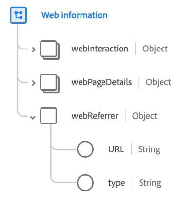

# [!UICONTROL Web information] gegevenstype

[!UICONTROL Web information] is een standaardgegevenstype van het Gegevensmodel van de Ervaring (XDM) dat informatie beschrijft die via een Gebeurtenis van de Ervaring wordt geregistreerd die voor het World Wide Web kanaal, met inbegrip van de Web-pagina, de verwijzer, en/of de verbinding met betrekking tot de op-pagina interactie specifiek is.

| Eigenschap | Gegevenstype | Beschrijving |
| --- | --- | --- |
| `webInteraction` | [[!UICONTROL Web interaction]](./web-interaction.md) | Beschrijft de details over de Webverbinding of URL die aan de interactie beantwoordt. |
| `webPageDetails` | [[!UICONTROL Web page details]](./webpage-details.md) | Beschrijft de details over de Web-pagina waar de Webinteractie voorkwam. |
| `webReferrer` | [!UICONTROL Object] | Beschrijft de referentie van een Webinteractie, die URL is een bezoeker van onmiddellijk vóór de huidige Webinteractie kwam werd geregistreerd. Bevat de volgende subeigenschappen: <ul><li>`URL`: De referentie-URL.</li><li>`type`: Het verwijzingstype.</li></ul> |

{style=&quot;table-layout:auto&quot;}

Raadpleeg de openbare XDM-opslagplaats voor meer informatie over het gegevenstype:

* [Voorbeeld van vulling](https://github.com/adobe/xdm/blob/master/components/datatypes/web/webinfo.example.1.json)
* [Volledig schema](https://github.com/adobe/xdm/blob/master/components/datatypes/web/webinfo.schema.json)
