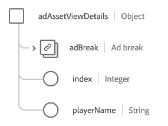

# [!UICONTROL Advertising Details] schemaveldgroep

[!UICONTROL Advertising Details] is een standaardgroep van het schemagebied voor de [[!DNL XDM ExperienceEvent]  klasse &#x200B;](../../classes/experienceevent.md). De veldgroep biedt één `advertising` -object aan een schema dat informatie vastlegt over advertenties, doorklikbewerkingen en attributie.

| Eigenschap | Gegevenstype | Beschrijving |
| --- | --- | --- |
| `adAssetReference` | Object | Hiermee legt u elementgegevens over de advertentie vast. Zie de [&#x200B; onderafdeling hieronder &#x200B;](#adAssetReference) voor meer informatie over de structuur van dit voorwerp. |
| `adAssetViewDetails` | Object | Hiermee legt u weergavedetails voor het afspelen van de advertentie vast. Zie de [&#x200B; onderafdeling hieronder &#x200B;](#adAssetViewDetails) voor meer informatie over de structuur van dit voorwerp. |
| `adViewability` | Object | Vangt het aantal beelden die door eind - gebruikers zoals spelervolume, bibliotheekversie, vensterstatus, en de afmetingen van de advertentiepoort worden gezien. Zie de [&#x200B; onderafdeling hieronder &#x200B;](#adViewability) voor meer informatie over de structuur van dit voorwerp. |
| `clicks` | [[!UICONTROL Measure]](../../data-types/measure.md) | Het aantal klikhandelingen op de advertentie. |
| `completes` | [[!UICONTROL Measure]](../../data-types/measure.md) | Het aantal keren dat een getimed media-element is gecontroleerd tot voltooiing. Dit betekent niet noodzakelijkerwijs dat de eindgebruiker de hele video heeft bekeken omdat deze mogelijk vooruit is overgeslagen. |
| `conversions` | [[!UICONTROL Measure]](../../data-types/measure.md) | Het aantal keren dat een vooraf gedefinieerde actie (of acties) een gebeurtenis voor prestatiebeoordeling heeft geactiveerd. |
| `federated` | [[!UICONTROL Measure]](../../data-types/measure.md) | Geeft aan of een ervaringsgebeurtenis is gemaakt via gegevensfederatie, zoals het delen van gegevens tussen klanten. |
| `firstQuartiles` | [[!UICONTROL Measure]](../../data-types/measure.md) | Het aantal keren dat een digitale video die 25% van zijn duur bij normale snelheid heeft gespeeld. |
| `impressions` | [[!UICONTROL Measure]](../../data-types/measure.md) | Het aantal advertenties dat naar een eindgebruiker wordt verzonden met het potentieel om te worden bekeken. |
| `midpoints` | [[!UICONTROL Measure]](../../data-types/measure.md) | Het aantal keren dat een digitale video die 50% van zijn duur bij normale snelheid heeft gespeeld. |
| `starts` | [[!UICONTROL Measure]](../../data-types/measure.md) | Het aantal keren dat een digitale video is afgespeeld. |
| `thirdQuartiles` | [[!UICONTROL Measure]](../../data-types/measure.md) | Het aantal keren dat een digitale video die 75% van zijn duur bij normale snelheid heeft gespeeld. |
| `timePlayed` | [[!UICONTROL Measure]](../../data-types/measure.md) | De hoeveelheid tijd die door een eindgebruiker aan een specifiek getimed media middel wordt doorgebracht. |
| `downloadedPlayback` | Boolean | Wanneer ingesteld op `true` , geeft dit aan dat de hit wordt gegenereerd als gevolg van het afspelen van een gedownloade advertentiesessie. |

{style="table-layout:auto"}

## `adAssetReference` {#adAssetReference}

Met het `adAssetReference` -object wordt elementinformatie over de advertentie vastgelegd.

| Eigenschap | Gegevenstype | Beschrijving |
| --- | --- | --- |
| `_dc.title` | String | De vriendelijke en leesbare naam van het advertentiemiddel. |
| `_xmpDM.duration` | Geheel | De lengte of duur van het element in seconden. |
| `_id` | String | Een uniek herkenningsteken van het advertentiemiddel, na de [&#x200B; norm Ad-ID &#x200B;](https://datatracker.ietf.org/doc/html/rfc8107). |
| `advertiser` | String | De onderneming of het merk waarvan het product in de advertentie wordt vermeld. |
| `campaign` | String | De id van de advertentiecampagne. |
| `creativeID` | String | De id van de advertentie. |
| `creativeURL` | String | De URL van de advertentie. |
| `placementID` | String | De plaatsing-id van de advertentie. |
| `siteID` | String | De id van de advertentiesite. |

{style="table-layout:auto"}

## `adAssetViewDetails` {#adAssetViewDetails}

Met het `adAssetViewDetails` -object worden weergavedetails voor het afspelen van de advertentie vastgelegd.

| Eigenschap | Gegevenstype | Beschrijving |
| --- | --- | --- |
| `adBreak` | [[!UICONTROL Ad break]](../../data-types/ad-break.md) | Beschrijft hoe een getimed advertentie in getimed media wordt opgenomen. |
| `index` | Geheel | De index van de advertentie binnen het bovenliggende element en het einde. De eerste advertentie heeft bijvoorbeeld index `0` en de tweede advertentie heeft index `1` . |
| `playerName` | String | De naam van de speler die verantwoordelijk is voor het renderen van de advertentie. |

{style="table-layout:auto"}

## `adViewability` {#adViewability}

Met het `adViewability` -object wordt het aantal indrukken vastgelegd dat eindgebruikers kunnen zien, zoals spelervolume, bibliotheekversie, vensterstatus en viewportafmetingen.

| Eigenschap | Gegevenstype | Beschrijving |
| --- | --- | --- |
| `implementationDetails` | [[!UICONTROL Implementation details]](../../data-types/implementation-details.md) | De naam en versie van de bibliotheek die van instrumenten worden voorzien om viewability metrics te meten. |
| `measuredAdNotVisible` | [[!UICONTROL Measure]](../../data-types/measure.md) | Geeft aan dat de advertentie niet zichtbaar is zoals deze wordt gemeten door een weergavebibliotheek op het moment dat de advertentie wordt weergegeven. |
| `measuredMuted` | [[!UICONTROL Measure]](../../data-types/measure.md) | Geeft aan dat de advertentie wordt gedempt zoals deze wordt gemeten in een weergavebibliotheek op het moment van de impositie. |
| `unmeasurableIframe` | [[!UICONTROL Measure]](../../data-types/measure.md) | Geeft aan dat de advertentie wordt weergegeven in een inactief venster, zoals wordt gemeten door een weergavebibliotheek tijdens het weergeven. |
| `unmeasurableOther` | [[!UICONTROL Measure]](../../data-types/measure.md) | Geeft aan dat de weergavebibliotheek metingen niet correct kan uitvoeren omdat de advertentie in een iframe wordt weergegeven. |
| `viewabilityEligibleImpressions` | [[!UICONTROL Measure]](../../data-types/measure.md) | De indruk(en) van een advertentie aan een eindgebruiker met een weergavebibliotheek van instrumenten voorzien. |
| `viewabilityCompletes` | [[!UICONTROL Measure]](../../data-types/measure.md) | Voltooiing(en) van een advertentie aan een eindgebruiker die op het moment van voltooiing kan worden bekeken door een bibliotheek voor de zichtbaarheid. |
| `viewableFirstQuartiles` | [[!UICONTROL Measure]](../../data-types/measure.md) | Eerste kwartiel(s) van een advertentie aan een eindgebruiker die in het eerste kwartiel van het spel door een zichtbaarheidsbibliotheek kan worden bekeken. |
| `viewableImpressions` | [[!UICONTROL Measure]](../../data-types/measure.md) | Impressies van een advertentie op een eindgebruiker die na twee seconden afspelen door een weergavebibliotheek als zichtbaar wordt beschouwd. |
| `viewableMidpoints` | [[!UICONTROL Measure]](../../data-types/measure.md) | Middelpunt(en) van een advertentie voor een eindgebruiker die door een zichtbaarheidsbibliotheek op het middelpunt van het spel kan worden bekeken. |
| `viewableThirdQuartiles` | [[!UICONTROL Measure]](../../data-types/measure.md) | Derde kwartiel(s) van een advertentie aan een eindgebruiker die in een derde kwartiel van het spel kan worden bekeken door middel van een weergavebibliotheek. |
| `activeWindow` | Boolean | Geeft aan of de advertentie is weergegeven in het actieve venster van het apparaat van de gebruiker. |
| `adHeight` | Geheel | Het aantal verticale pixels van de speler, gemeten bij uitvoering. Dit kan groter zijn dan de grootte van de advertentie als de speler extra besturingselementen of miniaturen heeft. |
| `adUnitDepth` | Geheel | Uitgevers kunnen advertentie-eenheden insluiten in containers (iFrames) om de toegang van de advertentie te beperken tot alleen de code van de pagina. Deze waarde beschrijft hoeveel containers de advertentie-eenheid binnen van wordt getoond. |
| `adWidth` | Geheel | Het aantal horizontale pixels van de speler, gemeten bij uitvoering. Dit kan groter zijn dan de grootte van de advertentie als de speler extra besturingselementen of miniaturen heeft. |
| `measurementEligible` | Boolean | Of de advertentie al dan niet in aanmerking kwam voor een zichtbaarheidsmeting. Een advertentie is subsidiabel als de eenheid een ondersteunde creatieve indeling en type tag heeft. |
| `percentViewable` | Geheel | Het percentage pixels in de advertentie dat tijdens het meten zichtbaar werd geacht. |
| `playerVolume` | Geheel | Het volumepercentage van de speler zoals tijdens runtime wordt gemeten, waarbij `0` wordt gedempt en `100` het maximale volume is. |
| `viewable` | Boolean | Geeft aan of de advertentie kan worden weergegeven bij uitvoering. Weergaveadvertenties worden als zichtbaar beschouwd wanneer ten minste 50% van de advertentie gedurende ten minste één seconde zichtbaar is. Videoadvertenties worden als zichtbaar beschouwd wanneer ten minste 50% van de advertentie zichtbaar is terwijl de video ten minste twee opeenvolgende seconden wordt afgespeeld. |
| `viewportHeight` | Geheel | De verticale grootte (in pixels) van het venster dat tijdens de runtime werd weergegeven. Voor een webweergavegebeurtenis geeft deze waarde de hoogte van de viewport van de browser aan. |
| `viewportWidth` | Geheel | De horizontale grootte (in pixels) van het venster dat tijdens de runtime werd weergegeven. Voor een webweergavegebeurtenis geeft deze waarde de breedte van de viewport van de browser aan. |

{style="table-layout:auto"}

Voor meer details op de gebiedsgroep, verwijs naar de [&#x200B; openbare bewaarplaats XDM &#x200B;](https://github.com/adobe/xdm/blob/master/components/fieldgroups/experience-event/experienceevent-advertising.schema.json).
