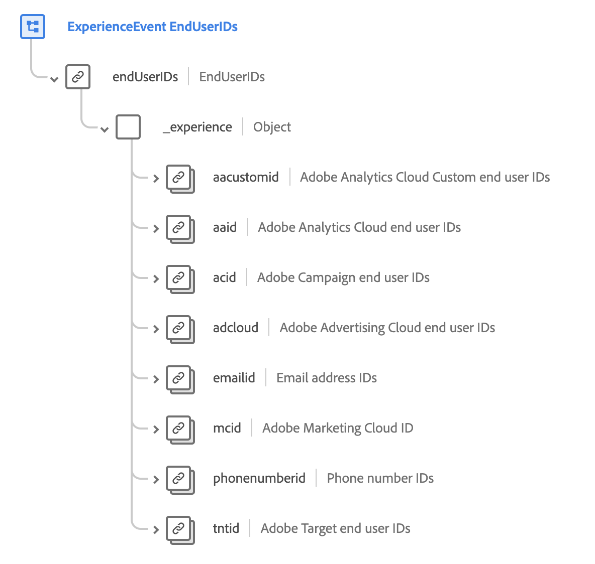

# [!UICONTROL End User ID Details] schemaveldgroep

>[!NOTE]
>
>De namen van verschillende groepen schemavelden zijn gewijzigd. Zie het document op [ de naamupdates van de gebiedsgroep ](../name-updates.md) voor meer informatie.

[!UICONTROL End User ID Details] is een standaardgroep van het schemagebied voor de [[!DNL XDM ExperienceEvent]  klasse ](../../classes/experienceevent.md), die wordt gebruikt om de identiteitsinformatie van een individu over verscheidene toepassingen van Adobe te beschrijven. De veldgroep biedt een `endUserIDs` -object op hoofdniveau dat zelf een `_experience` -veld met het kenmerk Alleen-lezen bevat waarvan de waarden automatisch worden bijgewerkt terwijl er gegevens worden ingevoerd.

{width=700}

| Eigenschap | Gegevenstype | Beschrijving |
| --- | --- | --- |
| `aacustomid` | [ Identiteit ](../../data-types/identity.md) | Aangepaste eindgebruiker-id&#39;s voor Adobe Analytics Cloud. |
| `aaid` | [ Identiteit ](../../data-types/identity.md) | Eindgebruiker-id&#39;s voor Adobe Analytics Cloud. |
| `acid` | [ Identiteit ](../../data-types/identity.md) | Eindgebruiker-id&#39;s voor Adobe Campaign. |
| `adcloud` | [ Identiteit ](../../data-types/identity.md) | Eindgebruiker-id&#39;s voor Adobe Advertising. |
| `emailid` | [ Identiteit ](../../data-types/identity.md) | E-mailadres-id&#39;s. |
| `mcid` | [ Identiteit ](../../data-types/identity.md) | Adobe Marketing Cloud-id (MCID). De MCID wordt nu de Experience Cloud-id (ECID) genoemd. |
| `phonenumberid` | [ Identiteit ](../../data-types/identity.md) | Telefoonnummer-id&#39;s. |
| `tntid` | [ Identiteit ](../../data-types/identity.md) | Eindgebruiker-id&#39;s voor Adobe Target. |

{style="table-layout:auto"}

Raadpleeg de openbare XDM-opslagplaats voor meer informatie over de veldgroep:

* [ Bevolkt voorbeeld ](https://github.com/adobe/xdm/blob/master/components/fieldgroups/experience-event/experienceevent-enduserids.example.1.json)
* [ Volledig schema ](https://github.com/adobe/xdm/blob/master/components/fieldgroups/experience-event/experienceevent-enduserids.schema.json)
