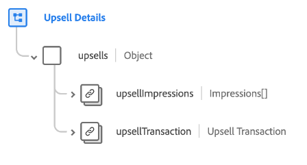

# [!UICONTROL Upsell Details] schemaveldgroep

[!UICONTROL Upsell Details] is een standaardschemagebiedgroep voor de  [[!DNL XDM ExperienceEvent] ](../../classes/experienceevent.md) klasse die wordt gebruikt om informatie betreffende een upsell marketing gebeurtenis, met inbegrip van details over de transactie en de verschillende manieren te vangen de aanbieding aan een klant werd getoond.

De veldgroep bevat één objecttype veld, `upsells`. De eigenschappen in dit object worden hieronder uitgelegd.

| Eigenschap | Gegevenstype | Beschrijving |
| --- | --- | --- |
| `upsellImpressions` | Array van [Impressies](../../data-types/impressions.md) | Een array die de opgenomen indrukken (digitale weergaven of overeenkomsten met de upsellaanbieding) voor de klant opsomt. |
| `upsellTransaction` | [Transactie](../../data-types/transaction.md) | Beschrijft de valutatransactie voor upsell. |

{style=&quot;table-layout:auto&quot;}

Raadpleeg de openbare XDM-opslagplaats voor meer informatie over de veldgroep:

* [Voorbeeld van vulling](https://github.com/adobe/xdm/blob/master/components/fieldgroups/experience-event/industry-verticals/experienceevent-upsell-details.example.1.json)
* [Volledig schema](https://github.com/adobe/xdm/blob/master/components/fieldgroups/experience-event/industry-verticals/experienceevent-upsell-details.schema.json)
