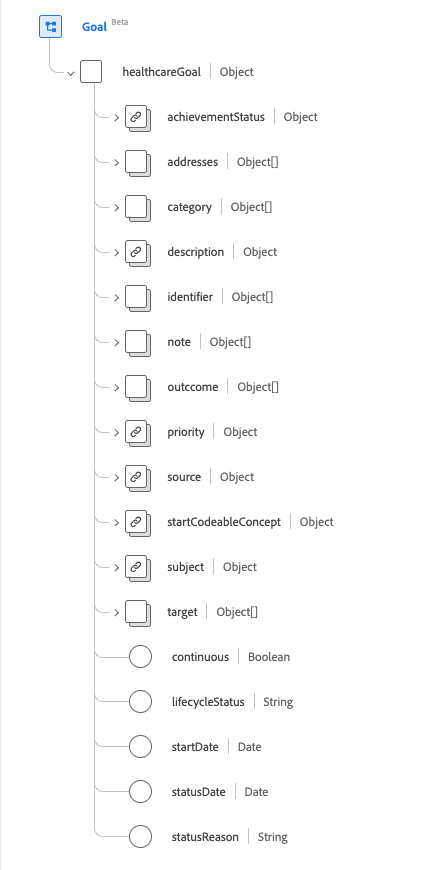
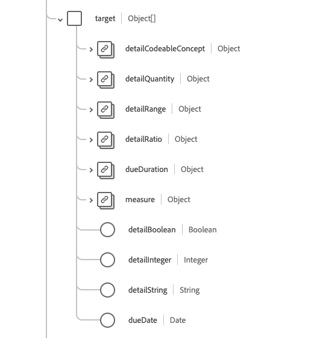

# [!UICONTROL Goal] schemaveldgroep

[!UICONTROL Goal] is een standaardgroep van het schemagebied voor de [[!DNL XDM Individual Profile]  klasse ](../../classes/individual-profile.md) en [[!DNL Provider class]](../../classes/provider.md). Het biedt één objecttype veld `healthcareGoal` waarin de beoogde doelstelling(en) voor een patiënt, groep of organisatie wordt beschreven.

| Weergavenaam | Eigenschap | Gegevenstype | Beschrijving |
| --- | --- | --- | --- |
| [!UICONTROL Achievment Status] | `achievementStatus` | [[!UICONTROL Codeable Concept]](../../data-types/healthcare/codeable-concept.md) | Beschrijft de vooruitgang, of het gebrek daarvan, in de richting van het doel tegen het doel. |
| [!UICONTROL Addresses] | `addresses` | Array van [[!UICONTROL Reference]](../../data-types/healthcare/reference.md) | De voorwaarden en andere elementen van het gezondheidsdossier die door het doel moeten worden aangepakt. |
| [!UICONTROL Category] | `category` | Array van [[!UICONTROL Codeable Concept]](../../data-types/healthcare/codeable-concept.md) | Geeft een categorie aan waarin het doel valt, zoals dieet of gedrag. |
| [!UICONTROL Description] | `description` | [[!UICONTROL Codeable Concept]](../../data-types/healthcare/codeable-concept.md) | De code of tekst die het doel beschrijft. |
| [!UICONTROL Identifier] | `identifier` | Array van [[!UICONTROL Identifier]](../../data-types/healthcare/identifier.md) | De bedrijfs herkenningstekens die aan dit doel door de uitvoerder of andere systemen worden toegewezen die constant blijven aangezien het middel wordt bijgewerkt en van server aan server verspreidt. |
| [!UICONTROL Note] | `note` | Array van [[!UICONTROL Annotation]](../../data-types/healthcare/annotation.md) | Opmerkingen over het doel. |
| [!UICONTROL Outcome] | `outcome` | Array van [[!UICONTROL Codeable Reference]](../../data-types/healthcare/codeable-reference.md) | Hiermee wordt de wijziging (of het gebrek aan verandering) aangegeven wanneer de status van het doel wordt beoordeeld. |
| [!UICONTROL Priority] | `priority` | [[!UICONTROL Codeable Concept]](../../data-types/healthcare/codeable-concept.md) | Hiermee wordt aangegeven welk niveau van belang onderling is overeengekomen voor het bereiken of ondersteunen van het doel. |
| [!UICONTROL Source] | `source` | [[!UICONTROL Reference]](../../data-types/healthcare/reference.md) | Geeft de bron van het doel aan, zoals de patiënt of de arts. |
| [!UICONTROL Start Codeable Concept] | `startCodeableConcept` | [[!UICONTROL Codeable Concept]](../../data-types/healthcare/codeable-concept.md) | De gebeurtenis waarna het doel moet worden bereikt. |
| [!UICONTROL Subject |]`subject` | [[!UICONTROL Reference]](../../data-types/healthcare/reference.md) | Identificeert de patiënt, groep of organisatie waarvoor het doel wordt vastgesteld. |
| [!UICONTROL Target] | `target` | Array van objecten | Geeft de tijdlijn aan van specifieke stappen in het doel. Zie de [ sectie hieronder ](#target) voor meer informatie. |
| [!UICONTROL Continous] | `continous` | Boolean | Geeft aan of er na het bereiken van het doel doorlopende activiteit nodig is om het doel te ondersteunen. |
| [!UICONTROL Lifecycle Status] | `lifecycleStatus` | String | De status van de levenscyclus van het doel. De waarde van deze eigenschap moet gelijk zijn aan een van de volgende bekende opsommingswaarden. <li> `proposed` </li> <li> `planned` </li> <li> `accepted` </li> <li> `active` </li> <li> `on-hold` </li> <li> `completed` </li> <li> `cancelled` </li> <li> `entered-in-error` </li> <li> `rejected` </li> |
| [!UICONTROL Start Date] | `startDate` | Datum | De datum waarna het doel moet worden nagestreefd. |
| [!UICONTROL Status Date] | `statusDate` | Datum | Identificeert wanneer de status is gemaakt. |
| [!UICONTROL Status Reason] | `statusReason` | String | Hiermee legt u de reden voor de huidige status vast. |

Raadpleeg de openbare XDM-opslagplaats voor meer informatie over de veldgroep:

* [ Bevolkt voorbeeld ](https://github.com/adobe/xdm/blob/master/extensions/industry/healthcare/fhir/fieldgroups/goal.example.1.json)
* [ Volledig schema ](https://github.com/adobe/xdm/blob/master/extensions/industry/healthcare/fhir/fieldgroups/goal.example.1.json)

## `target` {#target}

`target` wordt opgegeven als een array van objecten. De structuur van elk object wordt hieronder beschreven.

| Weergavenaam | Eigenschap | Gegevenstype | Beschrijving |
| --- | --- | --- | --- |
| [!UICONTROL Detail Codeable Concept] | `detailCodeableConcept` | [[!UICONTROL Codeable Concept]](../../data-types/healthcare/codeable-concept.md) | De doelcode die moet worden bereikt om aan te geven dat het doel is bereikt. |
| [!UICONTROL Detail Quantity] | `detailQuantity` | [[!UICONTROL Quantity]](../../data-types/healthcare/quantity.md) | De streefhoeveelheid die moet worden bereikt om aan te geven dat het doel is bereikt. |
| [!UICONTROL Detail Range] | `detailRange` | [[!UICONTROL Range]](../../data-types/healthcare/range.md) | Het streefbereik dat moet worden bereikt om aan te geven dat het doel is bereikt. |
| [!UICONTROL Detail Ratio] | `detailRatio` | [[!UICONTROL Ratio]](../../data-types/healthcare/ratio.md) | De streefverhouding die moet worden bereikt om aan te geven dat het doel is bereikt. |
| [!UICONTROL Measure] | `measure` | [[!UICONTROL Codeable Concept]](../../data-types/healthcare/codeable-concept.md) | De parameter die waarde heeft, wordt bijgehouden. |
| [!UICONTROL Detail Boolean] | `detailBoolean` | Boolean | Geeft aan of het doel is bereikt. |
| [!UICONTROL Detail Integer] | `detailInteger` | Geheel | Het streefnummer dat moet worden bereikt om aan te geven dat het doel is bereikt. |
| [!UICONTROL Detail String] | `detailString` | String | De streefwaarde die moet worden bereikt om aan te geven dat het doel is bereikt. |
| [!UICONTROL Due Date] | `dueDate` | Datum | De datum waarop het streefcijfer moet worden gehaald. |
