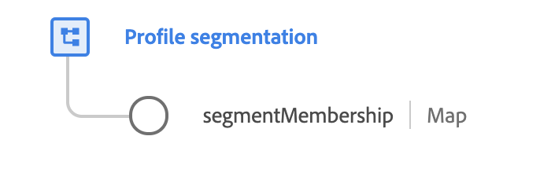

# [!UICONTROL Segment Membership Details] schemaveldgroep

>[!NOTE]
>
>De namen van verschillende groepen schemavelden zijn gewijzigd. Zie het document op [ de naamupdates van de gebiedsgroep ](../name-updates.md) voor meer informatie.

[!UICONTROL Segment Membership Details] is een standaardgroep van het schemagebied voor de [[!DNL XDM Individual Profile]  klasse ](../../classes/individual-profile.md). De gebiedsgroep verstrekt één enkel kaartgebied dat informatie betreffende segmentlidmaatschap, met inbegrip van welke segmenten het individu tot, de laatste kwalificatietijd behoort, en wanneer het lidmaatschap geldig tot is.

>[!WARNING]
>
>Hoewel het veld `segmentMembership` handmatig aan het profielschema moet worden toegevoegd met behulp van deze veldgroep, mag u niet handmatig proberen dit veld te vullen of bij te werken. Het systeem werkt automatisch de `segmentMembership` -kaart voor elk profiel bij terwijl segmentatietaken worden uitgevoerd.

<br />

| Eigenschap | Gegevenstype | Beschrijving |
| --- | --- | --- |
| `segmentMembership` | Kaart | A map object that describes the individu&#39;s segment membership. De structuur van dit object wordt hieronder in detail beschreven. |

{style="table-layout:auto"}

Hier volgt een voorbeeld van een `segmentMembership` -kaart die door het systeem is gevuld voor een bepaald profiel. Segmentlidmaatschappen worden gesorteerd op naamruimte, zoals aangegeven door de sleutels op hoofdniveau van het object. De afzonderlijke sleutels onder elke naamruimte vertegenwoordigen vervolgens de id&#39;s van de segmenten waarvan het profiel lid is. Elk segmentobject bevat verschillende subvelden met meer informatie over het lidmaatschap:

```json
{
  "xdm:segmentMembership": {
    "AAM": {
      "04a81716-43d6-4e7a-a49c-f1d8b3129ba9": {
        "xdm:version": "15",
        "xdm:lastQualificationTime": "2018-04-26T15:52:25+00:00",
        "xdm:validUntil": "2019-04-26T15:52:25+00:00",
        "xdm:status": "realized",
        "xdm:payload": {
          "xdm:payloadBooleanValue": true,
          "xdm:payloadType": "boolean"
        }
      },
      "53cba6b2-a23b-454a-8069-fc41308f1c0f": {
        "xdm:version": "3",
        "xdm:lastQualificationTime": "2018-04-26T15:52:25+00:00",
        "xdm:validUntil": "2018-04-27T15:52:25+00:00",
        "xdm:status": "realized",
        "xdm:payload": {
          "xdm:payloadPropensityValue": 0.5,
          "xdm:payloadType": "propensity"
        }
      }
    },
    "Email": {
      "abcd@adobe.com": {
        "xdm:version": "1",
        "xdm:lastQualificationTime": "2017-09-26T15:52:25+00:00",
        "xdm:validUntil": "2017-12-26T15:52:25+00:00",
        "xdm:status": "exited"
      }
    }
  }
}
```

| Eigenschap | Beschrijving |
| --- | --- |
| `xdm:version` | De versie van het segment waarvoor dit profiel in aanmerking kwam. |
| `xdm:lastQualificationTime` | Een tijdstempel van de laatste keer dat dit profiel voor het segment kwalificeerde. |
| `xdm:validUntil` | Een tijdstempel waarin wordt aangegeven wanneer het segmentlidmaatschap niet langer geldig is. Voor externe doelgroepen geldt dat als dit veld niet is ingesteld, het segmentlidmaatschap slechts 30 dagen na `lastQualificationTime` behouden blijft. |
| `xdm:status` | Een koordgebied dat erop wijst of het segmentlidmaatschap als deel van het huidige verzoek is gerealiseerd. De volgende waarden worden geaccepteerd: <ul><li>`realized`: Het profiel komt voor het segment in aanmerking.</li><li>`exited`: Het profiel sluit het segment af als onderdeel van de huidige aanvraag.</li></ul> |
| `xdm:payload` | Sommige segmentlidmaatschappen omvatten een lading die extra waarden beschrijft die direct met het lidmaatschap verband houden. Voor elk lidmaatschap kan slechts één lading van een bepaald type worden verstrekt. `xdm:payloadType` geeft het type lading aan (`boolean`, `number`, `propensity`, of `string`), terwijl zijn eigenschap sibling de waarde voor het ladingstype verstrekt. |

{style="table-layout:auto"}

>[!NOTE]
>
>Elk segmentlidmaatschap dat meer dan 30 dagen in de `exited` -status is, gebaseerd op `lastQualificationTime` , wordt verwijderd.

Raadpleeg de openbare XDM-opslagplaats voor meer informatie over de veldgroep:

* [ Bevolkt voorbeeld ](https://github.com/adobe/xdm/blob/master/components/fieldgroups/profile/profile-personal-details.example.1.json)
* [ Volledig schema ](https://github.com/adobe/xdm/blob/master/components/fieldgroups/profile/profile-personal-details.schema.json)
