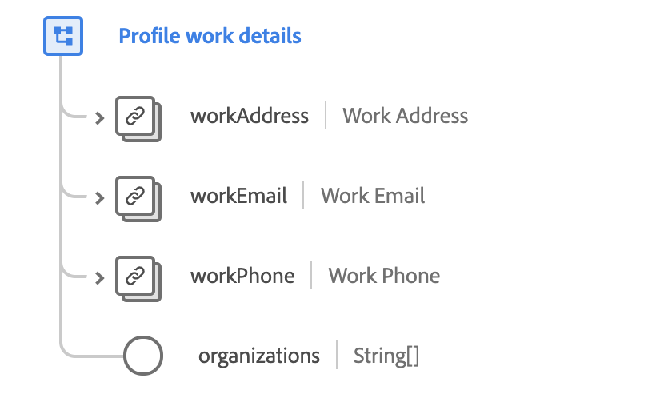

# [!UICONTROL Contactgegevens] voor werk, mixen

>[!NOTE]
>
>De namen van verschillende mengsels zijn gewijzigd. Zie het document over de updates [van de](../name-updates.md) mixnaam voor meer informatie.

[!UICONTROL De Details] van het Contact van het werk is een standaardmengeling voor de [[!DNL XDM Individual Profile] klasse](../../classes/individual-profile.md). De mix biedt verschillende velden waarin bedrijfsinformatie over een individuele persoon wordt vastgelegd, zoals het werkadres, het werkbericht, het telefoonnummer van de werktelefoon en de organisaties waartoe de persoon behoort.

 

| Eigenschap | Gegevenstype | Beschrijving |
| --- | --- | --- |
| `workAddress` | [Postadres](../../data-types/postal-address.md) | Beschrijft het het werkadres van de persoon. |
| `workEmail` | [E-mailadres](../../data-types/email-address.md) | Beschrijft het het werk e-mailadres van de persoon. |
| `workPhone` | [Telefoonnummer](../../data-types/phone-number.md) | Beschrijft het het het werktelefoonnummer van de persoon. |
| `organizations` | String (Array) | Een array van vrije-vormreeksen die de organisaties vertegenwoordigen waarvan de persoon lid is. |

Raadpleeg de openbare XDM-opslagplaats voor meer informatie over de mix:

* [Voorbeeld van vulling](https://github.com/adobe/xdm/blob/master/components/mixins/profile/profile-work-details.example.1.json)
* [Volledig schema](https://github.com/adobe/xdm/blob/master/components/mixins/profile/profile-work-details.schema.json)