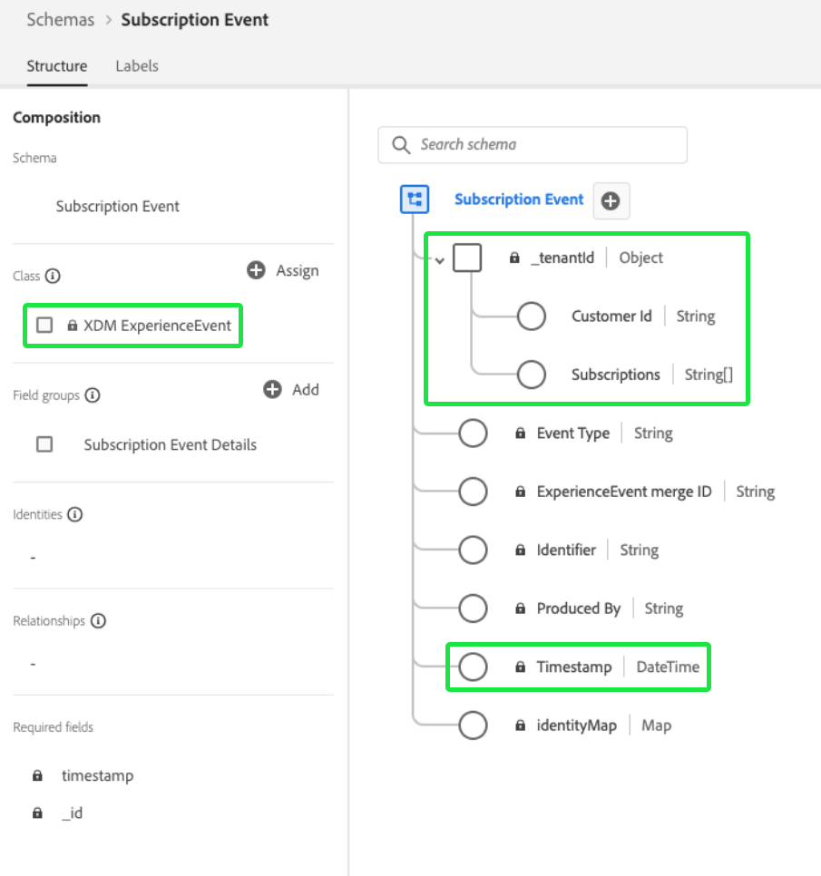
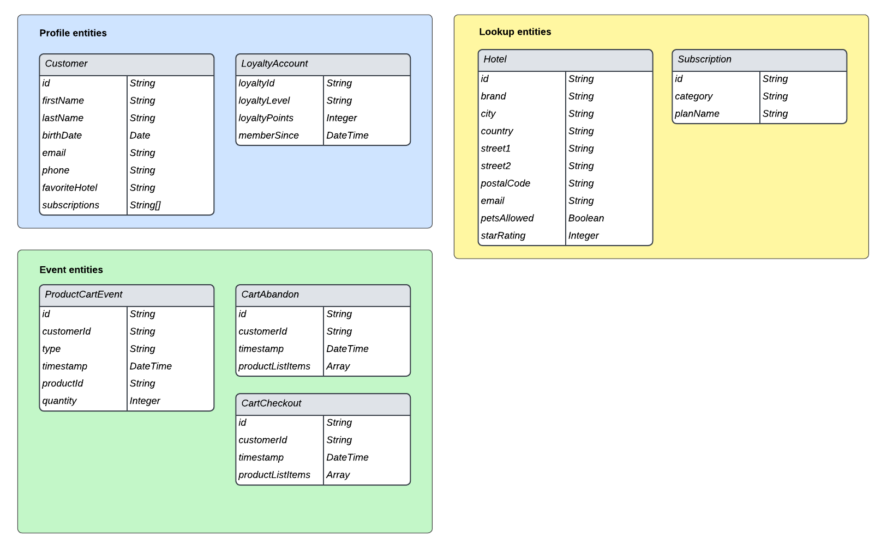

# Aanbevolen procedures voor gegevensmodellering in Adobe Experience Platform

[!DNL Experience Data Model] (XDM) is het kernkader dat de gegevens van de klantenervaring door gemeenschappelijke structuren en definities voor gebruik in de stroomafwaartse diensten van Adobe Experience Platform te verstrekken gestandaardiseerd. Door zich aan de normen van XDM te houden, kunnen alle gegevens van de klantenervaring in een gemeenschappelijke vertegenwoordiging worden opgenomen die u toestaat om waardevolle inzichten van klantenacties te bereiken, klantenpubliek door segmenten te bepalen, en klantenattributen voor verpersoonlijkingsdoeleinden uit te drukken.

Aangezien XDM uiterst veelzijdig en aanpasbaar door ontwerp is, is het daarom belangrijk om beste praktijken voor gegevensmodellering te volgen wanneer het ontwerpen van uw schema&#39;s. Dit document behandelt de belangrijkste besluiten en overwegingen u moet maken wanneer het in kaart brengen van uw gegevens van de klantenervaring aan XDM.

## Aan de slag

Voordat u deze handleiding leest, moet u het [XDM System-overzicht](../home.md) bekijken voor een introductie op hoog niveau van XDM en de rol ervan in het Experience Platform.

Bovendien concentreert deze gids zich uitsluitend op zeer belangrijke overwegingen betreffende schemaontwerp. Daarom wordt sterk geadviseerd dat u naar de [grondbeginselen van schemacompositie](./composition.md) voor gedetailleerde verklaringen van de individuele schemaelementen verwijst die door deze gids worden vermeld.

## Overzicht van best practices

De aanbevolen aanpak voor het ontwerpen van uw gegevensmodel voor gebruik in Experience Platform kan als volgt worden samengevat:

1. Begrijp de zaken van het bedrijfsgebruik voor uw gegevens.
1. Identificeer de primaire gegevensbronnen die moeten worden aangesproken [!DNL Platform] om die gebruiksgevallen te behandelen.
1. Identificeer om het even welke secundaire gegevensbronnen die ook van belang zouden kunnen zijn. Bijvoorbeeld, als momenteel slechts één bedrijfseenheid in uw organisatie in het uitvoeren van hun gegevens aan geinteresseerd is, zou een gelijkaardige bedrijfseenheid ook in het uitvoeren van gelijkaardige gegevens in de toekomst kunnen geinteresseerd zijn. [!DNL Platform] Het overwegen van deze secundaire bronnen helpt het gegevensmodel over uw volledige organisatie te standaardiseren.
1. Creeer een diagram van de entiteitverhouding op hoog niveau (ERD) voor de gegevensbronnen die zijn geïdentificeerd.
1. Zet het ERD op hoog niveau om in een [!DNL Platform]centric ERD (inclusief profielen, Experience Events en lookup entities).

De stappen met betrekking tot het identificeren van de toepasselijke gegevensbronnen die worden vereist om uw zaken van het bedrijfsgebruik uit te voeren zullen van organisatie tot organisatie variëren. Hoewel de overige secties in dit document zich richten op de laatste stappen voor het organiseren en samenstellen van een ERD nadat de gegevensbronnen zijn geïdentificeerd, kunnen de toelichtingen bij de verschillende componenten van het diagram u informeren over de vraag naar welke van uw gegevensbronnen moet worden gemigreerd [!DNL Platform].

## Een ERD op hoog niveau maken

Zodra u de gegevensbronnen hebt bepaald u wilt brengen in [!DNL Platform], creeer een ERD op hoog niveau helpen het proces begeleiden om uw gegevens aan schema&#39;s toe te wijzen XDM.

In het onderstaande voorbeeld wordt een vereenvoudigde ERD voorgesteld voor een bedrijf dat gegevens in [!DNL Platform]het programma wil opnemen. Het diagram benadrukt de essentiële entiteiten die in klassen XDM, met inbegrip van klantenrekeningen, hotels, adressen, en verscheidene gemeenschappelijke e-commercegebeurtenissen zouden moeten worden gesorteerd.

## Entiteiten sorteren in profiel-, zoekopdracht- en gebeurteniscategorieën

Zodra u een ERD hebt gemaakt om de essentiële entiteiten te identificeren waarin u wilt opnemen [!DNL Platform], moeten deze entiteiten worden gesorteerd in profiel-, zoekopdracht- en gebeurtenissencategorieën:

| Categorie | Beschrijving |
| --- | --- |
| Profielentiteiten | Profielentiteiten vertegenwoordigen kenmerken die betrekking hebben op een individuele persoon, doorgaans een klant. Entiteiten die onder deze categorie vallen, moeten worden vertegenwoordigd door schema&#39;s die op de **[!DNL XDM Individual Profile]klasse** zijn gebaseerd. |
| Entiteiten opzoeken | Opzoekentiteiten zijn concepten die betrekking kunnen hebben op een individuele persoon, maar die niet rechtstreeks kunnen worden gebruikt om de persoon te identificeren. Entiteiten die onder deze categorie vallen, moeten worden vertegenwoordigd door schema&#39;s die op **aangepaste klassen** zijn gebaseerd. |
| Gebeurtenisentiteiten | Gebeurtenisentiteiten vertegenwoordigen concepten met betrekking tot acties die een klant kan uitvoeren, systeemgebeurtenissen of andere concepten waarbij u wijzigingen in de loop van de tijd wilt bijhouden. Entiteiten die onder deze categorie vallen, moeten worden vertegenwoordigd door schema&#39;s die op de **[!DNL XDM ExperienceEvent]klasse** zijn gebaseerd. |

### Overwegingen bij het sorteren van entiteiten

In de volgende secties vindt u meer informatie over het sorteren van entiteiten in de bovenstaande categorieën.

#### Klantkenmerken

Als een entiteit kenmerken bevat die betrekking hebben op een individuele klant, is het zeer waarschijnlijk een profielentiteit. Voorbeelden van klantkenmerken zijn:

* Persoonlijke gegevens zoals naam, geboortedatum, geslacht en account-id(s).
* Locatiegegevens zoals adressen en GPS-gegevens.
* Contactgegevens zoals telefoonnummers en e-mailadressen.

#### Gegevens bijhouden in de loop van de tijd

Als u wilt analyseren hoe bepaalde kenmerken binnen een entiteit in de loop der tijd veranderen, is het waarschijnlijk een gebeurtenisentiteit. Bijvoorbeeld, kan het toevoegen van productpunten aan een karretje als toe:voegen-aan-kartgebeurtenissen in worden gevolgd [!DNL Platform]:

| Klant-id | Type | Product-id | Aantal | Tijdstempel |
| --- | --- | --- | --- | --- |
| 1234567 | Toevoegen | 275098 | 2 | 1 okt. 10:32 |
| 1234567 | Verwijderen | 275098 | 1 | 1 okt. 10:33 |
| 1234567 | Toevoegen | 486502 | 1 | 1 okt. 10:41 |
| 1234567 | Toevoegen | 910482 | 5 | 3 okt. 14:15 |

#### Gebruiksgevallen voor segmentatie

Wanneer het categoriseren van uw entiteiten, is het belangrijk om over de publiekssegmenten te denken u kunt willen bouwen om uw bepaalde zaken van het bedrijfsgebruik te richten.

Een bedrijf wil bijvoorbeeld alle &quot;Gold&quot; of &quot;Platinum&quot; leden van zijn loyaliteitsprogramma kennen die het afgelopen jaar meer dan vijf aankopen hebben gedaan. Op basis van deze segmentlogica kunnen de volgende conclusies worden getrokken met betrekking tot de wijze waarop relevante entiteiten moeten worden vertegenwoordigd:

* &quot;Goud&quot; en &quot;Platinum&quot; staan voor de status van loyaliteit die van toepassing is op een individuele klant. Aangezien de segmentlogica slechts met de huidige loyaliteitsstatus van klanten bezig is, kunnen deze gegevens als deel van een profielschema worden gemodelleerd. Als u veranderingen in loyaliteitsstatus in tijd wilt volgen, kon u een extra gebeurtenisschema voor de veranderingen van de loyaliteitsstatus ook tot stand brengen.
* Aankopen zijn gebeurtenissen die zich op een bepaald tijdstip voordoen en de segmentlogica heeft betrekking op aankoopgebeurtenissen binnen een opgegeven tijdvenster. Deze gegevens moeten daarom als een gebeurtenisschema worden gemodelleerd.

#### Gebruiksgevallen activeren

Naast overwegingen met betrekking tot gevallen waarin segmentatie wordt gebruikt, moet u ook de activeringsgebruiksgevallen voor die segmenten bekijken om aanvullende relevante kenmerken te identificeren.

Bijvoorbeeld, heeft een bedrijf een publiekssegment gebouwd dat op de regel wordt gebaseerd die `country = US`. Vervolgens wil het bedrijf bij het activeren van dat segment naar bepaalde downstreamdoelen alle geëxporteerde profielen filteren op basis van de status van het land van herkomst. Daarom moet een `state` kenmerk ook in de toepasselijke profielentiteit worden vastgelegd.

#### Geaggregeerde waarden

Op basis van het gebruiksgeval en de granulariteit van uw gegevens moet u bepalen of bepaalde waarden vooraf moeten worden geaggregeerd voordat ze in een profiel of gebeurtenisentiteit worden opgenomen.

Een bedrijf wil bijvoorbeeld een segment bouwen op basis van het aantal winkels. U kunt ervoor kiezen deze gegevens op te nemen met de laagste granulariteit door elke aanschafgebeurtenis met een tijdstempel op te nemen als een eigen entiteit. Hierdoor kan het aantal opgenomen gebeurtenissen echter soms exponentieel toenemen. Om het aantal ingebedde gebeurtenissen te verminderen, kunt u verkiezen om een gezamenlijke waarde over een weeklange of maandperiode tot stand te brengen. `numberOfPurchases` Andere statistische functies zoals MIN en MAX kunnen ook op deze situaties van toepassing zijn.

>[!CAUTION]
>
>Experience Platform voert momenteel geen automatische waardecodering uit, hoewel dit voor toekomstige versies gepland is. Als u ervoor kiest om geaggregeerde waarden te gebruiken, moet u de berekeningen extern uitvoeren voordat u de gegevens naar [!DNL Platform]stuurt.

#### Kardinaal

De in uw ERD vastgestelde randvoorwaarden kunnen ook aanwijzingen geven over de manier waarop u uw entiteiten kunt indelen. Als er een een-op-veel relatie is tussen twee entiteiten, zal de entiteit die de &quot;velen&quot;vertegenwoordigt waarschijnlijk een gebeurtenisentiteit zijn. Er zijn echter ook gevallen waarin &quot;veel&quot; een set opzoekentiteiten is die als een array binnen een profielentiteit worden opgegeven.

>[!NOTE]
>
>Aangezien er geen universele aanpak bestaat om alle gevallen van gebruik te kunnen gebruiken, is het belangrijk om bij de indeling van entiteiten op basis van kardinaliteit rekening te houden met de voor- en nadelen van elke situatie. Zie de [volgende sectie](#pros-and-cons) voor meer informatie.

In de volgende tabel worden enkele gemeenschappelijke entiteitsrelaties en de categorieën beschreven die daaruit kunnen worden afgeleid:

| Relatie | Kardinaal | Categorieën entiteiten |
| --- | --- | --- |
| Klanten en winkelwagentjes | Eén naar vele | Eén klant kan veel winkelwagentjes hebben, dit zijn gebeurtenissen die in de loop der tijd kunnen worden bijgehouden. Klanten zouden daarom een profielentiteit zijn, terwijl winkelwagentjes een gebeurtenisentiteit zouden zijn. |
| Klanten en klantenaccounts | Eén op één | Één enkele klant kan slechts één loyaliteitsrekening hebben, en vice versa. Aangezien de relatie één-op-één is, vertegenwoordigen zowel Klanten als Loyalty&#39;s profielentiteiten. |
| Klanten en abonnementen | Eén naar vele | Eén klant kan vele abonnementen hebben. Aangezien het bedrijf slechts met de huidige abonnementen van een klant betrokken is, zijn de Klanten een profielentiteit, terwijl de Abonnementen een raadplegingsentiteit is. |

### Pros en cons van verschillende entiteitsklassen {#pros-and-cons}

Hoewel het vorige gedeelte enkele algemene richtlijnen bevatte om te bepalen hoe u uw entiteiten kunt indelen, is het belangrijk te begrijpen dat er vaak voor- en nadelen zijn bij het kiezen van een categorie entiteiten in plaats van een andere categorie. In het volgende casestudy ziet u hoe u in deze situaties rekening kunt houden met uw opties.

Een bedrijf volgt actieve abonnementen voor hun klanten, waar één klant vele abonnementen kan hebben. Het bedrijf wil ook abonnementen voor segmentgebruiksgevallen, zoals het vinden van alle gebruikers met actieve abonnementen omvatten.

In dit scenario, heeft het bedrijf twee potentiële opties om de abonnementen van een klant in hun gegevensmodel te vertegenwoordigen:

1. [Profielkenmerken gebruiken](#profile-approach)
1. [Gebeurtenisentiteiten gebruiken](#event-approach)

#### Aanpak 1: Profielkenmerken gebruiken {#profile-approach}

De eerste benadering zou zijn om een array van abonnementen als attributen binnen de profielentiteit voor Klanten te omvatten. Objecten in deze array bevatten velden voor `category`, `status`, `planName`, `startDate`en `endDate`.

 

**Pros**

* Segmentering is haalbaar voor het beoogde gebruik.
* Het schema zal slechts de recentste abonnementsverslagen voor een klant bewaren.

**Cons**

* De volledige array moet worden aangepast telkens wanneer er wijzigingen optreden in een veld in de array.
* Als verschillende gegevensbronnen of bedrijfseenheden gegevens in de array invoeren, wordt het lastig om de meest recente bijgewerkte array te synchroniseren via alle kanalen.

#### Benadering 2: Gebeurtenisentiteiten gebruiken {#event-approach}

De tweede benadering zou gebeurtenisschema&#39;s moeten gebruiken om abonnementen te vertegenwoordigen. Dit betekent dat u dezelfde abonnementsvelden als de eerste aanpak moet invoeren, plus een abonnement-id, een klant-id en een tijdstempel van wanneer de abonnementsgebeurtenis heeft plaatsgevonden.

 

**Pros**

* De segmentatieregels kunnen flexibeler zijn (zoals het vinden van alle klanten die hun abonnementen in de laatste 30 dagen veranderden).
* Wanneer de abonnementsstatus van een klant verandert, hoeft u niet langer een lange, mogelijk complexe array bij te werken binnen de profielkenmerken van de klant. Dit is vooral nuttig als de gelijktijdige veranderingen in de abonnementenlijst van de klant van veelvoudige bronnen voorkomen.

**Cons**

* De segmentatie wordt complexer voor het originele voorgenomen gebruiksgeval (identificerend de status van de recentste abonnementen van klanten). Het segment heeft nu extra logica nodig om de laatste abonnementsgebeurtenis voor een klant te markeren om zijn status te controleren.

## Schema&#39;s maken op basis van uw gecategoriseerde entiteiten

Nadat u de entiteiten hebt gesorteerd in profiel-, opzoekfunctie- en gebeurteniscategorieën, kunt u beginnen met het omzetten van uw gegevensmodel in XDM-schema&#39;s. Voor demonstratiedoeleinden is het eerder getoonde model van voorbeeldgegevens in aangewezen categorieën in het volgende diagram gesorteerd:

 

De categorie waarop een entiteit is gesorteerd, moet de XDM-klasse bepalen waarop u het schema baseert. Herhalen:

* Profielentiteiten moeten de [!DNL XDM Individual Profile] klasse gebruiken.
* Gebeurtenisentiteiten moeten de [!DNL XDM ExperienceEvent] klasse gebruiken.
* Bij opzoeken moeten entiteiten aangepaste XDM-klassen gebruiken die door uw organisatie zijn gedefinieerd.

>[!NOTE]
>
>Hoewel gebeurtenisentiteiten bijna altijd worden vertegenwoordigd door afzonderlijke schema&#39;s, kunnen entiteiten in de profiel- of opzoekcategorieën worden gecombineerd in één XDM-schema, afhankelijk van hun kardinaliteit.
>
>Bijvoorbeeld, aangezien de entiteit van Klanten een één-aan-één verhouding met de entiteit LoyaltyAccounts heeft, kon het schema voor de entiteit van Klanten ook een `LoyaltyAccount` voorwerp omvatten om de aangewezen loyaliteitsgebieden voor elke klant te bevatten. Als de relatie echter één op vele is, kan de entiteit die de &quot;vele&quot;vertegenwoordigt door een afzonderlijk schema of een serie van profielattributen, afhankelijk van zijn ingewikkeldheid worden vertegenwoordigd.

De onderstaande secties bieden algemene richtlijnen voor het samenstellen van schema&#39;s op basis van uw ERD.

### Een iteratieve modelleringsaanpak hanteren

De [regels van schemaevolutie](./composition.md#evolution) bepalen dat slechts niet-destructieve veranderingen in schema&#39;s kunnen worden aangebracht zodra zij zijn uitgevoerd. Met andere woorden, wanneer u een veld aan een schema toevoegt en er gegevens tegen dat veld zijn ingevoerd, kan het veld niet meer worden verwijderd. Daarom is het van essentieel belang om bij de eerste opzet van uw schema&#39;s een herhalende modelleringsaanpak te volgen, te beginnen met een vereenvoudigde implementatie die in de loop der tijd steeds complexer wordt.

Als u niet zeker bent of een bepaald gebied noodzakelijk is om in een schema te omvatten, is de beste praktijken het uit te sluiten. Als later wordt bepaald dat het veld nodig is, kan dit altijd worden toegevoegd in de volgende versie van het schema.

### Identiteitsvelden

In Experience Platform, worden de gebieden XDM duidelijk als identiteiten gebruikt om informatie over individuele klanten te verbinden die uit veelvoudige gegevensbronnen komen. Hoewel een schema veelvoudige gebieden kan hebben duidelijk als identiteiten, moet één enkele primaire identiteit worden bepaald opdat het schema voor gebruik binnen wordt toegelaten [!DNL Real-time Customer Profile]. Zie de sectie over [identiteitsgebieden](./composition.md#identity) in de grondbeginselen van schemacompositie voor meer gedetailleerde informatie over het gebruiksgeval van deze gebieden.

Wanneer het ontwerpen van uw schema&#39;s, zullen om het even welke primaire sleutels in uw relationele gegevensbestandlijsten waarschijnlijk kandidaten voor primaire identiteiten zijn. Andere voorbeelden van toepasselijke identiteitsvelden zijn e-mailadressen van klanten, telefoonnummers, account-id&#39;s en [ECID](../../identity-service/ecid.md).

### Adobe-toepassingsmixen

Experience Platform verstrekt verscheidene uit-van-de-doos mengsels XDM voor het vangen van gegevens met betrekking tot de volgende toepassingen van Adobe:

* Adobe Analytics
* Adobe Audience Manager
* Adobe Campaign
* Adobe Target

Met de [[!UICONTROL Adobe Analytics ExperienceEvent-sjabloonmixin]](https://github.com/adobe/xdm/blob/master/extensions/adobe/experience/analytics/experienceevent-all.schema.json) kunt u bijvoorbeeld [!DNL Analytics]specifieke velden toewijzen aan uw XDM-schema&#39;s. Afhankelijk van de toepassingen van de Adobe u met werkt, zou u deze Adobe-Geleverde mengen in uw schema&#39;s moeten gebruiken.

 

Adobe-toepassingsmixins wijzen automatisch een primaire standaardidentiteit toe via het gebruik van het `identityMap` veld. Dit is een door het systeem gegenereerd, alleen-lezen-object dat standaardidentiteitswaarden voor een individuele klant toewijst.

Voor Adobe Analytics is ECID de primaire standaardidentiteit. Als een klant geen ECID-waarde opgeeft, wordt de primaire identiteit standaard ingesteld op AID.

>[!IMPORTANT]
>
>Wanneer u Adobe-toepassingsmixen gebruikt, mogen er geen andere velden worden gemarkeerd als de primaire identiteit. Als er extra eigenschappen zijn die als identiteiten moeten worden gemerkt, moeten deze gebieden in plaats daarvan als secundaire identiteiten worden toegewezen.

## Volgende stappen

In dit document worden de algemene richtlijnen en aanbevolen procedures voor het ontwerpen van uw gegevensmodel voor Experience Platform besproken. Samenvatten:

* Gebruik een top-down benadering door uw gegevenslijsten in profiel, raadpleging, en gebeurteniscategorieën te sorteren alvorens uw schema&#39;s te construeren.
* Er zijn vaak meerdere benaderingen en opties als het gaat om het ontwerpen van schema&#39;s voor verschillende doeleinden.
* Uw gegevensmodel zou uw zaken van het bedrijfsgebruik zoals segmentatie of de analyse van de klantenreis moeten steunen.
* Maak uw schema&#39;s zo eenvoudig mogelijk, en voeg slechts nieuwe gebieden toe wanneer absoluut noodzakelijk.

Zodra u klaar bent, zie de zelfstudie over het [creëren van een schema in UI](../tutorials/create-schema-ui.md) voor geleidelijke instructies op hoe te om een schema tot stand te brengen, de aangewezen klasse voor de entiteit toe te wijzen, en gebieden toe te voegen om uw gegevens aan in kaart te brengen.