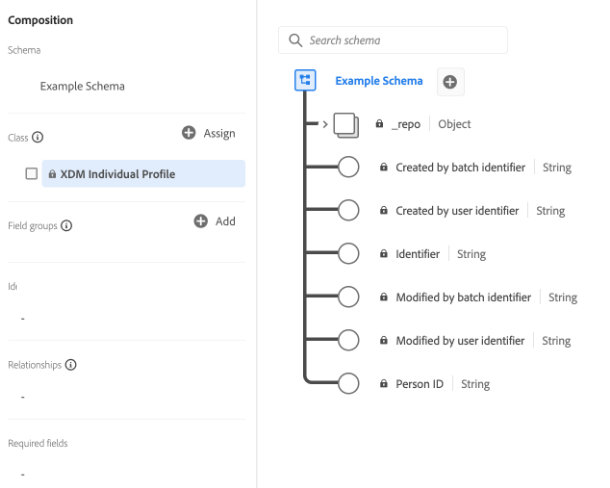

# Basisbeginselen van de schemacompositie

Dit document bevat een inleiding op [!DNL Experience Data Model] (XDM) schema&#39;s en de bouwstenen, de principes, en beste praktijken voor het samenstellen van schema&#39;s die in Adobe Experience Platform moeten worden gebruikt. Voor algemene informatie over XDM en hoe het binnen wordt gebruikt [!DNL Platform], zie de [XDM System, overzicht](../home.md).

## Schema&#39;s begrijpen

Een schema is een set regels die de structuur en indeling van gegevens vertegenwoordigen en valideren. Op een hoog niveau, verstrekken de schema&#39;s een abstracte definitie van een real-world voorwerp (zoals een persoon) en schetsen welke gegevens in elke instantie van dat voorwerp (zoals voornaam, achternaam, verjaardag, etc.) zouden moeten worden omvat.

Naast het beschrijven van de structuur van gegevens, passen de schema&#39;s beperkingen en verwachtingen op gegevens toe zodat het kan worden bevestigd aangezien het zich tussen systemen beweegt. Deze standaarddefinities maken het mogelijk dat gegevens consistent worden geïnterpreteerd, ongeacht de oorsprong, en verwijderen de noodzaak van vertaling in verschillende toepassingen.

[!DNL Experience Platform] handhaaft deze semantische normalisatie door schema&#39;s te gebruiken. Schema&#39;s zijn de standaardmanier om gegevens te beschrijven in [!DNL Experience Platform], zodat alle gegevens die aan schema&#39;s voldoen, opnieuw kunnen worden gebruikt in een organisatie zonder conflicten of zelfs kunnen worden gedeeld tussen meerdere organisaties.

XDM-schema&#39;s zijn ideaal voor het opslaan van grote hoeveelheden complexe gegevens in een op zichzelf staand formaat. Zie de secties op [ingesloten objecten](#embedded) en [big data](#big-data) in de bijlage bij dit document voor meer informatie over hoe XDM dit doet.

### Workflows op basis van schema&#39;s in [!DNL Experience Platform]

Standaardisering is een sleutelbegrip achter [!DNL Experience Platform]. XDM, die door Adobe wordt gedreven, is een inspanning om de gegevens van de klantenervaring te standaardiseren en standaardschema&#39;s voor het beheer van de klantenervaring te bepalen.

De infrastructuur waarop [!DNL Experience Platform] is gebouwd, bekend als [!DNL XDM System], vergemakkelijkt workflows op basis van schema&#39;s en omvat de [!DNL Schema Registry], [!DNL Schema Editor], schema-metagegevens en servicepatronen. Zie de [XDM System, overzicht](../home.md) voor meer informatie .

Er zijn verschillende belangrijke voordelen verbonden aan het gebruik van schema&#39;s in [!DNL Experience Platform]. In de eerste plaats zorgen schema&#39;s voor een beter gegevensbeheer en gegevensminimalisering, wat vooral belangrijk is bij privacyregels. Ten tweede, staat het bouwen van schema&#39;s met standaard componenten Adobe voor uit-van-de-doos inzichten en gebruik van de diensten AI/ML met minimale aanpassingen toe. Ten slotte bieden schema&#39;s infrastructuren voor het uitwisselen van inzichten in gegevens en een efficiënte orchestratie.

## Uw schema plannen

De eerste stap in het bouwen van een schema is het concept, of real-world voorwerp, te bepalen dat u binnen het schema probeert te vangen. Zodra u het concept identificeert u probeert te beschrijven, kunt u beginnen uw schema te plannen door over dingen zoals het type van gegevens, potentiële identiteitsgebieden, en te denken hoe het schema in de toekomst kan evolueren.

### Gedrag van gegevens in [!DNL Experience Platform]

Gegevens bestemd voor gebruik in [!DNL Experience Platform] wordt gegroepeerd in twee gedragstypen:

* **Gegevens opnemen**: Verstrekt informatie over de attributen van een onderwerp. Een onderwerp kan een organisatie of een individu zijn.
* **Gegevens uit tijdreeksen**: Biedt een momentopname van het systeem op het moment dat een handeling direct of indirect door een recordonderwerp is uitgevoerd.

Alle XDM schema&#39;s beschrijven gegevens die als verslag of tijdreeks kunnen worden gecategoriseerd. Het gegevensgedrag van een schema wordt bepaald door de klasse van het schema, die aan een schema wordt toegewezen wanneer het eerst wordt gecreeerd. XDM-klassen worden later in dit document nader beschreven.

Zowel de verslagen als de tijdreeksschema&#39;s bevatten een kaart van identiteiten (`xdm:identityMap`). Dit veld bevat de identiteitsrepresentatie van een onderwerp, getekend vanuit velden die zijn gemarkeerd als Identiteit zoals beschreven in de volgende sectie.

### [!UICONTROL Identity] {#identity}

>[!CONTEXTUALHELP]
>id="platform_schemas_identities"
>title="Identiteiten in schema&#39;s"
>abstract="Identiteiten zijn sleutelvelden in een schema die kunnen worden gebruikt om een onderwerp te identificeren, zoals een e-mailadres of een marketing-id. Deze gebieden worden gebruikt om de identiteitsgrafiek voor elk individu te construeren en klantenprofielen te bouwen."
>text="See the documentation for more information on identities in schemas."

Schema&#39;s worden gebruikt voor het opnemen van gegevens in [!DNL Experience Platform]. Deze gegevens kunnen over de veelvoudige diensten worden gebruikt om één enkele, verenigde mening van een individuele entiteit tot stand te brengen. Daarom is het belangrijk wanneer het denken over schema&#39;s om over klantenidentiteiten te denken en welke gebieden kunnen worden gebruikt om een onderwerp te identificeren ongeacht waar de gegevens uit kunnen komen.

Om dit proces te helpen, kunnen de belangrijkste gebieden binnen uw schema&#39;s als identiteiten worden gemerkt. Bij gegevensinvoer worden de gegevens in die velden ingevoegd in &quot;[!UICONTROL Identity Graph]&quot; voor die persoon. De grafiekgegevens zijn vervolgens toegankelijk via [[!DNL Real-time Customer Profile]](../../profile/home.md) en andere [!DNL Experience Platform] de diensten om een geneutraliseerde mening van elke individuele klant te verstrekken.

Velden die doorgaans zijn gemarkeerd als &quot;[!UICONTROL Identity]&quot; omvatten: e-mailadres, telefoonnummer, [[!DNL Experience Cloud ID (ECID)]](https://experienceleague.adobe.com/docs/id-service/using/home.html), CRM-id of andere unieke id-velden. U zou ook om het even welke unieke herkenningstekens moeten overwegen specifiek voor uw organisatie, aangezien zij kunnen goed zijn &quot;[!UICONTROL Identity]&quot; ook velden.

Het is belangrijk om over klantenidentiteiten tijdens de schema planningsfase te denken helpen ervoor zorgen dat de gegevens worden samengebracht om het meest robuuste profiel mogelijk te bouwen. Zie het overzicht op [Adobe Experience Platform Identity Service](../../identity-service/home.md) voor meer informatie over hoe identiteitsgegevens u kunnen helpen digitale ervaringen aan uw klanten te leveren.

Er zijn twee manieren om identiteitsgegevens naar Platform te verzenden:

1. Identiteitsbeschrijvingen toevoegen aan afzonderlijke velden, via de [Gebruikersinterface van Schema-editor](../ui/fields/identity.md) of door [Schema-register-API](../api/descriptors.md#create)
1. Een [`identityMap` field](#identityMap)

#### `identityMap` {#identityMap}

`identityMap` is een map-type gebied dat de diverse identiteitswaarden voor een individu, samen met hun bijbehorende namespaces beschrijft. Dit gebied kan worden gebruikt om identiteitsinformatie voor uw schema&#39;s te verstrekken, in plaats van het bepalen van identiteitswaarden binnen de structuur van het schema zelf.

Het belangrijkste nadeel van het gebruik `identityMap` is dat identiteiten in de gegevens worden ingesloten en daardoor minder zichtbaar worden. Als u onbewerkte gegevens opneemt, moet u in plaats daarvan afzonderlijke identiteitsvelden definiëren binnen de daadwerkelijke schemastructuur.

>[!NOTE]
>
>Een schema dat `identityMap` kan als bronschema in een verhouding worden gebruikt, maar kan niet als bestemmingsschema worden gebruikt. Dit is omdat alle bestemmingsschema&#39;s een zichtbare identiteit moeten hebben die op een verwijzingsgebied binnen het bronschema kan worden in kaart gebracht. Raadpleeg de UI-handleiding op [relaties](../tutorials/relationship-ui.md) voor meer informatie over de vereisten van bron- en bestemmingsschema&#39;s.

Identiteitskaarten kunnen echter vooral handig zijn als u gegevens opneemt uit bronnen die identiteiten samen opslaan (zoals [!DNL Airship] of Adobe Audience Manager), of wanneer er een variabel aantal identiteiten voor een schema is. Daarnaast zijn identiteitskaarten vereist als u de [Adobe Experience Platform Mobile SDK](https://aep-sdks.gitbook.io/docs/).

Een voorbeeld van een eenvoudige identiteitskaart zou als het volgende kijken:

```json
"identityMap": {
  "email": [
    {
      "id": "jsmith@example.com",
      "primary": false
    }
  ],
  "ECID": [
    {
      "id": "87098882279810196101440938110216748923",
      "primary": false
    },
    {
      "id": "55019962992006103186215643814973128178",
      "primary": false
    }
  ],
  "loyaltyId": [
    {
      "id": "2e33192000007456-0365c00000000000",
      "primary": true
    }
  ]
}
```

Zoals in het bovenstaande voorbeeld wordt getoond, wordt elke toets in het dialoogvenster `identityMap` object staat voor een naamruimte van de identiteit. De waarde voor elke sleutel is een array van objecten die de identiteitswaarden (`id`) voor de desbetreffende naamruimte. Zie de [!DNL Identity Service] documentatie voor een [lijst met standaardnaamruimten](../../identity-service/troubleshooting-guide.md#standard-namespaces) wordt herkend door Adobe-toepassingen.

>[!NOTE]
>
>Een Booleaanse waarde waarmee wordt bepaald of de waarde een primaire identiteit is (`primary`) kan ook worden opgegeven voor elke identiteitswaarde. De primaire identiteiten hoeven alleen te worden vastgesteld voor schema&#39;s die bestemd zijn om te worden gebruikt in [!DNL Real-time Customer Profile]. Zie de sectie over [vakbondsschema&#39;s](#union) voor meer informatie .

### Beginselen voor de ontwikkeling van schema&#39;s {#evolution}

Naarmate de aard van de digitale ervaringen zich blijft ontwikkelen, moeten de schema&#39;s die gebruikt worden om ze te vertegenwoordigen ook worden gebruikt. Een goed ontworpen schema kan daarom aanpassen en evolueren zoals nodig, zonder destructieve veranderingen in vorige versies van het schema te veroorzaken.

Aangezien het handhaven van achterwaartse verenigbaarheid essentieel voor schemaevolutie is, [!DNL Experience Platform] handhaaft een zuiver additief versieringsbeginsel. Dit beginsel zorgt ervoor dat om het even welke revisies aan het schema slechts in niet-destructieve updates en veranderingen resulteren. Met andere woorden: **afbrekende wijzigingen worden niet ondersteund.**

>[!NOTE]
>
>Als een schema nog niet is gebruikt om gegevens in te voeren [!DNL Experience Platform] en is niet toegelaten voor gebruik in het Profiel van de Klant In real time, kunt u een het breken verandering in dat schema introduceren. Nochtans, zodra het schema binnen is gebruikt [!DNL Platform], moet zij zich houden aan het additieve versieringsbeleid.

In de volgende tabel wordt aangegeven welke wijzigingen worden ondersteund bij het bewerken van schema&#39;s, veldgroepen en gegevenstypen:

| Ondersteunde wijzigingen | Wijzigingen doorlopen (niet ondersteund) |
| --- | --- |
| <ul><li>Nieuwe velden toevoegen aan de bron</li><li>Een vereist veld optioneel maken</li><li>Nieuwe vereiste velden maken*</li><li>De weergavenaam en beschrijving van de bron wijzigen</li><li>Het schema toestaan om aan Profiel deel te nemen</li></ul> | <ul><li>Eerder gedefinieerde velden verwijderen</li><li>Bestaande velden hernoemen of opnieuw definiëren</li><li>Eerder ondersteunde veldwaarden verwijderen of beperken</li><li>Bestaande velden verplaatsen naar een andere locatie in de structuur</li><li>Het schema verwijderen</li><li>Het schema uitschakelen om deel te nemen aan profiel</li></ul> |

\**Raadpleeg de onderstaande sectie voor belangrijke overwegingen met betrekking tot [nieuwe vereiste velden instellen](#post-ingestion-required-fields).*

### Vereiste velden

Afzonderlijke schemavelden kunnen [gemarkeerd als vereist](../ui/fields/required.md), wat betekent dat alle opgenomen records gegevens in die velden moeten bevatten om de validatie te kunnen doorstaan. Bijvoorbeeld, kan het plaatsen van het primaire identiteitsgebied van een schema zoals vereist helpen ervoor zorgen dat alle ingebedde verslagen aan het Profiel van de Klant in real time zullen deelnemen, terwijl het plaatsen van een timestamp gebied zoals vereist ervoor zorgt dat alle tijd-reeksgebeurtenissen chronologisch worden bewaard.

>[!IMPORTANT]
>
>Ongeacht of een schemagebied wordt vereist of niet, keurt het Platform niet goed `null` of lege waarden voor een ingesloten veld. Als er geen waarde is voor een bepaald veld in een record of gebeurtenis, moet de sleutel voor dat veld worden uitgesloten van de opname-lading.

#### Velden instellen zoals vereist na invoegen {#post-ingestion-required-fields}

Als een veld is gebruikt om gegevens in te voeren en oorspronkelijk niet is ingesteld als vereist, heeft dat veld mogelijk een null-waarde voor sommige records. Als u dit veld na invoer als vereist instelt, moeten alle toekomstige records een waarde voor dit veld bevatten, ook al kunnen historische records null zijn.

Houd rekening met het volgende wanneer u een eerder optioneel veld naar wens instelt:

1. Als u historische gegevens controleert en de resultaten in een nieuwe dataset schrijft, zullen sommige rijen ontbreken omdat zij ongeldige waarden voor het vereiste gebied bevatten.
1. Als het veld deelneemt aan [Klantprofiel in realtime](../../profile/home.md) en als u gegevens exporteert voordat u deze zo nodig instelt, is de waarde voor sommige profielen mogelijk null.
1. U kunt de API van de Registratie van het Schema gebruiken om een timestamped verandering voor alle middelen XDM in Platform, met inbegrip van nieuwe vereiste gebieden te bekijken. Zie de handleiding op de [controlelogeindpunt](../api/audit-log.md) voor meer informatie .

### Schema&#39;s en gegevensinvoer

Om gegevens in te voeren in [!DNL Experience Platform]moet eerst een gegevensset worden gemaakt. Datasets zijn de bouwstenen voor gegevenstransformatie en -tracking voor [[!DNL Catalog Service]](../../catalog/home.md)en vertegenwoordigen over het algemeen tabellen of bestanden die ingesloten gegevens bevatten. Alle datasets zijn gebaseerd op bestaande schema&#39;s XDM, die beperkingen voor wat verstrekken de ingebedde gegevens zouden moeten bevatten en hoe het zou moeten worden gestructureerd. Zie het overzicht op [Adobe Experience Platform-gegevensinscriptie](../../ingestion/home.md) voor meer informatie .

## Bouwstenen van een schema

[!DNL Experience Platform] gebruikt een compositiebenadering waarin de standaard bouwstenen worden gecombineerd om schema&#39;s tot stand te brengen. Deze benadering bevordert de herbruikbaarheid van bestaande componenten en drijft standaardisatie over de industrie om verkopersschema&#39;s en componenten in [!DNL Platform].

De schema&#39;s worden samengesteld gebruikend de volgende formule:

**Klasse + &amp;Schemaveldgroep; = XDM-schema**

&amp;ast;Een schema bestaat uit een klasse en nul of meer groepen schemavelden. Dit betekent dat u een datasetschema kon samenstellen zonder gebiedsgroepen bij allen te gebruiken.

### Klasse {#class}

Het samenstellen van een schema begint door een klasse toe te wijzen. De klassen bepalen de gedragsaspecten van de gegevens het schema (verslag of tijdreeks) zal bevatten. Bovendien beschrijven de klassen het kleinste aantal gemeenschappelijke eigenschappen die alle die schema&#39;s op die klasse worden gebaseerd zouden moeten omvatten en een manier verstrekken om veelvoudige compatibele datasets worden samengevoegd.

De klasse van een schema bepaalt welke gebiedsgroepen voor gebruik in dat schema in aanmerking zullen komen. Dit wordt nader besproken in het [volgende sectie](#field-group).

Adobe biedt verschillende standaard XDM-klassen (&quot;core&quot;). Twee van deze klassen, [!DNL XDM Individual Profile] en [!DNL XDM ExperienceEvent], zijn vereist voor bijna alle processen in het stroomafwaartse Platform. Naast deze kernklassen kunt u ook uw eigen aangepaste klassen maken om specifieke gebruiksgevallen voor uw organisatie te beschrijven. Aangepaste klassen worden gedefinieerd door een organisatie wanneer er geen door Adobe gedefinieerde kernklassen beschikbaar zijn om een uniek gebruiksgeval te beschrijven.

De volgende schermafbeelding toont hoe klassen worden weergegeven in de gebruikersinterface van het Platform. Aangezien het getoonde voorbeeldschema geen gebiedsgroepen bevat, worden alle getoonde gebieden verstrekt door de klasse van het schema ([!UICONTROL XDM Individual Profile]).



Voor de meest recente lijst van beschikbare standaardXDM klassen, verwijs naar [officiële XDM-opslagplaats](https://github.com/adobe/xdm/tree/master/components/classes). U kunt ook naar de handleiding verwijzen op [XDM-componenten verkennen](../ui/explore.md) als u liever bronnen in de gebruikersinterface weergeeft.

### Veldgroep {#field-group}

Een veldgroep is een herbruikbare component die een of meer velden definieert die bepaalde functies implementeren, zoals persoonlijke gegevens, hotelvoorkeuren of adres. Veldgroepen moeten worden opgenomen als onderdeel van een schema dat een compatibele klasse implementeert.

Veldgroepen definiëren met welke klasse(n) ze compatibel zijn op basis van het gedrag van de gegevens die ze vertegenwoordigen (record- of tijdreeks). Dit betekent dat niet alle veldgroepen beschikbaar zijn voor gebruik met alle klassen.

[!DNL Experience Platform] omvat vele standaard Adobe gebiedsgroepen terwijl ook het toestaan van verkopers om gebiedsgroepen voor hun gebruikers te bepalen, en individuele gebruikers om gebiedsgroepen voor hun eigen specifieke concepten te bepalen.

Als u bijvoorbeeld details wilt vastleggen, zoals &quot;[!UICONTROL First Name]&quot; en &quot;[!UICONTROL Home Address]&quot; voor je &quot;[!UICONTROL Loyalty Members]&quot; schema, zou u standaardgebiedsgroepen kunnen gebruiken die die gemeenschappelijke concepten bepalen. Concepten die echter specifiek zijn voor minder gangbare gebruiksgevallen (zoals &quot;[!UICONTROL Loyalty Program Level]&quot;) hebben vaak geen vooraf gedefinieerde veldgroep. In dit geval moet u uw eigen veldgroep definiëren om deze gegevens vast te leggen.

>[!NOTE]
>
>Het wordt ten zeerste aanbevolen om waar mogelijk standaardveldgroepen in uw schema&#39;s te gebruiken, aangezien deze velden impliciet worden begrepen door [!DNL Experience Platform] diensten en zorgen voor meer consistentie bij gebruik in [!DNL Platform] componenten.
>
>Velden die worden geleverd door standaardcomponenten (zoals &quot;Voornaam&quot; en &quot;E-mailadres&quot;) bevatten aanvullende aantekeningen die verdergaan dan de elementaire scalaire veldtypen en die [!DNL Platform] alle velden die hetzelfde gegevenstype delen, zich op dezelfde manier gedragen. Dit gedrag kan worden vertrouwd om consistent te zijn ongeacht waar de gegevens vandaan komen of waar [!DNL Platform] de dienst de gegevens wordt gebruikt.

Herinner dat de schema&#39;s uit &quot;nul of meer&quot;gebiedsgroepen worden samengesteld, zodat betekent dit dat u een geldig schema kon samenstellen zonder enige gebiedsgroepen bij allen te gebruiken.

De volgende schermafbeelding laat zien hoe veldgroepen worden weergegeven in de gebruikersinterface van het Platform. Eén veldgroep ([!UICONTROL Demographic Details]) wordt in dit voorbeeld toegevoegd aan een schema, dat een groepering van gebieden aan de structuur van het schema verstrekt.


Voor de meest recente lijst van beschikbare standaard XDM gebiedsgroepen, verwijs naar [officiële XDM-opslagplaats](https://github.com/adobe/xdm/tree/master/components/fieldgroups). U kunt ook naar de handleiding verwijzen op [XDM-componenten verkennen](../ui/explore.md) als u liever bronnen in de gebruikersinterface weergeeft.

### Gegevenstype {#data-type}

Gegevenstypen worden op dezelfde manier als letterlijke basisvelden gebruikt als referentieveldtypen in klassen of schema&#39;s. Het belangrijkste verschil is dat gegevenstypen meerdere subvelden kunnen definiëren. Net als bij een veldgroep staat een gegevenstype voor een consistent gebruik van een structuur met meerdere velden, maar heeft het een grotere flexibiliteit dan een veldgroep omdat een gegevenstype overal in een schema kan worden opgenomen door het als het gegevenstype van een veld toe te voegen.

[!DNL Experience Platform] verstrekt een aantal gemeenschappelijke gegevenstypes als deel van [!DNL Schema Registry] ondersteuning van het gebruik van standaardpatronen voor het beschrijven van gemeenschappelijke gegevensstructuren. Dit wordt nader toegelicht in de [!DNL Schema Registry] zelfstudies, waarbij het duidelijker wordt wanneer u de stappen doorloopt om gegevenstypen te definiëren.

De volgende schermafbeelding toont hoe gegevenstypen worden weergegeven in de gebruikersinterface van het Platform. Een van de velden die door de [!UICONTROL Demographic Details] veldgroep gebruikt &quot;[!UICONTROL Person name]&quot; gegevenstype, zoals aangegeven door de tekst na het verticale streepje (`|`) naast de naam van het veld. Dit specifieke gegevenstype biedt verschillende subvelden die betrekking hebben op de naam van een individuele persoon, een constructie die opnieuw kan worden gebruikt voor andere velden waarin de naam van een persoon moet worden vastgelegd.


Voor de meest bijgewerkte lijst van beschikbare standaard XDM gegevenstypes, verwijs naar [officiële XDM-opslagplaats](https://github.com/adobe/xdm/tree/master/components/datatypes). U kunt ook naar de handleiding verwijzen op [XDM-componenten verkennen](../ui/explore.md) als u liever bronnen in de gebruikersinterface weergeeft.

### Veld

Een veld is de eenvoudigste bouwsteen van een schema. Velden bieden beperkingen met betrekking tot het type gegevens dat ze kunnen bevatten door een specifiek gegevenstype te definiëren. Deze basistypen definiëren één veld, terwijl de [gegevenstypen](#data-type) Met de eerder vermelde opties kunt u meerdere subvelden definiëren en dezelfde structuur voor meerdere velden opnieuw gebruiken in verschillende schema&#39;s. Naast het definiëren van het &quot;gegevenstype&quot; van een veld als een van de gegevenstypen die in het register zijn gedefinieerd, [!DNL Experience Platform] steunt fundamentele scalaire types zoals:

* Tekenreeks
* Geheel
* Dubbel
* Boolean
* Array
* Object

>[!TIP]
>
>Zie de [aanhangsel](#objects-v-freeform) voor informatie over de voor- en nadelen van het gebruik van vrije-formuliervelden boven objecttypevelden.

De geldige waaiers van deze scalaire types kunnen verder tot bepaalde patronen, formaten, minimum/maximum, of vooraf bepaalde waarden worden beperkt. Gebruikend deze beperkingen, kan een brede waaier van specifiekere gebiedstypes worden vertegenwoordigd, die omvatten:

* Enum
* Lang
* Kort
* Byte
* Datum
* Datum/tijd
* Kaart

>[!NOTE]
>
>Het &quot;kaart&quot;gebiedstype staat voor sleutel-waarde paargegevens, met inbegrip van veelvoudige waarden voor één enkele sleutel toe. Kaarten vindt u in standaard XDM-klassen en -veldgroepen, maar u kunt ook aangepaste kaarten definiëren met behulp van de API voor schemaregistratie. Zie de zelfstudie aan [aangepaste velden definiëren](../tutorials/custom-fields-api.md#maps) voor meer informatie .

## Compositievoorbeeld

Schema&#39;s vertegenwoordigen de indeling en structuur van gegevens waarin gegevens worden opgenomen [!DNL Platform]en worden samengesteld met behulp van een compositiemodel. Zoals eerder vermeld, zijn deze schema&#39;s samengesteld uit een klasse en nul of meer gebiedsgroepen die met die klasse compatibel zijn.

Bijvoorbeeld, zou een schema beschrijvend aankopen die bij een detailhandel worden gemaakt kunnen worden genoemd &quot;[!UICONTROL Store Transactions]&quot;. Het schema implementeert het [!DNL XDM ExperienceEvent] klasse gecombineerd met de norm [!UICONTROL Commerce] veldgroep en een door de gebruiker gedefinieerde [!UICONTROL Product Info] veldgroep.

Een ander schema dat websiteverkeer volgt zou &quot; kunnen worden genoemd[!UICONTROL Web Visits]&quot;. Het implementeert ook de [!DNL XDM ExperienceEvent] , maar deze keer wordt de standaard [!UICONTROL Web] veldgroep.

In het onderstaande diagram worden deze schema&#39;s en de velden weergegeven die door elke veldgroep worden bijgedragen. Het bevat ook twee schema&#39;s die op [!DNL XDM Individual Profile] klasse, inclusief de klasse &quot;[!UICONTROL Loyalty Members]&quot; schema genoemd eerder in deze gids.


### Samenvoegen {#union}

while [!DNL Experience Platform] staat u toe om schema&#39;s voor bepaalde gebruiksgevallen samen te stellen, staat het u ook toe om een &quot;unie&quot;van schema&#39;s voor een specifiek klassentype te zien. Het vorige diagram toont twee schema&#39;s die op de klasse XDM ExperienceEvent en twee schema&#39;s worden gebaseerd op [!DNL XDM Individual Profile] klasse. De samenvoeging, die hieronder wordt weergegeven, aggregeert de velden van alle schema&#39;s die dezelfde klasse delen ([!DNL XDM ExperienceEvent] en [!DNL XDM Individual Profile], respectievelijk).


Door een schema in te schakelen voor gebruik met [!DNL Real-time Customer Profile], wordt het opgenomen in de union voor dat klassetype. [!DNL Profile] levert robuuste, gecentraliseerde profielen van klantenattributen evenals een timestamped rekening van elke gebeurtenis die de klant over om het even welk systeem heeft gehad dat met wordt geïntegreerd [!DNL Platform]. [!DNL Profile] gebruikt de verenigingsmening om deze gegevens te vertegenwoordigen en een holistische mening van elke individuele klant te verstrekken.

Meer informatie over het werken met [!DNL Profile], zie de [Overzicht van het realtime klantprofiel](../../profile/home.md).

## Gegevensbestanden toewijzen aan XDM-schema&#39;s

Alle gegevensbestanden waarin [!DNL Experience Platform] moet in overeenstemming zijn met de structuur van een XDM-schema. Zie het document over het opmaken van gegevensbestanden om te voldoen aan XDM-hiërarchieën (inclusief voorbeeldbestanden) voor meer informatie over het opmaken van gegevensbestanden [ETL-testtransformaties](../../etl/transformations.md). Voor algemene informatie over het opnemen van gegevensbestanden in [!DNL Experience Platform], zie de [overzicht van batch-opname](../../ingestion/batch-ingestion/overview.md).

## Schema&#39;s voor externe segmenten

Als u segmenten van externe systemen in Platform brengt, moet u de volgende componenten gebruiken om hen in uw schema&#39;s te vangen:

* [[!UICONTROL Segment definition] class](../classes/segment-definition.md): Gebruik deze standaardklasse om zeer belangrijke attributen van een externe segmentdefinitie te vangen.
* [[!UICONTROL Segment Membership Details] veldgroep](../field-groups/profile/segmentation.md): Deze veldgroep toevoegen aan uw [!UICONTROL XDM Individual Profile] schema om klantenprofielen aan specifieke segmenten te associëren.

## Volgende stappen

Nu u de grondbeginselen van schemacompositie begrijpt, bent u bereid beginnen het onderzoeken en bouwend schema&#39;s gebruikend [!DNL Schema Registry].

Raadpleeg de volgende documentatie voor informatie over de structuur van de twee belangrijkste XDM-klassen en hun veelgebruikte compatibele veldgroepen:

* [[!DNL XDM Individual Profile]](../classes/individual-profile.md)
* [[!DNL XDM ExperienceEvent]](../classes/experienceevent.md)

De [!DNL Schema Registry] wordt gebruikt om toegang te krijgen tot [!DNL Schema Library] in Adobe Experience Platform en biedt een gebruikersinterface en RESTful-API die toegang bieden tot alle beschikbare bibliotheekbronnen. De [!DNL Schema Library] Bevat bronnen van de Industrie die door Adobe worden bepaald, de middelen van de Leverancier door [!DNL Experience Platform] partners, en klassen, gebiedsgroepen, gegevenstypes, en schema&#39;s die door leden van uw organisatie zijn samengesteld.

Als u wilt beginnen met het samenstellen van het schema met de gebruikersinterface, volgt u de [Zelfstudie Schema Editor](../tutorials/create-schema-ui.md) om het schema voor &quot;Loyalty-leden&quot; op te bouwen dat in dit document wordt vermeld.

Als u het gereedschap [!DNL Schema Registry] API, begin door te lezen [Handleiding voor ontwikkelaars van de API voor schemaregister](../api/getting-started.md). Nadat u de handleiding voor ontwikkelaars hebt gelezen, volgt u de stappen die in de zelfstudie worden beschreven op [het creëren van een schema gebruikend de Registratie API van het Schema](../tutorials/create-schema-api.md).

## Aanhangsel

De volgende secties bevatten extra informatie betreffende de beginselen van schemacompositie.

### Relatieve tabellen versus ingesloten objecten {#embedded}

Wanneer het werken met relationele gegevensbestanden, impliceren de beste praktijken het normaliseren van gegevens, of het nemen van een entiteit en het verdelen van het in discrete stukken die dan over veelvoudige lijsten worden getoond. Om de gegevens als geheel te lezen of de entiteit bij te werken, lees en schrijf verrichtingen over vele individuele lijsten moeten worden gemaakt gebruikend JOIN.

Door het gebruik van ingebedde voorwerpen, kunnen de schema&#39;s XDM complexe gegevens direct vertegenwoordigen en het opslaan in op zichzelf staande documenten met een hiërarchische structuur. Één van de belangrijkste voordelen aan deze structuur is dat het u toestaat om de gegevens te vragen zonder het moeten de entiteit door dure verbindingen aan veelvoudige gedenormaliseerde lijsten reconstrueren. Er zijn geen harde beperkingen aan hoeveel niveaus uw schemahiërarchie kan zijn.

### Schema&#39;s en grote gegevens {#big-data}

Moderne digitale systemen genereren enorme hoeveelheden gedragssignalen (transactiegegevens, weblogbestanden, internet van dingen, weergave, enzovoort). Deze grote gegevens bieden buitengewone mogelijkheden om ervaringen te optimaliseren, maar zijn lastig te gebruiken vanwege de schaal en de verscheidenheid van de gegevens. Om waarde te kunnen halen uit de gegevens, moeten de structuur, de indeling en de definities ervan worden gestandaardiseerd, zodat ze consistent en efficiënt kunnen worden verwerkt.

De schema&#39;s lossen dit probleem op door gegevens toe te laten om uit veelvoudige bronnen worden geïntegreerd, door gemeenschappelijke structuren en definities worden gestandaardiseerd, en over oplossingen worden gedeeld. Op die manier kunnen verdere processen en services elk type vraag van de gegevens beantwoorden, waarbij van de traditionele benadering naar gegevensmodellering wordt overgeschakeld, waarbij alle vragen die van de gegevens worden gesteld van tevoren bekend zijn en de gegevens zijn gemodelleerd om aan die verwachtingen te voldoen.

### Objecten versus vrije-formuliervelden {#objects-v-freeform}

Bij het ontwerpen van uw schema&#39;s moet u rekening houden met een aantal belangrijke factoren wanneer u objecten kiest op vrije-formuliervelden:

| Objecten | Velden met vrije vorm |
| --- | --- |
| Meer nesten | Minder of geen nesten |
| Hiermee maakt u logische veldgroepen | Velden worden op ad-hoclocaties geplaatst |

{style=&quot;table-layout:auto&quot;}

#### Objecten

Hieronder ziet u de voor- en nadelen van het gebruik van objecten op vrije velden.

**Pros**:

* Objecten kunt u het beste gebruiken als u een logische groepering van bepaalde velden wilt maken.
* Objecten ordenen het schema op een meer gestructureerde manier.
* Objecten helpen indirect bij het maken van een goede menustructuur in de gebruikersinterface van Segment Builder. De gegroepeerde velden in het schema worden direct weerspiegeld in de mappenstructuur die is opgegeven in de gebruikersinterface van Segment Builder.

**Cons**:

* Velden worden meer genest.
* Wanneer u [Adobe Experience Platform Query Service](../../query-service/home.md)langere verwijzingstekenreeksen moeten worden opgegeven voor queryvelden die in objecten zijn genest.

#### Velden met vrije vorm

De voor- en nadelen van het gebruik van vrije-formuliervelden op objecten worden hieronder weergegeven.

**Pros**:

* Velden met vrije vorm worden direct onder het hoofdobject van het schema gemaakt (`_tenantId`), de zichtbaarheid vergroten.
* De koorden van de verwijzing voor vrije-vormgebieden zijn gewoonlijk korter wanneer het gebruiken van de Dienst van de Vraag.

**Cons**:

* De locatie van vrije-formuliervelden in het schema is ad hoc. Dit betekent dat deze velden in alfabetische volgorde worden weergegeven in de Schema-editor. Hierdoor kunnen schema&#39;s minder gestructureerd worden, en vergelijkbare vrije-vormgebieden kunnen uiteindelijk ver worden gescheiden afhankelijk van hun namen.
