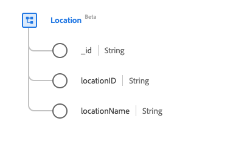

# [!UICONTROL Location] -klasse

In Experience Data Model (XDM) legt de klasse [!UICONTROL Location] locatie-informatie voor livegebeurtenissen vast, zoals een reishal of sportarena.

| Weergavenaam | Eigenschap | Gegevenstype | Beschrijving |
| --- | --- | --- | --- |
| [!UICONTROL Identifier] | `_id` | [!UICONTROL String] | Een unieke, door het systeem gegenereerde tekenreeks-id voor de record. Dit veld wordt gebruikt om het unieke karakter van een individueel record te volgen, om te voorkomen dat gegevens dubbel worden opgeslagen en om dat record op te zoeken in downstreamdiensten.   Aangezien dit gebied systeem-geproduceerd is, te hoeven het niet om een expliciete waarde tijdens gegevensopname te worden verstrekt. U kunt er echter desgewenst nog voor kiezen om uw eigen unieke id-waarden op te geven. |
| [!UICONTROL Location Identifier] | `locationID` | [!UICONTROL String] | Een unieke id voor de locatie. |
| [!UICONTROL Location Name] | `locationName` | [!UICONTROL String] | De naam van de locatie. |

De klasse kan met de [[!UICONTROL Location] gebiedsgroep &#x200B;](../field-groups/location.md) worden uitgebreid om verdere details over een plaats te beschrijven.
