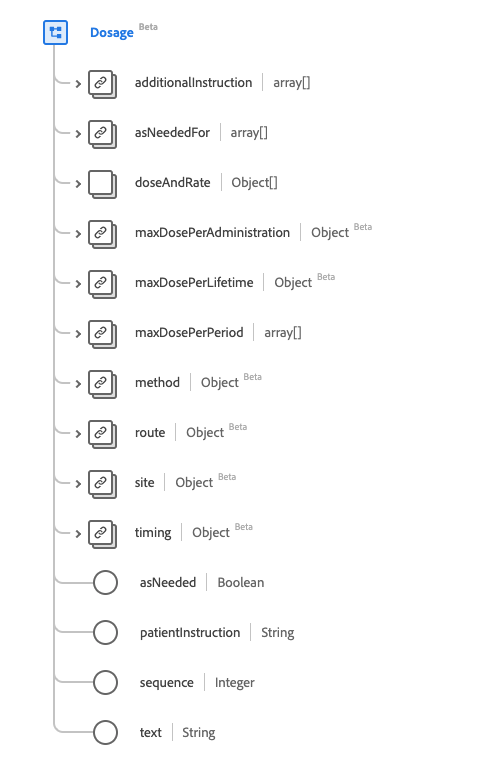

# [!UICONTROL Dosage] gegevenstype

[!UICONTROL Dosage] is een standaard XDM-gegevenstype (Experience Data Model) dat beschrijft hoe de medicatie wordt/werd ingenomen of moet worden gebruikt. Dit gegevenstype wordt gecreeerd volgens de specificaties van Versie 5 van HL7 FHIR.

| Weergavenaam | Eigenschap | Gegevenstype | Beschrijving |
| --- | --- | --- | --- |
| [!UICONTROL Additional Instructions] | `additionalInstruction` | Array van [[!UICONTROL Codeable Concept]](../data-types/codeable-concept.md) | Aanvullende instructies of waarschuwingen voor de patiënt. |
| [!UICONTROL As Needed For] | `asNeededFor` | Array van [[!UICONTROL Codeable Concept]](../data-types/codeable-concept.md) | Geeft aan welke kwestie de medicatie moet worden gebruikt als dat nodig is. |
| [!UICONTROL Dose And Rate] | `doseAndRate` | Array van objecten | De toegediende hoeveelheid geneesmiddel, de toe te dienen hoeveelheid of de gebruikelijke toe te dienen hoeveelheid. Zie de [&#x200B; sectie hieronder &#x200B;](#dose-and-rate) voor meer informatie |
| [!UICONTROL Max Dose Per Administration] | `maxDosePerAdministration` | [[!UICONTROL Simple Quantity]](../data-types/simple-quantity.md) | De bovengrens van de medicatie per toediening. |
| [!UICONTROL Max Dose Per Lifetime] | `maxDosePerLifetime` | [[!UICONTROL Simple Quantity]](../data-types/simple-quantity.md) | De bovengrens van de medicatie per levensduur van de patiënt. |
| [!UICONTROL Max Dose Per Period] | `maxDosePerPeriod` | Array van [[!UICONTROL Ratio]](../data-types/ratio.md) | De bovengrens van de medicatie per tijdseenheid. |
| [!UICONTROL Method] | `method` | [[!UICONTROL Codeable Concept]](../data-types/codeable-concept.md) | De techniek voor het toedienen van de medicatie. |
| [!UICONTROL Route] | `route` | [[!UICONTROL Codeable Concept]](../data-types/codeable-concept.md) | Hoe het geneesmiddel in het lichaam moet komen. |
| [!UICONTROL Body Site] | `site` | [[!UICONTROL Codeable Concept]](../data-types/codeable-concept.md) | Het lichaam waar het geneesmiddel wordt toegediend. |
| [!UICONTROL Timing] | `timing` | [[!UICONTROL Timing]](../data-types/timing.md) | Wanneer medicatie moet worden toegediend. |
| [!UICONTROL As Needed] | `asNeeded` | Boolean | Een indicator om aan te geven of het geneesmiddel moet worden ingenomen indien dit nodig is. |
| [!UICONTROL Patient Instructions] | `patientInstruction` | String | Instructies voor de patiënt of de consument. |
| [!UICONTROL Sequence] | `Integer` | [[!UICONTROL Codeable Concept]](../data-types/codeable-concept.md) | De volgorde van de doseringsinstructies. |
| [!UICONTROL Text] | `text` | String | Volg de instructies voor de dosering. |

Raadpleeg de openbare XDM-opslagplaats voor meer informatie over het gegevenstype:

* [&#x200B; Bevolkt voorbeeld &#x200B;](https://github.com/adobe/xdm/blob/master/extensions/industry/healthcare/fhir/datatypes/dosage.example.1.json)
* [&#x200B; Volledig schema &#x200B;](https://github.com/adobe/xdm/blob/master/extensions/industry/healthcare/fhir/datatypes/dosage.schema.json)

## `doseAndRate` {#dose-and-rate}

`doseAndRate` wordt opgegeven als een array van objecten. De structuur van elk object wordt hieronder beschreven.

| Weergavenaam | Eigenschap | Gegevenstype | Beschrijving |
| --- | --- | --- | --- |
| [!UICONTROL Dose Quantity] | `doseQuantity` | [[!UICONTROL Simple Quantity]](../data-types/simple-quantity.md) | De hoeveelheid medicatie per dosis. |
| [!UICONTROL Dose Range] | `doseRange` | [[!UICONTROL Range]](../data-types/range.md) | De hoeveelheid medicatie per dosis. |
| [!UICONTROL Rate Quantity] | `rateQuantity` | [[!UICONTROL Simple Quantity]](../data-types/simple-quantity.md) | De hoeveelheid medicatie per tijdseenheid. |
| [!UICONTROL Rate Range] | `rateRange` | [[!UICONTROL Range]](../data-types/range.md) | De hoeveelheid medicatie per tijdseenheid. |
| [!UICONTROL Rate Ratio] | `rateRatio` | [[!UICONTROL Ratio]](../data-types/ratio.md) | De hoeveelheid medicatie per tijdseenheid. |
| [!UICONTROL Type] | `type` | [[!UICONTROL Codeable Concept]](../data-types/codeable-concept.md) | De aard van de dosis of snelheid die is opgegeven. |
