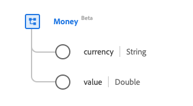

# [!UICONTROL Money] gegevenstype

[!UICONTROL Money] is een standaard XDM-gegevenstype (Experience Data Model) dat een hoeveelheid economisch nut in een erkende valuta biedt. Dit gegevenstype wordt gecreeerd volgens de specificaties van Versie 5 van HL7 FHIR.

| Weergavenaam | Eigenschap | Gegevenstype | Beschrijving |
| --- | --- | --- | --- |
| [!UICONTROL Currency] | `currency` | String | De ISO 4217-valutacode. |
| [!UICONTROL Value] | `value` | Dubbel | De numerieke waarde. |

Raadpleeg de openbare XDM-opslagplaats voor meer informatie over het gegevenstype:

* [ Bevolkt voorbeeld ](https://github.com/adobe/xdm/blob/master/extensions/industry/healthcare/fhir/datatypes/money.example.1.json)
* [ Volledig schema ](https://github.com/adobe/xdm/blob/master/extensions/industry/healthcare/fhir/datatypes/money.schema.json)
