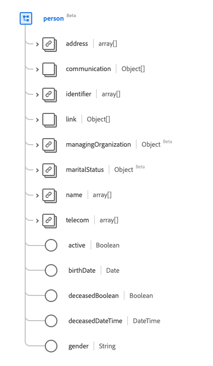

# [!UICONTROL Person] gegevenstype

[!UICONTROL Person] is een standaardgegevenstype van het Gegevensmodel van de Ervaring (XDM) dat informatie over een generisch persoonverslag verstrekt. Dit gegevenstype wordt gecreeerd volgens de specificaties van Versie 5 van HL7 FHIR.

| Weergavenaam | Eigenschap | Gegevenstype | Beschrijving |
| --- | --- | --- | --- |
| [!UICONTROL Address] | `address` | Array van [[!UICONTROL Address]](../data-types/address.md) | Een of meer adressen voor de persoon. |
| [!UICONTROL Communication] | `communication` | Array van objecten | Een taal die kan worden gebruikt om met de persoon te communiceren over zijn of haar gezondheid. Zie de [&#x200B; sectie hieronder &#x200B;](#communication) voor meer informatie. |
| [!UICONTROL Identifier] | `identifier` | Array van [[!UICONTROL Identifier]](../data-types/identifier.md) | Een menselijke identificator voor deze persoon. |
| [!UICONTROL Person Link Details] | `link` | Array van objecten | Een koppeling naar een bron die dezelfde persoon aangaat. Zie de [&#x200B; sectie hieronder &#x200B;](#link) voor meer informatie. |
| [!UICONTROL Managing Organization] | `managingOrganization` | [[!UICONTROL Reference]](../data-types/reference.md) | De organisatie die de bewaarder van het patiëntendossier is. |
| [!UICONTROL Marital Status] | `maritalStatus` | [[!UICONTROL Codeable Concept]](../data-types/codeable-concept.md) | De burgerlijke (of burgerlijke) staat van een persoon |
| [!UICONTROL Name] | `name` | Array van [[!UICONTROL Human Name]](../data-types/human-name.md) | De namen die aan een persoon zijn gekoppeld. |
| [!UICONTROL Contact Details] | `telecom` | Array van [[!UICONTROL Contact Point]] | De contactgegevens waarmee contact met de persoon kan worden opgenomen. |
| [!UICONTROL Is Active] | `active` | Boolean | Geeft aan of de record van de persoon actief wordt gebruikt. |
| [!UICONTROL Birth Date] | `birthDate` | Datum | De geboortedatum van de persoon. |
| [!UICONTROL Deceased Indicator] | `deceasedBoolean` | Boolean | Hiermee wordt aangegeven of de persoon al dan niet overleden is. |
| [!UICONTROL Deceased Date Time] | `deceasedDateTime` | DateTime | Datum en tijdstip van overlijden indien de betrokkene overleden is. |
| [!UICONTROL Gender] | `gender` | String | De genderidentiteit van de persoon. De waarde van deze eigenschap moet gelijk zijn aan een van de volgende bekende opsommingswaarden. <li> `female` </li> <li> `male` </li> <li> `other` </li> <li> `unknown`</li> |

Raadpleeg de openbare XDM-opslagplaats voor meer informatie over het gegevenstype:

* [&#x200B; Bevolkt voorbeeld &#x200B;](https://github.com/adobe/xdm/blob/master/extensions/industry/healthcare/fhir/datatypes/identifier.example.1.json)
* [&#x200B; Volledig schema &#x200B;](https://github.com/adobe/xdm/blob/master/extensions/industry/healthcare/fhir/datatypes/identifier.schema.json)

## `communication` {#communication}

`communication` wordt opgegeven als een array van objecten. De structuur van elk object wordt hieronder beschreven.

| Weergavenaam | Eigenschap | Gegevenstype | Beschrijving |
| --- | --- | --- | --- |
| [!UICONTROL Language] | `language` | [[!UICONTROL Codeable concept]](../data-types/codeable-concept.md) | De taal die kan worden gebruikt om met de persoon over zijn of haar gezondheid te communiceren. |
| [!UICONTROL Is Preferred Language] | `preferred` | Boolean | Geeft aan of de taal de voorkeurstaal is. |

## `link` {#link}

`link` wordt opgegeven als een array van objecten. De structuur van elk object wordt hieronder beschreven.

| Weergavenaam | Eigenschap | Gegevenstype | Beschrijving |
| --- | --- | --- | --- |
| [!UICONTROL Target] | `target` | [[!UICONTROL Reference]](../data-types/reference.md) | De bron waaraan deze persoon is gekoppeld. |
| [!UICONTROL Assurance] | `assurance` | String | Het betrouwbaarheidsniveau dat aan de koppeling is gekoppeld. De waarden van deze eigenschap moeten gelijk zijn aan een of meer van de volgende bekende opsommingswaarden. <li> `level1` </li> <li> `level2` </li> <li> `level3` </li> <li> `level4` </li> |
