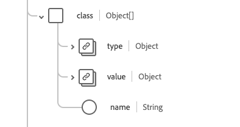

# [!UICONTROL Coverage] schemaveldgroep

[!UICONTROL Coverage] is een standaardgroep van het schemagebied voor de [[!DNL Plan]  klasse ](../../../classes/plan.md). Het verstrekt één enkel voorwerp-type gebied `healthcareCoverage` dat bedoeld is om de hoogniveauherkenningstekens en beschrijvers van een verzekeringsplan te verstrekken, typisch de informatie die op een verzekeringskaart zou verschijnen, die kan worden gebruikt om, geheel of gedeeltelijk, voor de levering van producten en de diensten van de gezondheidszorg te betalen.

| Weergavenaam | Eigenschap | Gegevenstype | Beschrijving |
| --- | --- | --- | --- |
| [!UICONTROL Plan Beneficiary] | `beneficiary` | [[!UICONTROL Reference]](../data-types/reference.md) | De partij die de verzekeringsdekking geniet en de patiënt wanneer producten of diensten worden geleverd. |
| [!UICONTROL Class] | `class` | Array van objecten | Een reeks van underwriter-specifieke classificateurs. Zie de [ sectie hieronder ](#class) voor meer informatie. |
| [!UICONTROL Contact] | `contract` | Array van [[!UICONTROL Reference]](../data-types/reference.md) | De polis(en) die deze verzekeringsdekking vormen. |
| [!UICONTROL Cost To Beneficiary] | `costToBeneficiary` | Array van objecten | Een reeks codes die de kostencategorie en het bijbehorende bedrag aangeven en die in het beleid zijn beschreven en mogelijk op de gezondheidskaart zijn opgenomen. Zie de [ sectie hieronder ](#cost-to-beneficiary) voor meer informatie. |
| [!UICONTROL Exception] | `exception` | Array van objecten | Een reeks codes die uitzonderingen of verlagingen van de kosten van de patiënt en hun effectieve perioden aangeven. Zie de [ sectie hieronder ](#exception) voor meer informatie. |
| [!UICONTROL Identifier] | `identifier` | Array van [[!UICONTROL Identifier]](../data-types/identifier.md) | De identificatiecode van de dekking zoals uitgegeven door de verzekeraar. |
| [!UICONTROL Insurance Plan] | `insurancePlan` | [[!UICONTROL Reference]](../data-types/reference.md) | In de verzekeringsplannen worden de details van de verzekeringspolis, de voordelen en de kosten vermeld. |
| [!UICONTROL Insurer] | `insurer` | [[!UICONTROL Reference]](../data-types/reference.md) | Het programma of plan underwriter, payor, of verzekeringsbedrijf. |
| [!UICONTROL Payment By] | `paymentBy` | Array van objecten | De link naar de betalende partij en eventueel naar wat zij moeten betalen. Zie de [ sectie hieronder ](#payment-by) voor meer informatie. |
| [!UICONTROL Coverage Start And End Dates] | `period` | [[!UICONTROL Period]](../data-types/period.md) | De periode waarin de dekking actief is. Een ontbrekende begindatum geeft aan dat de begindatum onbekend is, een ontbrekende einddatum betekent dat de dekking aan de gang is. |
| [!UICONTROL Policy Holder] | `policyHolder` | [[!UICONTROL Reference]](../data-types/reference.md) | De partij die de verzekeringspolis bezit. |
| [!UICONTROL Beneficiary Relationship] | `relationship` | [[!UICONTROL Codeable Concept]](../data-types/codeable-concept.md) | De relatie tussen de begunstigde en de abonnee. |
| [!UICONTROL Subscriber] | `subscriber` | [[!UICONTROL Reference]](../data-types/reference.md) | De partij die de contractuele relatie met het beleid heeft. |
| [!UICONTROL Subscriber Identifier] | `subscriberId` | Array van [[!UICONTROL Identifier]](../data-types/identifier.md) | De verzekeraar heeft de id van de abonnee toegewezen. |
| [!UICONTROL Type] | `type` | [[!UICONTROL Codeable Concept]](../data-types/codeable-concept.md) | Het type dekking. |
| [!UICONTROL Dependent Number] | `dependent` | String | De aanduiding voor een afhankelijke persoon onder de dekking. |
| [!UICONTROL Kind] | `kind` | String | Het soort dekking. De waarde van deze eigenschap moet gelijk zijn aan een van de volgende bekende opsommingswaarden. <li> `insurance` </li> <li> `self-pay` </li> <li> `other` </li> |
| [!UICONTROL Insurer Network] | `network` | String | Het netwerk van dienstverleners waaraan de begunstigde een behandeling kan aanvragen die tegen het tarief binnen het netwerk zal worden gedekt, anders zijn de voorwaarden en voorwaarden buiten het netwerk van toepassing. |
| [!UICONTROL Coverage Order] | `order` | Geheel | De relatieve volgorde van de dekking, met een minimumwaarde van `0` . |
| [!UICONTROL Status] | `status` | String | De status van de dekking. De waarde van deze eigenschap moet gelijk zijn aan een van de volgende bekende opsommingswaarden. <li> `active` </li> <li> `cancelled` </li> <li> `draft` </li> <li> `entered-in-error` </li> |
| [!UICONTROL Subrogation] | `subrogation` | Boolean | Wanneer `true` , is deze verzekeringsinstantie opgenomen niet voor uitspraak, maar om verzekeraars de details te verstrekken om kosten terug te krijgen. |

Raadpleeg de openbare XDM-opslagplaats voor meer informatie over de veldgroep:

* [ Bevolkt voorbeeld ](https://github.com/adobe/xdm/blob/master/extensions/industry/healthcare/fhir/fieldgroups/coverage.example.1.json)
* [ Volledig schema ](https://github.com/adobe/xdm/blob/master/extensions/industry/healthcare/fhir/fieldgroups/coverage.schema.json)

## `class` {#class}

`class` wordt opgegeven als een array van objecten. De structuur van elk object wordt hieronder beschreven.

| Weergavenaam | Eigenschap | Gegevenstype | Beschrijving |
| --- | --- | --- | --- |
| [!UICONTROL Type] | `type` | Array van [[!UICONTROL Codeable Concept]](../data-types/codeable-concept.md) | Het type indeling waarvoor een verzekeraarspecifiek klasselabel, of een nummer en optionele naam, wordt verstrekt. Het type kan bijvoorbeeld worden gebruikt om een dekkingsklasse, werkgeversgroep, beleid of plan te identificeren. |
| [!UICONTROL Value] | `value` | [[!UICONTROL Identifier]](../data-types/identifier.md) | De alfanumerieke identificatiecode die aan het door de verzekeraar afgegeven label is gekoppeld. |
| [!UICONTROL Name] | `name` | String | Een korte beschrijving voor de klasse. |

## `costToBeneficiary` {#cost-to-beneficiary}

`costToBeneficiary` wordt opgegeven als een array van objecten. De structuur van elk object wordt hieronder beschreven.

| Weergavenaam | Eigenschap | Gegevenstype | Beschrijving |
| --- | --- | --- | --- |
| [!UICONTROL Category] | `category` | [[!UICONTROL Codeable Concept]](../data-types/codeable-concept.md) | De code ter identificatie van het algemene soort uitkeringen waaronder producten en diensten worden verleend. |
| [!UICONTROL Network] | `network` | [[!UICONTROL Codeable Concept]](../data-types/codeable-concept.md) | De code om erop te wijzen of de voordelen naar binnen-netwerk of uit-van-netwerk leveranciers verwijzen. |
| [!UICONTROL Term] | `term` | [[!UICONTROL Codeable Concept]](../data-types/codeable-concept.md) | De duur van de waarden, zoals het maximale levenslange voordeel. |
| [!UICONTROL Type] | `type` | [[!UICONTROL Codeable Concept]](../data-types/codeable-concept.md) | De categorie van de centrische kosten van de patiënt in verband met de behandeling. |
| [!UICONTROL Unit] | `unit` | [[!UICONTROL Codeable Concept]](../data-types/codeable-concept.md) | Geeft aan of de uitkeringen op een individu of op het gezin van toepassing zijn. |

## `exception` {#exception}

`exception` wordt opgegeven als een array van objecten. De structuur van elk object wordt hieronder beschreven.

| Weergavenaam | Eigenschap | Gegevenstype | Beschrijving |
| --- | --- | --- | --- |
| [!UICONTROL Type] | `type` | [[!UICONTROL Codeable Concept]](../data-types/codeable-concept.md) | De code voor de specifieke uitzondering. |
| [!UICONTROL Period] | `period` | [[!UICONTROL Period]](../data-types/period.md) | Het tijdframe waarop de uitzondering betrekking heeft, is actief. |

## `paymentBy` {#payment-by}

`paymentBy` wordt opgegeven als een array van objecten. De structuur van elk object wordt hieronder beschreven.

| Weergavenaam | Eigenschap | Gegevenstype | Beschrijving |
| --- | --- | --- | --- |
| [!UICONTROL Party] | `party` | [[!UICONTROL Reference]](../data-types/reference.md) | De lijst van partijen die niet-verzekeringsbetalingen voor de behandelingskosten verrichten. |
| [!UICONTROL Responsibility] | `responsibility` | String | De beschrijving van de financiële verantwoordelijkheid. |
