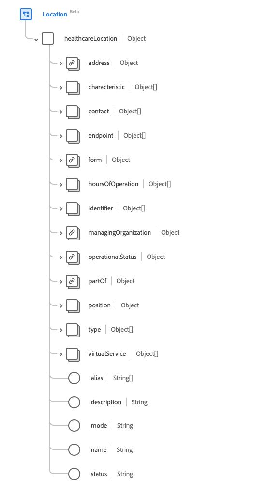

# [!UICONTROL Location] schemaveldgroep

[!UICONTROL Location] is een standaardgroep van het schemagebied voor de [[!DNL Location]  klasse ](../classes/location.md). Het biedt één veld van het objecttype `healthcareLocation` waarin details en positiegegevens voor een plaats worden vastgelegd.

| Weergavenaam | Eigenschap | Gegevenstype | Beschrijving |
| --- | --- | --- | --- |
| [!UICONTROL Address] | `address` | [[!UICONTROL Address]](../data-types/address.md) | Het adres van de fysieke locatie. |
| [!UICONTROL Characteristic] | `characteristic` | Array van [[!UICONTROL Codeable Concept]](../data-types/codeable-concept.md) | Een verzameling van de kenmerken van de locatie. |
| [!UICONTROL Contact] | `contact` | Array van [[!UICONTROL Extended Contact Details]](../data-types/extended-contact-detail.md) | De contactgegevens voor de locatie. |
| [!UICONTROL Endpoint] | `endpoint` | Array van [[!UICONTROL Reference]](../data-types/reference.md) | De technische eindpunten die toegang verlenen tot de exploitatiediensten voor de locatie. |
| [!UICONTROL Form] | `form` | [[!UICONTROL Codeable Concept]](../data-types/codeable-concept.md) | De fysieke vorm van de locatie. |
| [!UICONTROL Hours of Operation] | `hoursOfOperation` | Array van [[!UICONTROL Availability]](../data-types/availability.md) | Welke dagen en tijden deze plaats typisch open is (met inbegrip van uitzonderingen). |
| [!UICONTROL Identifier] | `identifier` | Array van [[!UICONTROL Identifier]](../data-types/identifier.md) | De unieke code of het unieke nummer dat de locatie identificeert. |
| [!UICONTROL Managing Organization] | `managingOrganization` | [[!UICONTROL Reference]](../data-types/reference.md) | De organisatie die verantwoordelijk is voor levering en onderhoud. |
| [!UICONTROL Operational Status] | `operationalStatus` | [[!UICONTROL Coding]](../data-types/coding.md) | De operationele status voor de locatie. |
| [!UICONTROL Part Of Location] | `partOf` | [[!UICONTROL Reference]](../data-types/reference.md) | De locatie waarvan deze locatie deel uitmaakt. |
| [!UICONTROL Position] | `position` | Object | De absolute geografische locatie. Bevat drie eigenschappen in de indeling Double: <li>`longitude`: Lengtegraad met WGS84-datum</li> <li>`latitude`: Latitude met WGS84-datum.</li> <li>`altitude`: Hoogte met WGS84-datum.</li> |
| [!UICONTROL Type] | `type` | Array van [[!UICONTROL Codeable Concept]](../data-types/codeable-concept.md) | Het type functie dat op de locatie wordt uitgevoerd. |
| [!UICONTROL Virtual Service] | `virtualService` | Array van [[!UICONTROL Virtual Service Detail]](../data-types/virtual-service-detail.md) | De verbindingsgegevens van een virtuele service. |
| [!UICONTROL Alias] | `alias` | Array van tekenreeksen | Een lijst met alternatieve namen die de locatie wordt of werd genoemd. |
| [!UICONTROL Description] | `description` | String | Nadere informatie om de locatie buiten de naam te identificeren. |
| [!UICONTROL Mode] | `mode` | String | De modus van de locatie. De waarde van deze eigenschap moet gelijk zijn aan een van de volgende bekende opsommingswaarden. <li> `instance` </li> <li> `kind` </li> |
| [!UICONTROL Name] | `name` | String | De naam van de locatie. |
| [!UICONTROL Status] | `status` | String | De status van de locatie. De waarde van deze eigenschap moet gelijk zijn aan een van de volgende bekende opsommingswaarden. <li> `active` </li> <li> `inactive` </li> <li> `suspended` </li> |

Raadpleeg de openbare XDM-opslagplaats voor meer informatie over de veldgroep:

* [ Bevolkt voorbeeld ](https://github.com/adobe/xdm/blob/master/extensions/industry/healthcare/fhir/fieldgroups/location.example.1.json)
* [ Volledig schema ](https://github.com/adobe/xdm/blob/master/extensions/industry/healthcare/fhir/fieldgroups/location.schema.json)
