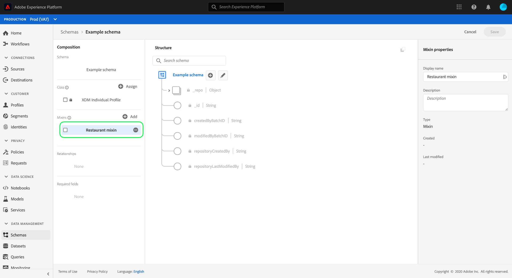

# Gegevenstypen maken en bewerken met de gebruikersinterface van het Experience Platform

In het Model van Gegevens van de Ervaring (XDM), worden de gegevenstypes gebruikt als verwijzing-type gebieden in klassen of mengelingen op de zelfde manier zoals fundamentele letterlijke gebieden, met het belangrijkste verschil dat de gegevenstypes veelvoudige subfields kunnen bepalen. Hoewel gelijkaardig aan mengelingen in zoverre zij voor het verenigbare gebruik van een multi-gebiedstructuur toestaan, zijn de gegevenstypes flexibeler omdat zij overal in de schemastructuur kunnen worden omvat terwijl de mengelingen slechts op het wortelniveau kunnen worden toegevoegd.

Adobe Experience Platform biedt vele standaardgegevenstypen die kunnen worden gebruikt voor een groot aantal gangbare praktijkbeheertoepassingen. U kunt echter ook uw eigen aangepaste gegevenstypen definiëren om aan uw unieke bedrijfsbehoeften te voldoen.

Deze zelfstudie behandelt de stappen voor het maken en bewerken van aangepaste gegevenstypen in de gebruikersinterface van het Platform.

## Vereisten

Deze zelfstudie vereist een goed begrip van XDM System. Verwijs naar het [XDM overzicht](../home.md) voor een inleiding aan de rol van XDM binnen het Experience Platform ecosysteem, en de [grondbeginselen van schemacompositie](../schema/composition.md) voor hoe de gegevenstypes tot XDM schema&#39;s bijdragen.

Hoewel niet vereist voor deze zelfstudie, wordt aanbevolen dat u ook de zelfstudie over het [samenstellen van een schema in de gebruikersinterface](./create-schema-ui.md) volgt om uzelf vertrouwd te maken met de verschillende mogelijkheden van de [!DNL Schema Editor].

## Open het dialoogvenster [!DNL Schema Editor] voor een gegevenstype

Selecteer in de interface van het Platform de optie **[!UICONTROL Schema]** in de linkernavigatie om de werkruimte [!UICONTROL Schema] te openen en selecteer vervolgens het tabblad **[!UICONTROL Gegevenstypen]** . Een lijst van beschikbare gegevenstypes wordt getoond, met inbegrip van die door Adobe worden bepaald evenals die die door uw organisatie worden gecreeerd.

Hier hebt u twee opties:

* [Een nieuw gegevenstype maken](#create)
* [Een bestaand gegevenstype selecteren om te bewerken](#edit)

### Een nieuw gegevenstype maken {#create}

Selecteer op het tabblad **[!UICONTROL Gegevenstypen]** de optie **[!UICONTROL Gegevenstype]** maken.

De [!DNL Schema Editor] weergave toont de huidige structuur van het nieuwe gegevenstype in het canvas. Aan de rechterkant van de editor kunt u een weergavenaam en een optionele beschrijving voor het gegevenstype opgeven. Zorg ervoor dat u een unieke en beknopte naam voor uw gegevenstype opgeeft, omdat dit zo is dat het wordt geïdentificeerd wanneer u het aan een schema toevoegt.

Deze zelfstudie maakt een gegevenstype dat een restauratie-eigenschap beschrijft, zodat het gegevenstype de weergavenaam &quot;Restaurant&quot; krijgt.

Ga verder met de [volgende sectie](#add-fields) om velden aan het gegevenstype toe te voegen.

### Een bestaand gegevenstype bewerken

Alleen aangepaste gegevenstypen die door uw organisatie zijn gedefinieerd, kunnen worden bewerkt. Als u de weergegeven lijst wilt verkleinen, selecteert u het filterpictogram () om besturingselementen voor filteren op basis van [!UICONTROL Eigenaar]weer te geven. Selecteer **[!UICONTROL Klant]** om alleen aangepaste gegevenstypen weer te geven die eigendom zijn van uw organisatie.

Selecteer in de lijst het gegevenstype dat u wilt bewerken om de rechtertrack te openen, met daarin de details van het gegevenstype. Selecteer de naam van het gegevenstype in de rechterspoorstaaf om de structuur in het [!DNL Schema Editor]gegevenstype te openen.

## Velden toevoegen aan het gegevenstype {#add-fields}

Als u velden wilt toevoegen aan het gegevenstype, selecteert u het **plusteken (+)** naast het veld op hoofdniveau op het canvas. Hieronder wordt een nieuw veld weergegeven en de rechtertrack wordt bijgewerkt met besturingselementen voor het nieuwe veld.

Gebruik de besturingselementen voor de rechtertrack om een **[!UICONTROL veldnaam]**, **[!UICONTROL weergavenaam]** en **[!UICONTROL Type]** voor het veld op te geven. Merk op dat het type van een gebied een basiscalar type (zoals een koord, een geheel, of booleaanse) kan zijn, of een ander multi-gebied gegevenstype kan vertegenwoordigen dat door Adobe of uw organisatie wordt bepaald.

Het gegevenstype Restaurant vereist een tekenreeksveld voor de naam van het restaurant. Als zodanig wordt de [!UICONTROL veldnaam] ingesteld als &quot;naam&quot; en wordt het [!UICONTROL type] ingesteld als [!UICONTROL tekenreeks]. Selecteer **[!UICONTROL Toepassen]** om de wijzigingen toe te passen op het veld.

Ga verder met hetzelfde proces voor het toevoegen van extra velden, te beginnen met het selecteren van de **plusknop (+)** naast het veld op hoofdniveau en het opgeven van de configuratiedetails in de rechterrail.

Het gegevenstype Restaurant heeft nu extra velden voor merk, zitcapaciteit en vloerruimte.

Naast basisvelden kunt u ook andere gegevenstypen nesten binnen het aangepaste gegevenstype. Het gegevenstype Restaurant vereist bijvoorbeeld een veld dat het fysieke adres van de eigenschap vertegenwoordigt. In dit scenario, kunt u een nieuw &quot;adres&quot;gebied toevoegen dat het standaardgegevenstype &quot;[!UICONTROL Postadres]&quot;wordt toegewezen.

Dit toont aan hoe de flexibele gegevenstypes in termen van het beschrijven van uw gegevens kunnen zijn: gegevenstypen kunnen velden gebruiken die ook gegevenstypen zijn, die zelf verdere gegevenstypen kunnen bevatten, enzovoort. Dit staat u toe om gemeenschappelijke gegevenspatronen door uw schema&#39;s te abstract en opnieuw te gebruiken XDM, die het gemakkelijker maken om complexe gegevensstructuren te vertegenwoordigen.

Nadat u alle velden aan het gegevenstype hebt toegevoegd, selecteert u **[!UICONTROL Opslaan]** om de wijzigingen op te slaan en het gegevenstype aan het gegevenstype toe te voegen [!DNL Schema Library].

## Het gegevenstype toevoegen aan een mix

Nadat u een gegevenstype hebt gemaakt, kunt u het in uw schema&#39;s gebruiken. Aangezien XDM-schema&#39;s bestaan uit een klasse en nul of meer combinaties, kunnen velden die door een gegevenstype worden verschaft, niet rechtstreeks aan een schema worden toegevoegd. In plaats daarvan moeten ze in een klasse of een mix worden opgenomen.

>[!NOTE]
>
>Deze sectie richt zich op het toevoegen van een gegevenstype aan een mengeling, aangezien dit het gemeenschappelijkste patroon voor de types van douanegegevens is. U kunt echter ook dezelfde stappen toepassen om uw gegevenstype aan een klasse toe te voegen.

U kunt het gegevenstype toevoegen aan een bestaande mix of een nieuwe mix maken. In beide gevallen, moet u [!DNL Schema Editor] voor een schema openen dat u van plan bent om het nieuwe gegevenstype aan toe te voegen, of door een bestaand schema van het **[!UICONTROL Browse]** lusje te selecteren, of door een nieuw schema volledig te creëren.

Als u het schema hebt geopend in het [!DNL Schema Editor]deelvenster, selecteert u de mix waaraan u het gegevenstype wilt toevoegen in de linkertrack. Als het schema geen aangewezen mengeling heeft, volg de stappen om een nieuwe mengeling [tot stand te](./create-schema-ui.md#define-mixin) brengen om aan het schema in plaats daarvan toe te voegen, en zorg ervoor dat de mixin in de linkerspoorstaaf wordt geselecteerd.

Selecteer de **plusknop (+)** naast de naam van het schema om een nieuw veld toe te voegen aan de geselecteerde mix. Wanneer u de eigenschap **[!UICONTROL Type]** voor het veld selecteert, wordt de naam van het gegevenstype dat u eerder hebt gemaakt, nu beschikbaar in de vervolgkeuzelijst. U kunt de naam van het gegevenstype beginnen te typen om het gemakkelijker te vinden.

Selecteer het gegevenstype in de lijst en selecteer vervolgens **[!UICONTROL Toepassen]**. Het schemagebied werkt op het canvas bij om de gestructureerde subgebieden te tonen die door het gegevenstype worden verstrekt. Als u het schema opslaat door **[!UICONTROL Opslaan]** te selecteren, wordt de mix ook opgeslagen, zodat u de mix opnieuw kunt gebruiken in aanvullende schema&#39;s die tot dezelfde klasse behoren.

>[!NOTE]
>
>Mixinen zijn slechts compatibel met één klasse. Als u uw gegevenstype in extra schema&#39;s wilt gebruiken die op verschillende klassen worden gebaseerd, moet u de bovenstaande stappen volgen om het gegevenstype aan extra mengen toe te voegen voorgenomen om die klassen uit te breiden.

## Volgende stappen

Deze zelfstudie besprak hoe u gegevenstypen kunt maken en bewerken en hoe u deze aan mixins kunt toevoegen met behulp van de [!DNL Schema Editor]module. Meer over het werken met gegevenstypes in UI, met inbegrip van hoe te om een multi-field voorwerp in een gegevenstype om te zetten, zie de [schemaaanmaakzelfstudie](./create-schema-ui.md#datatype).

Leren hoe te om een gegevenstype tot stand te brengen gebruikend de Registratie API van het Schema, zie de gids [van het](../api/data-types.md#create)gegevenstypepunteindpunt.