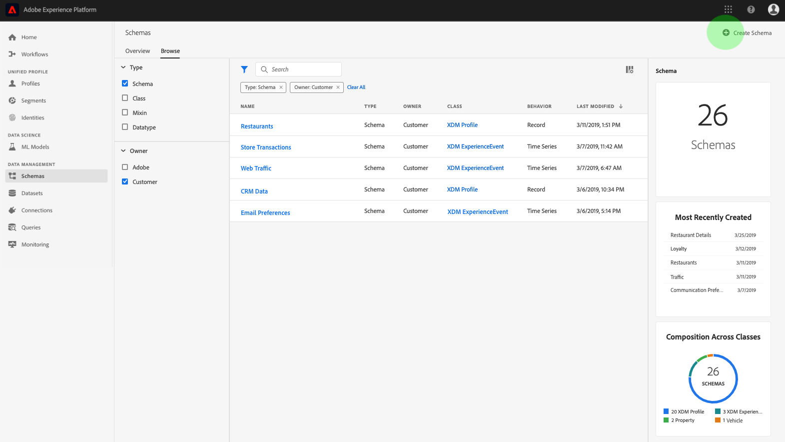
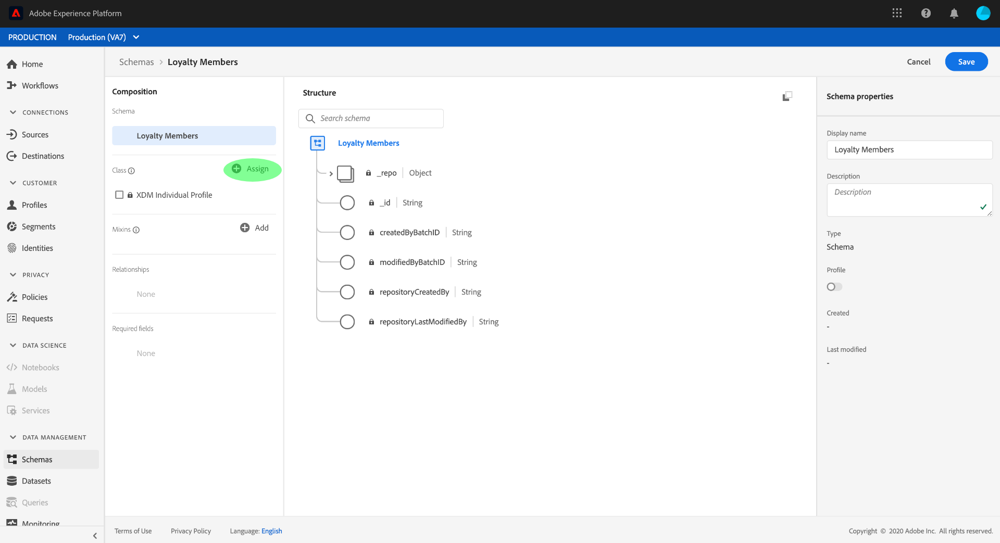
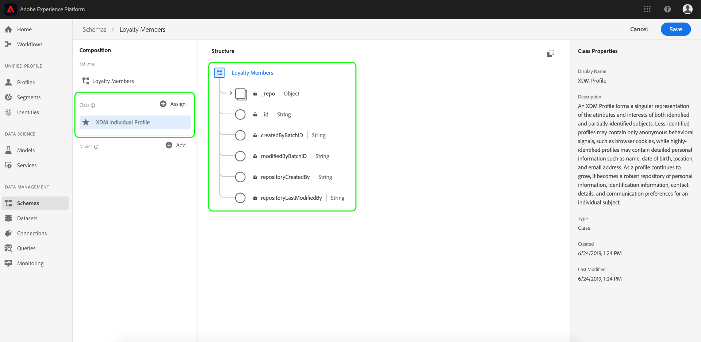
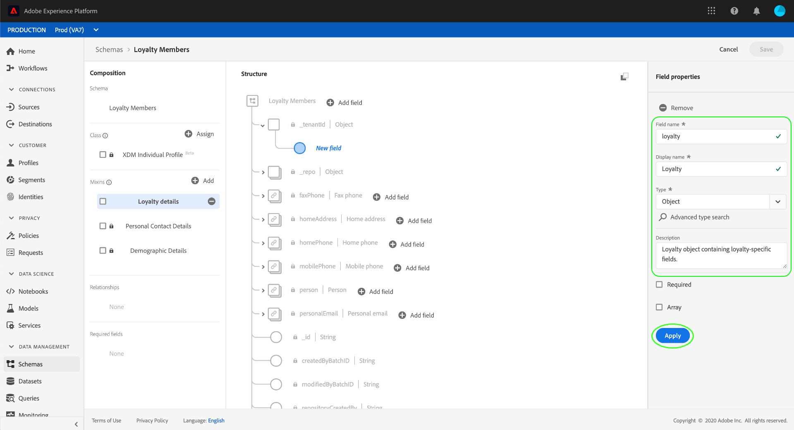
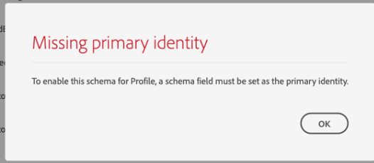
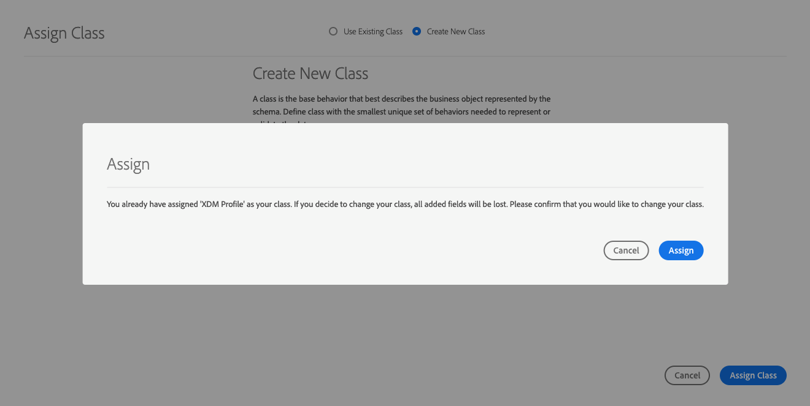

# Een schema maken met de Schema-editor

Het schemaregister biedt een gebruikersinterface en RESTful-API waarmee u alle bronnen in de Adobe Experience Platform-schemabibliotheek kunt weergeven en beheren. De schemabibliotheek bevat middelen die aan u door de partners van het Platform van de Ervaring, en verkopers ter beschikking worden gesteld van wie toepassingen u gebruikt, evenals middelen die u bepaalt en aan de Registratie van het Schema opslaat.

Deze zelfstudie behandelt de stappen voor het maken van een schema met behulp van de Schema-editor in het Experience Platform. Als u liever een schema samenstelt met de API voor de registratie van het schema, moet u eerst de handleiding voor [de ontwikkelaar van het](../api/getting-started.md) schemaregister lezen voordat u de zelfstudie [maakt met behulp van de API](create-schema-api.md).

Deze zelfstudie bevat ook stappen om een nieuwe klasse [te](#create-new-class) definiëren waarmee u een schema kunt samenstellen.

## Aan de slag

Deze zelfstudie vereist een goed begrip van de verschillende aspecten van het Adobe Experience Platform die betrokken zijn bij het gebruik van de Schema-editor. Lees vóór het starten van deze zelfstudie de documentatie voor de volgende concepten:

* [XDM (Experience Data Model)](../home.md): Het gestandaardiseerde kader waardoor Platform gegevens van de klantenervaring organiseert.
* [Basisbeginselen van de schemacompositie](../schema/composition.md): Een overzicht van schema&#39;s XDM en hun bouwstenen, met inbegrip van klassen, mengen, gegevenstypes, en gebieden.
* [Klantprofiel](../../profile/home.md)in realtime: Verstrekt een verenigd, real-time consumentenprofiel dat op bijeengevoegde gegevens van veelvoudige bronnen wordt gebaseerd.

Voor deze zelfstudie hebt u toegang tot het Experience Platform. Als u geen toegang tot een IMS Organisatie in het Platform van de Ervaring hebt, gelieve met uw systeembeheerder te spreken alvorens te werk te gaan.

## Door bestaande schema&#39;s in de werkruimte Schema&#39;s bladeren

De werkruimte van Schema&#39;s binnen het Platform van de Ervaring verstrekt een visualisatie van de Bibliotheek van het Schema, die u toestaat om alle schema&#39;s te bekijken en te beheren beschikbaar aan u, evenals nieuwe degenen samen te stellen. De werkruimte omvat ook de Redacteur van het Schema, het canvas waarop u een schema door dit leerprogramma zult samenstellen.

Nadat u zich hebt aangemeld bij Experience Platform, klikt u op **Schema** &#39;s in de linkernavigatie en gaat u naar de werkruimte Schemas. U zult een lijst van schema&#39;s (een vertegenwoordiging van de Bibliotheek van het Schema) zien waar u, alle schema&#39;s kunt bekijken beheren en aanpassen beschikbaar aan u. De lijst bevat de naam, het type, de klasse en het gedrag (record of tijdreeks) waarop het schema is gebaseerd, evenals de datum en tijd waarop het schema voor het laatst is gewijzigd.

Klik het filterpictogram naast de bar van het Onderzoek om het filtreren mogelijkheden voor alle middelen in de registratie, met inbegrip van klassen, mengen, en gegevenstypes te gebruiken.

## Een schema maken en een naam geven

Als u wilt beginnen met het samenstellen van een schema, klikt u op Schema **** maken in de rechterbovenhoek van de werkruimte Schema.

De *Schema-editor* wordt weergegeven. Dit is het canvas waarop u het schema wilt samenstellen. Wanneer u bij de redacteur aankomt, wordt een &quot;Naamloos Schema&quot;in de sectie van de *Structuur* van het canvas automatisch gecreeerd voor u beginnen aanpassend.

Aan de rechterkant van de editor staan de *schemaeigenschappen* , waar u een naam voor het schema kunt opgeven (met behulp van het veld **Weergavenaam** ). Nadat u een naam hebt ingevoerd, wordt het canvas bijgewerkt met de nieuwe naam van het schema.

Er zijn verscheidene belangrijke overwegingen om te maken wanneer het beslissen over een naam voor uw schema:

* De namen van het schema zouden kort en beschrijvend moeten zijn zodat het schema in de bibliotheek later gemakkelijk kan worden gevonden.
* Schemenamen moeten uniek zijn, wat betekent dat ze ook specifiek genoeg moeten zijn om in de toekomst niet opnieuw te worden gebruikt. Bijvoorbeeld, als uw organisatie afzonderlijke loyaliteitsprogramma&#39;s voor verschillende merken had, zou het verstandig zijn om uw schema &quot;Merk A Loyalty Leden&quot;te noemen om het gemakkelijk te maken om van andere loyaliteits-verwante regelingen onderscheid te maken u zou kunnen later bepalen.
* U kunt desgewenst aanvullende informatie over het schema opgeven in het veld **Beschrijving** .

Deze zelfstudie stelt een schema samen om gegevens met betrekking tot de leden van een loyaliteitsprogramma in te voeren, daarom wordt het schema genoemd &quot;Loyalty Leden&quot;.

## Een klasse toewijzen

Links in de editor bevindt zich de sectie *Compositie* . Het bevat momenteel twee subsecties: *Schema* en *Klasse*.

Nu het schema een naam heeft, is het tijd om de klasse toe te wijzen die het schema zal uitvoeren. Klik op **Toewijzen** naast *Klasse*.

Het dialoogvenster *Klasse* toewijzen wordt weergegeven. In dit venster wordt een lijst weergegeven met alle beschikbare klassen, inclusief alle klassen die door uw organisatie zijn gedefinieerd (de eigenaar is &quot;Klant&quot;) en standaardklassen die door Adobe zijn gedefinieerd.

Klik op de klassenaam om de beschrijving van de klasse weer te geven. U kunt ook een **voorbeeld van de klassenstructuur** weergeven om de velden en metagegevens weer te geven die aan de klasse zijn gekoppeld.

In deze zelfstudie wordt de klasse Individueel profiel XDM gebruikt. Klik op het keuzerondje naast de klasse om deze te selecteren en klik vervolgens op **Klasse** toewijzen.

Het canvas verschijnt weer. De sectie *Klasse* bevat nu de klasse die u hebt geselecteerd (XDM Individual Profile) en de velden die worden bijgedragen door de klasse Individueel profiel XDM zijn nu zichtbaar binnen de sectie *Structuur* .

De velden worden weergegeven in de notatie &quot;fieldName| Gegevenstype&quot;. De stappen voor het bepalen van schemagebieden in UI worden verstrekt later in dit leerprogramma.

>[!NOTE] U kunt de klasse van een schema [op om het even welk punt tijdens het aanvankelijke samenstellingsproces](#change-class) veranderen alvorens het schema is bewaard, maar dit zou met uiterste voorzichtigheid moeten worden gedaan. Mixins zijn alleen compatibel met bepaalde klassen. Als u de klasse wijzigt, worden het canvas en alle toegevoegde velden opnieuw ingesteld.

## Een mix toevoegen

Nu een klasse is toegewezen, bevat de sectie *Compositie* een derde subsectie: *Mixins*.

U kunt nu velden toevoegen aan uw schema door mixen toe te voegen. Een mix is een groep van één of meerdere gebieden die een bepaald concept beschrijven. Deze zelfstudie gebruikt mixins om de leden van het loyaliteitsprogramma te beschrijven en zeer belangrijke informatie zoals naam, verjaardag, telefoonaantal, adres, en meer te vangen.

Als u een mix wilt toevoegen, klikt u op **Toevoegen** in de subsectie *Mixins* .

Het dialoogvenster *Mixin* toevoegen wordt weergegeven. Mixins zijn alleen bedoeld voor gebruik met specifieke klassen. Daarom geeft de lijst met mixinen alleen die eigenschappen weer die compatibel zijn met de klasse die u hebt geselecteerd (in dit geval de klasse Individual Profile van XDM).

Als u het keuzerondje naast een mix selecteert, kunt u de **mixinstructuur** voorvertonen. Selecteer de mix Details van de Persoon van het Profiel, dan klik **Add Mixin**.

Het schemacanvas verschijnt opnieuw. In de sectie *Mixins* wordt nu de mix &quot;Details van profielpersoon&quot; weergegeven en in de sectie *Structuur* zijn de velden opgenomen die door de mix worden toegevoegd.

Deze mix levert verschillende velden onder de naam &quot;person&quot; op het hoogste niveau bij met het gegevenstype &quot;Person&quot;. In deze groep velden wordt informatie over een individu beschreven, zoals naam, geboortedatum en geslacht.

>[!NOTE] Herinner dat de gebieden scalaire types (zoals koord, geheel, serie, of datum) als gegevenstype, evenals om het even welk &quot;gegevenstype&quot;(een groep gebieden die een gemeenschappelijk concept vertegenwoordigen) in de Registratie van het Schema kunnen gebruiken.

Het veld &quot;name&quot; heeft een gegevenstype van het type &quot;Person Name&quot;, wat betekent dat het een algemeen concept beschrijft en naamgerelateerde subvelden bevat zoals voornaam, achternaam en volledige naam.

Klik op verschillende velden op het canvas om extra velden weer te geven die worden toegevoegd aan de schemastructuur.

## Een andere mix toevoegen

U kunt nu dezelfde stappen herhalen om een andere mix toe te voegen. Wanneer u dit keer het dialoogvenster *Mixin* toevoegen weergeeft, ziet u dat de mix &quot;Details van profielpersoon&quot; grijs is weergegeven en dat het keuzerondje ernaast niet kan worden geselecteerd. Zo voorkomt u dat u per ongeluk combinaties dupliceert die u al in het huidige schema hebt opgenomen.

U kunt nu de mix &quot;Persoonlijke gegevens profiel&quot; toevoegen vanuit het dialoogvenster *Mixin* toevoegen.

Nadat u het canvas hebt toegevoegd, verschijnt het weer. De &quot;Persoonlijke Details van het Profiel&quot;is nu vermeld onder *Mixins* in de sectie van de *Samenstelling* , en gebieden voor huisadres, mobiele telefoon, en meer zijn toegevoegd onder *Structuur*.

Net als in het veld Naam geven de velden die u zojuist hebt toegevoegd, concepten met meerdere velden weer. &quot;homeAddress&quot; heeft bijvoorbeeld een gegevenstype van &quot;Address&quot; en &quot;mobilePhone&quot; heeft een gegevenstype van &quot;Phone Number&quot;. U kunt op elk van deze gebieden klikken om hen uit te breiden en de extra gebieden te zien inbegrepen in het gegevenstype.

## Een nieuwe mix definiëren

Het schema &quot;Loyalty-leden&quot; is bedoeld voor het vastleggen van gegevens met betrekking tot de leden van een loyaliteitsprogramma, zodat het een aantal specifieke velden met betrekking tot loyaliteit vereist. Er zijn geen standaardmengingen beschikbaar die de noodzakelijke gebieden bevatten, daarom zult u een nieuwe mix moeten bepalen.

Wanneer u dit keer het dialoogvenster *Mixin* toevoegen opent, selecteert u Nieuwe **mixer** maken. Vervolgens wordt u gevraagd een **weergavenaam** en een **beschrijving** voor de mix op te geven.

Net als bij klassennamen moet de mixinnaam kort en eenvoudig zijn en beschrijven wat de mix aan het schema zal bijdragen. Ook deze zijn uniek, dus u kunt de naam niet opnieuw gebruiken en moet er dus voor zorgen dat deze voldoende specifiek is.

Geef voor deze zelfstudie de nieuwe mix de naam &quot;Loyalty Details&quot;.

Klik op Mixin **toevoegen** om terug te keren naar de schema-editor. &quot;Loyalty Details&quot; moeten nu worden weergegeven onder *Mixins* aan de linkerkant van het canvas, maar er zijn nog geen velden aan gekoppeld en daarom verschijnen er geen nieuwe velden onder *Structuur*.

## Velden toevoegen aan de mix

Nu u de mix &quot;Loyalty Details&quot;hebt gecreeerd, is het tijd om de gebieden te bepalen die de mixin aan het schema zal bijdragen.

Klik om te beginnen op de naam van de mix in de sectie *Mixins* . Zodra u dit doet, zullen de Eigenschappen *van de* Mixin op de rechterkant van de redacteur verschijnen en zal een **Add knoop van het Gebied** naast de naam van het schema onder *Structuur* verschijnen.

Klik op Veld **** toevoegen naast &quot;Loyalty-leden&quot; om een nieuw knooppunt in de structuur te maken. Dit knooppunt (in dit voorbeeld &#39;_huurderId&#39; genoemd) vertegenwoordigt de huurder-id van uw IMS-organisatie, voorafgegaan door een onderstrepingsteken. De aanwezigheid van huurder identiteitskaart wijst erop dat de gebieden u toevoegt in namespace van uw organisatie bevat zijn.

Met andere woorden, de velden die u toevoegt, zijn uniek voor uw organisatie en worden in het schemaregister opgeslagen in een specifiek gebied dat alleen voor uw IMS-organisatie toegankelijk is. Velden die u definieert, moeten altijd aan de naamruimte worden toegevoegd om conflicten te voorkomen met namen van andere standaardklassen, mixins, gegevenstypen en velden.

In dat knooppunt met naamruimte bevindt zich een &quot;Nieuw veld&quot;. Dit is het begin van de mix &quot;Loyalty Details&quot;.

Gebruikend de Eigenschappen *van het* Gebied op de rechterkant van de redacteur, begin door een &quot;loyaliteitsgebied&quot;met type &quot;Voorwerp te creëren dat zal worden gebruikt om uw loyaliteits-verwante gebieden te houden. Klik op **Toepassen** als u klaar bent.

De wijzigingen worden toegepast en het nieuwe &#39;loyalty&#39;-object wordt weergegeven. Klik naast het object op Veld **** toevoegen om aanvullende aan loyaliteit gerelateerde velden toe te voegen. Er wordt een &#39;&#39;Nieuw veld&#39;&#39; weergegeven en de sectie *Veldeigenschappen* is aan de rechterkant van het canvas zichtbaar.

Voor elk veld is de volgende informatie vereist:

* **Veldnaam:** De naam van het veld, geschreven in camelcase. Voorbeeld: loyaltyLevel
* **Weergavenaam:** De naam van het veld, geschreven in hoofdletters/kleine letters. Voorbeeld: Loyaliteitsniveau
* **Type:** Het gegevenstype van het veld. Dit omvat fundamentele scalaire types en om het even welke gegevenstypes die in de Registratie van het Schema worden bepaald. Voorbeelden: tekenreeks, geheel getal, Booleaans, Persoon, Adres, Telefoonnummer, enz.
* **Omschrijving:** Er moet een facultatieve beschrijving van het veld worden opgenomen, geschreven in geval van een zin. (max. 200 tekens)

Het eerste veld voor het object Loyalty is een tekenreeks met de naam &quot;loyaltyId&quot;. Wanneer u het nieuwe veldtype instelt op &quot;String&quot;, wordt het venster *Veldeigenschappen* gevuld met verschillende opties voor het toepassen van beperkingen, zoals **Standaardwaarde**, **Indeling** en **Maximale lengte**.

Welke beperkingsopties beschikbaar zijn, is afhankelijk van het geselecteerde gegevenstype. Aangezien &#39;loyaltyId&#39; een e-mailadres is, selecteert u &#39;email&#39; in het vervolgkeuzemenu **Indeling** . Selecteer **Toepassen** om uw wijzigingen toe te passen.

## Meer velden toevoegen om te mengen

Nu u het gebied &quot;loyaltyId&quot;hebt toegevoegd, kunt u extra gebieden toevoegen om loyaliteitsgerelateerde informatie zoals te vangen:

* Punten (geheel getal)
* Lid sinds (datum)

Elk veld wordt toegevoegd door op Veld **** toevoegen op het loyaliteitsobject te klikken en de vereiste informatie in te vullen.

Wanneer dit is voltooid, bevat het object Loyalty velden voor: Loyalty ID, Punten, en Lid sinds.

## Veld &#39;enum&#39; toevoegen om te mengen

Wanneer u velden in de Schema-editor definieert, zijn er enkele aanvullende opties die u kunt toepassen op elementaire veldtypen om de gegevens in het veld verder te beperken.

Een voorbeeld hiervan is een veld met het kenmerk Loyalty Level, waarbij de waarde slechts een van de vier mogelijke opties kan zijn. Als u dit veld aan het schema wilt toevoegen, klikt u op Veld **** toevoegen naast het object &quot;loyaliteit&quot; en vult u de vereiste velden in onder *Veldeigenschappen*.

Voor **Type** selecteert u &quot;String&quot; en ziet u extra selectievakjes voor **Array**, **Enum** en **Identity**.

Schakel het selectievakje **Enum** in om de sectie *Enum Values* hieronder te openen. Hier kunt u de **Waarde** (in camelCase) en het **Etiket** (een facultatieve, reader-vriendelijke naam in het Geval van de Titel) voor elk aanvaardbaar loyaliteitsniveau invoeren.

Als u alle veldeigenschappen hebt voltooid, klikt u op **Toepassen** en wordt het veld &quot;loyaltyLevel&quot; toegevoegd aan het object &quot;loyalty&quot;.

Meer informatie over beschikbare extra beperkingen:

* **Vereist:** Geeft aan dat het veld verplicht is voor gegevensinvoer. Om het even welke gegevens die aan een dataset worden geupload die op dit schema wordt gebaseerd dat dit gebied niet bevat zullen op opname ontbreken.
* **Array:** Geeft aan dat het veld een array van waarden bevat, elk met het opgegeven gegevenstype. Als u bijvoorbeeld een gegevenstype &quot;String&quot; selecteert en het selectievakje &quot;Array&quot; inschakelt, bevat het veld een array van tekenreeksen.
* **Enum:** Geeft aan dat dit veld een van de waarden uit een opsommingslijst met mogelijke waarden moet bevatten.
* **Identiteit:** Geeft aan dat dit veld een identiteitsveld is. Meer informatie over identiteitsvelden vindt u [later in deze zelfstudie](#identity-field).

## Een object met meerdere velden omzetten in een gegevenstype

Na het toevoegen van verscheidene loyaliteits-specifieke gebieden, bevat het &quot;loyaliteitsvoorwerp&quot;nu een gemeenschappelijke gegevensstructuur die in andere schema&#39;s nuttig zou kunnen zijn.

Wanneer u vindt dat een structuur met meerdere velden opnieuw kan worden gebruikt en u de flexibiliteit wilt hebben om die zelfde gegevensstructuur elders te gebruiken, maakt de Redacteur van het Schema het mogelijk om die structuur in een gegevenstype om te zetten.

De types van gegevens staan voor het verenigbare gebruik van multi-gebiedsstructuren toe en verstrekken meer flexibiliteit dan een mengeling omdat zij overal binnen een schema kunnen worden gebruikt. Dit wordt gedaan door het **Type** van een gebied in een mengeling aan dat van om het even welk die gegevenstype te plaatsen in de registratie wordt bepaald.

Als u het object &quot;loyalty&quot; wilt omzetten in een gegevenstype, klikt u op het veld &quot;loyalty&quot; onder *Structuur* en selecteert u **Converteren naar nieuw gegevenstype** aan de rechterkant van de editor onder *Veldeigenschappen*. Er verschijnt een kleine groene pop-up met de bevestiging &quot;Object omgezet in gegevenstype&quot;.

Als je nu onder *Structuur* kijkt, zie je dat het veld &quot;loyaliteit&quot; een gegevenstype &quot;Loyalty&quot; heeft en dat de velden kleine slotpictogrammen naast ze hebben die aangeven dat ze geen afzonderlijke velden meer zijn, maar deel uitmaken van een structuur met meerdere velden.

In een toekomstig schema, kon u een gebied nu toewijzen het **Type** van &quot;Loyalty&quot;en het zou automatisch het Niveau van de Loyalty, Punten, Lid sinds, en de gebieden van identiteitskaart van de Loyalty omvatten.

## Een schemaveld instellen als een identiteitsveld {#identity-field}

Schema&#39;s worden gebruikt voor het opnemen van gegevens in het Experience Platform en die gegevens worden uiteindelijk gebruikt om individuen te identificeren en informatie uit meerdere bronnen samen te voegen. Om dit proces te helpen, kunnen de zeer belangrijke gebieden als gebieden van de Identiteit worden gemerkt.

Met Experience Platform kunt u gemakkelijk een identiteitsveld aangeven met behulp van het selectievakje **Identiteit** in de Schema-editor.

Er kunnen bijvoorbeeld duizenden leden van het loyaliteitsprogramma zijn die tot hetzelfde &quot;niveau&quot; behoren, maar elk lid van het loyaliteitsprogramma heeft een unieke &quot;loyaltyId&quot; (wat in dit geval het e-mailadres van het individuele lid is). Het feit dat &quot;loyaltyId&quot;een uniek herkenningsteken voor elk lid is maakt het een goede kandidaat voor een identiteitsgebied, terwijl &quot;niveau&quot;niet is.

In de sectie van de *Structuur* van de redacteur, klik op het &quot;loyaltyId&quot;gebied dat u creeerde en u zult het checkbox van de **Identiteit** onder de Eigenschappen *van het* Gebied zien. Schakel het selectievakje in en u kunt dit instellen als de **primaire identiteit**. Controleer ook die doos.

Vervolgens moet u een **identiteitsnaamruimte opgeven**. Er zijn verschillende vooraf gedefinieerde naamruimten, maar aangezien &#39;loyaltyId&#39; het e-mailadres van het lid is, selecteert u &#39;E-mail&#39; in de vervolgkeuzelijst. U kunt nu op **Toepassen** klikken om de updates van het veld &quot;loyaltyId&quot; te bevestigen.

Nu zullen alle gegevens die in het &quot;loyaltyId&quot;gebied worden opgenomen worden gebruikt helpen die individu identificeren en één enkele mening van die klant verbinden.

>[!NOTE] Als een schemaveld eenmaal is ingesteld als primaire identiteit, ontvangt u een foutbericht als u later probeert een ander veld in het schema in te stellen als primaire identiteit. Elk schema mag slechts één primair identiteitsveld bevatten.

Raadpleeg de documentatie bij [Identiteitsservice](../../identity-service/home.md) voor meer informatie over het werken met identiteiten.

<!-- ## Relationship

Schemas define a static view of a concept, but do not provide specific details on how data based on these schemas (datasets, etc) may relate to one another. Adobe Experience Platform allows you to describe these relationships through the **Relationship** checkbox in the schema editor. 

In order to define a relationship, click on the field and check the **Relationship** checkbox on the right-side of the canvas. 

More information about relationships and other schema metadata can be found in the [Schema Registry API Developer Guide](../schema_registry_developer_guide.md). -->

## Het schema inschakelen voor gebruik in Real-time klantprofiel {#profile}

De Redacteur van het Schema verstrekt de capaciteit om een schema voor gebruik met het Profiel [van de Klant in](../../profile/home.md)real time toe te laten. Profiel biedt een holistische weergave van elke individuele klant door een robuust, 360°-profiel van klantkenmerken op te bouwen en een tijdstempelaccount van elke interactie die de klant heeft gehad op elk systeem dat is geïntegreerd met het Experience Platform.

Om een schema voor gebruik met het Profiel van de Klant in real time te kunnen worden toegelaten, moet het een primaire bepaalde identiteit hebben. Als u een schema wilt inschakelen zonder eerst een primaire identiteit te definiëren, ontvangt u het foutbericht &quot;Ontbrekende primaire identiteit&quot;.

Als u het schema &quot;Loyalty-leden&quot; wilt gebruiken in Profiel, klikt u eerst op &quot;Loyalty-leden&quot; in het gedeelte *Structuur* van de editor.

Aan de rechterkant van de editor, onder *Schema-eigenschappen*, wordt informatie over het schema weergegeven, inclusief de weergavenaam, beschrijving en type. Naast deze informatie is er een schakelknop met de naam **Profiel**.

Klik op **Profiel** en er verschijnt een pop-up met de vraag of u het schema wilt inschakelen voor Profiel.

>[!NOTE] Zodra een schema voor het Profiel van de Klant in real time is toegelaten en opgeslagen, kan het niet worden onbruikbaar gemaakt.

## Volgende stappen

Nu u klaar bent met het samenstellen van een schema van &quot;Loyalty Leden&quot;, kunt u het volledige schema in de sectie van de *Structuur* van de redacteur zien. Klik **sparen** en het schema zal aan de Bibliotheek van het Schema worden bewaard, makend het toegankelijk door de Registratie van het Schema.

Uw nieuwe schema kan nu worden gebruikt om gegevens in Platform in te voeren. Herinner dat zodra het schema is gebruikt om gegevens in te voeren, slechts de additieve veranderingen kunnen worden aangebracht. Zie de [grondbeginselen van schemacompositie](../schema/composition.md) voor meer informatie over schema versioning.

Het schema van &quot;Loyalty Leden&quot;is ook beschikbaar om te bekijken en te leiden gebruikend de Registratie API van het Schema. Om met API te beginnen te werken, begin door de de ontwikkelaarsgids [van de Registratie van het](../api/getting-started.md)Schema te lezen.

## Aanhangsel

De volgende informatie is een aanvulling op de zelfstudie voor de Schema-editor.

### Een nieuwe klasse maken {#create-new-class}

Het Platform van de ervaring verstrekt de flexibiliteit om een schema te bepalen dat op een klasse wordt gebaseerd die aan uw organisatie uniek is.

Open het dialoogvenster Klasse ** toewijzen door te klikken op **Toewijzen** in de sectie *Klasse* van de Schema-editor. Selecteer Nieuwe klasse **** maken in het dialoogvenster.

U kunt uw nieuwe klasse dan een Naam **van de** Vertoning (een korte, beschrijvende, unieke, en gebruikersvriendelijke naam voor de klasse), een **Beschrijving**, en een **Gedrag** (&quot;Verslag&quot;of &quot;Reeks van de Tijd&quot;) voor de gegevens geven het schema zal bepalen.

>[!NOTE] Wanneer het bouwen van een schema dat een klasse uitvoert die door uw organisatie wordt bepaald, herinner dat de mengen voor gebruik slechts met compatibele klassen beschikbaar zijn. Aangezien de klasse die u hebt gedefinieerd nieuw is, worden er geen compatibele combinaties weergegeven in het dialoogvenster *Mixin* toevoegen. In plaats daarvan moet u Nieuwe mix **** maken selecteren en een mix definiëren voor gebruik met die klasse. De volgende keer dat u een schema samenstelt dat de nieuwe klasse implementeert, wordt de mix die u hebt gedefinieerd vermeld en beschikbaar voor gebruik.

### De klasse van een schema wijzigen {#change-class}

Op elk ogenblik tijdens het aanvankelijke proces van de schemacompositie, alvorens het schema wordt bewaard, kunt u de klasse veranderen waarop het schema wordt gebaseerd.

>[!WARNING] Wees voorzichtig voordat u de klasse wijzigt. Mixins zijn alleen compatibel met bepaalde klassen. Als u de klasse wijzigt, wordt het canvas opnieuw ingesteld en worden alle velden verwijderd die u aan dat punt hebt toegevoegd.

Als u de klasse wilt wijzigen, klikt u op **Toewijzen** naast *Klasse* in het gedeelte *Compositie* van de editor.

Wanneer het dialoogvenster Klasse ** toewijzen wordt geopend, kunt u een nieuwe klasse kiezen in de beschikbare lijst. Klik op Klasse **** toewijzen en er wordt een nieuw dialoogvenster geopend waarin u wordt gevraagd te bevestigen dat u een nieuwe klasse wilt toewijzen.

Als u de klassenwijziging bevestigt, wordt het canvas opnieuw ingesteld en gaat alle voortgang van de compositie verloren.