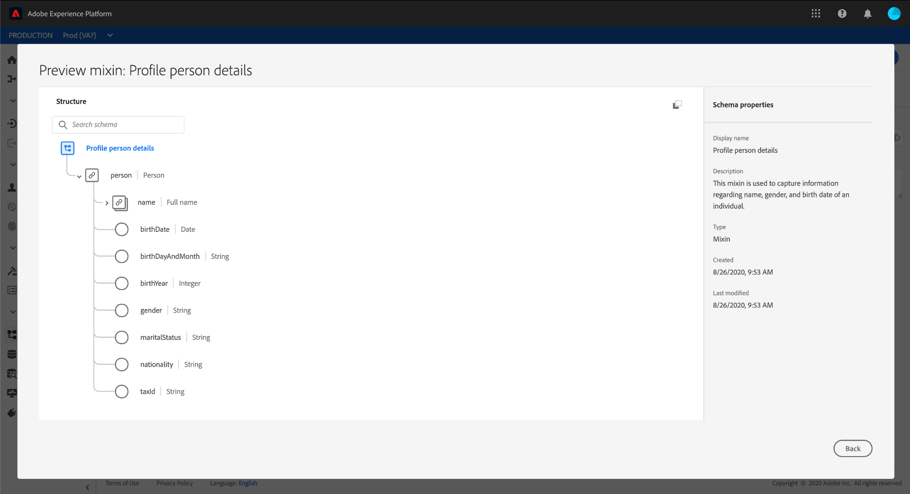
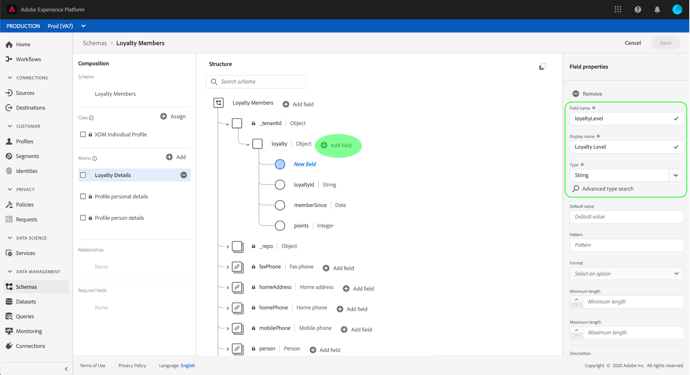

# Een schema maken met de [!DNL Schema Editor]

Met de Adobe Experience Platform-gebruikersinterface kunt u [!DNL Experience Data Model] (XDM)-schema&#39;s maken en beheren in een interactief visueel canvas met de naam [!DNL Schema Editor]. In deze zelfstudie wordt uitgelegd hoe u een schema maakt met de [!DNL Schema Editor].

>[!NOTE]
>
>Voor demonstratiedoeleinden, impliceren de stappen in dit leerprogramma het creëren van een voorbeeldschema dat leden van een programma van de klantenloyaliteit beschrijft. Terwijl u deze stappen kunt gebruiken om een verschillend schema voor uw eigen doeleinden tot stand te brengen, adviseert men dat u eerst samen met het creëren van het voorbeeldschema volgt om de mogelijkheden van [!DNL Schema Editor] te leren.

Als u verkiest om een schema samen te stellen gebruikend [!DNL Schema Registry] API in plaats daarvan, begin door [[!DNL Schema Registry] ontwikkelaarsgids](../api/getting-started.md) te lezen alvorens de leerprogramma [het creëren van een schema te proberen gebruikend API](create-schema-api.md).

## Aan de slag

Deze zelfstudie vereist een goed begrip van de verschillende aspecten van Adobe Experience Platform die bij het maken van schema&#39;s betrokken zijn. Lees vóór het starten van deze zelfstudie de documentatie voor de volgende concepten:

* [[!DNL Experience Data Model (XDM)]](../home.md): Het gestandaardiseerde kader waardoor de gegevens van de  [!DNL Platform] klantenervaring worden georganiseerd.
   * [Basisbeginselen van de schemacompositie](../schema/composition.md): Een overzicht van schema&#39;s XDM en hun bouwstenen, met inbegrip van klassen, mengen, gegevenstypes, en gebieden.
* [[!DNL Real-time Customer Profile]](../../profile/home.md): Verstrekt een verenigd, real-time consumentenprofiel dat op bijeengevoegde gegevens van veelvoudige bronnen wordt gebaseerd.

## De [!UICONTROL Schemas] werkruimte {#browse} openen

De [!UICONTROL Schemas] werkruimte in [!DNL Platform] UI verstrekt een visualisatie van [!DNL Schema Library], die u toestaat om de schema&#39;s te bekijken beschikbaar voor uw organisatie. De werkruimte omvat ook [!DNL Schema Editor], het canvas waarop u een schema door dit leerprogramma kunt samenstellen.

Nadat u zich hebt aangemeld bij [!DNL Experience Platform], selecteert u **[!UICONTROL Schemas]** in de linkernavigatie om de werkruimte **[!UICONTROL Schemas]** te openen. Het **[!UICONTROL Browse]** lusje toont een lijst van schema&#39;s (een vertegenwoordiging van [!DNL Schema Library]) die u kunt bekijken en aanpassen. De lijst bevat de naam, het type, de klasse en het gedrag (record of tijdreeks) waarop het schema is gebaseerd, evenals de datum en tijd waarop het schema voor het laatst is gewijzigd.

Zie de gids op [het onderzoeken van bestaande middelen XDM in UI](../ui/explore.md) voor meer informatie.

## Een schema maken en een naam geven {#create}

Als u wilt beginnen met het samenstellen van een schema, selecteert u **[!UICONTROL Create schema]** in de rechterbovenhoek van de werkruimte **[!UICONTROL Schemas]**. Er wordt een vervolgkeuzemenu weergegeven waarin u de keuze kunt maken tussen de kernklassen [!UICONTROL XDM Individual Profile] en [!UICONTROL XDM ExperienceEvent]. Als deze klassen niet aan uw doeleinden passen, kunt u **[!UICONTROL Browse]** ook selecteren om van andere beschikbare klassen te kiezen of [een nieuwe klasse te creëren](#create-new-class).

Selecteer **[!UICONTROL XDM Individual Profile]** voor deze zelfstudie.

Aangezien u een standaard XDM-klasse hebt gekozen om het schema op te baseren, wordt het dialoogvenster **[!UICONTROL Add mixin]** weergegeven, zodat u direct kunt beginnen met het toevoegen van velden aan het schema. Selecteer momenteel **[!UICONTROL Cancel]** om het dialoogvenster af te sluiten.

De [!DNL Schema Editor] verschijnt. Dit is het canvas waarop u het schema wilt samenstellen. Er wordt automatisch een naamloos schema gemaakt in de sectie **[!UICONTROL Structure]** van het canvas wanneer u de editor binnenkomt, samen met de standaardvelden die worden opgenomen in alle schema&#39;s die op die klasse zijn gebaseerd. De toegewezen klasse voor het schema wordt ook vermeld onder **[!UICONTROL Class]** in **[!UICONTROL Composition]** sectie.

>[!NOTE]
>
>U kunt [de klasse van een schema ](#change-class) op om het even welk punt tijdens het aanvankelijke samenstellingsproces veranderen alvorens het schema is bewaard, maar dit zou met uiterste voorzichtigheid moeten worden gedaan. Mixins zijn alleen compatibel met bepaalde klassen en als u de klasse wijzigt, worden het canvas en alle toegevoegde velden opnieuw ingesteld.

Gebruik de velden aan de rechterkant van de editor om een weergavenaam en een optionele beschrijving voor het schema op te geven. Nadat u een naam hebt ingevoerd, wordt het canvas bijgewerkt met de nieuwe naam van het schema.

Er zijn verscheidene belangrijke overwegingen om te maken wanneer het beslissen over een naam voor uw schema:

* De namen van het schema zouden kort en beschrijvend moeten zijn zodat het schema later gemakkelijk kan worden gevonden.
* Schemenamen moeten uniek zijn, wat betekent dat ze ook specifiek genoeg moeten zijn om in de toekomst niet opnieuw te worden gebruikt. Bijvoorbeeld, als uw organisatie afzonderlijke loyaliteitsprogramma&#39;s voor verschillende merken had, zou het verstandig zijn om uw schema &quot;Merk A Loyalty Leden&quot;te noemen om het gemakkelijk te maken om van andere loyaliteits-verwante regelingen onderscheid te maken u zou kunnen later bepalen.
* U kunt de schemabeschrijving ook gebruiken om het even welke extra contextafhankelijke informatie betreffende het schema te verstrekken.

Deze zelfstudie stelt een schema samen om gegevens met betrekking tot de leden van een loyaliteitsprogramma in te voeren, en daarom wordt het schema genoemd &quot;Loyalty Leden&quot;.

## Een mix toevoegen {#mixin}

U kunt nu velden toevoegen aan uw schema door mixen toe te voegen. Een mix is een groep van één of meerdere gebieden die vaak samen worden gebruikt om een bepaald concept te beschrijven. Deze zelfstudie gebruikt mixins om de leden van het loyaliteitsprogramma te beschrijven en zeer belangrijke informatie zoals naam, verjaardag, telefoonaantal, adres, en meer te vangen.

Als u een mix wilt toevoegen, selecteert u **[!UICONTROL Add]** in de **[!UICONTROL Mixins]**-subsectie.

Er wordt een nieuw dialoogvenster weergegeven met een lijst met beschikbare mixen. Elke mix is alleen bedoeld voor gebruik met een specifieke klasse. Daarom worden in het dialoogvenster alleen mengen weergegeven die compatibel zijn met de klasse die u hebt geselecteerd (in dit geval de klasse [!DNL XDM Individual Profile]). Als u een standaard XDM-klasse gebruikt, wordt de lijst met mixen op intelligente wijze gesorteerd op basis van de populariteit van het gebruik.

Als u een mix in de lijst selecteert, wordt deze weergegeven in de rechterspoorstaaf. U kunt desgewenst meerdere mixen selecteren en vervolgens de mixen toevoegen aan de lijst in de rechterrail voordat u de mixer bevestigt. Bovendien verschijnt er een pictogram aan de rechterkant van de geselecteerde mix, zodat u een voorbeeld kunt bekijken van de structuur van de velden die worden weergegeven.

Als u een voorbeeld van een mix bekijkt, wordt een gedetailleerde beschrijving van het schema van de mix gegeven in de rechterspoorstaaf. U kunt ook door de velden van de mix navigeren op het beschikbare canvas. Als u verschillende velden selecteert, wordt het rechterspoor bijgewerkt om details over het betreffende veld weer te geven. Selecteer **[!UICONTROL Back]** wanneer u klaar bent met het voorvertonen om naar het dialoogvenster van de mengselselectie terug te keren.

Selecteer voor deze zelfstudie de **[!UICONTROL Demographic Details]**-mix en selecteer **[!UICONTROL Add mixin]**.

Het schemacanvas verschijnt opnieuw. In de sectie **[!UICONTROL Mixins]** wordt nu &quot;[!UICONTROL Demographic Details]&quot; weergegeven en in de sectie **[!UICONTROL Structure]** worden de velden opgenomen die door de mix worden toegevoegd. U kunt de naam van de mix selecteren onder de sectie **[!UICONTROL Mixins]** om de specifieke velden te markeren die worden weergegeven binnen het canvas.

Deze mix levert verschillende velden onder de naam `person` op hoofdniveau bij met het gegevenstype &quot;[!UICONTROL Person]&quot;. In deze groep velden wordt informatie over een individu beschreven, zoals naam, geboortedatum en geslacht.

>[!NOTE]
>
>Onthoud dat velden scalaire typen kunnen gebruiken (zoals een tekenreeks, geheel getal, array of datum), evenals elk gegevenstype (een groep velden die een algemeen concept vertegenwoordigen) dat is gedefinieerd in [!DNL Schema Registry].

Het veld `name` heeft het gegevenstype &quot;[!UICONTROL Person name]&quot;. Dit houdt in dat het een algemeen concept beschrijft en naamgerelateerde subvelden bevat zoals voornaam, achternaam, hoffeleggende titel en achtervoegsel.

Selecteer de verschillende velden op het canvas om extra velden weer te geven die worden toegevoegd aan de schemastructuur.

## Een andere mix toevoegen {#mixin-2}

U kunt nu dezelfde stappen herhalen om een andere mix toe te voegen. Wanneer u het dialoogvenster **[!UICONTROL Add mixin]** deze keer weergeeft, ziet u dat de mix &quot;[!UICONTROL Demographic Details]&quot; grijs is weergegeven en dat het selectievakje naast de mix niet kan worden geselecteerd. Zo voorkomt u dat u per ongeluk combinaties dupliceert die u al in het huidige schema hebt opgenomen.

Voor deze zelfstudie selecteert u de &quot;[!DNL Personal Contact Details]&quot; mix in het dialoogvenster en selecteert u **[!UICONTROL Add mixin]** om deze aan het schema toe te voegen.

Nadat u het canvas hebt toegevoegd, verschijnt het weer. &quot;[!UICONTROL Personal Contact Details]&quot; wordt nu vermeld onder **[!UICONTROL Mixins]** in **[!UICONTROL Composition]** sectie, en gebieden voor huisadres, mobiele telefoon, en meer zijn toegevoegd onder **[!UICONTROL Structure]**.

Net als in het veld `name` vertegenwoordigen de velden die u zojuist hebt toegevoegd concepten met meerdere velden. `homeAddress` heeft bijvoorbeeld een gegevenstype &quot;[!UICONTROL Postal address]&quot; en `mobilePhone` heeft een gegevenstype &quot;[!UICONTROL Phone number]&quot;. U kunt elk van deze velden selecteren om deze uit te vouwen en de extra velden in het gegevenstype bekijken.

## Een aangepaste mix definiëren {#define-mixin}

Het schema &quot;[!UICONTROL Loyalty Members]&quot;is bedoeld om gegevens met betrekking tot de leden van een loyaliteitsprogramma te vangen, zodat zal het sommige specifieke op loyaliteit betrekking hebbende gebieden vereisen.

Er is een standaard [!UICONTROL Loyalty Details] mengsel dat u aan het schema kunt toevoegen om gemeenschappelijke gebieden met betrekking tot een loyaliteitsprogramma te vangen. Terwijl u sterk wordt aangemoedigd om standaardmengelingen te gebruiken om concepten te vertegenwoordigen die door uw schema&#39;s worden gevangen, zou de structuur van de standaardloyaliteitsmixin niet alle relevante gegevens voor uw bepaald loyaliteitsprogramma kunnen vangen. In dit scenario kunt u een nieuwe aangepaste mix definiëren om deze velden vast te leggen.

Open het dialoogvenster **[!UICONTROL Add Mixin]** opnieuw, maar selecteer **[!UICONTROL Create New Mixin]** nu boven. Vervolgens wordt u gevraagd een weergavenaam en beschrijving voor de mix op te geven.

Net als bij klassennamen moet de mixinnaam kort en eenvoudig zijn en beschrijven wat de mix aan het schema zal bijdragen. Ook deze zijn uniek, dus u kunt de naam niet opnieuw gebruiken en moet er dus voor zorgen dat deze voldoende specifiek is.

Geef voor deze zelfstudie de nieuwe mix de naam &quot;Loyalty Details&quot;.

Selecteer **[!UICONTROL Add mixin]** om op [!DNL Schema Editor] terug te komen. &quot;[!UICONTROL Loyalty Details]&quot; moet nu worden weergegeven onder **[!UICONTROL Mixins]** aan de linkerkant van het canvas, maar er zijn nog geen velden aan gekoppeld en daarom verschijnen er geen nieuwe velden onder **[!UICONTROL Structure]**.

## Velden toevoegen aan de mix {#mixin-fields}

Nu u de mix &quot;Loyalty Details&quot;hebt gecreeerd, is het tijd om de gebieden te bepalen die de mixin aan het schema zal bijdragen.

Selecteer eerst de mixnaam in de sectie **[!UICONTROL Mixins]**. Zodra u dit doet, verschijnen de eigenschappen van de mixin op de rechterkant van de redacteur en **plus (+)** verschijnt naast de naam van het schema onder **[!UICONTROL Structure]**.

Selecteer **plus (+)** pictogram naast &quot;[!DNL Loyalty Members]&quot;om een nieuwe knoop in de structuur tot stand te brengen. Dit knooppunt (in dit voorbeeld `_tenantId` genoemd) vertegenwoordigt de huurder-id van uw IMS-organisatie, voorafgegaan door een onderstrepingsteken. De aanwezigheid van huurder identiteitskaart wijst erop dat de gebieden u toevoegt in namespace van uw organisatie bevat zijn.

Met andere woorden, de velden die u toevoegt, zijn uniek voor uw organisatie en worden in het [!DNL Schema Registry] opgeslagen in een specifiek gebied dat alleen voor uw organisatie toegankelijk is. De gebieden u bepaalt moeten altijd aan uw huurdersnamespace worden toegevoegd om botsingen met namen van andere standaardklassen, mixins, gegevenstypes, en gebieden te verhinderen.

Binnen die namespaced knoop is &quot;[!UICONTROL New Field]&quot;. Dit is het begin van de &quot;[!UICONTROL Loyalty Details]&quot;mengeling.

Gebruikend de controles op de rechterkant van de redacteur, begin door een `loyalty` gebied met type &quot;[!UICONTROL Object]&quot;te creëren dat zal worden gebruikt om uw loyaliteits-verwante gebieden te houden. Selecteer **[!UICONTROL Apply]** als u klaar bent.

De wijzigingen worden toegepast en het nieuwe object `loyalty` wordt weergegeven. Selecteer het **plus (+)** pictogram naast het voorwerp om extra loyaliteitsgerelateerde gebieden toe te voegen. Er verschijnt een &quot;[!UICONTROL New Field]&quot; en de sectie **[!UICONTROL Field properties]** is zichtbaar aan de rechterkant van het canvas.

Voor elk veld is de volgende informatie vereist:

* **[!UICONTROL Field Name]:** De naam van het veld, geschreven in kamelagevallen. Voorbeeld: loyaltyLevel
* **[!UICONTROL Display Name]:** De naam van het veld, geschreven in hoofdletters/kleine letters. Voorbeeld: Loyaliteitsniveau
* **[!UICONTROL Type]:** Het gegevenstype van het veld. Dit omvat fundamentele scalaire types en om het even welke gegevenstypes die in [!DNL Schema Registry] worden bepaald. Voorbeelden: [!UICONTROL String], [!UICONTROL Integer], [!UICONTROL Boolean], [!UICONTROL Person], [!UICONTROL Address], [!UICONTROL Phone number], enz.
* **[!UICONTROL Description]:** Er moet een optionele beschrijving van het veld worden opgenomen, geschreven in een zin met maximaal 200 tekens.

Het eerste veld voor het object `Loyalty` is een tekenreeks met de naam `loyaltyId`. Wanneer u het type van het nieuwe veld instelt op &quot;[!UICONTROL String]&quot;, wordt de sectie **[!UICONTROL Field properties]** gevuld met verschillende opties voor het toepassen van beperkingen, zoals standaardwaarde, formaat en maximumlengte.

Welke beperkingsopties beschikbaar zijn, is afhankelijk van het geselecteerde gegevenstype. Aangezien `loyaltyId` een e-mailadres wordt, selecteert u &quot;[!UICONTROL email]&quot; in het vervolgkeuzemenu **[!UICONTROL Format]**. Selecteer **[!UICONTROL Apply]** om uw wijzigingen toe te passen.

## Meer velden toevoegen aan de mix {#mixin-fields-2}

Nu u het `loyaltyId` gebied hebt toegevoegd, kunt u extra gebieden toevoegen om loyaliteitsgerelateerde informatie zoals te vangen:

* Punten (geheel getal)
* Sinds lid (datum)

Als u elk veld aan het schema wilt toevoegen, selecteert u het **plus-pictogram (+)** naast het object `loyalty` en vult u de vereiste informatie in.

Wanneer voltooid, zal het voorwerp van de Loyalty gebieden voor loyauiteits identiteitskaart, punten, en lid-sinds bevatten.

## Een opsommingsveld toevoegen aan de mix {#enum}

Bij het definiëren van velden in de [!DNL Schema Editor] zijn er enkele extra opties die u kunt toepassen op standaardveldtypen om verdere beperkingen te bieden aan de gegevens die het veld kan bevatten. De gebruiksgevallen voor deze beperkingen worden in de volgende tabel uitgelegd:

| Restrictie | Beschrijving |
| --- | --- |
| [!UICONTROL Required] | Geeft aan dat het veld verplicht is voor gegevensinvoer. Om het even welke gegevens die aan een dataset worden geupload die op dit schema wordt gebaseerd dat dit gebied niet bevat zullen op opname ontbreken. |
| [!UICONTROL Array] | Geeft aan dat het veld een array van waarden bevat, elk met het opgegeven gegevenstype. Als u deze beperking bijvoorbeeld gebruikt voor een veld met het gegevenstype &quot;[!UICONTROL String]&quot;, geeft u op dat het veld een array van tekenreeksen zal bevatten. |
| [!UICONTROL Enum] | Geeft aan dat dit veld een van de waarden uit een opsommingslijst met mogelijke waarden moet bevatten. |
| [!UICONTROL Identity] | Geeft aan dat dit veld een identiteitsveld is. Meer informatie over identiteitsgebieden wordt verstrekt [later in dit leerprogramma](#identity-field). |
| [!UICONTROL Relationship] | Hoewel schemarelaties kunnen worden afgeleid door het gebruik van het samenvoegingsschema en [!DNL Real-time Customer Profile], is dit alleen van toepassing op schema&#39;s die dezelfde klasse delen. De [!UICONTROL Relationship] beperking wijst erop dat dit gebied verwijzingen de primaire identiteit van een schema dat op een verschillende klasse wordt gebaseerd, die een verhouding tussen de twee schema&#39;s impliceert. Zie de zelfstudie over [het definiëren van een relatie](./relationship-ui.md) voor meer informatie. |

>[!NOTE]
>
>Alle vereiste, identiteits- of relatievelden worden weergegeven in het linkerspoor, zodat u deze velden gemakkelijk kunt vinden, ongeacht de complexiteit van het schema.
>
>

Voor deze zelfstudie vereist het [!DNL "loyalty"]-object in het schema een nieuw enum-veld dat het &quot;loyaliteitsniveau&quot; van een klant beschrijft, waarbij de waarde slechts een van de vier mogelijke opties kan zijn. Als u dit veld aan het schema wilt toevoegen, selecteert u het pictogram **plus (+)** naast het object `loyalty` en vult u de vereiste velden in voor **[!UICONTROL Field name]** en **[!UICONTROL Display name]**. Selecteer &quot;[!UICONTROL String]&quot; voor **[!UICONTROL Type]**.

Er verschijnen extra selectievakjes voor het veld nadat het type is geselecteerd, waaronder selectievakjes voor **[!UICONTROL Array]**, **[!UICONTROL Enum]** en **[!UICONTROL Identity]**.

Schakel het selectievakje **[!UICONTROL Enum]** in om de onderstaande sectie **[!UICONTROL Enum values]** te openen. Hier kunt u **[!UICONTROL Value]** (in camelCase) en **[!UICONTROL Label]** (een facultatieve, reader-vriendschappelijke naam in het Geval van de Titel) voor elk aanvaardbaar loyaliteitsniveau invoeren.

Als u alle veldeigenschappen hebt voltooid, selecteert u **[!UICONTROL Apply]** om het veld &quot;[!DNL loyaltyLevel]&quot; toe te voegen aan het object `loyalty`.

## Een object met meerdere velden omzetten in een gegevenstype {#datatype}

Het `loyalty` voorwerp bevat nu verscheidene loyaliteitspecifieke gebieden, en vertegenwoordigt een gemeenschappelijke gegevensstructuur die in andere schema&#39;s nuttig zou kunnen zijn. Met [!DNL Schema Editor] kunt u gemakkelijk herbruikbare objecten met meerdere velden toepassen door de structuur van die objecten om te zetten in gegevenstypen.

De types van gegevens staan voor het verenigbare gebruik van multi-gebiedsstructuren toe en verstrekken meer flexibiliteit dan een mengeling omdat zij overal binnen een schema kunnen worden gebruikt. Dit wordt gedaan door de waarde **[!UICONTROL Type]** van het gebied aan dat van om het even welk gegevenstype te plaatsen die in [!DNL Schema Registry] wordt bepaald.

Als u het object `loyalty` wilt omzetten in een gegevenstype, selecteert u het veld `loyalty` onder **[!UICONTROL Structure]** en selecteert u **[!UICONTROL Convert to new data type]** rechts van de editor onder **[!UICONTROL Field properties]**. Er verschijnt een groene popover om te bevestigen dat het object is geconverteerd.

Wanneer u nu onder **[!UICONTROL Structure]** kijkt, ziet u dat het veld `loyalty` een gegevenstype heeft van &quot;[!DNL Loyalty]&quot; en dat de velden kleine vergrendelingspictogrammen naast de velden hebben, wat aangeeft dat het niet langer om afzonderlijke velden gaat, maar om een onderdeel van een gegevenstype met meerdere velden.

In een toekomstig schema, kon u een gebied nu toewijzen als &quot;[!DNL Loyalty]&quot;type en het zou automatisch gebieden voor identiteitskaart, loyaliteitsniveau, lid sinds, en punten omvatten.

>[!NOTE]
>
>U kunt ook aangepaste gegevenstypen maken en bewerken, onafhankelijk van het bewerken van schema&#39;s. Zie de handleiding bij [het maken en bewerken van gegevenstypen](../ui/resources/data-types.md) voor meer informatie.

## Schema-velden zoeken en filteren

Het schema bevat nu verschillende combinaties naast de velden die door de basisklasse worden verschaft. Wanneer u met grotere schema&#39;s werkt, kunt u de selectievakjes naast mixinnamen in de linkerrails selecteren om de weergegeven velden te filteren op de velden die alleen worden weergegeven door de mixins waarin u geïnteresseerd bent.

Als u naar een specifiek veld in uw schema zoekt, kunt u ook de zoekbalk gebruiken om weergegeven velden op naam te filteren, ongeacht onder welke combinatie deze velden staan.

>[!IMPORTANT]
>
>Bij de weergave van overeenkomende velden houdt de zoekfunctie rekening met eventuele geselecteerde mixfilters. Als een onderzoeksvraag niet de resultaten toont u verwacht, kunt u moeten tweemaal controleren dat u geen relevante mengen filtreert.

## Een schemaveld instellen als een identiteitsveld {#identity-field}

De standaard gegevensstructuur die schema&#39;s verstrekken kan worden gebruikt om gegevens te identificeren die tot het zelfde individu over veelvoudige bronnen behoren, die voor diverse stroomafwaartse gebruiksgevallen zoals segmentatie, rapportering, gegevenswetenschapsanalyse, en meer toestaan. Als u gegevens op basis van individuele identiteiten wilt koppelen, moeten sleutelvelden worden gemarkeerd als [!UICONTROL Identity] velden binnen toepasselijke schema&#39;s.

[!DNL Experience Platform] maakt het gemakkelijk om een identiteitsgebied door het gebruik van een  **[!UICONTROL Identity]** checkbox in  [!DNL Schema Editor]te wijzen. U moet echter bepalen welk veld de beste kandidaat is om als identiteit te gebruiken, op basis van de aard van uw gegevens.

Er kunnen bijvoorbeeld duizenden leden van het loyaliteitsprogramma zijn die tot hetzelfde &quot;loyaliteitsniveau&quot; behoren, maar elk lid van het loyaliteitsprogramma heeft een unieke `loyaltyId` (wat in dit geval het e-mailadres van het individuele lid is). Het feit dat `loyaltyId` een uniek herkenningsteken voor elk lid is maakt het een goede kandidaat voor een identiteitsgebied, terwijl `loyaltyLevel` niet is.

>[!IMPORTANT]
>
>De stappen hieronder beschrijven hoe te om een identiteitsbeschrijver aan een bestaand schemagebied toe te voegen. Als alternatief voor het definiëren van identiteitsvelden binnen de structuur van het schema zelf, kunt u ook een veld `identityMap` gebruiken om identiteitsgegevens te bevatten.
>
>Als u van plan bent om `identityMap` te gebruiken, houd in mening dat het om het even welke primaire identiteit zal met voeten treden u direct aan het schema toevoegt. Zie de sectie over `identityMap` in [grondbeginselen van schemacompositie gids](../schema/composition.md#identityMap) voor meer informatie.

Selecteer in de sectie **[!UICONTROL Structure]** van de editor het veld `loyaltyId` en schakel **[!UICONTROL Identity]** onder **[!UICONTROL Field properties]** in. Schakel het selectievakje in en kies de optie om dit in te stellen terwijl **[!UICONTROL Primary identity]** wordt weergegeven. Selecteer dit vak ook.

>[!NOTE]
>
>Elk schema mag slechts één primair identiteitsveld bevatten. Zodra een schemagebied als primaire identiteit is geplaatst, zult u een foutenmelding ontvangen als u later probeert om een ander identiteitsgebied in het schema als primaire identiteit te plaatsen.

Vervolgens moet u een **[!UICONTROL Identity namespace]** opgeven uit de lijst met vooraf gedefinieerde naamruimten in het vervolgkeuzemenu. Aangezien `loyaltyId` het e-mailadres van de klant is, selecteert u &quot;[!UICONTROL Email]&quot; in het vervolgkeuzemenu. Selecteer **[!UICONTROL Apply]** om de updates aan het `loyaltyId` gebied te bevestigen.

>[!NOTE]
>
>Zie de [[!DNL Identity Service] documentatie](../../identity-service/troubleshooting-guide.md#standard-namespaces) voor een lijst met standaardnaamruimten en de bijbehorende definities.

Nadat de wijziging is toegepast, wordt op het pictogram voor `loyaltyId` een vingerafdruksymbool weergegeven om aan te geven dat het nu een identiteitsveld is.

Alle gegevens die in het veld `loyaltyId` worden ingevoerd, worden nu gebruikt om die persoon te identificeren en één weergave van die klant samen te voegen. Raadpleeg de [[!DNL Identity Service]](../../identity-service/home.md) documentatie voor meer informatie over het werken met identiteiten in [!DNL Experience Platform].

## Het schema inschakelen voor gebruik in [!DNL Real-time Customer Profile] {#profile}

[[!DNL Real-time Customer Profile]](../../profile/home.md) Gebruikt identiteitsgegevens in  [!DNL Experience Platform] om een holistische mening van elke individuele klant te verstrekken. De service bouwt robuuste, 360°-profielen van klantkenmerken en tijdstempelde accounts van elke interactie die klanten hebben gehad in elk systeem dat is geïntegreerd met [!DNL Experience Platform].

Een schema kan alleen worden ingeschakeld voor gebruik met [!DNL Real-time Customer Profile] als er een primaire identiteit is gedefinieerd. Er wordt een foutbericht weergegeven als u een schema wilt inschakelen zonder eerst een primaire identiteit te definiëren.

 

Als u het schema &quot;Loyalty-leden&quot; wilt inschakelen voor gebruik in [!DNL Profile], selecteert u eerst &quot;[!DNL Loyalty Members]&quot; in het gedeelte **[!UICONTROL Structure]** van de editor.

Aan de rechterkant van de editor wordt informatie over het schema weergegeven, inclusief de weergavenaam, beschrijving en type. Naast deze informatie is er een schakelknop **[!UICONTROL Profile]**.

Selecteer **[!UICONTROL Profile]** en een popover verschijnt, vragend u om te bevestigen dat u wenst om het schema voor [!DNL Profile] toe te laten.

 

>[!WARNING]
>
>Als een schema eenmaal is ingeschakeld voor [!DNL Real-time Customer Profile] en is opgeslagen, kan het niet worden uitgeschakeld.

Selecteer **[!UICONTROL Enable]** om uw keuze te bevestigen. U kunt de **[!UICONTROL Profile]** knevel opnieuw selecteren om het schema onbruikbaar te maken als u wenst, maar zodra het schema is bewaard terwijl [!DNL Profile] wordt toegelaten, kan het niet meer worden onbruikbaar gemaakt.

## Volgende stappen en extra bronnen

Nu u klaar bent met het samenstellen van het schema, kunt u het volledige schema in het canvas zien. Selecteer **[!UICONTROL Save]** en het schema zal aan [!DNL Schema Library] worden bewaard, die het toegankelijk door [!DNL Schema Registry] maken.

Uw nieuwe schema kan nu worden gebruikt om gegevens in [!DNL Platform] in te voeren. Herinner dat zodra het schema is gebruikt om gegevens in te voeren, slechts de additieve veranderingen kunnen worden aangebracht. Zie [grondbeginselen van schemacompositie](../schema/composition.md) voor meer informatie over schema versioning.

U kunt nu de zelfstudie op [het bepalen van een schemaverhouding in UI](./relationship-ui.md) volgen om een nieuw relatieveld aan het schema van de &quot;Leden van de Waardigheid&quot;toe te voegen.

Het schema &quot;Loyalty members&quot; is ook beschikbaar voor weergave en beheer met de API [!DNL Schema Registry]. Als u met de API wilt gaan werken, begint u met het lezen van de [[!DNL Schema Registry API] ontwikkelaarshandleiding](../api/getting-started.md).

### Videobronnen

>[!WARNING]
>
>De interface [!DNL Platform] die in de volgende video&#39;s wordt getoond is verouderd. Raadpleeg de bovenstaande documentatie voor de meest recente schermafbeeldingen en functionaliteit van de gebruikersinterface.

De volgende video toont hoe te om een eenvoudig schema in [!DNL Platform] UI tot stand te brengen.

>[!VIDEO](https://video.tv.adobe.com/v/27012?quality=12&learn=on)

De volgende video is bedoeld om uw inzicht in het werken met mixins en klassen te versterken.

>[!VIDEO](https://video.tv.adobe.com/v/27013?quality=12&learn=on)

## Aanhangsel

De volgende secties verstrekken extra informatie betreffende het gebruik van [!DNL Schema Editor].

### Een nieuwe klasse maken {#create-new-class}

[!DNL Experience Platform] biedt de flexibiliteit om een schema te definiëren dat is gebaseerd op een klasse die uniek is voor uw organisatie. Leer hoe te om een nieuwe klasse tot stand te brengen, zie de gids op [creërend en het uitgeven klassen in UI](../ui/resources/classes.md#create).

### De klasse van een schema wijzigen {#change-class}

U kunt de klasse van een schema op om het even welk punt tijdens het aanvankelijke samenstellingsproces veranderen alvorens het schema is bewaard.

>[!WARNING]
>
>Het opnieuw toewijzen van de klasse voor een schema zou met uiterste voorzichtigheid moeten worden gedaan. Mixins zijn alleen compatibel met bepaalde klassen en als u de klasse wijzigt, worden het canvas en alle toegevoegde velden opnieuw ingesteld.

Leer hoe te om de klasse van een schema te veranderen, zie de gids op [het beheren van schema&#39;s in UI](../ui/resources/schemas.md).
