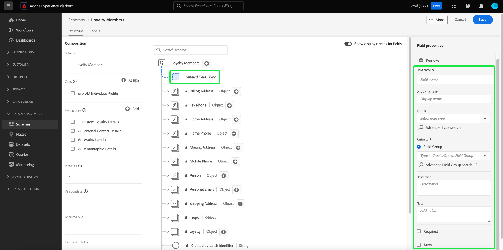

# Een schema maken met de opdracht [!DNL Schema Editor]

Met de Adobe Experience Platform-gebruikersinterface kunt u [!DNL Experience Data Model] (XDM) schema&#39;s in een interactief visueel canvas genoemd [!DNL Schema Editor]. In deze zelfstudie wordt uitgelegd hoe u een schema kunt maken met de [!DNL Schema Editor].

Voor demonstratiedoeleinden, impliceren de stappen in dit leerprogramma het creëren van een voorbeeldschema dat leden van een programma van de klantenloyaliteit beschrijft. Terwijl u deze stappen kunt gebruiken om een verschillend schema voor uw eigen doeleinden tot stand te brengen, adviseert men dat u eerst samen met het creëren van het voorbeeldschema volgt om de mogelijkheden van te leren [!DNL Schema Editor].

>[!NOTE]
>
>Als u CSV-gegevens in het Platform opgeeft, kunt u [kaart die gegevens aan een schema XDM dat door AI-Gegenereerde aanbevelingen wordt gecreeerd](../../ingestion/tutorials/map-csv/recommendations.md) (momenteel in bèta) zonder het schema zelf manueel te moeten creëren.
>
>Als u liever een schema samenstelt met de opdracht [!DNL Schema Registry] API, begin door te lezen [[!DNL Schema Registry] ontwikkelaarsgids](../api/getting-started.md) voordat u de zelfstudie hebt ingeschakeld [een schema maken met de API](create-schema-api.md).

## Aan de slag

Deze zelfstudie vereist een goed begrip van de verschillende aspecten van Adobe Experience Platform die bij het maken van schema&#39;s betrokken zijn. Lees vóór het starten van deze zelfstudie de documentatie voor de volgende concepten:

* [[!DNL Experience Data Model (XDM)]](../home.md): Het gestandaardiseerde kader waardoor [!DNL Platform] organiseert de gegevens van de klantenervaring.
   * [Basisbeginselen van de schemacompositie](../schema/composition.md): Een overzicht van schema&#39;s XDM en hun bouwstenen, met inbegrip van klassen, groepen van het schemagebied, gegevenstypes, en individuele gebieden.
* [[!DNL Real-Time Customer Profile]](../../profile/home.md): Verstrekt een verenigd, real-time consumentenprofiel dat op bijeengevoegde gegevens van veelvoudige bronnen wordt gebaseerd.

## Open de [!UICONTROL Schemas] werkruimte {#browse}

De [!UICONTROL Schemas] werkruimte in de [!DNL Platform] UI verstrekt een visualisatie van [!DNL Schema Library], zodat u de schema&#39;s die beschikbaar zijn voor uw organisatie kunt weergeven. De werkruimte bevat ook de [!DNL Schema Editor], het canvas waarop u een schema kunt samenstellen tijdens deze zelfstudie.

Nadat u zich hebt aangemeld [!DNL Experience Platform], selecteert u **[!UICONTROL Schemas]** in de linkernavigatie om de **[!UICONTROL Schemas]** werkruimte. De **[!UICONTROL Browse]** tabblad geeft een lijst met schema&#39;s weer (een weergave van de [!DNL Schema Library]) die u kunt weergeven en aanpassen. De lijst bevat de naam, het type, de klasse en het gedrag (record of tijdreeks) waarop het schema is gebaseerd, evenals de datum en tijd waarop het schema voor het laatst is gewijzigd.

Zie de handleiding op [bestaande XDM-bronnen in de gebruikersinterface verkennen](../ui/explore.md) voor meer informatie .

## Een schema maken en een naam geven {#create}

Selecteer **[!UICONTROL Create schema]** in de rechterbovenhoek van het dialoogvenster **[!UICONTROL Schemas]** werkruimte. Er wordt een vervolgkeuzemenu weergegeven waarin u de keuze hebt tussen de kernklassen [!UICONTROL XDM Individual Profile] en [!UICONTROL XDM ExperienceEvent]. Als deze klassen niet geschikt zijn voor uw doeleinden, kunt u ook **[!UICONTROL Browse]** om te kiezen uit andere beschikbare klassen of [een nieuwe klasse maken](#create-new-class).

In deze zelfstudie selecteert u **[!UICONTROL XDM Individual Profile]**.

De [!DNL Schema Editor] wordt weergegeven. Dit is het canvas waarop u het schema wilt samenstellen. Er wordt automatisch een naamloos schema gemaakt in het dialoogvenster **[!UICONTROL Structure]** van het canvas wanneer u in de editor aankomt, samen met de standaardvelden die in alle schema&#39;s zijn opgenomen die op die klasse zijn gebaseerd. De toegewezen klasse voor het schema wordt ook onder **[!UICONTROL Class]** in **[!UICONTROL Composition]** sectie.

>[!NOTE]
>
>U kunt [de klasse van een schema wijzigen](#change-class) op om het even welk punt tijdens het aanvankelijke samenstellingsproces alvorens het schema is bewaard, maar dit zou met uiterste voorzichtigheid moeten worden gedaan. Veldgroepen zijn alleen compatibel met bepaalde klassen. Als u de klasse wijzigt, worden het canvas en alle velden die u hebt toegevoegd opnieuw ingesteld.

Onder **[!UICONTROL Schema properties]** Geef een weergavenaam en een optionele beschrijving voor het schema op. Nadat u een naam hebt ingevoerd, wordt het canvas bijgewerkt met de nieuwe naam van het schema.

Er zijn verscheidene belangrijke overwegingen om te maken wanneer het beslissen over een naam voor uw schema:

* De namen van het schema zouden kort en beschrijvend moeten zijn zodat het schema later gemakkelijk kan worden gevonden.
* Schemenamen moeten uniek zijn, wat betekent dat ze ook specifiek genoeg moeten zijn om in de toekomst niet opnieuw te worden gebruikt. Bijvoorbeeld, als uw organisatie afzonderlijke loyaliteitsprogramma&#39;s voor verschillende merken had, zou het verstandig zijn om uw schema &quot;Merk A Loyalty Leden&quot;te noemen om het gemakkelijk te maken om van andere loyaliteits-verwante regelingen onderscheid te maken u zou kunnen later bepalen.
* U kunt de schemabeschrijving ook gebruiken om het even welke extra contextafhankelijke informatie betreffende het schema te verstrekken.

Deze zelfstudie stelt een schema samen om gegevens met betrekking tot de leden van een loyaliteitsprogramma in te voeren, en daarom wordt het schema genoemd &quot;[!DNL Loyalty Members]&quot;.

## Een veldgroep toevoegen {#field-group}

U kunt nu velden toevoegen aan uw schema door veldgroepen toe te voegen. Een veldgroep is een groep van een of meer velden die vaak samen worden gebruikt om een bepaald concept te beschrijven. Deze zelfstudie gebruikt veldgroepen om de leden van het loyaliteitsprogramma te beschrijven en belangrijke informatie zoals naam, verjaardag, telefoonaantal, adres, en meer te vangen.

Als u een veldgroep wilt toevoegen, selecteert u **[!UICONTROL Add]** in de **[!UICONTROL Field groups]** onderafdeling.

Er wordt een nieuw dialoogvenster weergegeven met een lijst met beschikbare veldgroepen. Elke veldgroep is alleen bedoeld voor gebruik met een specifieke klasse. Daarom worden in het dialoogvenster alleen veldgroepen weergegeven die compatibel zijn met de geselecteerde klasse (in dit geval de klasse [!DNL XDM Individual Profile] klasse). Als u een standaard XDM-klasse gebruikt, wordt de lijst met veldgroepen op intelligente wijze gesorteerd op basis van de populariteit van het gebruik.

U kunt een van de filters in de linkerraster selecteren om de lijst met standaardveldgroepen te beperken tot specifieke [industrieën](../schema/industries/overview.md) zoals detailhandel, financiële diensten, en gezondheidszorg.

Als u een veldgroep in de lijst selecteert, wordt deze weergegeven in de rechtertrack. U kunt desgewenst meerdere veldgroepen selecteren en deze aan de lijst in de rechtertrack toevoegen voordat u de groep bevestigt. Bovendien wordt aan de rechterkant van de momenteel geselecteerde veldgroep een pictogram weergegeven waarmee u een voorvertoning kunt weergeven van de structuur van de velden die worden weergegeven.

Als u een voorbeeld van een veldgroep bekijkt, wordt een gedetailleerde beschrijving van het schema van de veldgroep weergegeven in de rechtertrack. U kunt ook door de velden van de veldgroep navigeren op het beschikbare canvas. Als u verschillende velden selecteert, wordt het rechterspoor bijgewerkt om details over het betreffende veld weer te geven. Selecteren **[!UICONTROL Back]** als u klaar bent met de voorvertoning om terug te keren naar het dialoogvenster voor het selecteren van veldgroepen.

Selecteer voor deze zelfstudie de optie **[!UICONTROL Demographic Details]** veldgroep en selecteer vervolgens **[!UICONTROL Add field group]**.

Het schemacanvas verschijnt opnieuw. De **[!UICONTROL Field groups]** sectie nu lijsten &quot;[!UICONTROL Demographic Details]&quot; en de **[!UICONTROL Structure]** bevat de velden die worden toegevoegd door de veldgroep. U kunt de naam van de veldgroep selecteren onder de naam **[!UICONTROL Field groups]** om de specifieke velden te markeren die worden weergegeven op het canvas.

Deze veldgroep levert verschillende velden onder de naam van het hoogste niveau op `person` met het gegevenstype &quot;[!UICONTROL Person]&quot;. In deze groep velden wordt informatie over een individu beschreven, zoals naam, geboortedatum en geslacht.

>[!NOTE]
>
>Houd er rekening mee dat in velden scalaire typen (zoals een tekenreeks, geheel getal, array of datum) kunnen worden gebruikt, evenals elk gegevenstype (een groep velden die een algemeen concept vertegenwoordigen) dat is gedefinieerd in het dialoogvenster [!DNL Schema Registry].

Let erop dat de `name` veld heeft gegevenstype &quot;[!UICONTROL Full name]&quot;, wat betekent dat het ook een algemeen concept beschrijft en naamgerelateerde subvelden bevat, zoals voornaam, achternaam, hoffelijkheidstitel en achtervoegsel.

Selecteer de verschillende velden op het canvas om extra velden weer te geven die worden toegevoegd aan de schemastructuur.

## Meer veldgroepen toevoegen {#field-group-2}

U kunt nu dezelfde stappen herhalen om een andere veldgroep toe te voegen. Wanneer u de **[!UICONTROL Add field group]** deze keer wordt weergegeven, merkt u op dat &quot;[!UICONTROL Demographic Details]&quot; de veldgroep is grijs weergegeven en het selectievakje naast de veldgroep kan niet worden geselecteerd. Zo voorkomt u dat u per ongeluk veldgroepen dupliceert die u al in het huidige schema hebt opgenomen.

Selecteer voor deze zelfstudie de standaardveldgroepen **[!UICONTROL Personal Contact Details]** en **[!UICONTROL Loyalty Details]** in de lijst selecteert u vervolgens **[!UICONTROL Add field groups]** om deze aan het schema toe te voegen.

Het canvas verschijnt weer met toegevoegde veldgroepen die onder **[!UICONTROL Field groups]** in de **[!UICONTROL Composition]** en de bijbehorende samengestelde velden worden toegevoegd aan de schemastructuur.

## Een aangepaste veldgroep definiëren {#define-field-group}

De [!UICONTROL Loyalty Members] schema is bedoeld om gegevens te vangen met betrekking tot de leden van een loyaliteitsprogramma, en de norm [!UICONTROL Loyalty Details] de gebiedsgroep die u aan het schema toevoegde verstrekt het grootste deel van deze, met inbegrip van het programmatype, punten, bij datum aansluiten, en meer.

Er kan echter een scenario zijn waarin u extra aangepaste velden wilt opnemen die niet door standaardveldgroepen worden gedekt om uw gebruiksgevallen te bereiken. Als u velden voor aangepaste loyaliteit toevoegt, hebt u twee opties:

1. Maak een nieuwe aangepaste veldgroep om deze velden vast te leggen. Dit is de methode die in deze zelfstudie wordt behandeld.
1. De standaard uitbreiden [!UICONTROL Loyalty Details] veldgroep met aangepaste velden. Dit veroorzaakt [!UICONTROL Loyalty Details] om te zetten in een aangepaste veldgroep en de oorspronkelijke standaardveldgroep is niet meer beschikbaar. Zie de [!UICONTROL Schemas] UI-gids voor meer informatie over [aangepaste velden toevoegen aan de structuur van standaardveldgroepen](../ui/resources/schemas.md#custom-fields-for-standard-groups).

Als u een nieuwe veldgroep wilt maken, selecteert u **[!UICONTROL Add]** in de **[!UICONTROL Field groups]** subsectie zoals voorheen, maar selecteer deze keer **[!UICONTROL Create New Field group]** boven aan het dialoogvenster dat wordt weergegeven. Vervolgens wordt u gevraagd een weergavenaam en beschrijving op te geven voor de nieuwe veldgroep. Geef in deze zelfstudie de nieuwe veldgroep de naam &quot;[!DNL Custom Loyalty Details]&quot;, selecteert u vervolgens **[!UICONTROL Add field groups]**.

>[!NOTE]
>
>Net als bij klassennamen moet de naam van de veldgroep kort en eenvoudig zijn en beschrijven wat de veldgroep aan het schema zal bijdragen. Ook deze zijn uniek, dus u kunt de naam niet opnieuw gebruiken en moet er dus voor zorgen dat deze voldoende specifiek is.

&quot;[!DNL Custom Loyalty Details]&quot; nu onder **[!UICONTROL Field groups]** aan de linkerkant van het canvas, maar er zijn nog geen gebieden verbonden aan het en daarom verschijnen geen nieuwe gebieden onder **[!UICONTROL Structure]**.

## Velden toevoegen aan de veldgroep {#field-group-fields}

Nu hebt u &quot;[!DNL Custom Loyalty Details]&quot; veldgroep, is het tijd om de gebieden te bepalen die de gebiedsgroep aan het schema zal bijdragen.

Selecteer eerst de **plus (+)** naast de naam van het schema in het canvas.

Een &quot;[!UICONTROL Untitled Field]&quot; weergegeven op het canvas en de rechterrails worden bijgewerkt om configuratieopties voor het veld weer te geven.

In dit scenario, moet het schema een voorwerp-type gebied hebben dat de huidige loyaliteitsrij van de persoon in detail beschrijft. Begin met het gebruik van de besturingselementen in het rechterspoor een `loyaltyTier` veld met type &quot;[!UICONTROL Object]&quot; die wordt gebruikt voor de bijbehorende velden.

Onder **[!UICONTROL Assign to]** selecteert u een veldgroep waaraan u het veld wilt toewijzen. Houd er rekening mee dat alle schemavelden tot een klasse of een veldgroep behoren. Aangezien in dit schema een standaardklasse wordt gebruikt, kunt u alleen een veldgroep selecteren. Typ de naam &quot;[!DNL Custom Loyalty Details]&quot;, selecteert u vervolgens de veldgroep in de lijst.

Als u klaar bent, selecteert u **[!UICONTROL Apply]**.

De wijzigingen worden toegepast en de nieuwe `loyaltyTier` wordt weergegeven. Aangezien dit een aangepast veld is, wordt het automatisch genest binnen een object met de naam van de huurder-id van uw organisatie, voorafgegaan door een onderstrepingsteken (`_tenantId` in dit voorbeeld).

>[!NOTE]
>
>De aanwezigheid van het voorwerp van huurderidentiteitskaart wijst erop dat de gebieden u toevoegt in namespace van uw organisatie bevat zijn.
>
>Met andere woorden, de velden die u toevoegt, zijn uniek voor uw organisatie en worden opgeslagen in de [!DNL Schema Registry] in een specifiek gebied dat alleen voor uw organisatie toegankelijk is. De gebieden u bepaalt moeten altijd aan uw huurdersnamespace worden toegevoegd om botsingen met namen van andere standaardklassen, gebiedsgroepen, gegevenstypes, en gebieden te verhinderen.

Selecteer **plus (+)** pictogram naast `loyaltyTier` -object om subvelden toe te voegen. Er verschijnt een nieuwe plaatsaanduiding voor velden en de **[!UICONTROL Field properties]** is zichtbaar aan de rechterkant van het canvas.

Voor elk veld is de volgende informatie vereist:

* **[!UICONTROL Field Name]:** De naam van het veld, geschreven in camelcase. Voorbeeld: loyaltyLevel
* **[!UICONTROL Display Name]:** De naam van het veld, geschreven in hoofdletters/kleine letters. Voorbeeld: Loyaliteitsniveau
* **[!UICONTROL Type]:** Het gegevenstype van het veld. Dit omvat fundamentele scalaire types en om het even welke gegevenstypes die in [!DNL Schema Registry]. Voorbeelden: [!UICONTROL String], [!UICONTROL Integer], [!UICONTROL Boolean], [!UICONTROL Person], [!UICONTROL Address], [!UICONTROL Phone number], enz.
* **[!UICONTROL Description]:** Een optionele beschrijving van het veld moet maximaal 200 tekens bevatten.

Het eerste veld voor de `loyaltyTier` object wordt een tekenreeks genoemd `id`, die de id van de huidige laag van het loyaliteitslid vertegenwoordigt. Identiteitskaart van de rij zal uniek voor elk loyaliteitlid zijn, aangezien dit bedrijf verschillende die puntdrempels van de loyaliteitsrij voor elke klant plaatst op verschillende factoren wordt gebaseerd. Het nieuwe veldtype instellen op &quot;[!UICONTROL String]&quot;, en de **[!UICONTROL Field properties]** wordt gevuld met verschillende opties voor het toepassen van beperkingen, zoals standaardwaarde, opmaak en maximumlengte.

Sinds `id` een willekeurig gegenereerde vrije-vormtekenreeks, zijn geen verdere beperkingen meer nodig. Selecteren **[!UICONTROL Apply]** om uw wijzigingen toe te passen.

## Meer velden toevoegen aan de veldgroep {#field-group-fields-2}

Nu hebt u de `id` veld, kunt u extra velden toevoegen om informatie over de loyaliteitslaag vast te leggen, zoals:

* Huidige puntdrempel (geheel getal): Het minimale aantal loyaliteitspunten dat het lid moet handhaven om in de huidige rij te blijven.
* Drempel volgende tier (geheel getal): Het aantal trouwe punten dat het lid moet krijgen om naar het volgende niveau te kunnen afstuderen.
* Ingangsdatum (datum-tijd): De datum dat het loyaliteitslid zich bij deze rij aansloot.

Als u elk veld aan het schema wilt toevoegen, selecteert u de optie **plus (+)** pictogram naast `loyalty` -object en vul de vereiste gegevens in.

Wanneer voltooid, `loyaltyTier` object bevat velden voor `id`, `currentThreshold`, `nextThreshold`, en `effectiveDate`.

## Een opsommingsveld toevoegen aan de veldgroep {#enum}

Wanneer u velden definieert in het dialoogvenster [!DNL Schema Editor]Er zijn enkele aanvullende opties die u kunt toepassen op standaardveldtypen om extra beperkingen op te leggen aan de gegevens die het veld kan bevatten. De gebruiksgevallen voor deze beperkingen worden in de volgende tabel uitgelegd:

| Restrictie | Beschrijving |
| --- | --- |
| [!UICONTROL Required] | Geeft aan dat het veld verplicht is voor gegevensinvoer. Om het even welke gegevens die aan een dataset worden geupload die op dit schema wordt gebaseerd dat dit gebied niet bevat zullen op opname ontbreken. |
| [!UICONTROL Array] | Geeft aan dat het veld een array van waarden bevat, elk met het opgegeven gegevenstype. Als u deze beperking bijvoorbeeld gebruikt voor een veld met het gegevenstype &quot;[!UICONTROL String]&quot; specificeert dat het gebied een serie van koorden zal bevatten. |
| [!UICONTROL Enum & Suggested Values] | Een opsomming geeft aan dat dit veld een van de waarden uit een opsommingslijst met mogelijke waarden moet bevatten. U kunt deze optie ook gebruiken om alleen een lijst met voorgestelde waarden voor een tekenreeksveld op te geven zonder het veld tot die waarden te beperken. Zie de handleiding op [het definiëren van opsommingen en voorgestelde waarden](../ui/fields/enum.md) voor meer informatie over hoe te om deze soorten gebieden in UI te beheren. |
| [!UICONTROL Identity] | Geeft aan dat dit veld een identiteitsveld is. Meer informatie over identiteitsvelden is beschikbaar [later in deze zelfstudie](#identity-field). |
| [!UICONTROL Relationship] | Hoewel schemarelaties kunnen worden afgeleid door het gebruik van het union-schema en [!DNL Real-Time Customer Profile]Dit geldt alleen voor schema&#39;s die dezelfde klasse delen. De [!UICONTROL Relationship] beperking geeft aan dat dit veld verwijst naar de primaire identiteit van een schema op basis van een andere klasse, wat een relatie tussen de twee schema&#39;s impliceert. Zie de zelfstudie aan [definiëren van een relatie](./relationship-ui.md) voor meer informatie . |

{style=&quot;table-layout:auto&quot;}

>[!NOTE]
>
>Alle vereiste, identiteits- of relatievelden worden vermeld in hun respectieve secties in de linkertrack, zodat u deze velden gemakkelijk kunt vinden, ongeacht de complexiteit van het schema.

Voor deze zelfstudie `loyaltyTier` -object in het schema vereist een nieuw opsommingsveld dat de klasse tier beschrijft, waarbij de waarde slechts een van de vier mogelijke opties kan zijn. Als u dit veld aan het schema wilt toevoegen, selecteert u de optie **plus (+)** pictogram naast `loyaltyTier` object en vul de vereiste velden in voor **[!UICONTROL Field name]** en **[!UICONTROL Display name]**. Voor **[!UICONTROL Type]** selecteert u &quot;[!UICONTROL String]&quot;.

Er verschijnen extra selectievakjes voor het veld nadat het type is geselecteerd, waaronder selectievakjes voor **[!UICONTROL Array]**, **[!UICONTROL Enum & Suggested Values]**, **[!UICONTROL Identity]**, en **[!UICONTROL Relationship]**.

Selecteer **[!UICONTROL Enum & Suggested Values]** selectievakje en selecteer vervolgens **[!UICONTROL Enum]**. Hier kunt u de **[!UICONTROL Value]** (in camelCase) en **[!UICONTROL Display Name]** (een optionele, leesvriendelijke naam in het geval van Titel) voor elke acceptabele klasse van de loyaliteitslaag.

Als u alle veldeigenschappen hebt voltooid, selecteert u **[!UICONTROL Apply]** om de `tierClass` aan de `loyaltyTier` object.

## Een object met meerdere velden omzetten in een gegevenstype {#datatype}

De `loyaltyTier` Het object bevat nu verschillende velden en vertegenwoordigt een algemene gegevensstructuur die nuttig kan zijn in andere schema&#39;s. De [!DNL Schema Editor] Hiermee kunt u gemakkelijk herbruikbare objecten met meerdere velden toepassen door de structuur van die objecten om te zetten in gegevenstypen.

De types van gegevens staan voor het verenigbare gebruik van multi-gebiedsstructuren toe en verstrekken meer flexibiliteit dan een gebiedsgroep omdat zij overal binnen een schema kunnen worden gebruikt. Dit wordt gedaan door het gebied te plaatsen **[!UICONTROL Type]** de waarde van elk gegevenstype dat in de [!DNL Schema Registry].

Als u het dialoogvenster `loyaltyTier` -object naar een gegevenstype, selecteert u de optie `loyaltyTier` op het canvas en selecteert u vervolgens **[!UICONTROL Convert to new data type]** aan de rechterkant van de editor **[!UICONTROL Field properties]**.

Er wordt een melding weergegeven waarin wordt bevestigd dat het object is geconverteerd. Op het canvas kunt u nu zien dat de `loyaltyTier` field has now a link icon and the right rail indicates it has a data type of &quot;[!DNL Loyalty Tier]&quot;.

In een toekomstig schema kunt u nu een veld toewijzen als &quot;[!DNL Loyalty Tier]&quot; type en omvat automatisch velden voor ID, klasse op laag, puntdrempels en effectieve datum.

>[!NOTE]
>
>U kunt ook aangepaste gegevenstypen maken en bewerken, onafhankelijk van het bewerken van schema&#39;s. Zie de handleiding op [gegevenstypen maken en bewerken](../ui/resources/data-types.md) voor meer informatie .

## Schema-velden zoeken en filteren

Het schema bevat nu diverse veldgroepen naast de velden die door de basisklasse worden verschaft. Wanneer u met grotere schema&#39;s werkt, kunt u de selectievakjes naast veldgroepnamen in de linkerrail selecteren om de weergegeven velden te filteren op de velden die alleen worden weergegeven door de veldgroepen waarin u geïnteresseerd bent.

Als u een specifiek veld in uw schema zoekt, kunt u ook de zoekbalk gebruiken om weergegeven velden op naam te filteren, ongeacht de veldgroep waarin ze staan.

>[!IMPORTANT]
>
>De zoekfunctie houdt bij het weergeven van overeenkomende velden rekening met alle geselecteerde veldgroepfilters. Als een zoekquery de resultaten die u verwacht niet weergeeft, moet u mogelijk twee keer controleren of er geen relevante veldgroepen worden uitgefilterd.

## Een schemaveld instellen als een identiteitsveld {#identity-field}

De standaard gegevensstructuur die schema&#39;s verstrekken kan worden gebruikt om gegevens te identificeren die tot het zelfde individu over veelvoudige bronnen behoren, die voor diverse stroomafwaartse gebruiksgevallen zoals segmentatie, rapportering, gegevenswetenschapsanalyse, en meer toestaan. Om gegevens op basis van individuele identiteiten te koppelen, moeten de sleutelvelden worden gemarkeerd als [!UICONTROL Identity] velden binnen toepasselijke schema&#39;s.

[!DNL Experience Platform] maakt het gemakkelijk om een identiteitsgebied door het gebruiken van **[!UICONTROL Identity]** Selectievakje in het dialoogvenster [!DNL Schema Editor]. U moet echter bepalen welk veld de beste kandidaat is om als identiteit te gebruiken, op basis van de aard van uw gegevens.

Bijvoorbeeld, kunnen er duizenden leden van het loyaliteitsprogramma tot het zelfde loyaliteitsniveau behoren, en verscheidene die het zelfde fysieke adres kunnen delen. In dit scenario, echter, bij inschrijving verstrekt elk lid van het loyaliteitsprogramma zijn persoonlijk e-mailadres. Aangezien persoonlijke e-mailadressen meestal door één persoon worden beheerd, wordt het veld `personalEmail.address` (verstrekt door de [!UICONTROL Personal Contact Details] veldgroep) is een goede kandidaat voor een identiteitsveld.

>[!IMPORTANT]
>
>De stappen hieronder beschrijven hoe te om een identiteitsbeschrijver aan een bestaand schemagebied toe te voegen. Als alternatief voor het definiëren van identiteitsvelden binnen de structuur van het schema zelf, kunt u ook een `identityMap` in plaats daarvan identiteitsgegevens te bevatten.
>
>Als u van plan bent `identityMap`, houd in mening dat het om het even welke primaire identiteit zal met voeten treden u direct aan het schema toevoegt. Zie de sectie over `identityMap` in de [grondbeginselen van de schemacompositie](../schema/composition.md#identityMap) voor meer informatie .

Selecteer `personalEmail.address` op het canvas en de **[!UICONTROL Identity]** selectievakje wordt weergegeven onder **[!UICONTROL Field properties]**. Schakel het selectievakje in en stel dit in als de optie **[!UICONTROL Primary identity]** wordt weergegeven. Selecteer dit vak ook.

>[!NOTE]
>
>Elk schema mag slechts één primair identiteitsveld bevatten. Zodra een schemagebied als primaire identiteit is geplaatst, zult u een foutenmelding ontvangen als u later probeert om een ander identiteitsgebied in het schema als primaire identiteit te plaatsen.

Vervolgens moet u een **[!UICONTROL Identity namespace]** in de lijst met vooraf gedefinieerde naamruimten in het vervolgkeuzemenu. Aangezien dit veld het e-mailadres van de klant is, selecteert u &quot;[!UICONTROL Email]&quot; uit het vervolgkeuzemenu. Selecteren **[!UICONTROL Apply]** ter bevestiging van de bijwerkingen van de `personalEmail.address` veld.

>[!NOTE]
>
>Voor een lijst van standaardnamespaces en hun definities, zie [[!DNL Identity Service] documentatie](../../identity-service/troubleshooting-guide.md#standard-namespaces).

Nadat u de wijziging hebt toegepast, wordt het pictogram voor `personalEmail.address` geeft een vingerafdruksymbool weer dat aangeeft dat het nu een identiteitsveld is. Het veld wordt ook vermeld in het linkerspoor onder **[!UICONTROL Identities]**.

Nu alle gegevens die in de `personalEmail.address` wordt gebruikt om te helpen die persoon identificeren en één enkele mening van die klant verbinden. Meer informatie over het werken met identiteiten in [!DNL Experience Platform], bekijk de [[!DNL Identity Service]](../../identity-service/home.md) documentatie.

## Het schema inschakelen voor gebruik in [!DNL Real-Time Customer Profile] {#profile}

[[!DNL Real-Time Customer Profile]](../../profile/home.md) gebruikt identiteitsgegevens in [!DNL Experience Platform] een holistische visie op elke individuele klant te geven. De dienst bouwt robuuste, 360° profielen van klantenattributen evenals timestamped rekeningen van elke interactie die klanten over om het even welk systeem hebben geïntegreerd met [!DNL Experience Platform].

Een schema kan alleen worden ingeschakeld voor gebruik met [!DNL Real-Time Customer Profile], moet er een primaire identiteit worden gedefinieerd. Er wordt een foutbericht weergegeven als u een schema wilt inschakelen zonder eerst een primaire identiteit te definiëren.

Het schema &quot;Loyalty-leden&quot; inschakelen voor gebruik in [!DNL Profile]selecteert u eerst de titel van het schema in het canvas.

Rechts in de editor wordt informatie over het schema weergegeven, inclusief de weergavenaam, beschrijving en type. Naast deze informatie is er een **[!UICONTROL Profile]** schakelknop.

Selecteren **[!UICONTROL Profile]** en wordt een pop-up weergegeven met de vraag of u het schema wilt inschakelen voor [!DNL Profile].

>[!WARNING]
>
>Zodra een schema is toegelaten voor [!DNL Real-Time Customer Profile] en opgeslagen, kan deze niet worden uitgeschakeld.

Selecteren **[!UICONTROL Enable]** om uw keuze te bevestigen. U kunt de **[!UICONTROL Profile]** schakelen opnieuw om het schema uit te schakelen als u dit wenst, maar als het schema is opgeslagen terwijl [!DNL Profile] is ingeschakeld, kan deze niet meer worden uitgeschakeld.

## Volgende stappen en extra bronnen

Nu u klaar bent met het samenstellen van het schema, kunt u het volledige schema in het canvas zien. Selecteren **[!UICONTROL Save]** en het schema wordt opgeslagen in het [!DNL Schema Library], die toegankelijk worden gemaakt door de [!DNL Schema Registry].

Het nieuwe schema kan nu worden gebruikt om gegevens in te voeren in [!DNL Platform]. Herinner dat zodra het schema is gebruikt om gegevens in te voeren, slechts de additieve veranderingen kunnen worden aangebracht. Zie de [grondbeginselen van de schemacompositie](../schema/composition.md) voor meer informatie over schemaversie.

U kunt nu de zelfstudie volgen op [het bepalen van een schemaverhouding in UI](./relationship-ui.md) om een nieuw relatieveld aan het schema van &quot;Loyalty Leden&quot;toe te voegen.

Het schema &quot;Leden van de Loyalty&quot;is ook beschikbaar om te bekijken en te leiden gebruikend [!DNL Schema Registry] API. Als u met de API wilt gaan werken, begint u met het lezen van de [[!DNL Schema Registry API] ontwikkelaarsgids](../api/getting-started.md).

### Videobronnen

>[!WARNING]
>
>De [!DNL Platform] De interface die in de volgende video&#39;s wordt weergegeven, is verouderd. Raadpleeg de bovenstaande documentatie voor de meest recente schermafbeeldingen en functionaliteit van de gebruikersinterface.

In de volgende video ziet u hoe u een eenvoudig schema maakt in het dialoogvenster [!DNL Platform] UI.

>[!VIDEO](https://video.tv.adobe.com/v/27012?quality=12&learn=on)

De volgende video is bedoeld om u meer inzicht te geven in het werken met veldgroepen en klassen.

>[!VIDEO](https://video.tv.adobe.com/v/27013?quality=12&learn=on)

## Aanhangsel

De volgende secties bevatten aanvullende informatie over het gebruik van de [!DNL Schema Editor].

### Een nieuwe klasse maken {#create-new-class}

[!DNL Experience Platform] biedt de flexibiliteit om een schema te definiëren dat is gebaseerd op een klasse die uniek is voor uw organisatie. Zie de handleiding voor meer informatie over het maken van een nieuwe klasse [klassen maken en bewerken in de gebruikersinterface](../ui/resources/classes.md#create).

### De klasse van een schema wijzigen {#change-class}

U kunt de klasse van een schema op om het even welk punt tijdens het aanvankelijke samenstellingsproces veranderen alvorens het schema is bewaard.

>[!WARNING]
>
>Het opnieuw toewijzen van de klasse voor een schema zou met uiterste voorzichtigheid moeten worden gedaan. Veldgroepen zijn alleen compatibel met bepaalde klassen. Als u de klasse wijzigt, worden het canvas en alle velden die u hebt toegevoegd opnieuw ingesteld.

Leer hoe te om de klasse van een schema te veranderen, zie de gids op [het beheren van schema&#39;s in UI](../ui/resources/schemas.md#change-class).
