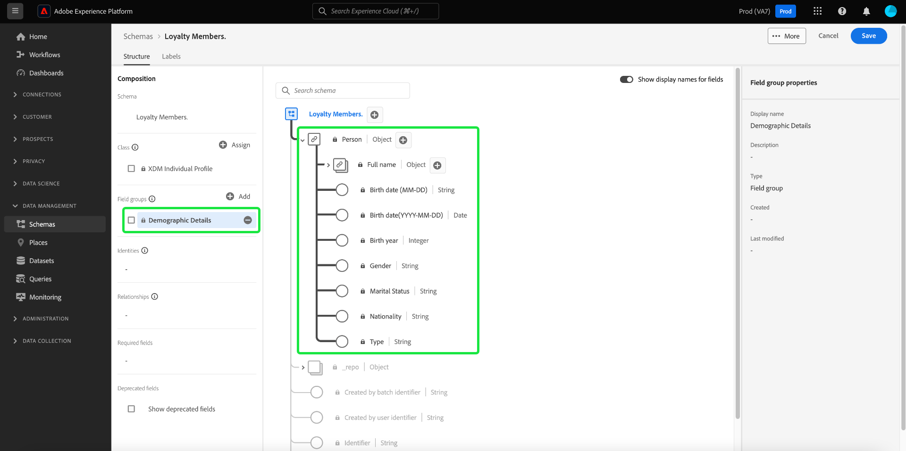

# Een schema maken met de [!DNL Schema Editor]

In de Adobe Experience Platform-gebruikersinterface kunt u [!DNL Experience Data Model] -schema&#39;s (XDM) maken en beheren in een interactief visueel canvas dat de [!DNL Schema Editor] wordt genoemd. In deze zelfstudie wordt uitgelegd hoe u een schema maakt met behulp van [!DNL Schema Editor] .

Voor demonstratiedoeleinden, impliceren de stappen in dit leerprogramma het creëren van een voorbeeldschema dat leden van een programma van de klantenloyaliteit beschrijft. Hoewel u deze stappen kunt gebruiken om een ander schema voor uw eigen doeleinden tot stand te brengen, adviseert u eerst samen met het creëren van het voorbeeldschema om de mogelijkheden van [!DNL Schema Editor] te leren.

>[!NOTE]
>
>Als u CSV gegevens in Experience Platform opneemt, kunt u [ kaart die gegevens aan een schema XDM dat door AI-Gegenereerde aanbevelingen ](../../ingestion/tutorials/map-csv/recommendations.md) wordt gecreeerd (momenteel in bèta) zonder het moeten manueel het schema creëren zelf.
>
>Als u verkiest om een schema samen te stellen gebruikend [!DNL Schema Registry] API, begin door de [[!DNL Schema Registry]  ontwikkelaarsgids ](../api/getting-started.md) te lezen alvorens het leerprogramma te proberen op [ creërend een schema gebruikend API ](create-schema-api.md).

## Aan de slag

Deze zelfstudie vereist een goed begrip van de verschillende aspecten van Adobe Experience Platform die bij het maken van schema&#39;s betrokken zijn. Lees vóór het starten van deze zelfstudie de documentatie voor de volgende concepten:

* [[!DNL Experience Data Model (XDM)]](../home.md): Het gestandaardiseerde framework waarmee [!DNL Experience Platform] gegevens voor de klantervaring indeelt.
   * [ Grondbeginselen van schemacompositie ](../schema/composition.md): Een overzicht van schema&#39;s XDM en hun bouwstenen, met inbegrip van klassen, groepen van het schemagebied, gegevenstypes, en individuele gebieden.
* [[!DNL Real-Time Customer Profile]](../../profile/home.md): biedt een uniform, real-time consumentenprofiel dat is gebaseerd op geaggregeerde gegevens van meerdere bronnen.

## De werkruimte van [!UICONTROL Schemas] openen {#browse}

De [!UICONTROL Schemas] -werkruimte in de [!DNL Experience Platform] -gebruikersinterface biedt een visualisatie van [!DNL Schema Library] , zodat u de schema&#39;s die voor uw organisatie beschikbaar zijn, kunt bekijken. De werkruimte bevat ook de [!DNL Schema Editor] , het canvas waarop u een schema kunt samenstellen tijdens deze zelfstudie.

Nadat u zich hebt aangemeld bij [!DNL Experience Platform] , selecteert u **[!UICONTROL Schemas]** in de linkernavigatie om de werkruimte van **[!UICONTROL Schemas]** te openen. Op het tabblad **[!UICONTROL Browse]** wordt een lijst met schema&#39;s (een voorstelling van de [!DNL Schema Library] ) weergegeven die u kunt weergeven en aanpassen. De lijst bevat de naam, het type, de klasse en het gedrag (record of tijdreeks) waarop het schema is gebaseerd, evenals de datum en tijd waarop het schema voor het laatst is gewijzigd.

Zie de gids bij [ het onderzoeken van bestaande middelen XDM in UI ](../ui/explore.md) voor meer informatie.

## Een schema maken en een naam geven {#create}

Als u wilt beginnen met het samenstellen van een schema, selecteert u **[!UICONTROL Create schema]** in de rechterbovenhoek van de **[!UICONTROL Schemas]** -werkruimte.

![ het [!UICONTROL Schemas] werkruimte [!UICONTROL Browse] lusje met [!UICONTROL Create schema] benadrukte.](../images/tutorials/create-schema/create-schema-button.png)

Het dialoogvenster [!UICONTROL Create a schema] wordt weergegeven. In dit dialoogvenster kunt u kiezen of u handmatig een schema wilt maken door velden en veldgroepen toe te voegen, of u kunt een CSV-bestand uploaden en XML-algoritmen gebruiken om een schema te genereren. Selecteer een workflow voor het maken van een schema in het dialoogvenster.

### [!BADGE &#x200B; Beta &#x200B;]{type=Informative} Handboek of ML-bijgestaan schemaverwezenlijking {#manual-or-assisted}

Leren hoe u een algoritme van XML kunt gebruiken om een schemastructuur te adviseren die op een geupload dossier wordt gebaseerd, zie de [ machine het leren-bijgewoonde gids van de schemaverwezenlijking ](../ui/ml-assisted-schema-creation.md). Deze UI-handleiding is gericht op de workflow voor handmatig maken.

### Een basisklasse kiezen {#choose-a-class}

De [!UICONTROL Create schema] -workflow wordt weergegeven. Kies vervolgens een basisklasse voor het schema. U kunt kiezen tussen de kernklassen [!UICONTROL XDM Individual Profile] en [!UICONTROL XDM ExperienceEvent] , of [!UICONTROL Other] als deze klassen niet geschikt zijn voor uw doeleinden. De [!UICONTROL Other] klassenoptie staat u toe om of [ een nieuwe klasse ](#create-new-class) tot stand te brengen of van andere reeds bestaande klassen te kiezen.

Zie de documentatie [[!UICONTROL XDM individual profile]](../classes/individual-profile.md) en [[!UICONTROL XDM ExperienceEvent]](../classes/experienceevent.md) voor meer informatie over deze klassen. In deze zelfstudie selecteert u **[!UICONTROL XDM Individual Profile]** gevolgd door **[!UICONTROL Next]** .

![ het [!UICONTROL Create schema] werkschema met de [!UICONTROL XDM individual profile] opties en [!UICONTROL Next] benadrukte.](../images/tutorials/create-schema/individual-profile-base-class.png)

### Naam en revisie {#name-and-review}

Nadat u een klasse hebt geselecteerd, wordt de sectie [!UICONTROL Name and review] weergegeven. In deze sectie geeft u een naam en beschrijving op om uw schema te identificeren. Er zijn verscheidene belangrijke overwegingen om te maken wanneer het beslissen over een naam voor uw schema:

* De namen van het schema zouden kort en beschrijvend moeten zijn zodat het schema later gemakkelijk kan worden gevonden.
* Schemenamen moeten uniek zijn, wat betekent dat ze ook specifiek genoeg moeten zijn om in de toekomst niet opnieuw te worden gebruikt. Bijvoorbeeld, als uw organisatie afzonderlijke loyaliteitsprogramma&#39;s voor verschillende merken had, zou het verstandig zijn om uw schema &quot;Merk A Loyalty Leden&quot;te noemen om het gemakkelijk te maken om van andere loyaliteits-verwante regelingen onderscheid te maken u zou kunnen later bepalen.
* U kunt de schemabeschrijving ook gebruiken om het even welke extra contextafhankelijke informatie betreffende het schema te verstrekken.

Dit leerprogramma stelt een schema samen om gegevens in te gaan met betrekking tot de leden van een loyaliteitsprogramma, en daarom wordt het schema genoemd &quot;[!DNL Loyalty Members]&quot;.

&#x200B; De basisstructuur van het schema (verstrekt door de klasse) wordt getoond in het canvas voor u om uw geselecteerde klasse en schemastructuur te herzien en te verifiëren.

Voer in het tekstveld een mensvriendelijke [!UICONTROL Schema display name] in. Voer vervolgens een geschikte beschrijving in om uw schema te identificeren. Wanneer u de schemastructuur hebt herzien en met uw montages gelukkig bent, uitgezocht **[!UICONTROL Finish]** om uw schema tot stand te brengen.

![ de [!UICONTROL Name and review] sectie van het [!UICONTROL Create schema] werkschema met [!UICONTROL Schema display name], [!UICONTROL Description], en [!UICONTROL Finish] benadrukte.](../images/ui/resources/schemas/name-and-review.png)

### Uw schema samenstellen {#compose-your-schema}

De lus [!DNL Schema Editor] wordt weergegeven. Dit is het canvas waarop u het schema wilt samenstellen. Het schema met eigen naam wordt automatisch gemaakt in de **[!UICONTROL Structure]** -sectie van het canvas wanneer u in de editor aankomt, samen met de standaardvelden die zijn opgenomen in de basisklasse die u hebt geselecteerd. De toegewezen klasse voor het schema wordt ook vermeld onder **[!UICONTROL Class]** in **[!UICONTROL Composition]** -sectie.

>[!NOTE]
>
>U kunt de weergavenaam en de optionele beschrijving voor het schema bijwerken via de zijbalk van **[!UICONTROL Schema properties]** . Zodra een nieuwe naam is ingegaan, werkt het canvas automatisch bij om op de nieuwe naam van het schema te wijzen.

>[!NOTE]
>
>U kunt [ de klasse van een schema ](#change-class) op om het even welk punt tijdens het aanvankelijke samenstellingsproces veranderen alvorens het schema is bewaard, maar dit zou met extreme voorzichtigheid moeten worden gedaan. Veldgroepen zijn alleen compatibel met bepaalde klassen. Als u de klasse wijzigt, worden het canvas en alle velden die u hebt toegevoegd opnieuw ingesteld.

## Een veldgroep toevoegen {#field-group}

U kunt nu velden toevoegen aan uw schema door veldgroepen toe te voegen. Een veldgroep is een groep van een of meer velden die vaak samen worden gebruikt om een bepaald concept te beschrijven. Deze zelfstudie gebruikt veldgroepen om de leden van het loyaliteitsprogramma te beschrijven en belangrijke informatie zoals naam, verjaardag, telefoonaantal, adres, en meer te vangen.

Als u een veldgroep wilt toevoegen, selecteert u **[!UICONTROL Add]** in de subsectie **[!UICONTROL Field groups]** .

Er wordt een nieuw dialoogvenster weergegeven met een lijst met beschikbare veldgroepen. Elke veldgroep is alleen bedoeld voor gebruik met een specifieke klasse. Daarom worden in het dialoogvenster alleen veldgroepen weergegeven die compatibel zijn met de klasse die u hebt geselecteerd (in dit geval de klasse [!DNL XDM Individual Profile] ). Als u een standaard XDM-klasse gebruikt, wordt de lijst met veldgroepen op intelligente wijze gesorteerd op basis van de populariteit van het gebruik.

![ de [!UICONTROL Add field groups] dialoog.](../images/tutorials/create-schema/field-group-popularity.png)

U kunt één van de filters in het linkerspoor selecteren om onderaan de lijst van standaardgebiedsgroepen aan specifieke [ industrieën ](../schema/industries/overview.md) zoals kleinhandel, financiële diensten, en gezondheidszorg te versmallen.

![ de [!UICONTROL Add field groups] dialoog met de benadrukte groepen van het industrieterrein.](../images/tutorials/create-schema/industry-field-groups.png)

Als u een veldgroep in de lijst selecteert, wordt deze weergegeven in de rechtertrack. U kunt desgewenst meerdere veldgroepen selecteren en deze aan de lijst in de rechtertrack toevoegen voordat u de groep bevestigt. Bovendien wordt aan de rechterkant van de momenteel geselecteerde veldgroep een pictogram weergegeven waarmee u een voorvertoning kunt weergeven van de structuur van de velden die worden weergegeven.

![ het [!UICONTROL Add field groups] dialoog met het geselecteerde benadrukte pictogram van de de voorproef van de gebiedsgroep.](../images/tutorials/create-schema/preview-field-group-button.png)

Als u een voorbeeld van een veldgroep bekijkt, wordt een gedetailleerde beschrijving van het schema van de veldgroep weergegeven in de rechtertrack. U kunt ook door de velden van de veldgroep navigeren op het beschikbare canvas. Als u verschillende velden selecteert, wordt het rechterspoor bijgewerkt om details over het betreffende veld weer te geven. Selecteer **[!UICONTROL Back]** wanneer u klaar bent met de voorvertoning om terug te keren naar het dialoogvenster voor het selecteren van veldgroepen.

![ de [!UICONTROL Preview field group] dialoog met de Demografische het gebiedsgroep van Details previewde.](../images/tutorials/create-schema/preview-field-group.png)

Selecteer voor deze zelfstudie de veldgroep **[!UICONTROL Demographic Details]** en selecteer vervolgens **[!UICONTROL Add field group]** .

![ de [!UICONTROL Add field groups] dialoog met de Demografische geselecteerde en [!UICONTROL Add field groups] benadrukte het gebiedsgroep van Details.](../images/tutorials/create-schema/demographic-details.png)

Het schemacanvas verschijnt opnieuw. De sectie **[!UICONTROL Field groups]** bevat nu &quot;[!UICONTROL Demographic Details]&quot; en de sectie **[!UICONTROL Structure]** bevat de velden die zijn toegevoegd door de veldgroep. U kunt de naam van de veldgroep selecteren onder de sectie **[!UICONTROL Field groups]** om de specifieke velden te markeren die worden weergegeven op het canvas.

>[!NOTE]
>
>Binnen de Redacteur van het Schema, worden de standaard (Adobe-geproduceerde) klassen en de gebiedsgroepen vermeld met het hangslotpictogram (. Het hangslot verschijnt in de linkerspoorstaaf naast de klasse of de naam van de gebiedsgroep, evenals naast om het even welk gebied in het schemadiagram dat een deel van een systeem-geproduceerde middel is.
>
>

Deze veldgroep draagt verschillende velden onder de naam op hoofdniveau `person` bij met het gegevenstype &quot;[!UICONTROL Person]&quot;. In deze groep velden wordt informatie over een individu beschreven, zoals naam, geboortedatum en geslacht.

>[!NOTE]
>
>Vergeet niet dat in velden scalaire typen kunnen worden gebruikt (zoals een tekenreeks, geheel getal, array of datum), en ook elk gegevenstype (een groep velden die een algemeen concept vertegenwoordigen) dat in de [!DNL Schema Registry] is gedefinieerd.

Het veld `name` heeft het gegevenstype &quot;[!UICONTROL Full name]&quot;. Dit houdt in dat het ook een algemeen concept beschrijft en aan namen gerelateerde subvelden bevat, zoals voornaam, achternaam, hoffelijkheidstitel en achtervoegsel.

Selecteer de verschillende velden op het canvas om extra velden weer te geven die worden toegevoegd aan de schemastructuur.

## Meer veldgroepen toevoegen {#field-group-2}

U kunt nu dezelfde stappen herhalen om een andere veldgroep toe te voegen. Wanneer u dit keer het dialoogvenster **[!UICONTROL Add field group]** bekijkt, ziet u dat de veldgroep &quot;[!UICONTROL Demographic Details]&quot; grijs is weergegeven en dat het selectievakje naast deze groep niet kan worden geselecteerd. Zo voorkomt u dat u per ongeluk veldgroepen dupliceert die u al in het huidige schema hebt opgenomen.

Selecteer in deze zelfstudie de standaardveldgroepen **[!UICONTROL Personal Contact Details]** en **[!UICONTROL Loyalty Details]** in de lijst en selecteer vervolgens **[!UICONTROL Add field groups]** om deze aan het schema toe te voegen.

![ de [!UICONTROL Add field groups] dialoog met twee nieuwe geselecteerde gebiedsgroepen en [!UICONTROL Add field groups] benadrukt.](../images/tutorials/create-schema/more-field-groups.png)

Het canvas verschijnt weer met de toegevoegde veldgroepen die onder **[!UICONTROL Field groups]** in de **[!UICONTROL Composition]** -sectie worden vermeld, en de samengestelde velden ervan worden toegevoegd aan de schemastructuur.

## Een aangepaste veldgroep definiëren {#define-field-group}

Het schema [!UICONTROL Loyalty Members] is bedoeld om gegevens te vangen met betrekking tot de leden van een loyaliteitsprogramma, en de standaard [!UICONTROL Loyalty Details] gebiedsgroep die u aan het schema toevoegde verstrekt de meesten van deze, met inbegrip van het programmatype, de punten, de verbindingsdatum, en meer.

Er kan echter een scenario zijn waarin u extra aangepaste velden wilt opnemen die niet door standaardveldgroepen worden gedekt om uw gebruiksgevallen te bereiken. Als u velden voor aangepaste loyaliteit toevoegt, hebt u twee opties:

1. Maak een nieuwe aangepaste veldgroep om deze velden vast te leggen. Dit is de methode die in deze zelfstudie wordt behandeld.
1. De standaardveldgroep van [!UICONTROL Loyalty Details] uitbreiden met aangepaste velden. Hierdoor wordt [!UICONTROL Loyalty Details] geconverteerd naar een aangepaste veldgroep en is de oorspronkelijke standaardveldgroep niet meer beschikbaar. Zie de [!UICONTROL Schemas] gids UI voor meer informatie over [ toevoegend douanegebieden aan de structuur van standaardgebiedsgroepen ](../ui/resources/schemas.md#custom-fields-for-standard-groups).

Als u een nieuwe veldgroep wilt maken, selecteert u **[!UICONTROL Add]** in de **[!UICONTROL Field groups]** -subsectie zoals voorheen, maar selecteert u deze keer **[!UICONTROL Create New Field group]** boven in het dialoogvenster dat verschijnt. Vervolgens wordt u gevraagd een weergavenaam en beschrijving op te geven voor de nieuwe veldgroep. Voor deze zelfstudie geeft u de nieuwe veldgroep de naam &quot;[!DNL Custom Loyalty Details]&quot; en selecteert u vervolgens **[!UICONTROL Add field groups]** .

![ de [!UICONTROL Add field groups] dialoog met [!UICONTROL Create new field group], [!UICONTROL Display name] en [!UICONTROL Description] benadrukte.](../images/tutorials/create-schema/create-new-field-group.png)

>[!NOTE]
>
>Net als bij klassennamen moet de naam van de veldgroep kort en eenvoudig zijn en beschrijven wat de veldgroep aan het schema zal bijdragen. Ook deze zijn uniek, dus u kunt de naam niet opnieuw gebruiken en moet er dus voor zorgen dat deze voldoende specifiek is.

&quot;[!DNL Custom Loyalty Details]&quot; moet nu worden weergegeven onder **[!UICONTROL Field groups]** aan de linkerkant van het canvas, maar er zijn nog geen velden aan gekoppeld en daarom verschijnen er geen nieuwe velden onder **[!UICONTROL Structure]** .

## Velden toevoegen aan de veldgroep {#field-group-fields}

Nu u &quot;[!DNL Custom Loyalty Details]&quot;gebiedsgroep hebt gecreeerd, is het tijd om de gebieden te bepalen die de gebiedsgroep aan het schema zal bijdragen.

Om te beginnen, selecteer **plus (+)** pictogram naast de naam van het schema in het canvas.

De tijdelijke aanduiding &quot;[!UICONTROL Untitled Field]&quot; wordt weergegeven op het canvas en de updates van de rechterrails om configuratieopties voor het veld weer te geven.

![ de Redacteur van het Schema met [!UICONTROL Untitled Field] en het benadrukte schema [!UICONTROL Field properties].](../images/tutorials/create-schema/untitled-field.png)

In dit scenario, moet het schema een voorwerp-type gebied hebben dat de huidige loyaliteitsrij van de persoon in detail beschrijft. Gebruikend de controles in het juiste spoor, begin een `loyaltyTier` gebied met type &quot;[!UICONTROL Object]&quot;te creëren dat zal worden gebruikt om uw verwante gebieden te houden.

Onder **[!UICONTROL Assign to]** moet u een veldgroep selecteren waaraan u het veld wilt toewijzen. Houd er rekening mee dat alle schemavelden tot een klasse of een veldgroep behoren. Aangezien in dit schema een standaardklasse wordt gebruikt, kunt u alleen een veldgroep selecteren. Begin in de naam &quot;[!DNL Custom Loyalty Details]&quot; te typen, dan selecteer de gebiedsgroep van de lijst.

Selecteer **[!UICONTROL Apply]** als u klaar bent.

![ de Redacteur van het Schema met het voorwerp van de Rij van de Loyalty die aan het benadrukte schema [!UICONTROL Field properties] wordt toegevoegd.](../images/tutorials/create-schema/loyalty-tier-object.png)

De wijzigingen worden toegepast en het nieuwe `loyaltyTier` -object wordt weergegeven. Aangezien dit een douanegebied is, wordt het automatisch genest binnen een voorwerp genoemd aan huurder ID van uw organisatie, voorafgegaan door een onderstrepingsteken (`_tenantId` in dit voorbeeld).

>[!NOTE]
>
>De aanwezigheid van het voorwerp van huurderidentiteitskaart wijst erop dat de gebieden u toevoegt in namespace van uw organisatie bevat zijn.
>
>Met andere woorden, de velden die u toevoegt, zijn uniek voor uw organisatie en worden opgeslagen in de [!DNL Schema Registry] in een specifiek gebied dat alleen voor uw organisatie toegankelijk is. De gebieden u bepaalt moeten altijd aan uw huurdersnamespace worden toegevoegd om botsingen met namen van andere standaardklassen, gebiedsgroepen, gegevenstypes, en gebieden te verhinderen.

Selecteer **plus (+)** pictogram naast het `loyaltyTier` voorwerp beginnen subfields toe te voegen. Er wordt een nieuwe plaatsaanduiding voor velden weergegeven en de sectie **[!UICONTROL Field properties]** wordt aan de rechterkant van het canvas weergegeven.

Voor elk veld is de volgende informatie vereist:

* **[!UICONTROL Field Name]:** De naam van het gebied, bij voorkeur geschreven in camelCase. Spaties zijn niet toegestaan. Dit is de naam die wordt gebruikt om in code en in andere downstreamtoepassingen naar het veld te verwijzen.
   * Voorbeeld: loyaltyLevel
* **[!UICONTROL Display Name]:** De naam van het gebied, geschreven in titelgeval. Dit is de naam die op het canvas wordt weergegeven wanneer u het schema weergeeft of bewerkt.
   * Voorbeeld: Loyaliteitsniveau
* **[!UICONTROL Type]:** Het gegevenstype van het veld. Dit zijn elementaire scalaire typen en alle gegevenstypen die in de [!DNL Schema Registry] zijn gedefinieerd. Voorbeelden: [!UICONTROL String] , [!UICONTROL Integer] , [!UICONTROL Boolean] , [!UICONTROL Person] , [!UICONTROL Address] , [!UICONTROL Phone number] , enzovoort.
* **[!UICONTROL Description]:** Een optionele beschrijving van het veld moet maximaal 200 tekens bevatten.

Het eerste veld voor het `loyaltyTier` -object is een tekenreeks met de naam `id` die de id van de huidige laag van het loyaliteitslid vertegenwoordigt. Identiteitskaart van de rij zal uniek voor elk loyaliteitlid zijn, aangezien dit bedrijf verschillende die puntdrempels van de loyaliteitsrij voor elke klant plaatst op verschillende factoren wordt gebaseerd. Stel het type van het nieuwe veld in op &quot;[!UICONTROL String]&quot; en de sectie **[!UICONTROL Field properties]** wordt gevuld met verschillende opties voor het toepassen van beperkingen, zoals standaardwaarde, opmaak en maximumlengte. Zie de documentatie over [ beste praktijken voor de gebieden van de gegevensbevestiging ](../schema/best-practices.md#data-validation-fields) om meer te leren.

Aangezien `id` een willekeurig gegenereerde vrije-vormtekenreeks wordt, zijn er geen verdere beperkingen nodig. Selecteer **[!UICONTROL Apply]** om de wijzigingen toe te passen.

## Meer velden toevoegen aan de veldgroep {#field-group-fields-2}

Nu u het veld `id` hebt toegevoegd, kunt u aanvullende velden toevoegen om informatie over de loyaliteitsniveaus vast te leggen, zoals:

* Huidige puntdrempel (geheel getal): het minimale aantal loyaliteitspunten dat het lid moet behouden om in de huidige laag te blijven.
* Drempel van volgende tier (geheel getal): het aantal loyaliteitspunten dat het lid moet krijgen om te kunnen afstuderen aan de volgende laag.
* Ingangsdatum (datum-tijd): de datum waarop het loyaliteitslid zich bij deze lijst heeft aangesloten.

Om elk gebied aan het schema toe te voegen, selecteer **plus (+)** pictogram naast het `loyalty` voorwerp en vul de vereiste informatie in.

Wanneer dit is voltooid, bevat het object `loyaltyTier` velden voor `id` , `currentThreshold` , `nextThreshold` en `effectiveDate` .

## Een opsommingsveld toevoegen aan de veldgroep {#enum}

Wanneer u velden in de [!DNL Schema Editor] definieert, zijn er enkele aanvullende opties die u kunt toepassen op standaardveldtypen om verdere beperkingen op te leggen aan de gegevens die het veld kan bevatten. De gebruiksgevallen voor deze beperkingen worden in de volgende tabel uitgelegd:

| Restrictie | Beschrijving |
| --- | --- |
| [!UICONTROL Required] | Geeft aan dat het veld verplicht is voor gegevensinvoer. Om het even welke gegevens die aan een dataset worden geupload die op dit schema wordt gebaseerd dat dit gebied niet bevat zullen op opname ontbreken. |
| [!UICONTROL Array] | Geeft aan dat het veld een array van waarden bevat, elk met het opgegeven gegevenstype. Bijvoorbeeld, gebruikend deze beperking op een gebied met een gegevenstype van &quot;[!UICONTROL String]&quot;specificeert dat het gebied een serie van koorden zal bevatten. |
| [!UICONTROL Enum & Suggested Values] | Een opsomming geeft aan dat dit veld een van de waarden uit een opsommingslijst met mogelijke waarden moet bevatten. U kunt deze optie ook gebruiken om alleen een lijst met voorgestelde waarden voor een tekenreeksveld op te geven zonder het veld tot die waarden te beperken. |
| [!UICONTROL Identity] | Geeft aan dat dit veld een identiteitsveld is. Meer informatie betreffende identiteitsgebieden wordt verstrekt [ later in dit leerprogramma ](#identity-field). |
| [!UICONTROL Relationship] | Hoewel schemarelaties kunnen worden afgeleid door het gebruik van het samenvoegingsschema en [!DNL Real-Time Customer Profile] , geldt dit alleen voor schema&#39;s die dezelfde klasse delen. De beperking [!UICONTROL Relationship] geeft aan dat dit veld verwijst naar de primaire identiteit van een schema op basis van een andere klasse, wat een relatie tussen de twee schema&#39;s impliceert. Zie het leerprogramma op [ bepalend een verhouding ](./relationship-ui.md) voor meer informatie. |

{style="table-layout:auto"}

>[!NOTE]
>
>Alle vereiste, identiteits- of relatievelden worden vermeld in hun respectieve secties in de linkertrack, zodat u deze velden gemakkelijk kunt vinden, ongeacht de complexiteit van het schema.

Voor deze zelfstudie vereist het `loyaltyTier` -object in het schema een nieuw opsommingsveld dat de klasse tier beschrijft, waarbij de waarde slechts een van de vier mogelijke opties kan zijn. Om dit gebied aan het schema toe te voegen, selecteer **plus (+)** pictogram naast het `loyaltyTier` voorwerp en vul de vereiste gebieden voor **[!UICONTROL Field name]** en **[!UICONTROL Display name]** in. Selecteer voor **[!UICONTROL Type]** &quot;[!UICONTROL String]&quot;.

![ de Redacteur van het Schema met het voorwerp van de Klasse van de Rij die in [!UICONTROL Field properties] wordt toegevoegd en wordt benadrukt.](../images/tutorials/create-schema/tier-class-type.png)

Er worden extra selectievakjes voor het veld weergegeven nadat het type is geselecteerd, waaronder selectievakjes voor **[!UICONTROL Array]** , **[!UICONTROL Enum & Suggested Values]** , **[!UICONTROL Identity]** en **[!UICONTROL Relationship]** .

Selecteer het selectievakje **[!UICONTROL Enum & Suggested Values]** en selecteer vervolgens **[!UICONTROL Enum]** . Hier kunt u **[!UICONTROL Value]** (in camelCase) en **[!UICONTROL Display Name]** (een optionele, leesvriendelijke naam in Alles Beginhoofdletter) invoeren voor elke acceptabele klasse van de loyaliteitslaag.

Wanneer u alle veldeigenschappen hebt voltooid, selecteert u **[!UICONTROL Apply]** om het `tierClass` veld aan het `loyaltyTier` -object toe te voegen.

![ Enum en stel eigenschappen voor van het waardegebied dat met [!UICONTROL Apply] wordt voltooid benadrukt.](../images/tutorials/create-schema/tier-class-enum.png)

## Een object met meerdere velden omzetten in een gegevenstype {#datatype}

Het `loyaltyTier` -object bevat nu verschillende velden en vertegenwoordigt een algemene gegevensstructuur die nuttig kan zijn in andere schema&#39;s. Met [!DNL Schema Editor] kunt u gemakkelijk herbruikbare objecten met meerdere velden toepassen door de structuur van die objecten om te zetten in gegevenstypen.

De types van gegevens staan voor het verenigbare gebruik van multi-gebiedsstructuren toe en verstrekken meer flexibiliteit dan een gebiedsgroep omdat zij overal binnen een schema kunnen worden gebruikt. Dit wordt gedaan door de waarde **[!UICONTROL Type]** van het gebied aan dat van om het even welk gegevenstype te plaatsen die in [!DNL Schema Registry] wordt bepaald.

Als u het `loyaltyTier` -object wilt omzetten in een gegevenstype, selecteert u het `loyaltyTier` -veld op het canvas en selecteert u vervolgens **[!UICONTROL Convert to new data type]** rechts van de editor onder **[!UICONTROL Field properties]** .

![ de Redacteur van het Schema met het loyaltyTier voorwerp en [!UICONTROL Convert to new data type] benadrukte.](../images/tutorials/create-schema/convert-data-type.png)

Er wordt een melding weergegeven waarin wordt bevestigd dat het object is geconverteerd. Op het canvas kunt u nu zien dat het veld `loyaltyTier` nu een koppelingspictogram heeft en de rechterspoorlijn geeft aan dat het een gegevenstype &quot;[!DNL Loyalty Tier]&quot; heeft.

In een toekomstig schema, kon u een gebied als &quot;[!DNL Loyalty Tier]&quot;type nu toewijzen en het zou automatisch gebieden voor identiteitskaart, rijklasse, puntdrempels, en efficiënte datum omvatten.

>[!NOTE]
>
>U kunt ook aangepaste gegevenstypen maken en bewerken, onafhankelijk van het bewerken van schema&#39;s. Zie de gids bij [ het creëren van en het uitgeven van gegevenstypes ](../ui/resources/data-types.md) voor meer informatie.

## Schema-velden zoeken en filteren

Het schema bevat nu diverse veldgroepen naast de velden die door de basisklasse worden verschaft. Wanneer u met grotere schema&#39;s werkt, kunt u de selectievakjes naast veldgroepnamen in de linkerrail selecteren om de weergegeven velden te filteren op de velden die alleen worden weergegeven door de veldgroepen waarin u geïnteresseerd bent.

Als u een specifiek veld in uw schema zoekt, kunt u ook de zoekbalk gebruiken om weergegeven velden op naam te filteren, ongeacht de veldgroep waarin ze staan.

>[!IMPORTANT]
>
>De zoekfunctie houdt bij het weergeven van overeenkomende velden rekening met alle geselecteerde veldgroepfilters. Als een zoekquery de resultaten die u verwacht niet weergeeft, moet u mogelijk twee keer controleren of er geen relevante veldgroepen worden uitgefilterd.

## Een schemaveld instellen als een identiteitsveld {#identity-field}

De standaard gegevensstructuur die schema&#39;s verstrekken kan worden gebruikt om gegevens te identificeren die tot het zelfde individu over veelvoudige bronnen behoren, die voor diverse stroomafwaartse gebruiksgevallen zoals segmentatie, rapportering, gegevenswetenschapsanalyse, en meer toestaan. Als u gegevens op basis van individuele identiteiten wilt koppelen, moeten sleutelvelden worden gemarkeerd als [!UICONTROL Identity] -velden binnen de toepasselijke schema&#39;s.

[!DNL Experience Platform] maakt het gemakkelijk om een identiteitsveld aan te duiden door het selectievakje **[!UICONTROL Identity]** in het [!DNL Schema Editor] te gebruiken. U moet echter bepalen welk veld de beste kandidaat is om als identiteit te gebruiken, op basis van de aard van uw gegevens.

Bijvoorbeeld, kunnen er duizenden leden van het loyaliteitsprogramma tot het zelfde loyaliteitsniveau behoren, en verscheidene die het zelfde fysieke adres kunnen delen. In dit scenario, echter, bij inschrijving verstrekt elk lid van het loyaliteitsprogramma zijn persoonlijk e-mailadres. Aangezien persoonlijke e-mailadressen meestal door één persoon worden beheerd, is het veld `personalEmail.address` (opgegeven door de [!UICONTROL Personal Contact Details] -veldgroep) een goede kandidaat voor een identiteitsveld.

>[!IMPORTANT]
>
>De stappen hieronder beschrijven hoe te om een identiteitsbeschrijver aan een bestaand schemagebied toe te voegen. Als alternatief voor het definiëren van identiteitsvelden binnen de structuur van het schema zelf, kunt u ook een `identityMap` -veld gebruiken voor het bevatten van identiteitsgegevens.
>
>Als u `identityMap` wilt gebruiken, moet u er rekening mee houden dat elke primaire identiteit die u rechtstreeks aan het schema toevoegt, hierdoor wordt overschreven. Zie de sectie over `identityMap` in de [ grondbeginselen van de gids van de schemacompositie ](../schema/composition.md#identityMap) voor meer informatie.

Selecteer het veld `personalEmail.address` op het canvas en schakel het selectievakje **[!UICONTROL Identity]** onder **[!UICONTROL Field properties]** in. Schakel het selectievakje in en kies de optie om deze in te stellen terwijl de **[!UICONTROL Primary identity]** wordt weergegeven. Selecteer dit vak ook.

>[!NOTE]
>
>Elk schema mag slechts één primair identiteitsveld bevatten. Zodra een schemagebied als primaire identiteit is geplaatst, zult u een foutenmelding ontvangen als u later probeert om een ander identiteitsgebied in het schema als primaire identiteit te plaatsen.

Vervolgens moet u een **[!UICONTROL Identity namespace]** opgeven uit de lijst met vooraf gedefinieerde naamruimten in het vervolgkeuzemenu. Aangezien dit veld het e-mailadres van de klant is, selecteert u &quot;[!UICONTROL Email]&quot; in de vervolgkeuzelijst. Selecteer **[!UICONTROL Apply]** om de updates voor het veld `personalEmail.address` te bevestigen.

>[!NOTE]
>
>Voor een lijst van standaard namespaces en hun definities, zie de [[!DNL Identity Service]  documentatie ](../../identity-service/troubleshooting-guide.md#standard-namespaces).

Nadat de wijziging is toegepast, wordt op het pictogram voor `personalEmail.address` een vingerafdruksymbool weergegeven om aan te geven dat het nu een identiteitsveld is. Het veld wordt ook weergegeven in de linkertrack onder **[!UICONTROL Identities]** .

Alle gegevens die in het veld `personalEmail.address` worden ingevoerd, worden nu gebruikt om die persoon te identificeren en één weergave van die klant samen te voegen. Raadpleeg de documentatie van [[!DNL Identity Service]](../../identity-service/home.md) voor meer informatie over het werken met identiteiten in [!DNL Experience Platform] .

## Het schema inschakelen voor gebruik in [!DNL Real-Time Customer Profile] {#profile}

[[!DNL Real-Time Customer Profile]](../../profile/home.md) gebruikt identiteitsgegevens in [!DNL Experience Platform] voor een holistische weergave van elke afzonderlijke klant. De service maakt robuuste, 360°-profielen van klantkenmerken en tijdstempelde accounts van elke interactie die klanten hebben gehad in elk systeem dat is geïntegreerd met [!DNL Experience Platform] .

Een schema kan alleen worden ingeschakeld voor gebruik met [!DNL Real-Time Customer Profile] als er een primaire identiteit is gedefinieerd. Er wordt een foutbericht weergegeven als u een schema wilt inschakelen zonder eerst een primaire identiteit te definiëren.

Als u het schema &#39;Loyalty-leden&#39; wilt inschakelen voor gebruik in [!DNL Profile] , selecteert u eerst de schematitel op het canvas.

Rechts in de editor wordt informatie over het schema weergegeven, inclusief de weergavenaam, beschrijving en type. Naast deze informatie is er een schakelknop **[!UICONTROL Profile]** .

Selecteer **[!UICONTROL Profile]** en er verschijnt een pop-up met de vraag of u het schema wilt inschakelen voor [!DNL Profile] .

>[!WARNING]
>
>Als een schema eenmaal is ingeschakeld voor [!DNL Real-Time Customer Profile] en opgeslagen, kan het niet worden uitgeschakeld.

Selecteer **[!UICONTROL Enable]** om uw keuze te bevestigen. U kunt desgewenst de schakeloptie **[!UICONTROL Profile]** opnieuw selecteren om het schema uit te schakelen, maar als het schema is opgeslagen terwijl [!DNL Profile] is ingeschakeld, kan het niet meer worden uitgeschakeld.

## Meer acties {#more}

In de Schema-editor kunt u ook snel handelingen uitvoeren om de JSON-structuur van het schema te kopiëren of het schema te verwijderen. Selecteer [!UICONTROL More] boven aan de weergave om een vervolgkeuzelijst met snelle acties weer te geven.

### Schema verwijderen {#delete-a-schema}

>[!CONTEXTUALHELP]
>id="platform_schemas_delete_profileenabledwithdatasets"
>title="Kan schema niet verwijderen"
>abstract="Het schema kan niet worden geschrapt omdat het voor Profiel is toegelaten en bijbehorende datasets heeft."

>[!CONTEXTUALHELP]
>id="platform_schemas_delete_profileenablednodatasets"
>title="Kan schema niet verwijderen"
>abstract="Het schema kan niet worden verwijderd omdat het is ingeschakeld voor Profiel."

>[!CONTEXTUALHELP]
>id="platform_schemas_delete_withdatasetsnotprofileenabled"
>title="Kan schema niet verwijderen"
>abstract="Het schema kan niet worden geschrapt omdat het bijbehorende datasets heeft."

Een schema kan binnen UI van de Redacteur van het Schema worden geschrapt gebruikend [!UICONTROL More] acties en ook van de schemadetails op het [!UICONTROL Browse] lusje. Er zijn bepaalde voorwaarden die voorkomen dat een schema wordt verwijderd. Een schema kan niet worden verwijderd als:

* Het schema is ingeschakeld voor Profiel.
* Het schema wordt toegelaten voor Profiel en heeft bijbehorende datasets.
* Het schema heeft bijbehorende datasets maar is niet toegelaten voor Profiel.

### JSON-structuur kopiëren {#copy-json-structure}

Selecteer **[!UICONTROL Copy JSON structure]** om een exportlading voor om het even welk schema in de Bibliotheek van het Schema te produceren. Met deze handeling wordt de JSON-structuur naar het klembord gekopieerd. Uw geëxporteerde JSON kan vervolgens worden gebruikt om het schema en eventuele gerelateerde bronnen te importeren in een andere sandbox of organisatie. Dit maakt het delen en hergebruiken van schema&#39;s tussen verschillende milieu&#39;s eenvoudig en efficiënt.

## Volgende stappen en extra bronnen

Nu u klaar bent met het samenstellen van het schema, kunt u het volledige schema in het canvas zien. Selecteer **[!UICONTROL Save]** en het schema wordt opgeslagen in [!DNL Schema Library] , waardoor het toegankelijk wordt voor [!DNL Schema Registry] .

Het nieuwe schema kan nu worden gebruikt om gegevens in te voeren in [!DNL Experience Platform] . Herinner dat zodra het schema is gebruikt om gegevens in te voeren, slechts de additieve veranderingen kunnen worden aangebracht. Zie de [ grondbeginselen van schemacompositie ](../schema/composition.md) voor meer informatie over schema versioning.

U kunt het leerprogramma nu volgen op [ bepalend een schemaverhouding in UI ](./relationship-ui.md) om een nieuw relatiegebied aan het schema van de Leden van de &quot;Loyalty&quot;toe te voegen.

Het schema &quot;Loyalty Member&quot; is ook beschikbaar voor weergave en beheer met de API [!DNL Schema Registry] . Beginnen werkend met API, begin door de [[!DNL Schema Registry API]  ontwikkelaarsgids ](../api/getting-started.md) te lezen.

### Videobronnen

>[!WARNING]
>
>De gebruikersinterface van [!DNL Experience Platform] in de volgende video&#39;s is verouderd. Raadpleeg de bovenstaande documentatie voor de meest recente schermafbeeldingen en functionaliteit van de gebruikersinterface.

In de volgende video ziet u hoe u een eenvoudig schema maakt in de gebruikersinterface van [!DNL Experience Platform] .

>[!VIDEO](https://video.tv.adobe.com/v/3430226?quality=12&learn=on&captions=dut)

De volgende video is bedoeld om u meer inzicht te geven in het werken met veldgroepen en klassen.

>[!VIDEO](https://video.tv.adobe.com/v/27013?quality=12&learn=on)

## Bijlage

In de volgende secties vindt u aanvullende informatie over het gebruik van de [!DNL Schema Editor] .

### Een nieuwe klasse maken {#create-new-class}

[!DNL Experience Platform] biedt de flexibiliteit om een schema te definiëren op basis van een klasse die uniek is voor uw organisatie. Leren hoe te om een nieuwe klasse tot stand te brengen, zie de gids bij [ het creëren van en het uitgeven van klassen in UI ](../ui/resources/classes.md#create).

### De klasse van een schema wijzigen {#change-class}

U kunt de klasse van een schema op om het even welk punt tijdens het aanvankelijke samenstellingsproces veranderen alvorens het schema is bewaard.

>[!WARNING]
>
>Het opnieuw toewijzen van de klasse voor een schema zou met uiterste voorzichtigheid moeten worden gedaan. Veldgroepen zijn alleen compatibel met bepaalde klassen. Als u de klasse wijzigt, worden het canvas en alle velden die u hebt toegevoegd opnieuw ingesteld.

Leren hoe te om de klasse van een schema te veranderen, zie de gids op [ het leiden schema&#39;s in UI ](../ui/resources/schemas.md#change-class).
