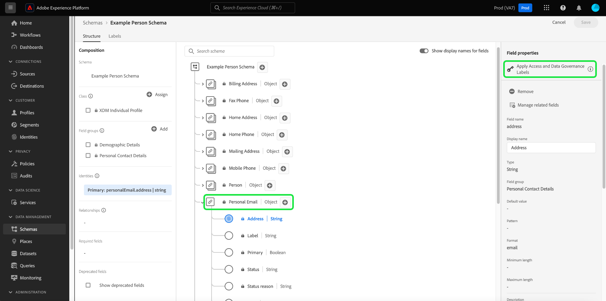

# De labels voor gegevensgebruik voor een schema beheren

>[!IMPORTANT]
>
>Etikettering op basis van schema maakt deel uit van [attribuut-based toegangsbeheer](../../access-control/abac/overview.md), die momenteel in een beperkte versie beschikbaar is voor in de VS gevestigde zorgklanten. Deze mogelijkheid is beschikbaar voor alle Real-time Customer Data Platform-klanten zodra deze volledig is vrijgegeven.

Alle gegevens die in Adobe Experience Platform worden gebracht worden beperkt door schema&#39;s van de Gegevens van de Ervaring van het Model (XDM). Deze gegevens zijn mogelijk onderworpen aan gebruiksbeperkingen die zijn gedefinieerd door uw organisatie of wettelijke voorschriften. Om dit te verklaren, staat het Platform u toe om het gebruik van bepaalde datasets en gebieden door het gebruik van te beperken [gegevensgebruikslabels](../../data-governance/labels/overview.md).

Een label dat wordt toegepast op een schemaveld, geeft het gebruiksbeleid aan dat van toepassing is op de gegevens in dat specifieke veld.

Terwijl de etiketten kunnen worden toegepast op individuele datasets (en gebieden binnen die datasets), kunt u etiketten op het schemaniveau ook toepassen. Wanneer de etiketten rechtstreeks op een schema worden toegepast, worden die etiketten verspreid aan alle bestaande en toekomstige datasets die op dat schema gebaseerd zijn.

Deze zelfstudie behandelt de stappen voor het toevoegen van labels aan een schema met behulp van de Schema-editor in de gebruikersinterface van het Platform.

## Aan de slag

Deze handleiding vereist een goed begrip van de volgende onderdelen van Adobe Experience Platform:

* [[!DNL Experience Data Model (XDM) System]](../home.md): Het gestandaardiseerde kader waardoor [!DNL Experience Platform] organiseert de gegevens van de klantenervaring.
   * [Schema-editor](../ui/overview.md): Leer om schema&#39;s en andere middelen in de UI van het Platform tot stand te brengen en te beheren.
* [[!DNL Adobe Experience Platform Data Governance]](../../data-governance/home.md): Verstrekt de infrastructuur voor het afdwingen van de beperkingen van het gegevensgebruik op de verrichtingen van het Platform, gebruikend beleid dat bepaalt welke marketing acties (of niet) op geëtiketteerde gegevens kunnen worden uitgevoerd.

## Selecteer een schema of veld waaraan u labels wilt toevoegen

De etiketten kunnen slechts op schema&#39;s worden toegepast, en kunnen niet aan de componenten worden toegevoegd die omhoog die schema&#39;s (klassen, gebiedsgroepen, en gegevenstypes) maken. Als u wilt beginnen met het toevoegen van labels, moet u eerst [een bestaand schema selecteren om te bewerken](../ui/resources/schemas.md#edit) of [een nieuw schema maken](../ui/resources/schemas.md#create) om de structuur ervan weer te geven in de Schema-editor.

Als u de labels voor een afzonderlijk veld wilt bewerken, selecteert u het veld op het canvas en selecteert u vervolgens **[!UICONTROL Manage access]** in het rechterspoor.

U kunt ook de **[!UICONTROL Labels]** kiest u het gewenste veld in de lijst en selecteert u **[!UICONTROL Edit governance labels]** in het rechterspoor.

![Selecteer een veld in het menu [!UICONTROL Labels] tab](../images/tutorials/labels/select-field-on-labels-tab.png)

Als u de labels voor het hele schema wilt bewerken, selecteert u het potloodpictogram () naast de naam van het schema onder de **[!UICONTROL Labels]** tab.

![Selecteer de naam van het schema in het menu [!UICONTROL Labels] tab](../images/tutorials/labels/select-schema-on-labels-tab.png)

>[!NOTE]
>
>Een ontkenningsbericht verschijnt wanneer u eerst probeert om de etiketten voor een schema of een gebied uit te geven, verklarend hoe het etiketgebruik stroomafwaartse verrichtingen afhankelijk van het beleid van uw organisatie beïnvloedt. Selecteren **[!UICONTROL Proceed]** om verder te gaan met bewerken.
>
>

## De labels voor het schema of veld bewerken

Er wordt een dialoogvenster weergegeven waarin u de labels voor het geselecteerde veld kunt bewerken. Als u een afzonderlijk objecttype-veld hebt geselecteerd, worden in de rechterrail de subvelden weergegeven waarnaar de toegepaste labels zullen doorgeven.

>[!NOTE]
>
>Als u velden bewerkt voor het hele schema, worden de toepasselijke velden niet in de rechtertrack vermeld en wordt in plaats daarvan de schemanaam weergegeven.

Gebruik de weergegeven lijst om de labels te selecteren die u aan het schema of veld wilt toevoegen. Als labels worden gekozen, wordt de **[!UICONTROL Applied labels]** -sectie wordt bijgewerkt om de labels weer te geven die tot nu toe zijn geselecteerd.

Als u de weergegeven labels op type wilt filteren, selecteert u de gewenste categorie in de linkertrack. Als u een nieuw aangepast label wilt maken, selecteert u **[!UICONTROL Create label]**.

Als u tevreden bent met de gekozen labels, selecteert u **[!UICONTROL Save]** om deze toe te passen op het veld of schema.

De **[!UICONTROL Labels]** opnieuw wordt weergegeven, met de toegepaste labels voor het schema.

## Volgende stappen

In deze handleiding wordt beschreven hoe u labels voor gegevensgebruik voor schema&#39;s en velden kunt beheren. Voor informatie over het beheren van de etiketten van het gegevensgebruik, met inbegrip van hoe te om hen aan specifieke datasets eerder dan op het schemaniveau toe te voegen, zie [UI-handleiding voor gegevensgebruikslabels](../../data-governance/labels/user-guide.md).
