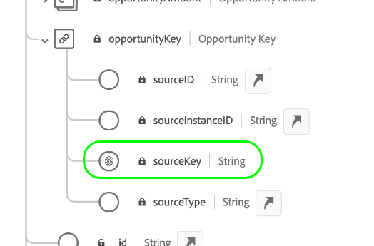

# Een veel-op-een relatie definiëren tussen twee schema&#39;s in Real-Time Customer Data Platform B2B edition {#relationship-b2b}

>[!CONTEXTUALHELP]
>id="platform_xdm_b2b_reference_schema"
>title="Referentieschema"
>abstract="Selecteer het schema u een verband met wilt vestigen. Afhankelijk van de klasse van het schema, kan het bestaande verhoudingen met andere entiteiten in de context B2B ook hebben. Zie de documentatie om te leren hoe de B2B schemaklassen op elkaar betrekking hebben."

Adobe Real-Time Customer Data Platform B2B edition verstrekt verscheidene klassen van de Gegevens van de Ervaring Model (XDM) die fundamentele B2B gegevensentiteiten, met inbegrip van [&#x200B; rekeningen &#x200B;](../classes/b2b/business-account.md), [&#x200B; kansen &#x200B;](../classes/b2b/business-opportunity.md), [&#x200B; campagnes &#x200B;](../classes/b2b/business-campaign.md), en meer vangen. Door schema&#39;s te bouwen die op deze klassen worden gebaseerd en hen toe te laten voor gebruik in [&#x200B; Real-Time Profiel van de Klant &#x200B;](../../profile/home.md), kunt u gegevens van ongelijksoortige bronnen in een verenigde vertegenwoordiging samenvoegen genoemd een unieschema.

Unieschema&#39;s kunnen echter alleen velden bevatten die zijn vastgelegd door schema&#39;s die dezelfde klasse delen. Dit is waar schemaverhoudingen binnen komen. Door relaties in uw B2B-schema&#39;s uit te voeren, kunt u beschrijven hoe deze bedrijfsentiteiten met elkaar verband houden en kunt u kenmerken van meerdere klassen in downstreamgevallen van segmentatiegebruik opnemen.

Het volgende diagram verstrekt een voorbeeld van hoe de verschillende klassen B2B op elkaar in een basisimplementatie kunnen betrekking hebben:

Deze zelfstudie behandelt de stappen voor het definiëren van een vele-op-één relatie tussen twee schema&#39;s in Real-Time CDP B2B edition.

>[!NOTE]
>
>Als u geen Real-Time Customer Data Platform B2B edition gebruikt of een één-aan-één verhouding wilt tot stand brengen, zie de gids op [&#x200B; creërend een één-aan-één verhouding &#x200B;](./relationship-ui.md) in plaats daarvan.
>
>Deze zelfstudie richt zich op het handmatig tot stand brengen van relaties tussen B2B-schema&#39;s in de gebruikersinterface van Experience Platform. Als u gegevens van een B2B bronverbinding brengt, kunt u een auto-generatienut gebruiken om de vereiste schema&#39;s, identiteiten, en verhoudingen in plaats daarvan tot stand te brengen. Zie de brondocumentatie op B2B namespaces en schema&#39;s voor meer informatie over [&#x200B; gebruikend het auto-generatienut &#x200B;](../../sources/connectors/adobe-applications/marketo/marketo-namespaces.md).

## Aan de slag

Deze zelfstudie vereist een goed begrip van [!DNL XDM System] en de Schema-editor in de gebruikersinterface van [!DNL Experience Platform] . Lees de volgende documentatie voordat u met deze zelfstudie begint:

* [&#x200B; XDM Systeem in Experience Platform &#x200B;](../home.md): Een overzicht van XDM en zijn implementatie in [!DNL Experience Platform].
* [&#x200B; Grondbeginselen van schemacompositie &#x200B;](../schema/composition.md): Een inleiding van de bouwstenen van schema&#39;s XDM.
* [&#x200B; creeer een schema gebruikend  [!DNL Schema Editor]](create-schema-ui.md): Een leerprogramma dat de grondbeginselen van behandelt om schema&#39;s in UI te bouwen en uit te geven.

## Een bron- en referentieschema definiëren

Verwacht wordt dat u reeds de twee schema&#39;s hebt gecreeerd die in de verhouding zullen worden bepaald. Voor demonstratiedoeleinden, leidt dit leerprogramma tot een verband tussen bedrijfskansen (die in een &quot;[!DNL Opportunities]&quot;schema worden bepaald) en hun bijbehorende bedrijfsrekening (die in een &quot;[!DNL Accounts]&quot;schema wordt bepaald).

De verhoudingen van het schema worden vertegenwoordigd door een specifiek gebied binnen a **bronschema** dat verwijzingen het primaire identiteitsgebied van a **verwijzingsschema**. In de stappen die volgen, &quot;[!DNL Opportunities]&quot;dient als bronschema, terwijl &quot;[!DNL Accounts]&quot;als verwijzingsschema dienst doet.

### Inzicht in identiteiten in B2B-relaties

>[!CONTEXTUALHELP]
>id="platform_xdm_b2b_identity_namespace"
>title="Naamruimte van verwijzing"
>abstract="De naamruimte (type) voor het primaire identiteitsveld van het referentieschema. Het referentieschema moet een bestaand primair identiteitsveld hebben om aan een relatie te kunnen deelnemen. Raadpleeg de documentatie voor meer informatie over identiteiten in B2B-relaties."

Om een relatie tot stand te brengen, moet het referentieschema een gedefinieerde primaire identiteit hebben. Houd er bij het instellen van een primaire identiteit voor een B2B-entiteit rekening mee dat op tekenreeks gebaseerde entiteit-id&#39;s elkaar kunnen overlappen als u deze verzamelt op verschillende systemen of locaties, wat tot gegevensconflicten in Experience Platform kan leiden.

Om dit te verklaren, bevatten alle standaardB2B klassen &quot;zeer belangrijke&quot;gebieden die met het [[!UICONTROL B2B Source] gegevenstype &#x200B;](../data-types/b2b-source.md) in overeenstemming zijn. Dit gegevenstype verschaft velden voor een tekenreeks-id voor de B2B-entiteit, samen met andere contextuele informatie over de bron van de id. Een van deze velden, `sourceKey` , voegt de waarden van de andere velden in het gegevenstype samen om een geheel unieke id voor de entiteit te maken. Dit veld moet altijd worden gebruikt als de primaire identiteit voor B2B-entiteitsschema&#39;s.

>[!NOTE]
>
>Wanneer [&#x200B; plaatsend een XDM gebied als identiteit &#x200B;](../ui/fields/identity.md), moet u een identiteit verstrekken namespace om de identiteit te bepalen onder. Dit kan een standaardnaamruimte zijn die door Adobe wordt verschaft of een aangepaste naamruimte die door uw organisatie wordt gedefinieerd. In de praktijk is de naamruimte gewoon een contextafhankelijke tekenreeks en kan deze worden ingesteld op elke gewenste waarde, mits deze voor uw organisatie van belang is voor het categoriseren van het identiteitstype. Zie het overzicht op [&#x200B; identiteit namespaces &#x200B;](../../identity-service/features/namespaces.md) voor meer informatie.

Voor verwijzingsdoeleinden, beschrijven de volgende secties de structuur van elk schema dat in dit leerprogramma wordt gebruikt alvorens een verhouding is bepaald. Let op waar de primaire identiteiten zijn gedefinieerd in de schemastructuur en de aangepaste naamruimten die ze gebruiken.

### Opportuniteitsschema

Het bronschema &quot;[!DNL Opportunities]&quot; is gebaseerd op de [!UICONTROL XDM Business Opportunity] -klasse. Een van de velden die door de klasse, `opportunityKey`, wordt opgegeven, fungeert als id voor het schema. Het veld `sourceKey` onder het object `opportunityKey` wordt specifiek ingesteld als de primaire identiteit van het schema onder een aangepaste naamruimte met de naam [!DNL B2B Opportunity] .

Zoals u onder **[!UICONTROL Field Properties]** ziet, is dit schema ingeschakeld voor gebruik in [!DNL Real-Time Customer Profile] .

### [!DNL Accounts] schema

Het referentieschema &quot;[!DNL Accounts]&quot; is gebaseerd op de klasse [!UICONTROL XDM Account] . Het veld op hoofdniveau `accountKey` bevat de `sourceKey` die als primaire identiteit fungeert onder een aangepaste naamruimte met de naam [!DNL B2B Account] . Dit schema is ook ingeschakeld voor gebruik in Profiel.

## Een relatieveld definiëren voor het bronschema {#relationship-field}

>[!CONTEXTUALHELP]
>id="platform_xdm_b2b_relationship_name_current"
>title="Relatienaam uit huidig schema"
>abstract="A label that describes the relationship from the current schema to the reference schema (example, &#39;Related Account&#39;). Dit label wordt gebruikt in Profiel en Segmentatie om context te geven aan gegevens van verwante B2B-entiteiten. Zie de documentatie om meer over het bouwen van B2B schemaverhoudingen te leren."

>[!CONTEXTUALHELP]
>id="platform_xdm_b2b_relationship_name_reference"
>title="Relatienaam van referentieschema"
>abstract="A label that describes the relationship from the reference schema to the current schema (example, &#39;Related Opportunity&#39;). Dit label wordt gebruikt in Profiel en Segmentatie om context te geven aan gegevens van verwante B2B-entiteiten. Zie de documentatie om meer over het bouwen van B2B schemaverhoudingen te leren."

Om een verhouding tussen twee schema&#39;s te bepalen, moet het bronschema een specifiek gebied hebben dat op de primaire identiteit van het verwijzingsschema wijst. De standaard B2B-klassen omvatten specifieke bronsleutelvelden voor algemeen verwante bedrijfsentiteiten. Bijvoorbeeld, bevat de [!UICONTROL XDM Business Opportunity] klasse bronzeer belangrijke gebieden voor een verwante rekening (`accountKey`) en een verwante campagne (`campaignKey`). U kunt echter ook andere [!UICONTROL B2B Source] -velden aan het schema toevoegen door aangepaste veldgroepen te gebruiken als u meer dan de standaardcomponenten nodig hebt.

>[!NOTE]
>
>Momenteel, slechts kunnen vele-aan-één en één-aan-één verhoudingen van een bronschema aan een verwijzingsschema worden bepaald. Voor één-aan-vele verhoudingen, moet u het relatiegebied in het schema bepalen dat &quot;velen&quot;vertegenwoordigt.

Als u een relatieveld wilt instellen, selecteert u het desbetreffende veld binnen het canvas, gevolgd door **[!UICONTROL Add relationship]** in de zijbalk van [!UICONTROL Schema properties] . In het geval van het [!DNL Opportunities] schema, is dit het `accountKey.sourceKey` gebied aangezien het doel een vele-aan-één verhouding met een rekening is te vestigen.

Het dialoogvenster [!UICONTROL Add relationship] wordt weergegeven. In dit dialoogvenster kunt u relatiegegevens opgeven. Het relatietype wordt standaard ingesteld op **[!UICONTROL Many-to-one]** .

Gebruik onder **[!UICONTROL Reference Schema]** de zoekbalk of het vervolgkeuzemenu om de naam van het referentieschema te zoeken. Wanneer u de naam van het verwijzingsschema markeert, werkt het **[!UICONTROL Reference Identity Namespace]** gebied automatisch aan namespace van de primaire identiteit van het verwijzingsschema bij.

>[!NOTE]
>
>De lijst met beschikbare referentieschema&#39;s wordt zo gefilterd dat deze alleen geschikte schema&#39;s bevatten. De schema&#39;s **moeten** een toegewezen primaire identiteit hebben en of een klasse B2B of de Individuele klasse van het Profiel zijn. De schema&#39;s van de klasse van het vooruitzicht kunnen geen verhoudingen hebben.

Geef onder **[!UICONTROL Relationship Name From Current Schema]** en **[!UICONTROL Relationship Name From Reference Schema]** vriendschappelijke namen op voor de relatie in de context van respectievelijk de bron- en referentieschema&#39;s. Als u klaar bent, selecteert u **[!UICONTROL Apply]** om de wijzigingen te bevestigen en de relatie op te slaan.

>[!NOTE]
>
>Relatienamen moeten uit maximaal 35 tekens bestaan.

Het canvas verschijnt weer, terwijl het relatieveld nu is gemarkeerd met de vriendelijke naam die u eerder hebt opgegeven. De relatienaam wordt ook vermeld op de linkerspoorstaaf voor gemakkelijke verwijzing.

Als u de structuur van het verwijzingsschema bekijkt, verschijnt de relatiemarkeerteken naast het primaire identiteitsveld van het schema en in de linkerspoorstaaf.

## Een B2B-schemarelatie bewerken {#edit-schema-relationship}

Nadat een schemarelatie is ingesteld, selecteert u het relatieveld in het bronschema gevolgd door **[!UICONTROL Edit relationship]** .

>[!NOTE]
>
>Als u alle bijbehorende relaties wilt weergeven, selecteert u het primaire identiteitsveld in het referentieschema gevolgd door [!UICONTROL View relationships] .
>{width="100" zoomable="yes"}

Het dialoogvenster [!UICONTROL Edit relationship] wordt weergegeven. In dit dialoogvenster kunt u het referentieschema en de relatienamen wijzigen of de relatie verwijderen. Het veel-op-één relatietype kan niet worden veranderd.

Om gegevensintegriteit te handhaven en verstoringen in segmentatie en andere processen te vermijden, overweeg de volgende richtlijnen wanneer het beheren van schemaverhoudingen met verbonden datasets:

* Vermijd direct het schrappen van verhoudingen als een schema met een dataset wordt geassocieerd, aangezien dit segmentatie negatief kan beïnvloeden. Verwijder in plaats daarvan de bijbehorende gegevensset voordat u de relatie verwijdert.
* U kunt het referentieschema niet wijzigen zonder eerst de bestaande relatie te verwijderen. Nochtans, zou dit met voorzichtigheid moeten worden gedaan, aangezien het schrappen van een verband met een bijbehorende dataset onbedoelde gevolgen kan veroorzaken.
* Het toevoegen van nieuwe verhoudingen aan een schema met bestaande verbonden datasets werkt mogelijk niet zoals bedoeld en kan tot potentiële conflicten leiden.

## Filter en zoek naar relaties {#filter-and-search}

U kunt filteren en naar specifieke relaties in uw schema&#39;s zoeken op het tabblad [!UICONTROL Relationships] van de [!UICONTROL Schemas] -werkruimte. Met deze weergave kunt u snel uw relaties zoeken en beheren. Lees het document op [&#x200B; het onderzoeken van schemamiddelen &#x200B;](../ui/explore.md#lookup) voor gedetailleerde instructies op de het filtreren opties.

## Volgende stappen

Door deze zelfstudie te volgen, hebt u met succes een veel-op-één verhouding tussen twee schema&#39;s tot stand gebracht gebruikend [!DNL Schema Editor]. Zodra het gegeven gebruikend datasets is opgenomen die op deze schema&#39;s worden gebaseerd en dat het gegeven in de de gegevensopslag van het Profiel is geactiveerd, kunt u attributen van beide schema&#39;s voor [&#x200B; multi-class gebruikscase van de segmentatie gebruiken &#x200B;](../../rtcdp/segmentation/b2b.md).
